# Tinga Sneek – open-wereld FPS

Een GTA-achtig first-person spel dat zich afspeelt in de wijk **Tinga in Sneek**. De plattegrond komt
uit de officiële geodata van de wijk (BGT en 3D BAG): elke straat, stoep, parkeerhaven, sloot en elk
huis staat op ware grootte en op de juiste plek, met de echte straatnamen en huisnummers en de echte
dakvormen en hoogtes.

## Spelen

Het spel staat online op GitHub Pages: **https://x589h29ftn-code.github.io/EDU2/**

Lokaal draaien kan ook. Het spel heeft geen build-stap, maar omdat het ES-modules gebruikt moet het
via een webserver geladen worden (niet via `file://`):

```bash
python3 -m http.server 8000
# open daarna http://localhost:8000/
```

Of gebruik een andere statische server (`npx serve`, VS Code Live Server, GitHub Pages).

| Toets | Actie |
|---|---|
| W A S D | lopen (shift = sprinten, spatie = springen) |
| muis | rondkijken · linkermuisknop = schieten · R = herladen · H = pistool weg en weer tevoorschijn |
| E | praten (en het gesprek doorklikken) · bij de voordeur van Molenkrite 15, de Wieken 29 en de schuurdeur van Tinga State naar binnen en naar buiten · op de bank zitten en weer opstaan · aan de toonbank in de boerderij munitie kopen · anders in- en uitstappen bij een auto |
| F5 / F9 | spel opslaan / opgeslagen spel laden |
| levensbalk | linksonder; leeg = je begint bij je laatste opgeslagen spel |
| portemonnee | rechtsonder; je begint met € 50 en verdient de rest met missies |
| **V** | camera: vanuit je ogen of over je schouder (handig met de auto) |
| **G** | scherpte: scherp, normaal of zuinig (blijft bewaard) |
| in de auto: W/S, A/D, spatie | gas/rem (en achteruit), sturen, handrem |
| M | grote kaart van de wijk met straatnamen |
| [ ] | klok een uur terug / vooruit · `\` laat de klok lopen (een dag in vier minuten) |
| Y | weer: helder, bewolkt, regen |
| U | geluid uit en aan |
| **F2** | wijkeditor: huizen verplaatsen en toevoegen |
| Esc | muis vrijgeven |

Op een telefoon of tablet verschijnt vanzelf touchbesturing: links een joystick om te lopen, rechts
vegen om rond te kijken, en knoppen voor vuren, springen, herladen, in-/uitstappen, de camera, de
kaart en pauze.

## Rijden

De 329 auto's in de wijk staan er niet alleen voor de sier: in elke auto waar je bij kunt kun je
stappen. Ze zijn opgebouwd uit een dorpel, een flank met een taille, een schouderlijn, een motorkap
en een kofferklep, met schuine A- en C-stijlen, wielkasten, spiegels, portiernaden en een uitlaat.

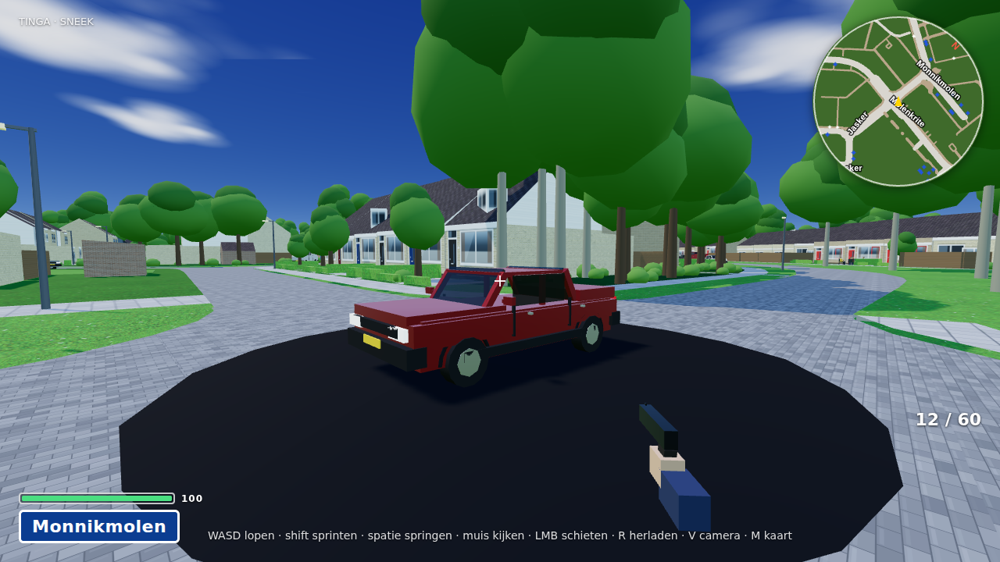

Zodra je instapt krijgt die ene auto het model met **losse wielen**: de voorwielen sturen mee en alle
vier rollen ze met de afgelegde weg. De carrosserie helt over in de bocht en duikt als je remt, de
remlichten branden als je op de rem staat en de achteruitrijlichten als je achteruit gaat. De rest van
de wijk houdt de zuinige uitvoering, want 329 auto's met losse wielen zou tweeduizend draw calls extra
kosten.

Het rijden zelf: gas geven trekt af naarmate je sneller gaat, los gas is motorrem plus
luchtweerstand, en de stuuruitslag wordt kleiner naarmate je harder rijdt — anders is een auto op
snelheid onbestuurbaar. De auto rijdt bovendien niet precies waar zijn neus wijst: de rijrichting
loopt er iets achteraan, en met de **handrem** (spatie) loopt hij er zóver achteraan dat de kont
uitbreekt en je de bocht uit glijdt.

Auto's zijn massief: je rijdt niet meer dwars door de geparkeerde rij of door het verkeer heen, en te
voet loop je er ook niet doorheen — je loopt eromheen zoals om alles wat er staat. Raak je er eentje
met vaart, dan rolt die een halve meter opzij en is jouw vaart eruit.

De motor heeft een **versnellingsbak** van vijf verzetten. Binnen een verzet lopen de toeren op, bij
het schakelen valt het gas even weg en beginnen ze weer onderaan — daardoor klinkt het niet meer
alsof je de hele wijk in zijn één doorkomt. Achteruit is één laag verzet dat hoog opjankt. En zodra
je achter het stuur zit speelt de **autoradio** een rockdeuntje: zacht genoeg om de motor eronder te
blijven horen, en tijdens de achtervolging in het verhaal zakt hij nog verder weg.

Vanachter het stuur kijk je vanaf een oogpunt vlak vóór de voorruit over de
motorkap. Dat is geen luxe: het glas is van buiten donker getint, en vanaf de
stoel keek je door twee van die vlakken naar buiten met de dakrand als donkere
balk erboven. De ruiten gaan daarom uit zolang jij erachter zit, en komen terug
zodra je uitstapt of naar de camera achter de auto gaat.

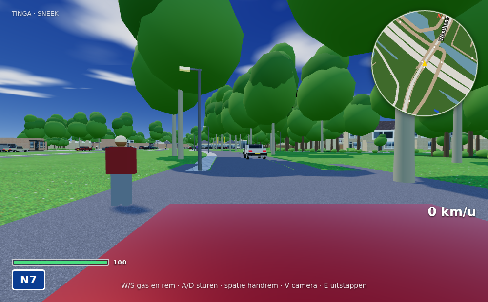

Het pistool zit in je rechterhand met een onderarm die naar de rechteronderhoek uit beeld loopt. Met
**H** stop je hem weg: dan verdwijnt ook het kruisje en schiet je niet meer, tot je hem met dezelfde
toets weer trekt.

## Camera over je schouder

**V** zet de camera achter je. Met de auto is dat een stuk handiger sturen: je ziet de neus, je
achterwielen en het stuk weg eromheen. Kijk je zelf niet rond, dan draait de camera vanzelf terug tot
recht achter de auto.

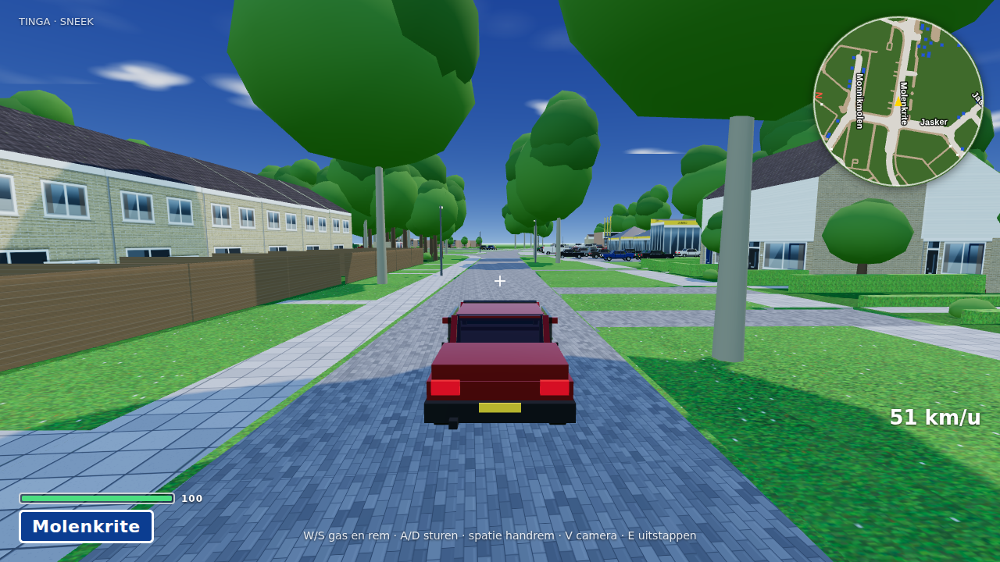

De camera zakt nooit door een gebouw: de hengel wordt elk beeld ingekort tot het eerste obstakel dat
hoger is dan de camera zelf, en schuift weer uit zodra het vrij is. Kan hij niet ver genoeg naar
achteren — je staat met je rug tegen een muur — dan klimt hij omhoog in plaats van naar binnen.

Te voet zie je jezelf lopen: Erik is hetzelfde poppetje als de mensen uit het verhaal. Schieten blijft
kloppen, want de kogel komt uit zijn schouder en gaat naar het punt onder het kruisje, niet uit de
camera achter je.

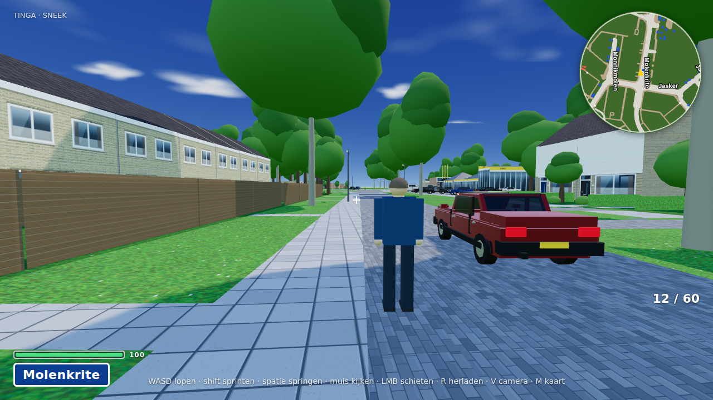

## Voetgangers aanrijden

Rij je harder dan zes kilometer per uur tegen een voetganger aan, dan gaat hij tegen de vlakte,
schuift hij een paar meter door in de richting van de klap en staat hij een halve minuut later
ergens anders in de wijk weer op. Stapvoets langs iemand manoeuvreren kan gewoon.

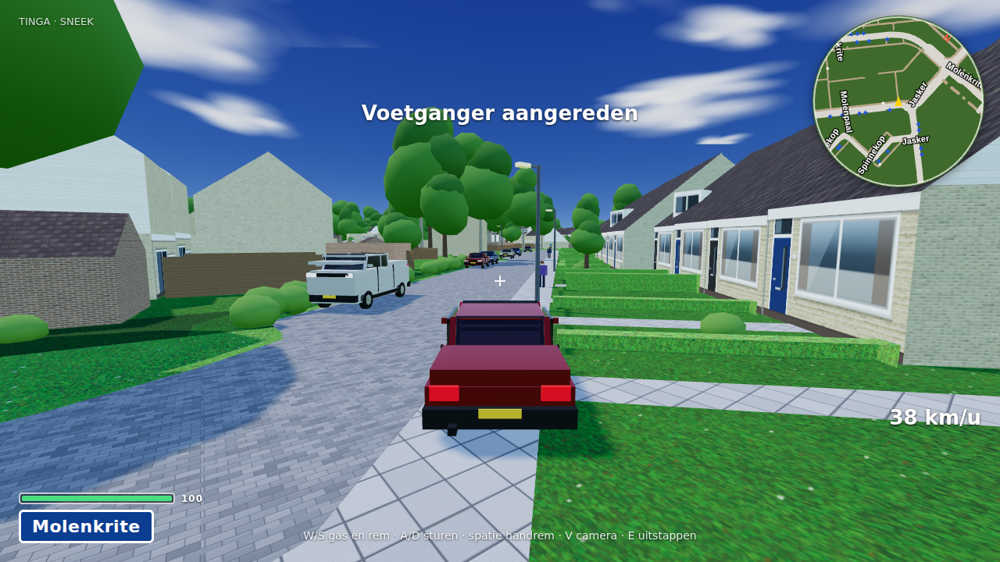

## De buurt schrikt

Van een schot (binnen 28 meter) of een aanrijding (binnen 20 meter) schrikt iedereen in de buurt. Ze
kijken eerst een paar tienden van een seconde op — een reactietijd — en zetten het dan op een lopen,
weg van de knal: eerst de straat uit waar ze staan, en op elke hoek de zijstraat die het verst van de
knal af ligt. Rennen gaat met zo'n 4,5 meter per seconde tegen 1,3 wandelend, fietsers trappen naar
7 m/s, en de pas loopt mee met de snelheid. Na een seconde of negen is de schrik voorbij en wandelt
iedereen weer verder. Wie er ver vandaan loopt merkt er niets van.

`npm run rijtest` loopt dit allemaal na — 55 controles over het model, het rijgedrag, de wielen en de
lichten, de camera achter je, het aanrijden, het wegrennen, de botsingen tussen auto's onderling en
het omheen lopen te voet.
`npm run rijshots` maakt de foto's hierboven.

## Politie en sterren

Sinds kort merkt de wijk wat je uitspookt. Elke misdaad levert **verdenking** op, maar niet elke
misdaad wordt gemeld — dat hangt af van wie het ziet:

- iemand neerschieten waar niemand bij is gaat vaak ongemerkt voorbij (ongeveer één op de tien wordt
  toch gebeld: iemand achter een raam);
- met omstanders erbij loopt die kans hard op, en met drie getuigen is het zo goed als zeker;
- en wie er al eentje op zijn geweten heeft valt bij de tweede veel eerder op — *stille* misdaden
  stapelen zich op tot iemand alsnog de telefoon pakt.

De verdenking staat in **sterren**, rechtsboven onder de minikaart: één ster na een melding, en verder
oplopend tot vijf. Hoe meer sterren, hoe meer blauw er op straat staat:

| sterren | surveillanceauto's | agenten | ze zoeken tot |
| --- | --- | --- | --- |
| ★ | 1 | 3 | 55 m rond de melding |
| ★★ | 2 | 4 | 85 m |
| ★★★ | 3 | 5 | 120 m |
| ★★★★ | 4 | 6 | 155 m |
| ★★★★★ | 5 | 8 | 195 m |

Bij elke auto zitten er nog twee agenten die uitstappen zodra je in de buurt komt, dus bij vijf
sterren lopen en rijden er zo'n twintig eenheden rond. Ze rijden over de straten naar de **plaats
delict** — de laatste plek waar ze jou wisten — en gaan van daaruit zoeken. Niet allemaal op dezelfde
hoek: iedere eenheid krijgt zijn eigen richting en een eigen afstand binnen die zoekring, dus ze
waaieren over de omliggende straten uit en verleggen hun zoekpunt om de vijftien à vijfentwintig
seconden. Op de minikaart én op de grote kaart (M) knipperen ze als blauwe stipjes, zodat je ziet waar
ze al zijn — gewone auto's staan daar grijs op, zodat blauw echt politie betekent.

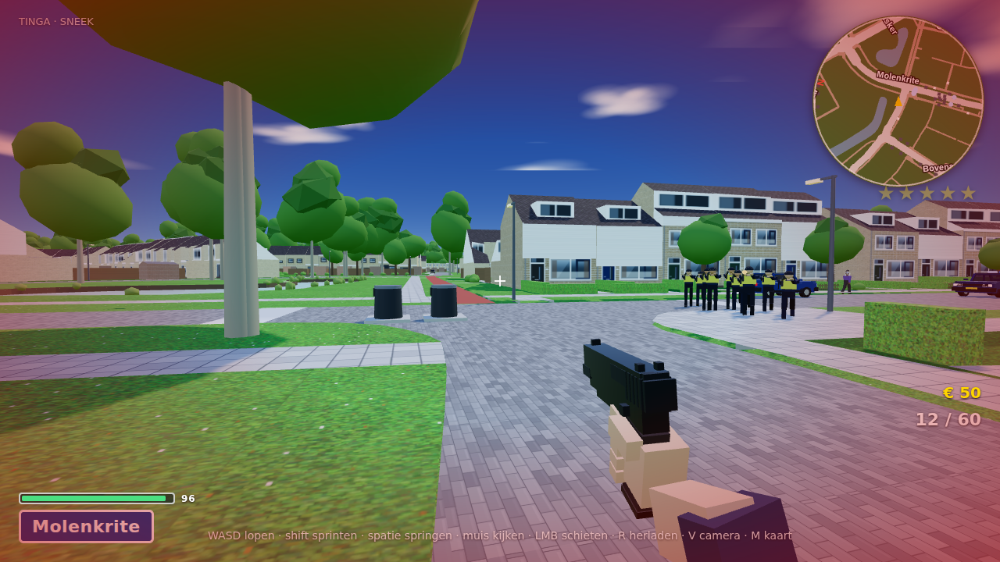

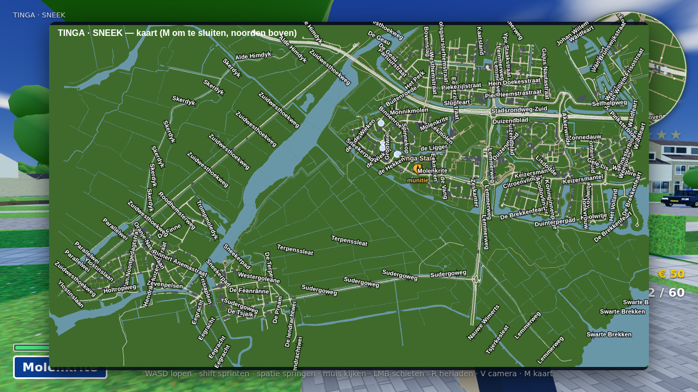

Komen ze met de auto bij je in de buurt, dan stappen de twee inzittenden uit. Die **wagen blijft dan
staan** met zijn zwaailicht aan — hij rijdt niet leeg verder — en je kunt er zelf in stappen. Doe je
dat, dan is hij van jou, lichtbalk en al. Laat je hem staan, dan verdwijnt hij vanzelf: snel zodra ze
je kwijt zijn, en anders na drie kwartier minuut, maar nooit terwijl je ernaast staat.

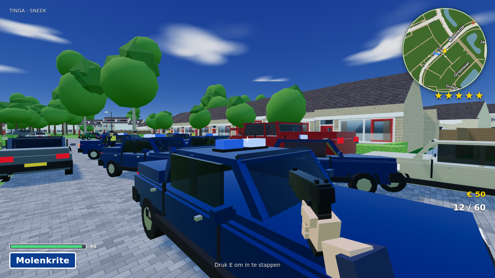

Nieuwe eenheden komen **ergens vandaan rijden**: altijd op een rijbaan, minstens ruim zestig meter bij
je vandaan en het liefst buiten je gezichtsveld. Ze verschijnen dus niet naast of achter je.

Zien ze je — kijkhoek plus vrij zicht — of horen ze je schieten, dan zetten ze de achtervolging in en
schieten ze op je. Elke treffer kost leven: de balk linksonder loopt terug en het beeld flitst rood.
Een agent aanrijden kan ook, en kost je net zoveel verdenking als hem neerschieten.

**Verstoppen werkt.** Staat er een gebouw of een schutting tussen, dan zien ze je niet, en dan volgen
ze je ook niet: ze lopen naar de plek waar ze je het láátst zagen. Horen ze alleen een schot, dan gaan
ze op dat gelúid af, niet op jou. Wel denken ze mee: op het moment dat de laatste je uit het oog
verliest schuift het zoekgebied een paar seconden mee in de richting waarin je wegliep, tot het
dichtstbijzijnde punt op een straat — en van daaruit waaieren ze met hun eigen sectoren de omliggende
straten in. Hoe langer je uit beeld blijft, hoe schever hun beeld wordt. Een auto die je kwijtraakt blijft nog een paar seconden zoeken en gaat dan terug
naar de laatst bekende plek — één hoek omgaan is dus niet genoeg. Blijf je uit het zicht, dan zakt de
verdenking na een aftelling van achttien seconden plus zes per ster, en zijn ze je kwijt. Een agent
neerschieten kost je meteen een paar sterren extra.

`npm run politietest` loopt het allemaal na — zevenveertig controles: de meldkans met en zonder
getuigen, de sterdrempels, het uitrukken en aankomen, het aantal eenheden en hun spreiding per
sterniveau, waar ze vandaan komen rijden, het schieten, het neerschieten én aanrijden van een agent,
het verstoppen achter een gebouw, het meeschuivende zoekgebied, het ontsnappen, de lege
surveillanceauto die blijft staan en te stelen is, en of de hoofdlus de politie buiten wél en
binnenshuis niet bijwerkt en de schade in de levensbalk terechtkomt. `npm run politieshots` maakt de twee foto's hierboven.

## Hondjes

Eén op de acht wandelaars laat een hondje uit: een klein beestje aan een lijn dat schuin achter zijn
baas aan dribbelt, met een slinger erin. Ze verschillen in kleur (wit, crème, zandbruin, roodbruin,
donkerbruin, grijs, zwart) en in maat. Alle hondjes samen kosten twee draw calls.

## Snelheid

Het spel draait op een telefoon en straks op een pc, dus de motor is gemeten en
niet op gevoel bijgesteld (`npm run audit`):

| | eerst | nu |
|---|---|---|
| draw calls in de wijk | 1649 | **595** |
| driehoeken per beeld | 1,69 M | **1,28 M** |
| texturegeheugen | 187 MB | **82 MB** |
| meshes in de scene | 3254 | **1256** |

Wat daarvoor veranderd is:

- **De 329 geparkeerde auto's zijn instanced.** Ze stonden er als losse groepjes
  van zeven meshes — op straat waren er zeshonderd van in beeld, meer dan de
  helft van alle draw calls. Nu zijn het zeven instanced meshes per soort voor
  de hele wijk, met de lakkleur per auto. Stap je in, dan gaat die ene op schaal
  nul en komt zijn eigen model met wielen ervoor in de plaats.
- **Auto's verder dan 170 m gaan uit.** Een instanced mesh valt nooit buiten
  beeld, dus zonder dat gingen alle 329 elk beeld naar de GPU.
- **De wereld ligt in tegels van 240 m.** De kaart werd per materiaal in één
  mesh samengevoegd — één mesh met alle trottoirbanden van de wijk — en die valt
  nooit buiten beeld. Hetzelfde gold voor de 3177 bomen. Nu gooit frustum
  culling het meeste weg.
- **De gevelplaten zijn kleiner.** Ze werden op 40 beeldpunten per meter
  getekend; dat is nu 26, met een bovengrens van 2048 px voor een lang rijtje.
  De steen- en dakpandoeken (tientallen kleurvarianten van 512×512) gaan naar
  288. Samen scheelt dat honderd megabyte — op een telefoon het verschil tussen
  soepel en haperen.

### Scherpte (G)

Op de pc laat de kaart de randen zelf gladmaken (MSAA), maar dat helpt alleen tegen gekartelde randen
van driehoeken. Wat in deze wijk vooral flikkert zijn de dunne dingen op afstand: hekspijlen,
dakranden, belijning. Daar is één middel tegen — op meer beeldpunten renderen dan het scherm heeft en
de browser het laten verkleinen. Op een gewoon 1×-scherm stond die teller op precies 1,00 en gebeurde
er dus niets.

**G** loopt door drie standen; hij blijft bewaard, dus je hoeft hem maar één keer te zetten:

| stand | wat hij doet |
|---|---|
| **scherp** | anderhalf keer zoveel beeldpunten (standaard op de pc) |
| normaal | precies je scherm (standaard op telefoon en tablet) |
| zuinig | driekwart, voor een trage machine |

De texturen staan bovendien op het maximale anisotrope filter dat de kaart aankan — meestal 16 in
plaats van 8. Dat houdt asfalt en stoeptegels die schuin weglopen scherp in plaats van een grijze brij
in de verte, en het kost geen geheugen.

## Het verhaal

Je heet **Erik**. Je broer **Mark** heeft vier missies voor je, en daarna belt Johan.

### 1 · Molenkrite 15

Bij het eerste opstarten sta je op de berm voor **Molenkrite 15** — het vierde huis na de knik in de
straat, aan de kant met de dakkapellen. Op de stoep ervoor staat Mark; hij kijkt je aan en zwaait.


Met **E** spreek je hem aan. Het gesprek staat onderin het scherm en klik je met **E** door (op een
telefoon: tik op de 🚗-knop om te praten en op de tekstbalk om door te klikken).


Daarna loopt hij de Molenkrite over naar het gezelschap dat schuin tegenover, in de voortuin van
**Molenkrite 20**, met een radio en een flesje bier in de tuin zit. Daar draait hij zich naar je om:
*"Schiet ze neer!"*


### 2 · Naar de waterzuivering

Als alle vier neer zijn vertelt Mark wat hij van De Veteraan gehoord heeft: bij de waterzuivering is
een grote lading afgeleverd. Er staat een auto in de straat, **jij rijdt**. De minikaart en de grote
kaart (**M**) wijzen de route naar de rioolwaterzuivering aan de Buitenroede: een blauwe lijn over de
straten en een gele vlag op de bestemming.


### 3 · De bewaking

Bij het terrein stap je automatisch uit. Achter het hek lopen **vijf bewakers** hun rondje, met de
vrachtwagen met de lading op het erf.


Binnen het hek vallen ze je aan zodra ze je zien of je horen schieten, en dan loopt je **levensbalk**
(linksonder) leeg. Ga je neer, dan begin je bij je laatst opgeslagen spel; is er niets opgeslagen,
dan begint de missie opnieuw. Na elke missie is je leven weer vol.


### 4 · Afleveren bij de boerderij

Liggen alle vijf neer, dan schuift de poort open en kun je de vrachtwagen pakken en het terrein
afrijden. De kaart navigeert dan naar de boerderij in de zuidwesthoek van het gebied. Zet de wagen
bij de schuur en de klus is klaar:


### 5 · Het telefoontje van Johan

Zodra de lading staat gaat de telefoon: **Johan** van Kruirad 62 is in zijn eigen huis bestolen. Zijn
kop komt in beeld, hij scheldt door de lijn en hangt op — en op de kaart staat een gele **J** bij zijn
oprit.


Op zijn oprit krijg je de briefing: duizend euro cash van de keukentafel, en de dader is *"die kneus
van De Wieken 27"* — felrood shirt, kanariegele broek, wit petje. En vooral: **niet schieten**, want
dan staat de halve Sneker politie op de stoep.


In De Wieken slentert hij over het trottoir. Kom je binnen vijftien meter en ziet hij je, dan is het
rennen:


Hij rent net iets langzamer dan je sprint (shift), dus je loopt hem langzaam in — en na anderhalve
minuut is hij op en wankelt hij verder. Onder de achtervolging loopt een **spannend deuntje**: een
jachtende achtstenbas in d-klein met een dreigende halve toon erboven, die aanzwelt zodra hij het op
een lopen zet en uitdooft als je hem hebt (of als je hem neerschiet). Schiet je hem neer, dan vaagt
het beeld naar grijs met **MISSIE MISLUKT** en begin je bij je laatste opgeslagen spel.


Kom je binnen armlengte (of ram je hem met de auto), dan smijt hij de envelop met €1.000 op de tegels.
Breng die terug naar Johan en je houdt er vijfhonderd euro aan over:


## Naar binnen bij Molenkrite 15

Loop je naar de **voordeur van Molenkrite 15** en druk je op **E**, dan ga je naar binnen:


Achter die deur zit een gang met zwart-witte blokjes. Achterin zit de deur naar de trap; die blijft
dicht, want alleen de begane grond is ingericht.


Rechts komt de gang uit in de woonkamer: bruin laminaat, een bank van 2,10 m tegen de zijmuur en een
tuindeur op de achtergevel.


Aan de andere kant staat de tv op het dressoir, met achterin de doorgang naar de keuken.


In de aanbouw staat het keukenblok in één rij: onderkasten met een licht houten front, een werkblad
op 90 cm met spoelbak en kookplaat, witte wandtegels tot 1,45 m en bovenkasten tot 2,15 m met een
wasemkap boven de plaat.


Met **E** bij de deur sta je weer buiten, op de plek waar je naar binnen ging. Zolang je binnen bent
zegt de HUD *Molenkrite 15* en blijft de minikaart de Molenkrite tonen.

### Waar het vandaan komt

Alle plekken in het verhaal komen uit de kaartdata: het pand met huisnummer 15 aan de Molenkrite, het
pand schuin tegenover, het hek en de schuifpoort van het RWZI-terrein, de schuur van de boerderij, de
oprit van Kruirad 62, het trottoir voor De Wieken 27, en het wegennet voor de routes en de
vluchtroutes van de dief. In `js/verhaal.js` staat geen enkele coördinaat, alleen adressen, namen
en afstanden vanaf de voorgevel — verhuist een pand in de brondata, dan verhuist de scène mee.

Dat geldt ook voor de woning binnen: het grondvlak `voet` van Molenkrite 15 uit de 3D BAG levert de
plattegrond (een voorhuis van 5,42 × 9,48 m met een aanbouw van 2,42 × 4,58 m), de goothoogte van
3,38 m laat één woonlaag met een plafond op 2,60 m toe, en de voordeur staat op dezelfde plek als in
de geveltexture. De kamer zelf staat ruim buiten het kaartgebied, zodat je er nooit langs loopt en hij
ook niet op het bovenaanzicht staat; naar binnen en naar buiten gaan is een teleport (`js/interieur.js`).

`npm run verhaaltest` loopt het hele verhaal na — 123 controles: startpunt, zwaaien, gesprek,
wandeling, schieten, rijden, de bewaking, de levensbalk, doodgaan, de poort, afleveren, het
telefoontje, de briefing, de dief die schrikt en wegrent, het deuntje bij de achtervolging, de
mislukking bij een schot, het uitgeput raken, het pakken, de beloning, de woning achter de voordeur
(maten, wanden, teleport, hoogtes van aanrecht, bank en tv) en opslaan en laden.
`npm run verhaalshots` maakt de foto's hierboven.

## Naar binnen bij de Wieken 29

Aan de Wieken zit de voordeur bij **elke** woning aan dezelfde kant — rechts, met de woonkamerpui
ernaast links. In de geveltexture stonden ze om en om links en rechts, zoals in de meeste rijtjes
waar twee woningen om hun bouwmuur heen spiegelen; die stijl doet dat nu niet meer.

Ook achter de blauwe voordeur van **de Wieken 29** kun je naar binnen. Het is dezelfde bouwer als bij
Molenkrite 15 — een voorhuis met een aanbouw erachter — maar met de maten van dít pand uit de kaart:
5,38 bij 14,07 m, met de keuken in de aanbouw en de gang aan de andere kant, want het grondvlak ligt
gespiegeld.

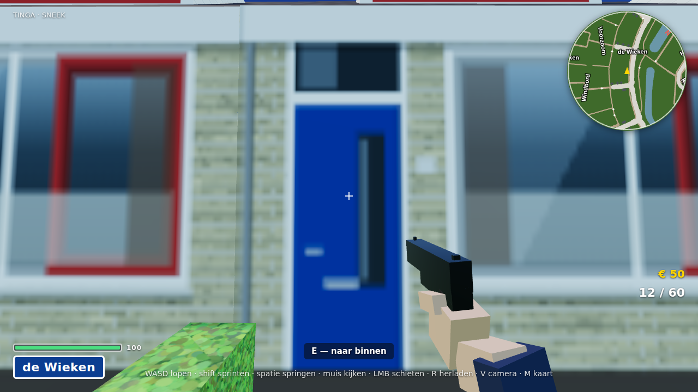

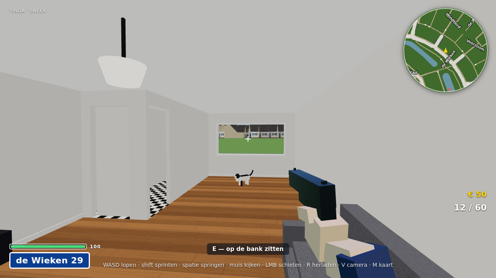

Drie dingen die er voor allebei de woningen bij zijn gekomen:

**Je kunt naar buiten kijken.** Het glas is doorzichtig geworden. De kamer staat ver buiten het
kaartgebied, dus daar was niets te zien; nu staat de buurt er weer omheen. De panden binnen vijftig
meter van het huis staan er op hun echte plek, maat en goothoogte uit de kaart, mét de geveltexture
van hun eigen woningtype en een zadeldak met pannen — dezelfde texturen als de wijk buiten, dus het
kost geen extra geheugen. Door de pui kijk je zo op de overkant van de straat, met de deuren, de
ramen en de dakkapellen erop.

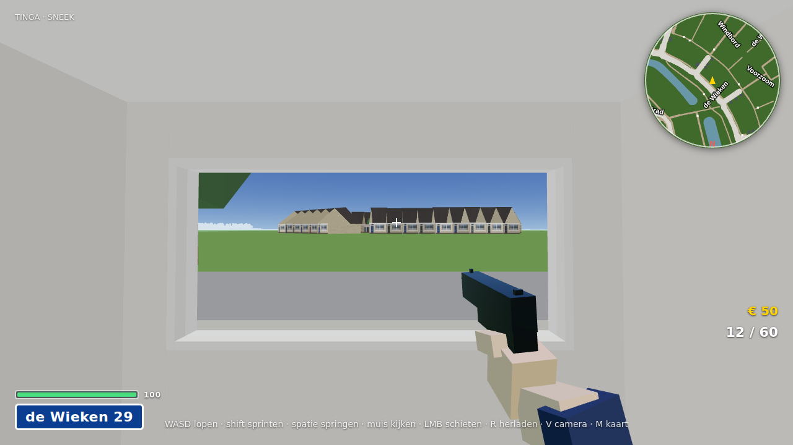

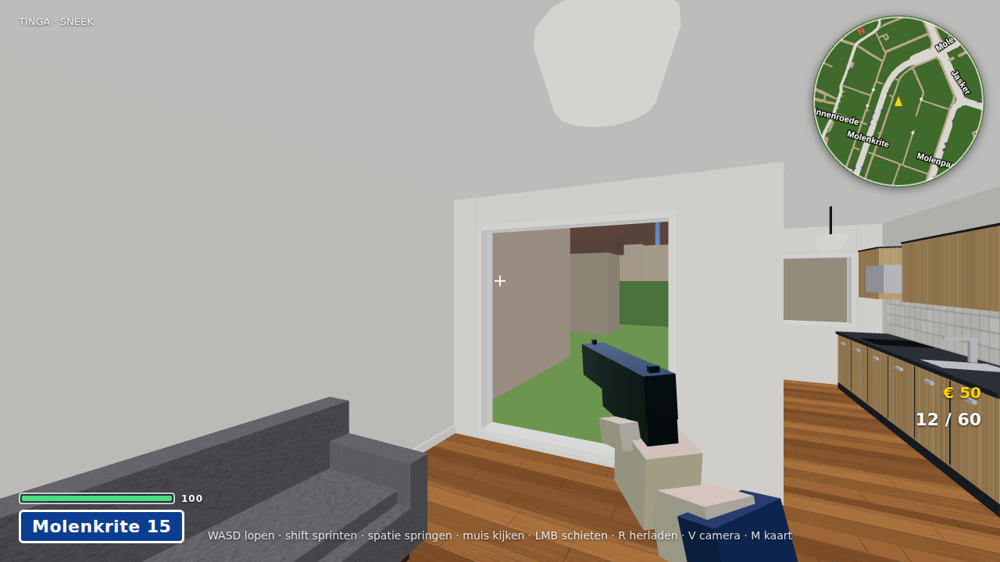

**Je kunt op de bank zitten.** Sta je bij de bank, dan zegt de hint `E — op de bank zitten`. Je zakt
naar zithoogte, kijkt naar de tv aan de overkant en kunt rondkijken; lopen doe je pas weer als je met
E opstaat.

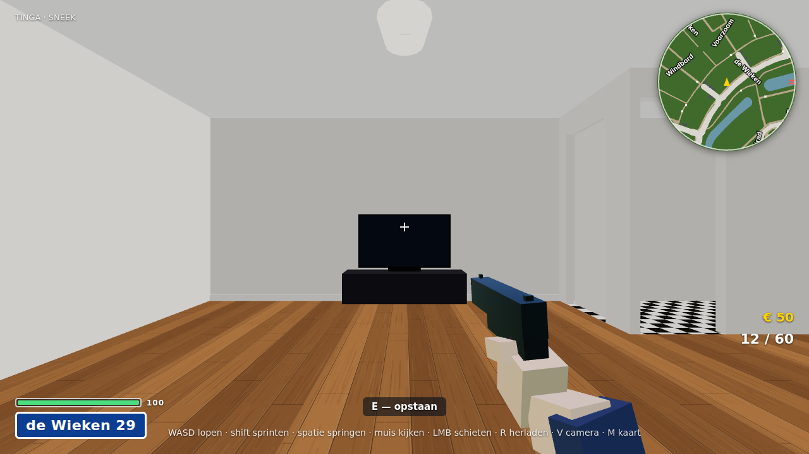

**En als het buiten donker wordt gaat de lamp aan.** Er staan geen lampen in de scene — de helderheid
zit in de materialen — dus 's avonds gaat er een andere tint over alle vlakken: binnen warm en iets
gedempt, buiten donkerblauw. De plafondlamp is dan het felste vlak in de kamer. Met `[` en `]` zet je
de klok vooruit, met `\` laat je hem lopen.

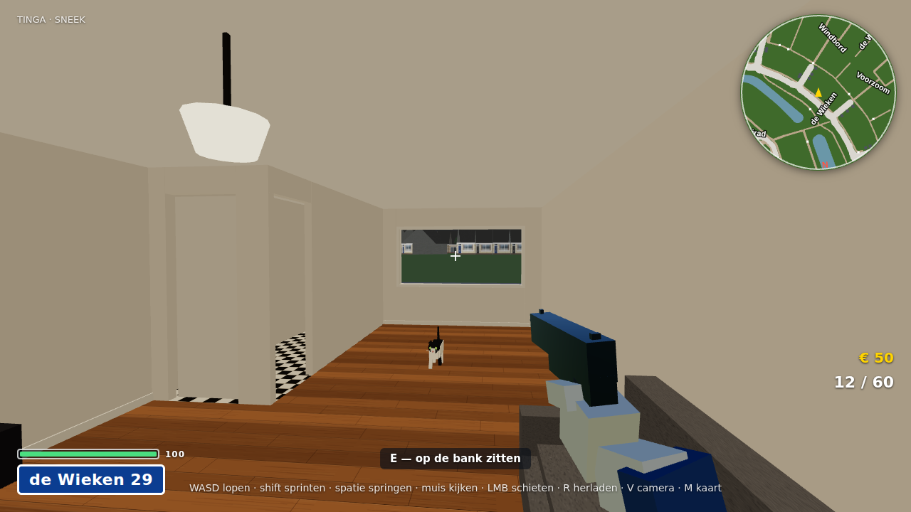

**En er lopen katten.** Aan de Molenkrite één, aan de Wieken twee: zwart-wit, met een witte bles over
de snuit. Ze lopen de kamer rond, blijven af en toe staan om rond te kijken, gaan zitten — en
klimmen geregeld op de bank, waar ze een halve minuut blijven liggen. Een kat is 45 cm lang met een
schofthoogte van 25 cm, dezelfde maat als de echte.

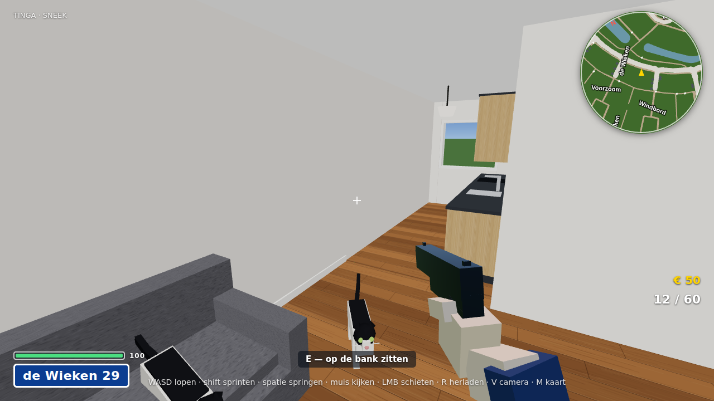

`npm run woningtest` toetst het geheel: de tweede woning en zijn maten, de deur heen en terug, het
zitten (lager oog, niet meer kunnen lopen, weer opstaan), de lamp die met de klok mee aan en uit gaat,
het doorzichtige glas met een buurt erachter, de katten (aantal, rondlopen, binnen blijven, op de
bank) en het speeltuintje hieronder. `npm run wereldtest` toetst dat de voordeur aan de Wieken bij
elke woning rechts zit en dat een gewoon rijtje nog wél spiegelt.
`npm run woningshots` maakt de foto's.

## Het speeltuintje achter de Wieken 144

Op het open grasveld achter **de Wieken 144** — tussen de achtertuinen en de vaart, aan het pad —
staat een speeltuintje: een schommel, een houten speelhuisje met een zadeldakje, een wipwap en een
glijbaan, met een zandbak en een bankje erbij.

Het staat op het veld zelf en niet in iemands tuin: het middelpunt ligt zo'n 37 meter achter het huis,
op ruim 25 meter van het dichtstbijzijnde pand en 18 meter van de dichtstbijzijnde tuin. De plekken
zijn uitgezet vanaf de voorgevel van 144, dus ze schuiven mee als het grondvlak in de brondata
verandert; in de code staat geen enkele coördinaat.

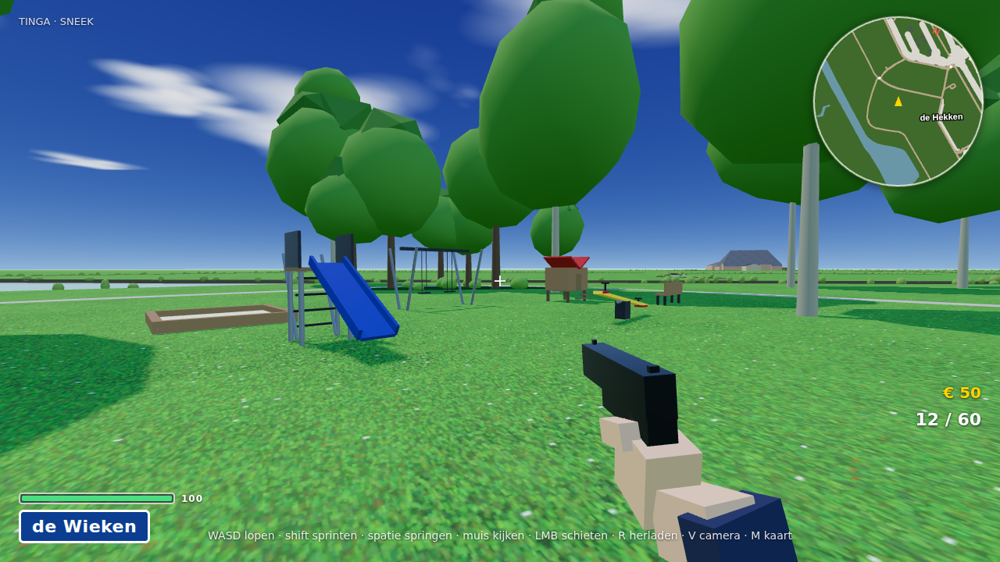

## Naar binnen bij Tinga State: munitie kopen

De stelpboerderij aan de Molenkrite is de tweede plek waar je naar binnen kunt. Ga voor de zwarte
schuurdeur staan en druk op **E**:

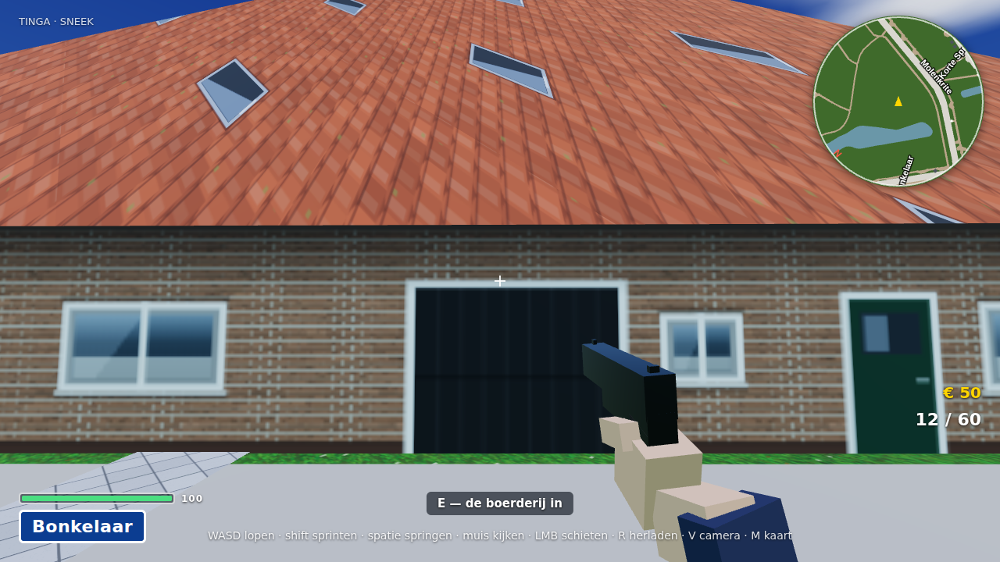

Daarachter ligt de deel: één open ruimte van 27,9 bij 19,1 m met de kap van binnen, van de goot op
1,94 m tot de nokbalk op 13,32 m — allemaal maten uit de kaart. Langs de wanden staan stellingen,
achterin liggen hooibalen.

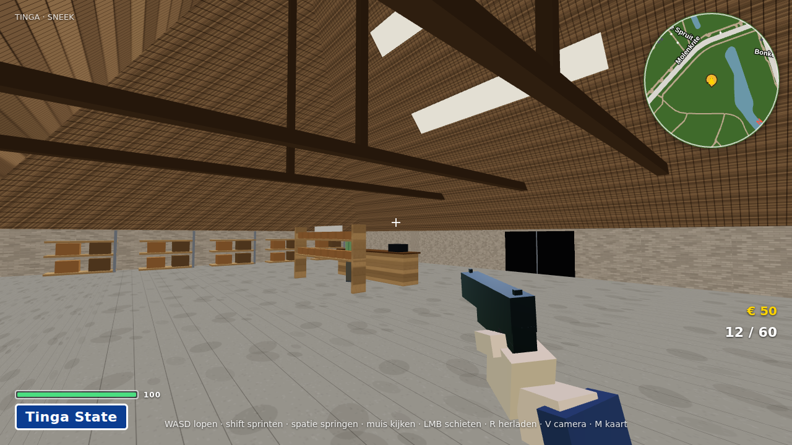

Aan de toonbank staat een verkoper. Voor **€ 50** krijg je **100 kogels**; het geld gaat meteen van je
portemonnee af. Sta je bij de bank, dan staat de prijs onderin beeld en reken je af met **E**. Heb je
het niet, dan zegt hij dat ook. Meer dan 600 kogels krijg je niet in je tas.

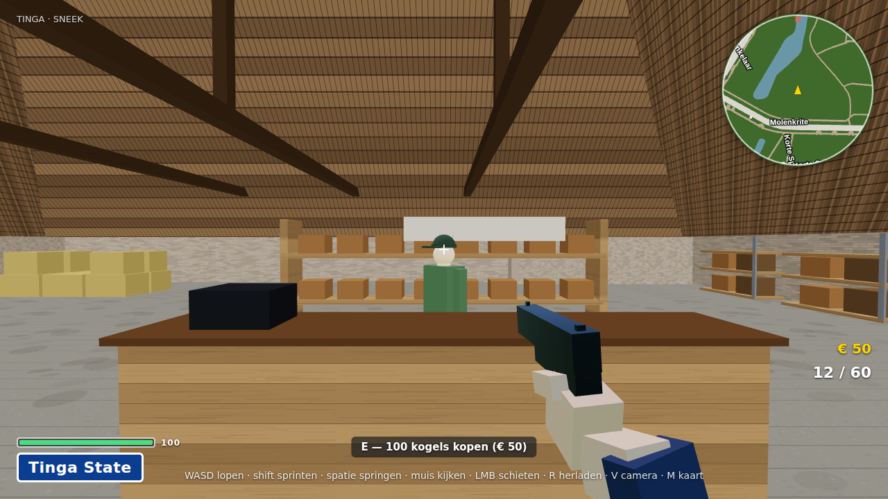

Je begint het spel met **€ 50**, dus één doos munitie zit er altijd in. Daarna moet je het verdienen:
de beloning van Johan aan het eind van het verhaal is € 500 (zie [Het verhaal](#het-verhaal)). Je geld
staat rechtsonder in beeld en gaat mee in de opslag.

De winkel is te vinden zonder ernaar te zoeken: op de minikaart én op de grote kaart (**M**) staat een
amberkleurig speldje met een patroon erin, op de plek van de schuurdeur. Op de minikaart draait het
icoontje niet mee met de kaart, zodat het altijd rechtop staat; op de grote kaart staat de naam
erbij.

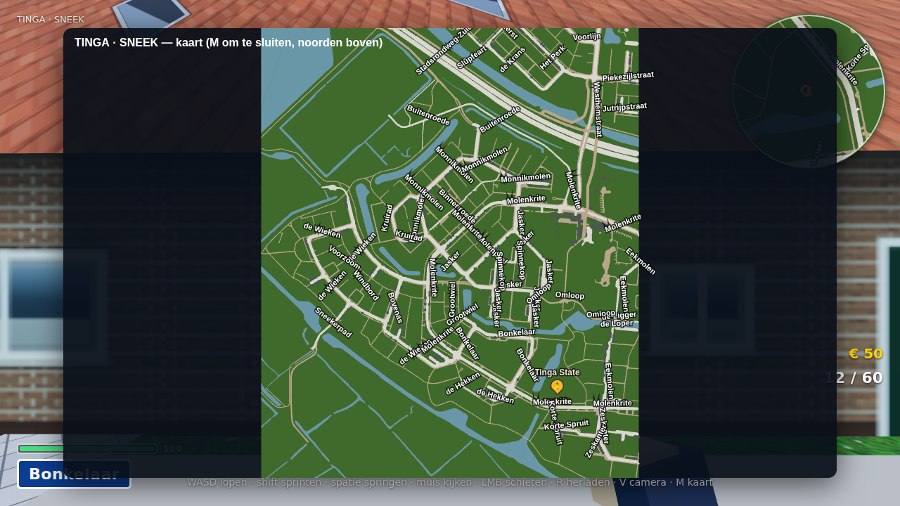

`npm run winkeltest` toetst het geheel — 23 controles: het beginkapitaal, de deur heen en terug, de
maten van de deel, de wanden die je binnenhouden, de prijs, wat er van je geld af gaat en wat je aan
kogels bijkrijgt, dat je met een lege portemonnee niets koopt, en dat het icoontje op allebei de
kaarten getekend wordt. `npm run winkelshots` maakt de foto's hierboven.

## Opslaan en laden

Er is één opslagplek, in de browser (de Windows-app draait dezelfde pagina en gebruikt dezelfde).
**F5** bewaart je spel, **F9** zet het terug. Bewaard worden: waar je staat en waar je naar kijkt, je
munitie en je leven, de auto waar je in zat, de tijd van de dag, het weer, en de stand van het
verhaal: welke missie, welke bierdrinkers en bewakers al neer liggen, of de poort open staat, waar de
auto en de vrachtwagen staan, hoe het met de dief staat en hoeveel geld je hebt. Ga je in een vuurgevecht neer, dan begint het spel bij deze opslag.

Staat er een opgeslagen spel, dan biedt het startscherm **Verder spelen** aan naast **Nieuw spel**, met
de datum van de opslag erbij; na **Esc** is datzelfde scherm het pauzescherm met **Doorgaan**. De wijk
zelf zit niet in de opslag: huizenrijen en objecten uit de wijkeditor hebben hun eigen opslag, zodat
een gewone opslag nooit werk aan de wijk overschrijft.

## Windows-app en wijkeditor

Naast de webversie is er een Windows-app met dezelfde wereld, waarin je **zelf huizenrijen kunt
verplaatsen, draaien, toevoegen en verwijderen** en die wijzigingen naar schijf kunt opslaan.

```bash
npm install
npm run desktop      # meteen draaien (Windows, macOS of Linux)
npm run dist:win     # bouwt dist/Tinga-win32-x64/Tinga.exe
```

De GitHub-workflow **Windows-app** bouwt bij elke push een kant-en-klare zip; die staat onder
*Actions → de run → Artifacts*.

De editor werkt ook in de browser (F2), alleen kan die het bestand niet zelf wegschrijven en krijg je
`rows.user.js` als download. Alle toetsen en de werkwijze staan in **[docs/EDITOR.md](docs/EDITOR.md)**.


Met **T** wissel je tussen achttien woningtypen:


En met **O** ga je naar de objecten: carports, bergingen, aanbouwen, hagen en hekken, verkeersborden,
containers, speeltoestellen, bomen, de vlaggenmasten van de supermarkt en zittende buren met een
biertje — 58 stuks, nagebouwd naar de street-viewfoto's van de wijk (het blad hieronder is nog van
vóór de vlaggenmasten):


## Twee gebouwen die geen woning zijn

Bijna heel Tinga bestaat uit woningen, en die krijgen hun aanzien van hun straat. Vier panden vielen
daarbuiten en stonden er tot nu toe als een naamloos blok bij. Ze staan nu met hun BAG-pandnummer in
**[data/stijl/straten.json](data/stijl/straten.json)** en hebben hun eigen aanzien gekregen.

### De Jumbo aan de Molenkrite

De supermarkt: de rij puntdaken komt uit het 3D BAG-model (goot 2,6 m, nok 7,1 m), en daaronder zit
nu een luifel over de volle breedte met een glazen pui met witte stijlen op een donkere plint, en de
gele huisstijlband met het woordmerk. Voor de ingang staan drie gele vlaggenmasten van ruim acht
meter, en het parkeerterrein ernaast is met 1239 m² het grootste van de wijk.


### Tinga State

De stelpboerderij aan de Molenkrite: één steile piramidekap van rode pannen die van de nok op 13,3 m
tot een dakvoet van twee tot vier meter doorloopt, met rijen dakramen erin. Daaronder een lage
bakstenen wand rondom, met witte kozijnen, een zwarte schuurdeur en een groene staldeur. Achter die
schuurdeur kun je naar binnen — daar zit de munitiewinkel, zie
[Naar binnen bij Tinga State](#naar-binnen-bij-tinga-state-munitie-kopen).


### De tuinen tegenover Molenkrite 15

De achtertuinen van de Binnenroede grenzen hier met hun achterkant aan de Molenkrite. De generator zet
daar normaal een schutting van 1,8 m neer, en dat werd een houten muur van achttien meter recht
tegenover de voordeur van nummer 15. In het echt staan er lage hagen, net als in de rest van de wijk.
Zulke uitzonderingen staan als vak in **[data/stijl/omgeving.json](data/stijl/omgeving.json)** onder
`lageErfscheidingen`.

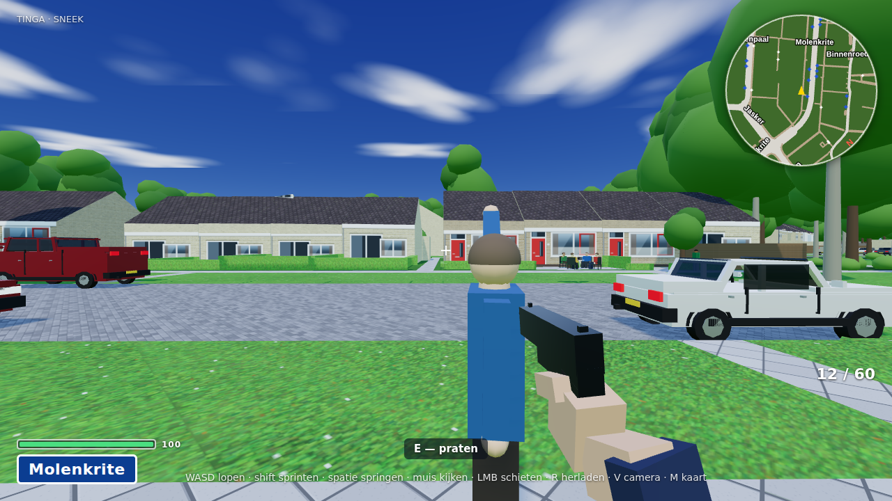

### Basisschool De Spil, Molenkrite 169

Het grootste pand van de wijk: een U van 6600 m² om een plein heen. Roodbruine baksteen met over de
hele lengte een doorlopende raamstrook met felblauwe kozijnen en gele gordijnen, een gele plaatband
onder een lichte dakrand, en om de drie traveeën de ingang met een geel bord erboven. Achterin staat
de rij puntdaken die ook in het 3D BAG-model zit.

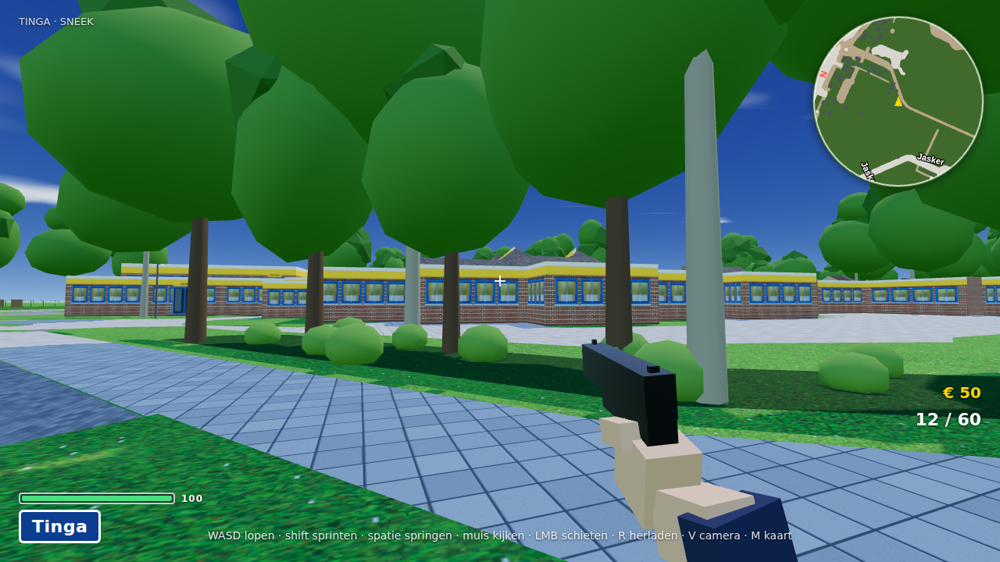

### Jeugdhulp Friesland, Molenkrite 234

Een lang gebouw van één laag met plat dak in donkerbruine steen, lichte kozijnen en blauwe deuren.
Het terrein is omheind met een donkergroen spijlenhek van anderhalve meter, en naast het gebouw ligt
een speeltuin met een klimtoestel met glijbaan, een zandbak, een wipkip en een bankje.

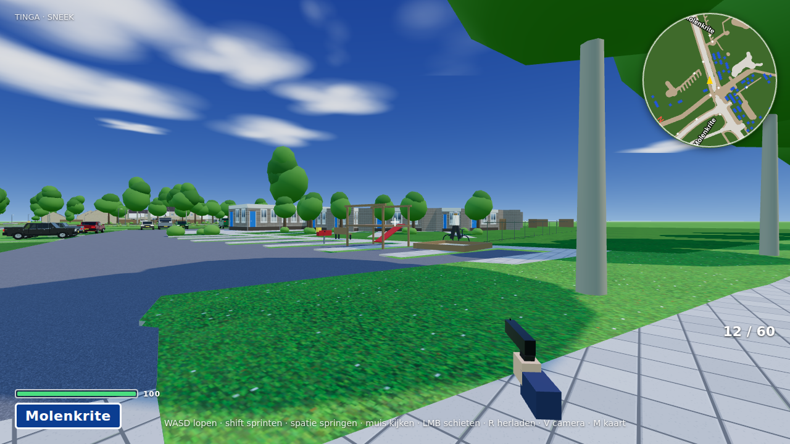

Dat hek staat niet in de BGT — de laag `scheiding` bevat in Tinga alleen kademuren — dus het komt uit
**[data/stijl/omgeving.json](data/stijl/omgeving.json)**: een lijn op acht meter uit de gevel, die
overal vervalt waar hij op de weg, de inrit of het voetpad zou komen. Daardoor ontstaat de opening bij
de inrit vanzelf.

`npm run adresshots` maakt de foto's van deze panden; de uitsnede staat bij het pand in de catalogus.
`node tools/plek.mjs <x> <z> <kijkNaarX> <kijkNaarZ> [naam]` maakt een foto van een willekeurige plek
in de wijk, handig als er ergens iets niet klopt.

## Dag, nacht en weer

De zon draait van oost naar west, met bijpassende kleuren voor licht, lucht en mist. Wordt het donker,
dan springen de straatlantaarns aan. Bij regen zakt het zicht van 900 naar 320 meter, wordt het water
dof en hoor je het op je jas.


Alle geluid is gesynthetiseerd met de Web Audio API, er zijn geen geluidsbestanden: wind, vogels
overdag en krekels 's avonds, regen, voetstappen die verschillen op klinkers, tegels en gras, een
motor waarvan de toonhoogte met de snelheid meeloopt, schoten, herladen en portieren. In de
voortuin van Molenkrite 20 staat een radio op een tafeltje die echt speelt: hoe dichter je erbij
staat, hoe harder je hem hoort.

## Straten in het spel

Molenkrite · Monnikmolen · Kruirad · Binnenroede · Buitenroede · Jasker · Molenpaal · Spinnekop ·
Omloop · De Wieken · Windbord · Voorzoom · Bovenas · Grootwiel · Bonkelaar · het Tinga Parkje met
vijver, zorgcomplex Tinga State en de N7 met afrit 21 aan de noordkant.

## Opbouw

- `index.html` – pagina, HUD en startscherm
- `js/kaart.js` – **de kaart van de wijk, gegenereerd uit BGT en 3D BAG** (`npm run geo:genereer`): alle
  vlakken van de openbare ruimte, wegassen met gemeten breedte, 1327 panden met hun echte grondvlak en
  3D-dak, parkeerplekken, straatnaamlabels en huisnummers, in meters vanaf het kruispunt
  Molenkrite/Monnikmolen/Jasker. Niet met de hand bewerken; zie [docs/METHODIEK.md](docs/METHODIEK.md)
- `js/kaartwereld.js` – bouwt de wereld uit `kaart.js`: ondergrond per materiaal, trottoirbanden, oevers,
  panden, hagen, struiken, bomen, lantaarns, en de aansluitingen voor verkeer, voetgangers en HUD
- `js/kaartkleuren.js` – één kleur per klasse, gedeeld door kaartplaat, bovenaanzicht en minimap
- `js/data.js` – de oude, handgetekende kaart in pixelcoördinaten; draait nog met `?kaart=oud`
- `js/rows.user.js` – eigen huizenrijen uit de editor; staat dit bestand er, dan gaat het voor op `data.js`
- `js/editor.js` – de wijkeditor (F2): huizenrijen en objecten
- `js/props.js` – de objectenbibliotheek (carports, borden, speeltoestellen, zittende buren met een biertje, ...)
- `js/verhaal.js` – de vijf missies: Mark voor Molenkrite 15, het gesprek onderin het scherm, de
  bierdrinkers schuin tegenover, de rit naar de waterzuivering, de bewaking op het terrein en het
  afleveren bij de boerderij, en het telefoontje van Johan met de achtervolging in De Wieken. Alle
  plekken komen uit de kaartdata via adressen en huisnummers
- `js/bewaking.js` – de vijf bewakers: patrouille, zien en horen, aanvallen en vuren
- `js/dief.js` – de dief van De Wieken 27: slenteren, schrikken, vluchten over het wegennet,
  uitgeput raken en gepakt worden
- `js/interieur.js` – de woning achter de voordeur van Molenkrite 15: de plattegrond uit het
  grondvlak van het pand, gang met blokjes, woonkamer met laminaat, bank en tv, keukenblok in de
  aanbouw, en de teleport naar binnen en naar buiten met E
- `js/navigatie.js` – het wegennet van de kaart als graaf, met de kortste route voor de kaartnavigatie
- `js/persoon.js` – één los poppetje dat kan staan, zwaaien, lopen, mikken, vuren en omvallen (de
  voetgangers in `npc.js` zijn instanced meshes en kunnen dat niet)
- `js/opslag.js` – opslaan en laden van het spel (F5 en F9)
- `js/sfeer.js` – tijd van de dag, weer, wind, stromend water en straatverlichting
- `js/audio.js` – alle geluid, volledig gesynthetiseerd
- `tools/geo/` – de geodata-keten: `bgt2geojson.mjs` en `bag3d2geojson.mjs` (ruwe downloads → GeoJSON),
  `genereer.mjs` (→ `js/kaart.js`), `plaat.mjs` (kaartplaat van de brondata), `bovenaanzicht.mjs`
  (bovenaanzicht van het spel en pixelvergelijking met de plaat), `controle.mjs` (keurt de brondata),
  `rd.mjs` (RD ↔ Google Maps ↔ spel), `skelet.mjs` (wegassen uit rijbaanvlakken)
- `tools/verhaaltest.mjs` – loopt het verhaal na en toetst opslaan en laden
- `tools/verhaalshots.mjs` – maakt de foto's van het verhaal
- `tools/adresshots.mjs` – maakt de foto's van de panden die met naam in `data/stijl/straten.json` staan
- `tools/rijtest.mjs` – toetst het automodel, de besturing, de camera achter de auto en het aanrijden
- `tools/rijshots.mjs` – maakt de foto's van het rijden en de derdepersoonscamera
- `tools/looptest.mjs` – toetst of je nergens vastloopt: het open terrein binnen de panden en een
  wandeling in acht richtingen vanaf de binnenpleinen
- `tools/plek.mjs` – één foto van een willekeurige plek in de wijk, in spelmeters
- `tools/wereldtest.mjs` – toetst wat je in beeld ziet: geen gat in de lucht, het pistool met zijn arm
  en de H-toets, de lage erfscheidingen en het dubbelzijdige vlaggendoek
- `tools/politietest.mjs` – toetst de politie: meldkans, sterren, uitrukken, de inzet en spreiding per
  sterniveau, schieten en ontsnappen
- `tools/politieshots.mjs` – maakt de twee foto's van de politie-inzet bij vijf sterren
- `tools/winkeltest.mjs` – toetst de boerderijwinkel: beginkapitaal, de schuurdeur, de deel en het
  kopen van munitie
- `tools/winkelshots.mjs` – maakt de foto's van Tinga State van buiten en van binnen
- `tools/woningtest.mjs` – toetst de Wieken 29, het zitten op de bank, de plafondlamp, het uitzicht
  door het glas en het speeltuintje
- `tools/woningshots.mjs` – maakt de foto's van de Wieken 29, binnen en buiten
- `tools/audit.mjs` – meet draw calls, geheugen en laadtijd door
- `tools/contactblad.py` – plakt de losse foto's uit `tools/propshots.mjs` en `tools/assets.mjs` tot de
  overzichtsbladen met alle objecten en woningtypen
- `tools/meetstrook.mjs` – meet een dwarsdoorsnede: hoeveel meter gras, tegels, water en rijbaan er
  achter elkaar liggen, om straatprofielen en groenstroken aan de foto's te toetsen
- `js/touch.js` – touchbesturing voor telefoon en tablet
- `desktop/` – de Electron-schil voor de Windows-app
  (3.26 px per meter, oorsprong op het kruispunt Molenkrite/Monnikmolen/Jasker)
- `js/textures.js` – procedureel gegenereerde textures: baksteen, dakpannen, klinkers (grijs en rood
  keperverband), stoeptegels, asfalt, gras, water, heggen en complete gevels met ramen en deuren
- `js/world.js` – bouwt het straatprofiel (smalle rijbaan, trottoirband, grasberm met bomen en
  parkeerhavens, tegeltrottoir tegen de voortuinen), huizenrijen met daken, dakkapellen,
  schoorstenen en zonnepanelen, voortuinen met heggen, achtertuinen met schuttingen en schuurtjes,
  lantaarnpalen, straatnaamborden, kliko's, de speeltuin en de parkjes met slingerpad, bomen,
  struiken en bankjes. Elke woning krijgt een eigen voortuintje: de een met een ligusterhaag, de
  ander met een houten kruishekje, een rode berberishaag, een conifeer of gewoon gras met struiken,
  een grindvak of een sierboompje. Elke woning wordt vóór plaatsing getoetst op overlap met wegen,
  water, parken en andere woningen; tuinen krijgen alleen de diepte die werkelijk beschikbaar is
- `js/player.js` – first-person besturing, botsingen en het pistool
- `js/vehicles.js`, `js/carmodel.js` – geparkeerde en bestuurbare auto's, verkeer op de N7 en in de wijk
- `js/npc.js` – voetgangers als instanced meshes (honderddertig mensen kosten samen zeven draw calls)
- `js/hud.js` – straatnaambord, minimap, snelheid en munitie
- `lib/three.module.js` – Three.js r160 (lokaal meegeleverd)
- `tools/screenshot.mjs` – maakt testscreenshots met headless Chromium (Playwright)
- `.github/workflows/pages.yml` – publiceert `index.html`, `js/` en `lib/` naar GitHub Pages

## Bronnen

De kaart komt uit open overheidsdata: de **BGT** (Basisregistratie Grootschalige Topografie) voor elke
rijbaan, stoep, parkeervak, berm, sloot en tuin, en **3D BAG** voor elk pand met zijn echte grondvlak,
daktype, goot- en nokhoogte en bouwjaar. De brondata staat in `data/geo/` (zie
[data/geo/README.md](data/geo/README.md)), de keten die er `js/kaart.js` van maakt in `tools/geo/`.

**[docs/METHODIEK.md](docs/METHODIEK.md)** beschrijft de aanpak: waarom foto's geen bron voor
geometrie zijn, welke bronnen en welk coördinatenstelsel (RD New) gebruikt worden, de stappen, en de
controles. De belangrijkste controle is `npm run geo:boven`: een bovenaanzicht van het spel dat pixel
voor pixel naast de kaartplaat van de brondata wordt gelegd (nu 1,3 % afwijking).


Elk pand krijgt zijn gevel met ramen en deuren uit het woningtype in de stijlcatalogus
`data/stijl/straten.json` (per straat), met het aantal lagen uit de echte goothoogte. `npm run
geo:steekproef` rendert twaalf vaste adressen vanaf de straat en zet er de Street View-link van
hetzelfde camerapunt naast, zie **[docs/steekproef/README.md](docs/steekproef/README.md)**.

De oude, handgetekende kaart in `js/data.js` (overgetypt uit schermafbeeldingen, bijgesteld met
Street View) draait nog met `?kaart=oud`. Street View-foto's dienen voortaan alleen nog voor de
stijl per straat: steenkleur, kozijnen, dakkapellen, voortuinen.

## Screenshots

| Monnikmolen | Bonkelaar | Jasker | Kruirad |
|---|---|---|---|
|  |  |  |  |

| Parkje De Wieken | De Wieken | Molenkrite | Bovenas |
|---|---|---|---|
|  |  |  |  |

| Overzicht vanaf Molenpaal | Kaart (toets M) |
|---|---|
|  |  |

Testscreenshots maken (vereist Playwright en de meegeleverde Chromium):

```bash
python3 -m http.server 8123 &
node tools/screenshot.mjs 8123 shots
```
