# Tinga Sneek – open-wereld FPS

Een GTA-achtig first-person spel dat zich afspeelt in de wijk **Tinga in Sneek**. De plattegrond komt
uit de officiële geodata van de wijk (BGT en 3D BAG): elke straat, stoep, parkeerhaven, sloot en elk
huis staat op ware grootte en op de juiste plek, met de echte straatnamen en huisnummers en de echte
dakvormen en hoogtes.

## Spelen

Het spel staat online op GitHub Pages: **https://x589h29ftn-code.github.io/EDU2/**

Lokaal draaien kan ook. Het spel heeft geen build-stap, maar omdat het ES-modules gebruikt moet het
via een webserver geladen worden (niet via `file://`):

```bash
python3 -m http.server 8000
# open daarna http://localhost:8000/
```

Of gebruik een andere statische server (`npx serve`, VS Code Live Server, GitHub Pages).

| Toets | Actie |
|---|---|
| W A S D | lopen (shift = sprinten, spatie = springen) |
| muis | rondkijken · linkermuisknop = schieten · R = herladen |
| E | praten (en het gesprek doorklikken) · bij de voordeur van Molenkrite 15 naar binnen en naar buiten · anders in- en uitstappen bij een auto |
| F5 / F9 | spel opslaan / opgeslagen spel laden |
| levensbalk | linksonder; leeg = je begint bij je laatste opgeslagen spel |
| portemonnee | rechtsonder; wat je met missies verdient |
| in de auto: W/S, A/D, spatie | gas/rem, sturen, handrem |
| M | grote kaart van de wijk met straatnamen |
| [ ] | klok een uur terug / vooruit · `\` laat de klok lopen (een dag in vier minuten) |
| Y | weer: helder, bewolkt, regen |
| U | geluid uit en aan |
| **F2** | wijkeditor: huizen verplaatsen en toevoegen |
| Esc | muis vrijgeven |

Op een telefoon of tablet verschijnt vanzelf touchbesturing: links een joystick om te lopen, rechts
vegen om rond te kijken, en knoppen voor vuren, springen, herladen, in-/uitstappen, de kaart en pauze.

## Het verhaal

Je heet **Erik**. Je broer **Mark** heeft vier missies voor je, en daarna belt Johan.

### 1 · Molenkrite 15

Bij het eerste opstarten sta je op de berm voor **Molenkrite 15** — het vierde huis na de knik in de
straat, aan de kant met de dakkapellen. Op de stoep ervoor staat Mark; hij kijkt je aan en zwaait.

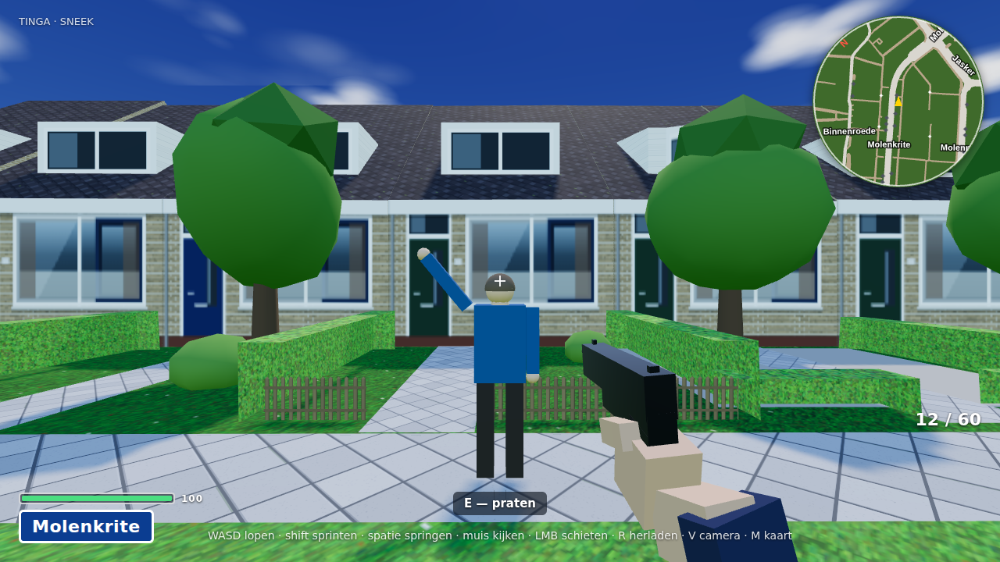

Met **E** spreek je hem aan. Het gesprek staat onderin het scherm en klik je met **E** door (op een
telefoon: tik op de 🚗-knop om te praten en op de tekstbalk om door te klikken).

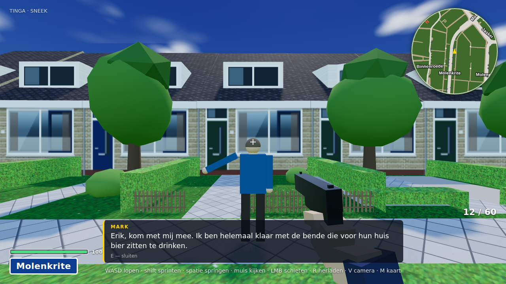

Daarna loopt hij de Molenkrite over naar het gezelschap dat schuin tegenover, in de voortuin van
**Molenkrite 20**, met een radio en een flesje bier in de tuin zit. Daar draait hij zich naar je om:
*"Schiet ze neer!"*

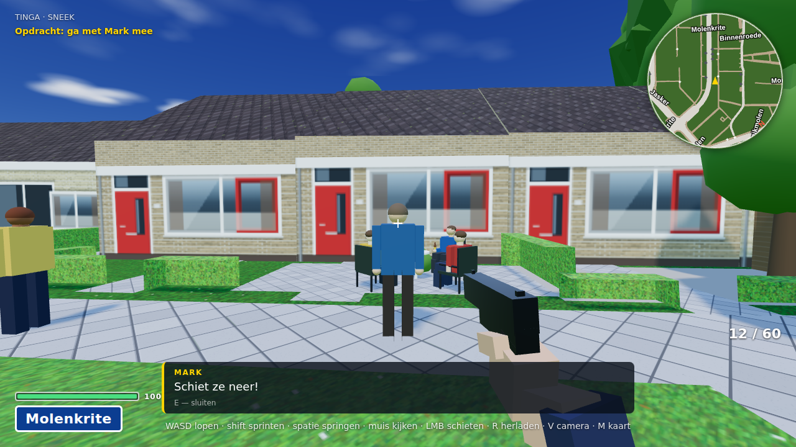

### 2 · Naar de waterzuivering

Als alle vier neer zijn vertelt Mark wat hij van De Veteraan gehoord heeft: bij de waterzuivering is
een grote lading afgeleverd. Er staat een auto in de straat, **jij rijdt**. De minikaart en de grote
kaart (**M**) wijzen de route naar de rioolwaterzuivering aan de Buitenroede: een blauwe lijn over de
straten en een gele vlag op de bestemming.

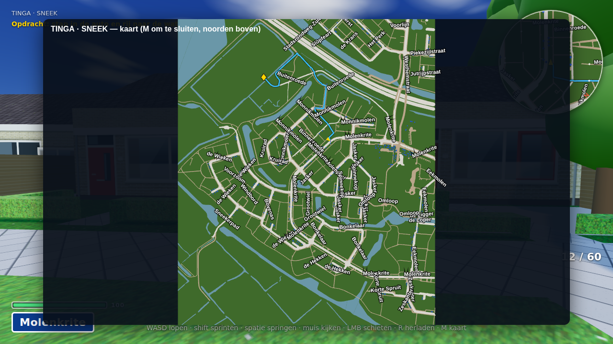

### 3 · De bewaking

Bij het terrein stap je automatisch uit. Achter het hek lopen **vijf bewakers** hun rondje, met de
vrachtwagen met de lading op het erf.

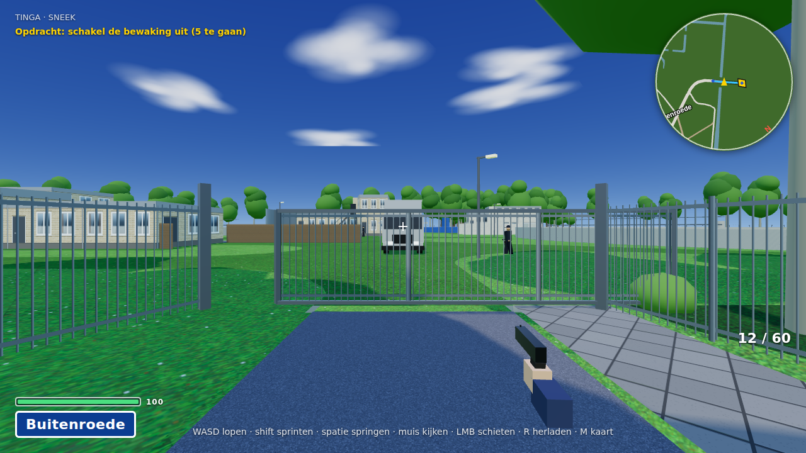

Binnen het hek vallen ze je aan zodra ze je zien of je horen schieten, en dan loopt je **levensbalk**
(linksonder) leeg. Ga je neer, dan begin je bij je laatst opgeslagen spel; is er niets opgeslagen,
dan begint de missie opnieuw. Na elke missie is je leven weer vol.

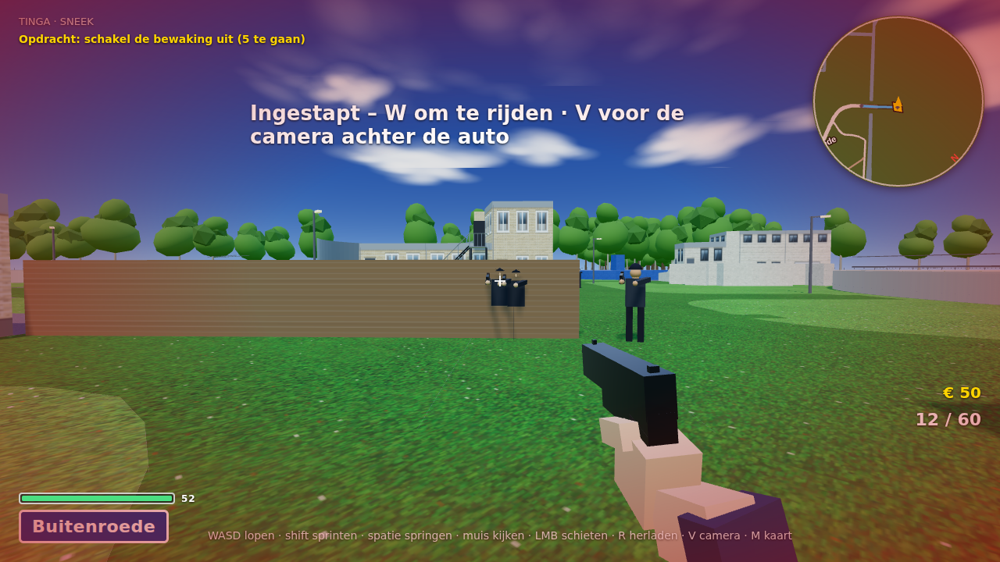

### 4 · Afleveren bij de boerderij

Liggen alle vijf neer, dan schuift de poort open en kun je de vrachtwagen pakken en het terrein
afrijden. De kaart navigeert dan naar de boerderij in de zuidwesthoek van het gebied. Zet de wagen
bij de schuur en de klus is klaar:

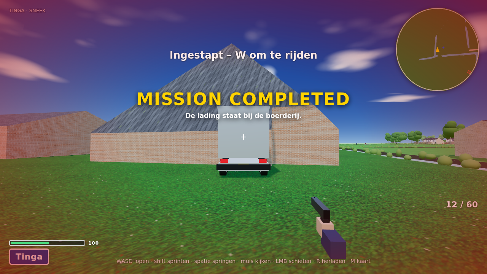

### 5 · Het telefoontje van Johan

Zodra de lading staat gaat de telefoon: **Johan** van Kruirad 62 is in zijn eigen huis bestolen. Zijn
kop komt in beeld, hij scheldt door de lijn en hangt op — en op de kaart staat een gele **J** bij zijn
oprit.

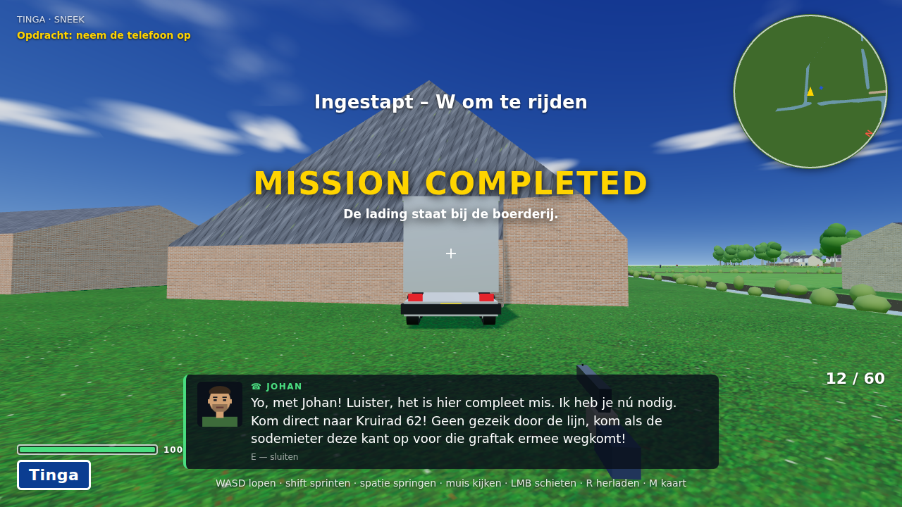

Op zijn oprit krijg je de briefing: duizend euro cash van de keukentafel, en de dader is *"die kneus
van De Wieken 27"* — felrood shirt, kanariegele broek, wit petje. En vooral: **niet schieten**, want
dan staat de halve Sneker politie op de stoep.

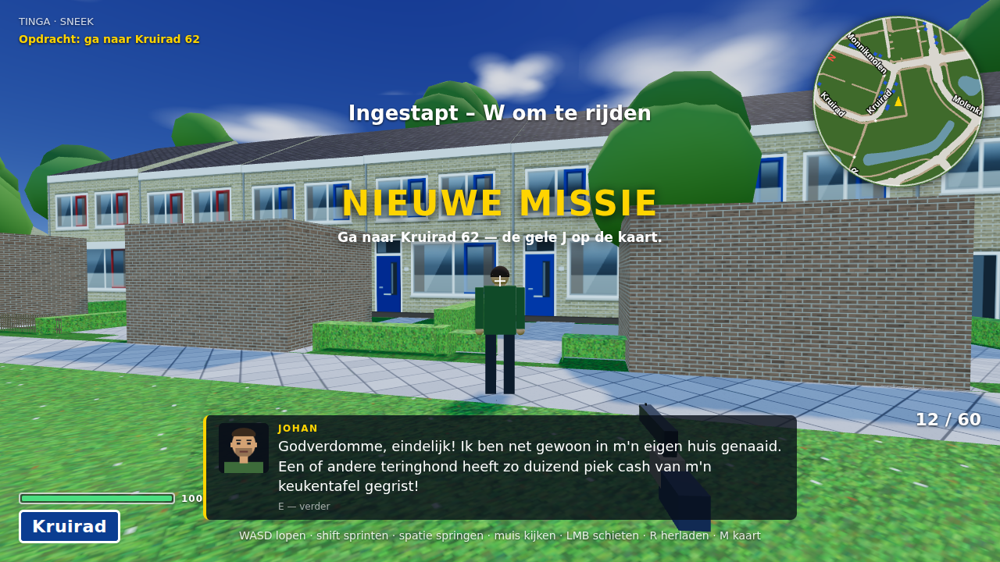

In De Wieken slentert hij over het trottoir. Kom je binnen vijftien meter en ziet hij je, dan is het
rennen:

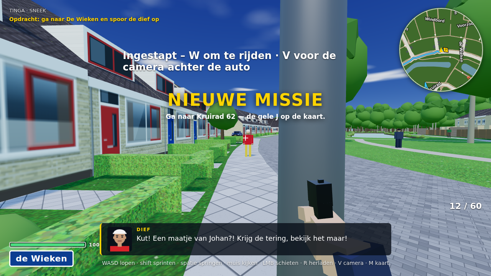

Hij rent net iets langzamer dan je sprint (shift), dus je loopt hem langzaam in — en na anderhalve
minuut is hij op en wankelt hij verder. Onder de achtervolging loopt een **spannend deuntje**: een
jachtende achtstenbas in d-klein met een dreigende halve toon erboven, die aanzwelt zodra hij het op
een lopen zet en uitdooft als je hem hebt (of als je hem neerschiet). Schiet je hem neer, dan vaagt
het beeld naar grijs met **MISSIE MISLUKT** en begin je bij je laatste opgeslagen spel.

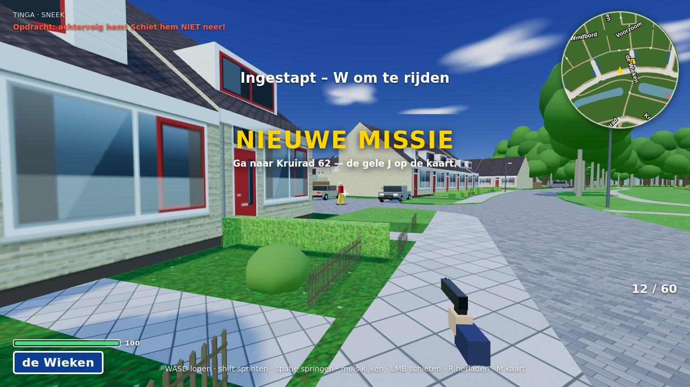

Kom je binnen armlengte (of ram je hem met de auto), dan smijt hij de envelop met €1.000 op de tegels.
Breng die terug naar Johan en je houdt er vijfhonderd euro aan over:

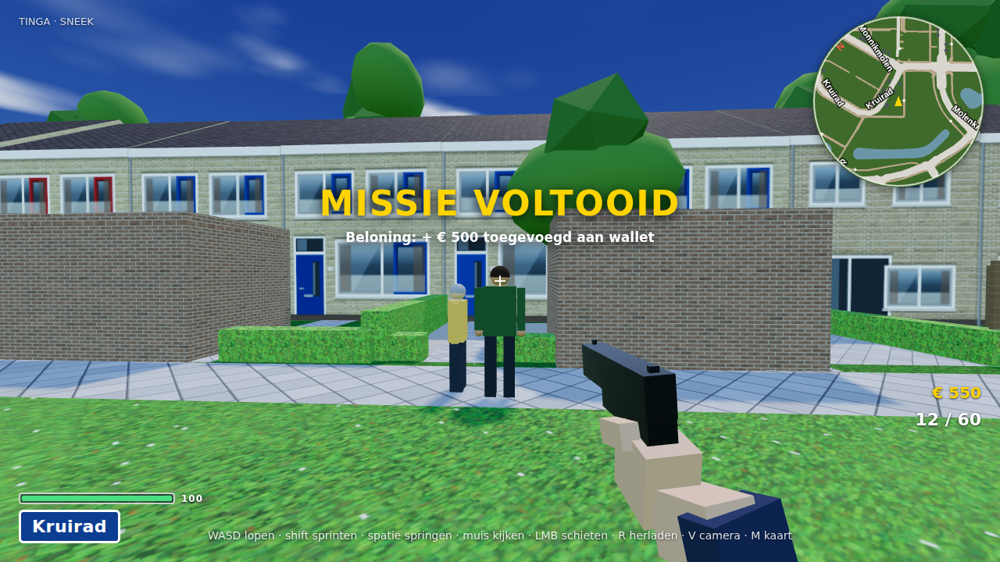

## Naar binnen bij Molenkrite 15

Loop je naar de **voordeur van Molenkrite 15** en druk je op **E**, dan ga je naar binnen:

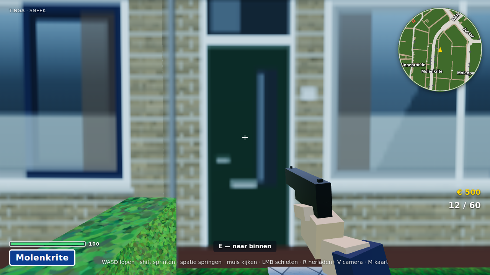

Achter die deur zit een gang met zwart-witte blokjes. Achterin zit de deur naar de trap; die blijft
dicht, want alleen de begane grond is ingericht.

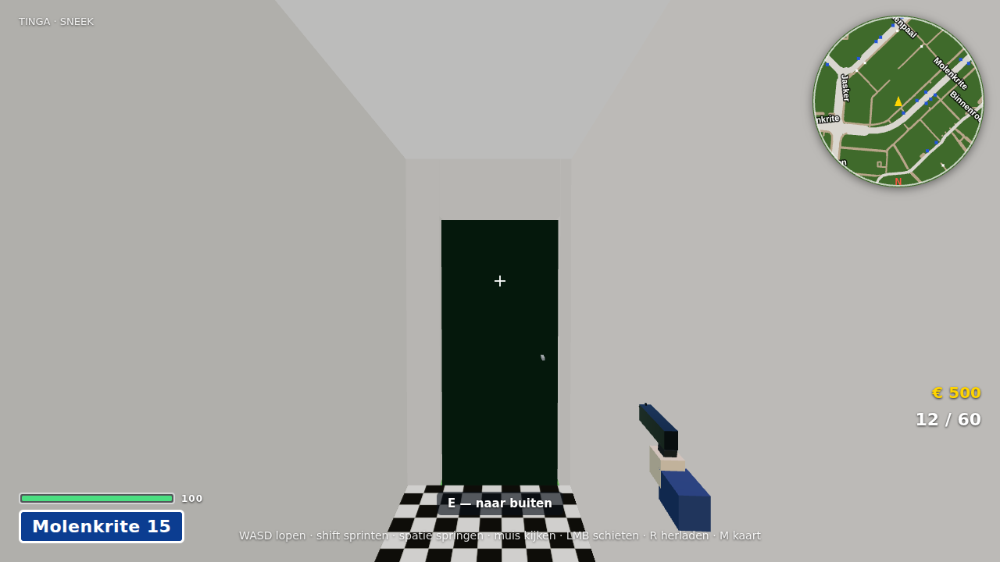

Rechts komt de gang uit in de woonkamer: bruin laminaat, een bank van 2,10 m tegen de zijmuur en een
tuindeur op de achtergevel.

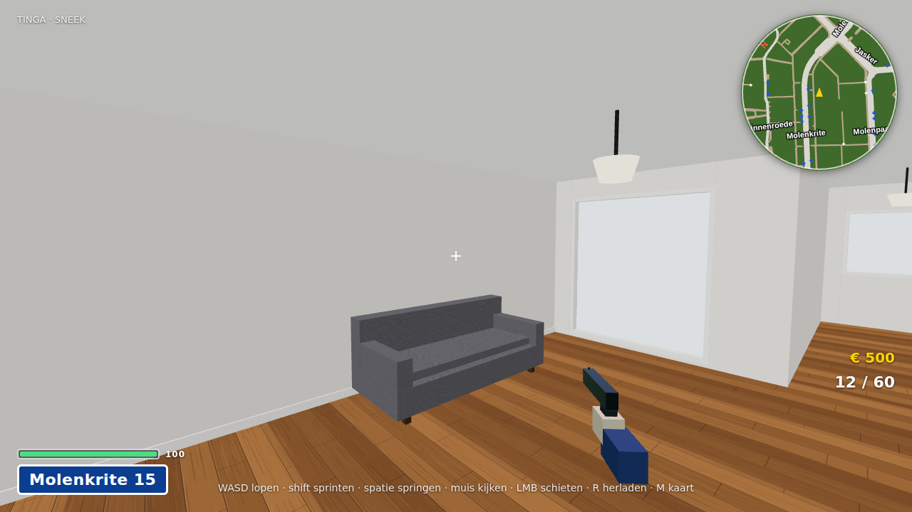

Aan de andere kant staat de tv op het dressoir, met achterin de doorgang naar de keuken.

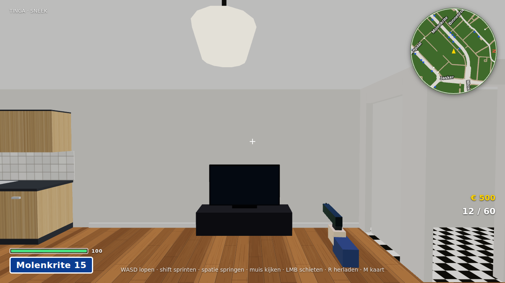

In de aanbouw staat het keukenblok in één rij: onderkasten met een licht houten front, een werkblad
op 90 cm met spoelbak en kookplaat, witte wandtegels tot 1,45 m en bovenkasten tot 2,15 m met een
wasemkap boven de plaat.

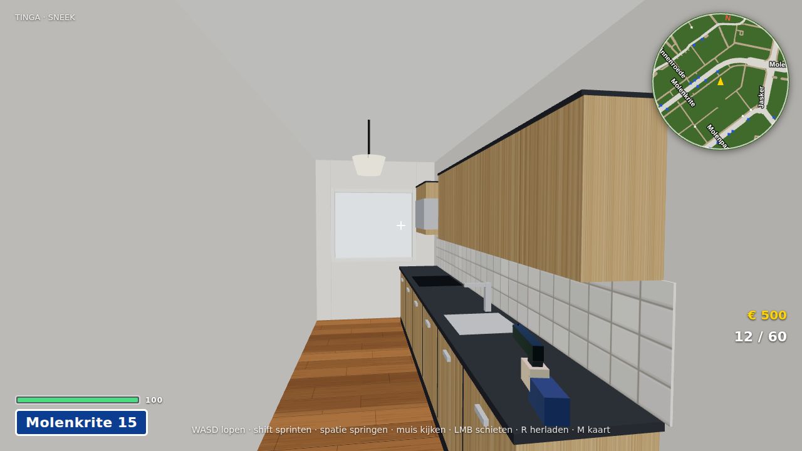

Met **E** bij de deur sta je weer buiten, op de plek waar je naar binnen ging. Zolang je binnen bent
zegt de HUD *Molenkrite 15* en blijft de minikaart de Molenkrite tonen.

### Waar het vandaan komt

Alle plekken in het verhaal komen uit de kaartdata: het pand met huisnummer 15 aan de Molenkrite, het
pand schuin tegenover, het hek en de schuifpoort van het RWZI-terrein, de schuur van de boerderij, de
oprit van Kruirad 62, het trottoir voor De Wieken 27, en het wegennet voor de routes en de
vluchtroutes van de dief. In `js/verhaal.js` staat geen enkele coördinaat, alleen adressen, namen
en afstanden vanaf de voorgevel — verhuist een pand in de brondata, dan verhuist de scène mee.

Dat geldt ook voor de woning binnen: het grondvlak `voet` van Molenkrite 15 uit de 3D BAG levert de
plattegrond (een voorhuis van 5,42 × 9,48 m met een aanbouw van 2,42 × 4,58 m), de goothoogte van
3,38 m laat één woonlaag met een plafond op 2,60 m toe, en de voordeur staat op dezelfde plek als in
de geveltexture. De kamer zelf staat ruim buiten het kaartgebied, zodat je er nooit langs loopt en hij
ook niet op het bovenaanzicht staat; naar binnen en naar buiten gaan is een teleport (`js/interieur.js`).

`npm run verhaaltest` loopt het hele verhaal na — 123 controles: startpunt, zwaaien, gesprek,
wandeling, schieten, rijden, de bewaking, de levensbalk, doodgaan, de poort, afleveren, het
telefoontje, de briefing, de dief die schrikt en wegrent, het deuntje bij de achtervolging, de
mislukking bij een schot, het uitgeput raken, het pakken, de beloning, de woning achter de voordeur
(maten, wanden, teleport, hoogtes van aanrecht, bank en tv) en opslaan en laden.
`npm run verhaalshots` maakt de foto's hierboven.

## Opslaan en laden

Er is één opslagplek, in de browser (de Windows-app draait dezelfde pagina en gebruikt dezelfde).
**F5** bewaart je spel, **F9** zet het terug. Bewaard worden: waar je staat en waar je naar kijkt, je
munitie en je leven, de auto waar je in zat, de tijd van de dag, het weer, en de stand van het
verhaal: welke missie, welke bierdrinkers en bewakers al neer liggen, of de poort open staat, waar de
auto en de vrachtwagen staan, hoe het met de dief staat en hoeveel geld je hebt. Ga je in een vuurgevecht neer, dan begint het spel bij deze opslag.

Staat er een opgeslagen spel, dan biedt het startscherm **Verder spelen** aan naast **Nieuw spel**, met
de datum van de opslag erbij; na **Esc** is datzelfde scherm het pauzescherm met **Doorgaan**. De wijk
zelf zit niet in de opslag: huizenrijen en objecten uit de wijkeditor hebben hun eigen opslag, zodat
een gewone opslag nooit werk aan de wijk overschrijft.

## Windows-app en wijkeditor

Naast de webversie is er een Windows-app met dezelfde wereld, waarin je **zelf huizenrijen kunt
verplaatsen, draaien, toevoegen en verwijderen** en die wijzigingen naar schijf kunt opslaan.

```bash
npm install
npm run desktop      # meteen draaien (Windows, macOS of Linux)
npm run dist:win     # bouwt dist/Tinga-win32-x64/Tinga.exe
```

De GitHub-workflow **Windows-app** bouwt bij elke push een kant-en-klare zip; die staat onder
*Actions → de run → Artifacts*.

De editor werkt ook in de browser (F2), alleen kan die het bestand niet zelf wegschrijven en krijg je
`rows.user.js` als download. Alle toetsen en de werkwijze staan in **[docs/EDITOR.md](docs/EDITOR.md)**.

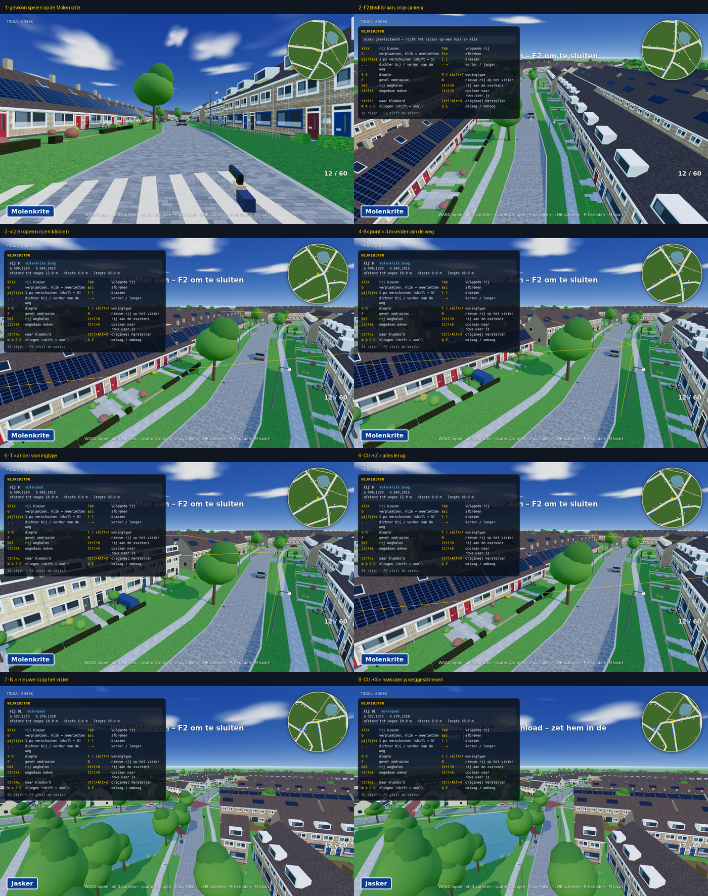

Met **T** wissel je tussen achttien woningtypen:

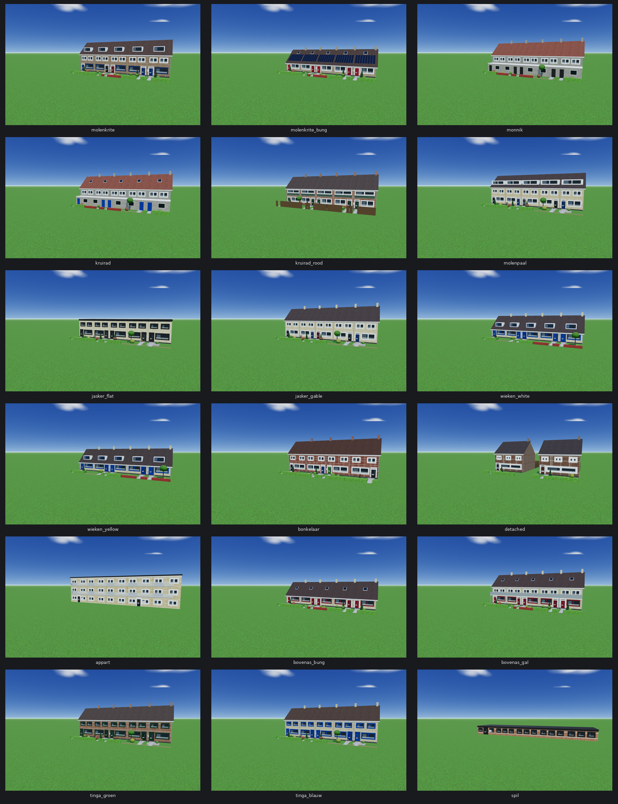

En met **O** ga je naar de objecten: carports, bergingen, aanbouwen, hagen en hekken, verkeersborden,
containers, speeltoestellen, bomen, de vlaggenmasten van de supermarkt en zittende buren met een
biertje — 58 stuks, nagebouwd naar de street-viewfoto's van de wijk (het blad hieronder is nog van
vóór de vlaggenmasten):

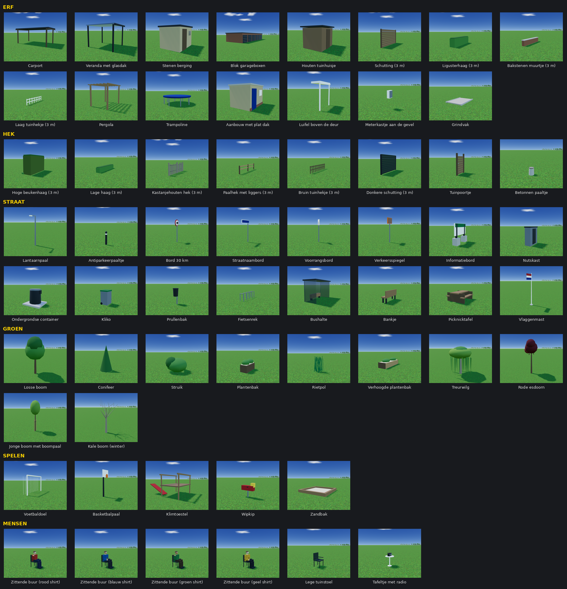

## Twee gebouwen die geen woning zijn

Bijna heel Tinga bestaat uit woningen, en die krijgen hun aanzien van hun straat. Twee panden vielen
daarbuiten en stonden er tot nu toe als een naamloos blok bij. Ze staan nu met hun BAG-pandnummer in
**[data/stijl/straten.json](data/stijl/straten.json)** en hebben hun eigen aanzien gekregen.

### De Jumbo aan de Molenkrite

De supermarkt: de rij puntdaken komt uit het 3D BAG-model (goot 2,6 m, nok 7,1 m), en daaronder zit
nu een luifel over de volle breedte met een glazen pui met witte stijlen op een donkere plint, en de
gele huisstijlband met het woordmerk. Voor de ingang staan drie gele vlaggenmasten van ruim acht
meter, en het parkeerterrein ernaast is met 1239 m² het grootste van de wijk.

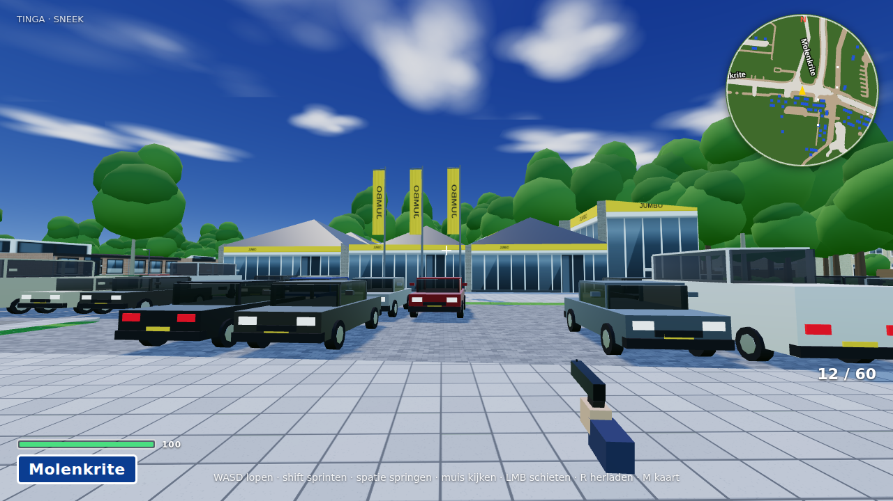

### Tinga State

De stelpboerderij aan de Molenkrite: één steile piramidekap van rode pannen die van de nok op 13,3 m
tot een dakvoet van twee tot vier meter doorloopt, met rijen dakramen erin. Daaronder een lage
bakstenen wand rondom, met witte kozijnen, een zwarte schuurdeur en een groene staldeur.

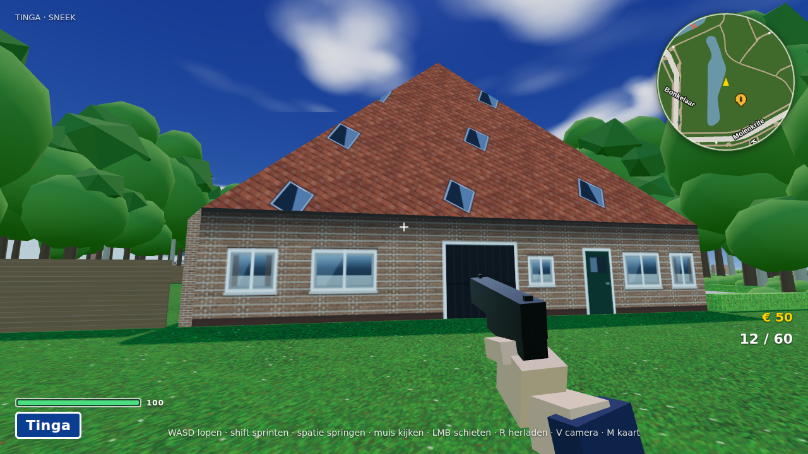

`npm run adresshots` maakt deze twee foto's; de uitsnede staat bij het pand in de catalogus.

## Dag, nacht en weer

De zon draait van oost naar west, met bijpassende kleuren voor licht, lucht en mist. Wordt het donker,
dan springen de straatlantaarns aan. Bij regen zakt het zicht van 900 naar 320 meter, wordt het water
dof en hoor je het op je jas.

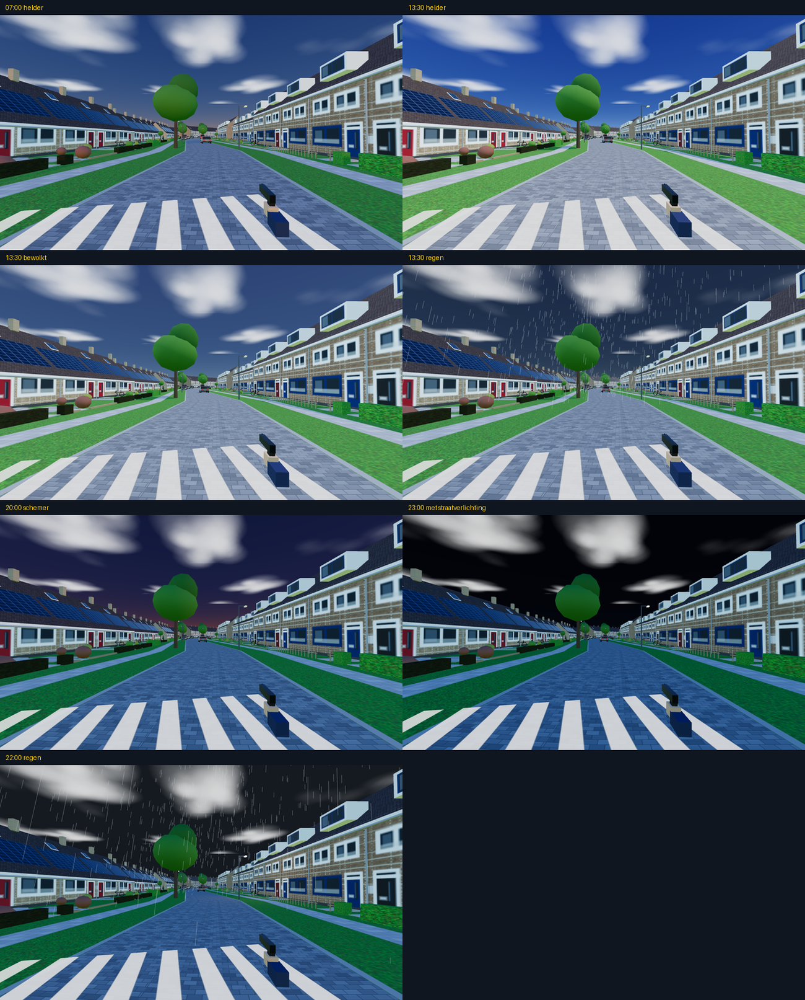

Alle geluid is gesynthetiseerd met de Web Audio API, er zijn geen geluidsbestanden: wind, vogels
overdag en krekels 's avonds, regen, voetstappen die verschillen op klinkers, tegels en gras, een
motor waarvan de toonhoogte met de snelheid meeloopt, schoten, herladen en portieren. In de
voortuin van Molenkrite 20 staat een radio op een tafeltje die echt speelt: hoe dichter je erbij
staat, hoe harder je hem hoort.

## Straten in het spel

Molenkrite · Monnikmolen · Kruirad · Binnenroede · Buitenroede · Jasker · Molenpaal · Spinnekop ·
Omloop · De Wieken · Windbord · Voorzoom · Bovenas · Grootwiel · Bonkelaar · het Tinga Parkje met
vijver, zorgcomplex Tinga State en de N7 met afrit 21 aan de noordkant.

## Opbouw

- `index.html` – pagina, HUD en startscherm
- `js/kaart.js` – **de kaart van de wijk, gegenereerd uit BGT en 3D BAG** (`npm run geo:genereer`): alle
  vlakken van de openbare ruimte, wegassen met gemeten breedte, 1327 panden met hun echte grondvlak en
  3D-dak, parkeerplekken, straatnaamlabels en huisnummers, in meters vanaf het kruispunt
  Molenkrite/Monnikmolen/Jasker. Niet met de hand bewerken; zie [docs/METHODIEK.md](docs/METHODIEK.md)
- `js/kaartwereld.js` – bouwt de wereld uit `kaart.js`: ondergrond per materiaal, trottoirbanden, oevers,
  panden, hagen, struiken, bomen, lantaarns, en de aansluitingen voor verkeer, voetgangers en HUD
- `js/kaartkleuren.js` – één kleur per klasse, gedeeld door kaartplaat, bovenaanzicht en minimap
- `js/data.js` – de oude, handgetekende kaart in pixelcoördinaten; draait nog met `?kaart=oud`
- `js/rows.user.js` – eigen huizenrijen uit de editor; staat dit bestand er, dan gaat het voor op `data.js`
- `js/editor.js` – de wijkeditor (F2): huizenrijen en objecten
- `js/props.js` – de objectenbibliotheek (carports, borden, speeltoestellen, zittende buren met een biertje, ...)
- `js/verhaal.js` – de vijf missies: Mark voor Molenkrite 15, het gesprek onderin het scherm, de
  bierdrinkers schuin tegenover, de rit naar de waterzuivering, de bewaking op het terrein en het
  afleveren bij de boerderij, en het telefoontje van Johan met de achtervolging in De Wieken. Alle
  plekken komen uit de kaartdata via adressen en huisnummers
- `js/bewaking.js` – de vijf bewakers: patrouille, zien en horen, aanvallen en vuren
- `js/dief.js` – de dief van De Wieken 27: slenteren, schrikken, vluchten over het wegennet,
  uitgeput raken en gepakt worden
- `js/interieur.js` – de woning achter de voordeur van Molenkrite 15: de plattegrond uit het
  grondvlak van het pand, gang met blokjes, woonkamer met laminaat, bank en tv, keukenblok in de
  aanbouw, en de teleport naar binnen en naar buiten met E
- `js/navigatie.js` – het wegennet van de kaart als graaf, met de kortste route voor de kaartnavigatie
- `js/persoon.js` – één los poppetje dat kan staan, zwaaien, lopen, mikken, vuren en omvallen (de
  voetgangers in `npc.js` zijn instanced meshes en kunnen dat niet)
- `js/opslag.js` – opslaan en laden van het spel (F5 en F9)
- `js/sfeer.js` – tijd van de dag, weer, wind, stromend water en straatverlichting
- `js/audio.js` – alle geluid, volledig gesynthetiseerd
- `tools/geo/` – de geodata-keten: `bgt2geojson.mjs` en `bag3d2geojson.mjs` (ruwe downloads → GeoJSON),
  `genereer.mjs` (→ `js/kaart.js`), `plaat.mjs` (kaartplaat van de brondata), `bovenaanzicht.mjs`
  (bovenaanzicht van het spel en pixelvergelijking met de plaat), `controle.mjs` (keurt de brondata),
  `rd.mjs` (RD ↔ Google Maps ↔ spel), `skelet.mjs` (wegassen uit rijbaanvlakken)
- `tools/verhaaltest.mjs` – loopt het verhaal na en toetst opslaan en laden
- `tools/verhaalshots.mjs` – maakt de foto's van het verhaal
- `tools/adresshots.mjs` – maakt de foto's van de panden die met naam in `data/stijl/straten.json` staan
- `tools/audit.mjs` – meet draw calls, geheugen en laadtijd door
- `tools/contactblad.py` – plakt de losse foto's uit `tools/propshots.mjs` en `tools/assets.mjs` tot de
  overzichtsbladen met alle objecten en woningtypen
- `tools/meetstrook.mjs` – meet een dwarsdoorsnede: hoeveel meter gras, tegels, water en rijbaan er
  achter elkaar liggen, om straatprofielen en groenstroken aan de foto's te toetsen
- `js/touch.js` – touchbesturing voor telefoon en tablet
- `desktop/` – de Electron-schil voor de Windows-app
  (3.26 px per meter, oorsprong op het kruispunt Molenkrite/Monnikmolen/Jasker)
- `js/textures.js` – procedureel gegenereerde textures: baksteen, dakpannen, klinkers (grijs en rood
  keperverband), stoeptegels, asfalt, gras, water, heggen en complete gevels met ramen en deuren
- `js/world.js` – bouwt het straatprofiel (smalle rijbaan, trottoirband, grasberm met bomen en
  parkeerhavens, tegeltrottoir tegen de voortuinen), huizenrijen met daken, dakkapellen,
  schoorstenen en zonnepanelen, voortuinen met heggen, achtertuinen met schuttingen en schuurtjes,
  lantaarnpalen, straatnaamborden, kliko's, de speeltuin en de parkjes met slingerpad, bomen,
  struiken en bankjes. Elke woning krijgt een eigen voortuintje: de een met een ligusterhaag, de
  ander met een houten kruishekje, een rode berberishaag, een conifeer of gewoon gras met struiken,
  een grindvak of een sierboompje. Elke woning wordt vóór plaatsing getoetst op overlap met wegen,
  water, parken en andere woningen; tuinen krijgen alleen de diepte die werkelijk beschikbaar is
- `js/player.js` – first-person besturing, botsingen en het pistool
- `js/vehicles.js`, `js/carmodel.js` – geparkeerde en bestuurbare auto's, verkeer op de N7 en in de wijk
- `js/npc.js` – voetgangers als instanced meshes (honderddertig mensen kosten samen zeven draw calls)
- `js/hud.js` – straatnaambord, minimap, snelheid en munitie
- `lib/three.module.js` – Three.js r160 (lokaal meegeleverd)
- `tools/screenshot.mjs` – maakt testscreenshots met headless Chromium (Playwright)
- `.github/workflows/pages.yml` – publiceert `index.html`, `js/` en `lib/` naar GitHub Pages

## Bronnen

De kaart komt uit open overheidsdata: de **BGT** (Basisregistratie Grootschalige Topografie) voor elke
rijbaan, stoep, parkeervak, berm, sloot en tuin, en **3D BAG** voor elk pand met zijn echte grondvlak,
daktype, goot- en nokhoogte en bouwjaar. De brondata staat in `data/geo/` (zie
[data/geo/README.md](data/geo/README.md)), de keten die er `js/kaart.js` van maakt in `tools/geo/`.

**[docs/METHODIEK.md](docs/METHODIEK.md)** beschrijft de aanpak: waarom foto's geen bron voor
geometrie zijn, welke bronnen en welk coördinatenstelsel (RD New) gebruikt worden, de stappen, en de
controles. De belangrijkste controle is `npm run geo:boven`: een bovenaanzicht van het spel dat pixel
voor pixel naast de kaartplaat van de brondata wordt gelegd (nu 1,3 % afwijking).

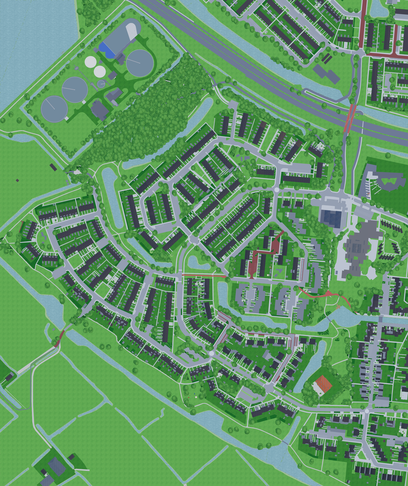

Elk pand krijgt zijn gevel met ramen en deuren uit het woningtype in de stijlcatalogus
`data/stijl/straten.json` (per straat), met het aantal lagen uit de echte goothoogte. `npm run
geo:steekproef` rendert twaalf vaste adressen vanaf de straat en zet er de Street View-link van
hetzelfde camerapunt naast, zie **[docs/steekproef/README.md](docs/steekproef/README.md)**.

De oude, handgetekende kaart in `js/data.js` (overgetypt uit schermafbeeldingen, bijgesteld met
Street View) draait nog met `?kaart=oud`. Street View-foto's dienen voortaan alleen nog voor de
stijl per straat: steenkleur, kozijnen, dakkapellen, voortuinen.

## Screenshots

| Monnikmolen | Bonkelaar | Jasker | Kruirad |
|---|---|---|---|
| 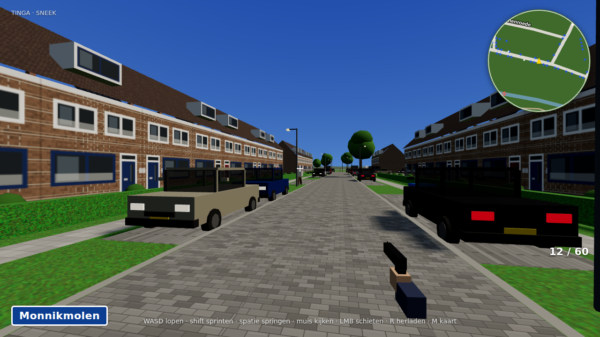 | 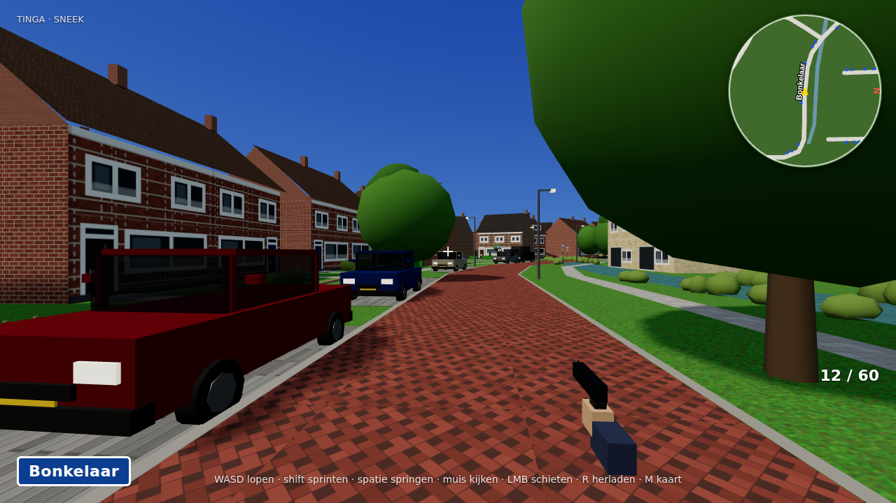 | 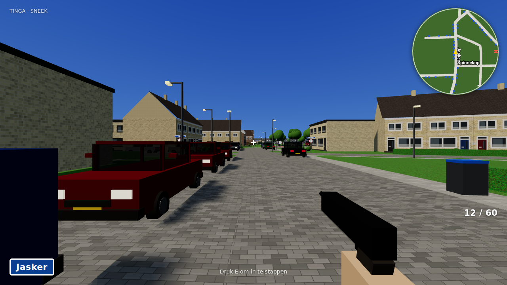 | 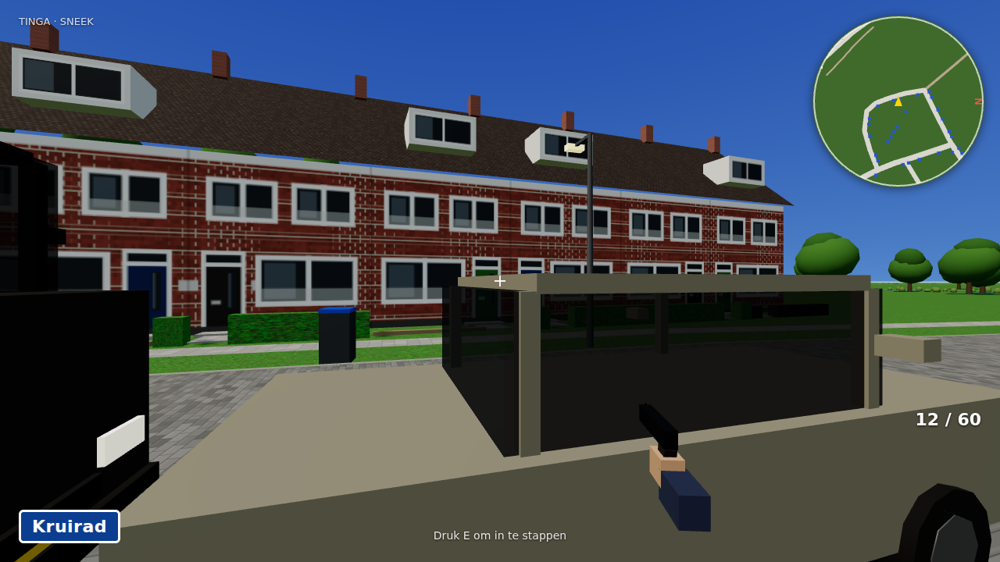 |

| Parkje De Wieken | De Wieken | Molenkrite | Bovenas |
|---|---|---|---|
| 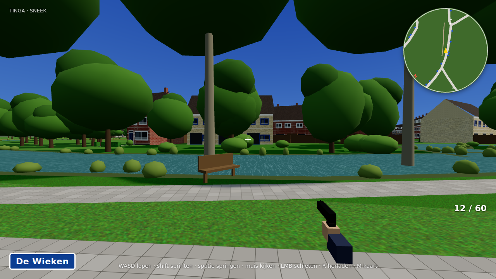 | 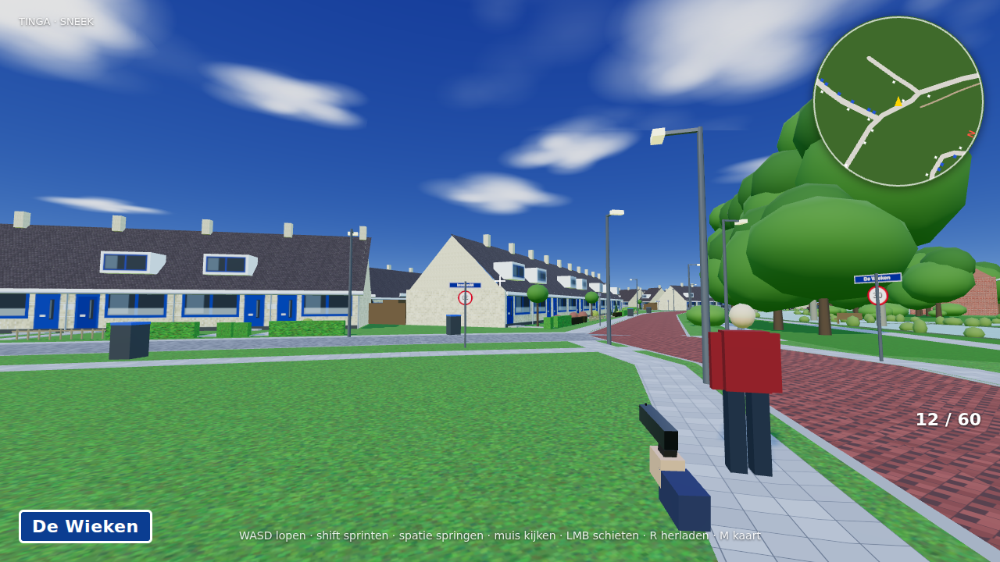 | 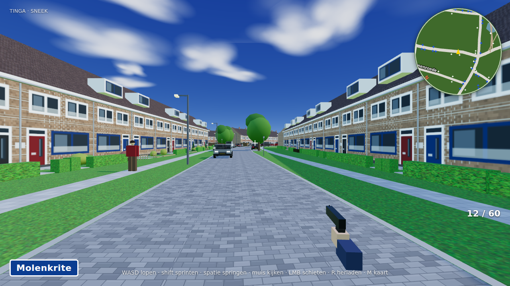 | 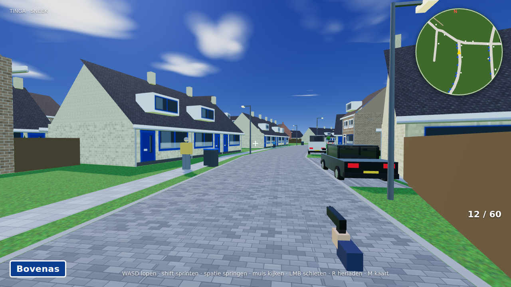 |

| Overzicht vanaf Molenpaal | Kaart (toets M) |
|---|---|
| 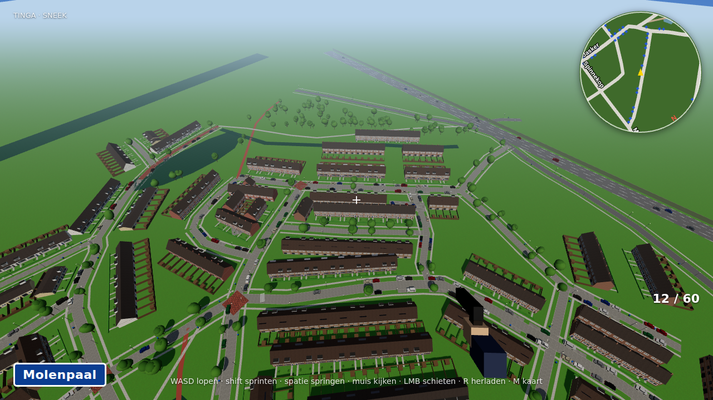 | 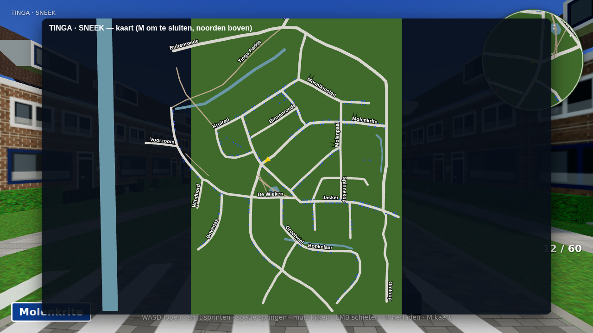 |

Testscreenshots maken (vereist Playwright en de meegeleverde Chromium):

```bash
python3 -m http.server 8123 &
node tools/screenshot.mjs 8123 shots
```
