# Tinga Sneek – open-wereld FPS

Een GTA-achtig first-person spel dat zich afspeelt in de wijk **Tinga in Sneek**. De plattegrond komt
uit de officiële geodata van de wijk (BGT en 3D BAG): elke straat, stoep, parkeerhaven, sloot en elk
huis staat op ware grootte en op de juiste plek, met de echte straatnamen en huisnummers en de echte
dakvormen en hoogtes.

De speelwereld is **4380 × 2500 meter** (bijna 11 km²): heel Tinga, de buurt aan de overkant van de
N7, de Lemmerweg naar het oosten, de polder ten zuidwesten en helemaal aan het eind de stad
**IJlst** — samen **7885 panden**, 155 straten en 75 kilometer weg. Dat is precies zover als de
brondata reikt, en dus ook de buitengrens van de wereld.

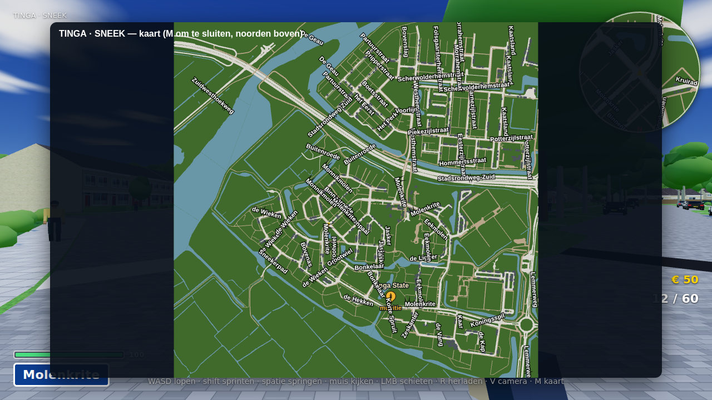

| Morrahemstraat, over de N7 | Partuurstraat, de zuidrand |
|---|---|
| 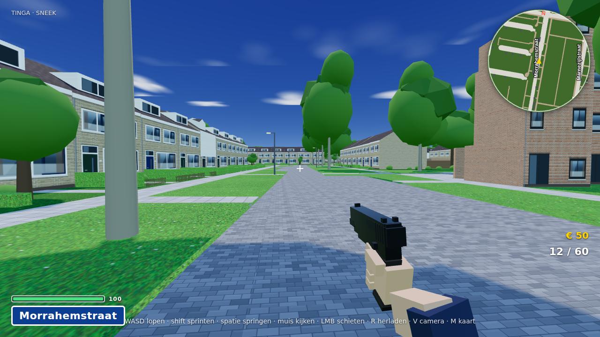 | 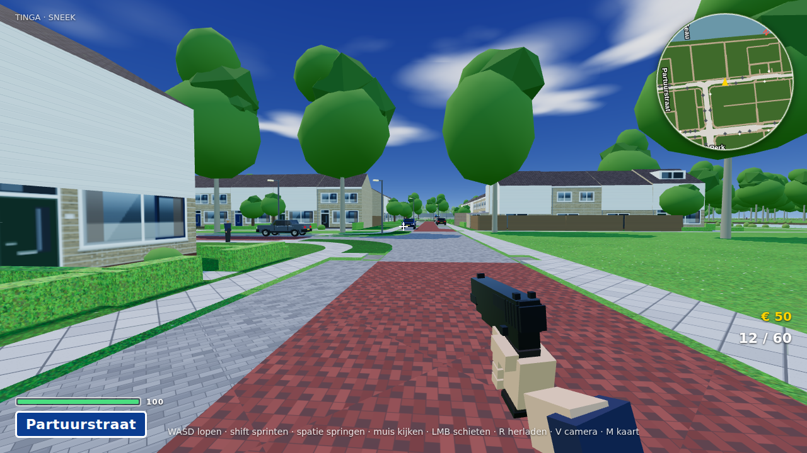 |

## Spelen

Het spel staat online op GitHub Pages: **https://x589h29ftn-code.github.io/EDU2/**

Lokaal draaien kan ook. Het spel heeft geen build-stap, maar omdat het ES-modules gebruikt moet het
via een webserver geladen worden (niet via `file://`):

```bash
npm run server        # node tools/server.mjs, op http://localhost:8123/
```

Of een andere statische server (`npx serve`, VS Code Live Server, GitHub Pages). Eén ding moet die
server wel kunnen: **Range-verzoeken**. `python3 -m http.server` kan dat niet, en dan kan de browser
niet in een geluidsbestand springen — Radio Spannenburg (een uitzending van een uur) begint dan altijd
bij nul. `tools/server.mjs`, GitHub Pages en de Windows-app kunnen het wel.

| Toets | Actie |
|---|---|
| W A S D | lopen (shift = sprinten, spatie = springen) |
| **C** | bukken: je zakt een halve meter, loopt op een derde van je snelheid en bent achter een muurtje of een auto niet meer te zien |
| ← → | in de auto: radiozender wisselen |
| muis | rondkijken · linkermuisknop = schieten (het machinegeweer schiet door zolang je hem vasthoudt) · R = herladen · H = wapen weg en weer tevoorschijn |
| scrollwiel | wisselen tussen het pistool en het machinegeweer; het icoon van het wapen staat kort rechtsonder |
| E | praten (en het gesprek doorklikken) · bij de voordeur van Molenkrite 15, de Wieken 29 en de schuurdeur van Tinga State naar binnen en naar buiten · op de bank zitten en weer opstaan · aan de toonbank in de boerderij munitie kopen · anders in- en uitstappen bij een auto |
| F | aan de toonbank bij Tinga State: het machinegeweer kopen (€ 500) |
| F5 / F9 | spel opslaan / opgeslagen spel laden |
| levensbalk | linksonder; leeg = je begint bij je laatste opgeslagen spel |
| portemonnee | rechtsonder; je begint met € 50 en verdient de rest met missies |
| **V** | camera: vanuit je ogen of over je schouder (handig met de auto) |
| **G** | scherpte: scherp, normaal of zuinig (blijft bewaard) |
| in de auto: W/S, A/D, spatie | gas/rem (en achteruit), sturen, handrem |
| M | grote kaart van de wijk met straatnamen |
| [ ] | klok een uur terug / vooruit · `\` laat de klok lopen (een dag in vier minuten) |
| Y | weer: helder, bewolkt, regen |
| U | geluid uit en aan |
| **K** | je eigen plek in spelmeters (`x, z`), in beeld en op het klembord — handig om een plek door te geven |
| Esc | muis vrijgeven · het menu, met Doorgaan, Instellingen, Besturing en Afsluiten |

Op een telefoon of tablet verschijnt vanzelf touchbesturing: links een joystick om te lopen, rechts
vegen om rond te kijken, en knoppen voor vuren, springen, herladen, wapen wisselen, bukken,
in-/uitstappen, de camera, de kaart en pauze. Daar is geen toetsenbord, dus **je plek staat ook linksonder op de grote kaart (M)** —
dezelfde twee getallen. Ze tellen vanaf het kruispunt Molenkrite / Monnikmolen / Jasker en veranderen
niet als de kaart opnieuw gegenereerd wordt, dus je kunt er een plek mee doorgeven: *"hier een
onzichtbare muur"*, *"hier een wegblokkade"*, *"dit object hoort hier".*

## Bukken (C)

Met **C** ga je door je knieën. Je zakt **achtenveertig centimeter** — precies zoveel als het lichaam
in js/lichaam.js zakt bij een heup van 1,45 en een knie van 2,15 radialen, dus het poppetje in de
derde persoon zakt evenveel als de camera — en je komt op ruim een derde van je snelheid vooruit.
Rennen kan niet; springen zet je eerst weer overeind.

Waar het voor is: **de politie kijkt lager**. Staand kijkt een agent over alles heen wat lager is dan
1,30 m — een tuinmuurtje, een haag, een geparkeerde auto. Gehurkt is 0,75 m genoeg om je uit het
zicht te houden. Achter het muurtje zitten werkt dus echt, en dat is een ander antwoord op vier
sterren dan wegrennen.

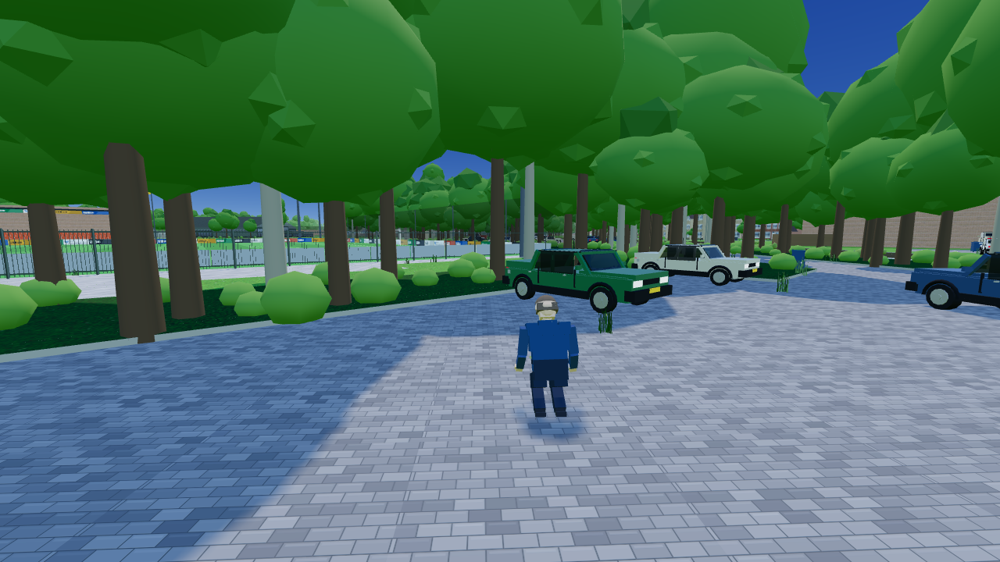

## De wijk heeft geleefd

De wijk was té netjes: geen onkruid tussen de tegels, geen papiertje in de goot, geen tag op een
blinde muur, en gevels die er stuk voor stuk bij stonden alsof ze gisteren zijn opgeleverd. Dat valt
niet op als een fout maar wel als een gevoel — het was een maquette en geen wijk waar dertig jaar in
gewoond is. Wat er nu staat:

| | wat | hoeveel |
|---|---|---|
| **onkruid** | pollen gras en een enkele paardenbloem langs de trottoirbanden, waar de veegwagen niet komt | 28.625 |
| **zwerfvuil** | een verfrommeld papiertje, een blikje, een plastic zak of een patatbakje, plat in de goot | 3.427 |
| **rolcontainers** | grijs, groen en blauw, op de stoep en in de berm, meestal met z'n tweeën | 936 |
| **graffiti** | een tag op ongeveer één op de negen blinde muurstukken uit de BGT | per muur |
| **verweerde gevels** | groene aanslag op de plint, regenstrepen onder de vensterbanken, roet onder de dakrand, vlekken en haarscheurtjes | elke gevel |

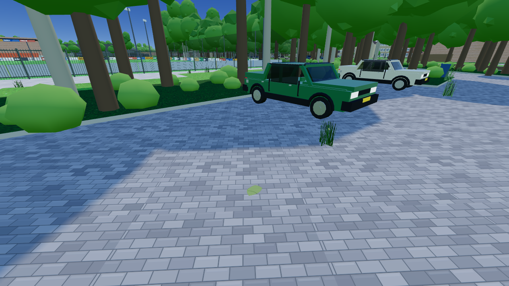

Waar het staat komt uit de kaart zelf: langs de assen van de rijbanen en de voetpaden, op een vaste
afstand uit het hart, met een dobbelsteen die aan de plek hangt. Dezelfde kaart geeft dus altijd
dezelfde rommel — het verspringt niet als je opnieuw laadt, en er hoeft geen lijst voor bewaard te
worden. Alles gaat per tegel van 240 m in instanced meshes met een afstandsgrens, net als de
struiken: een pol onkruid is op honderd meter een groen puntje van twee beeldpunten. Het kostte
**45 draw calls** en **zes megabyte** textuur extra, en geen meetbare tijd per beeld.

Hoe vuil een gevel is, verschilt per huis: de ene is vorig jaar gereinigd, de andere staat er al
twintig jaar zo bij. Een straat waar élke gevel even grauw is klopt net zo min als een straat waar
alles glimt.

**Wat er nog meer zou kunnen** (nog niet gedaan, in volgorde van wat het meeste oplevert):
olievlekken en gerepareerde stukken asfalt op de rijbaan, scheefliggende en verzakte stoeptegels,
mos in de voegen van het trottoir, bladeren in de goot onder de bomen, een omgevallen fiets tegen een
lantaarnpaal, een grofvuilhoop bij een oprit, schotelantennes en losse dakramen op de achterkanten,
gordijnen die per woning verschillen, een enkele verlaten auto op een parkeervak, en verf die van de
kozijnen bladdert op de straten waar de foto's dat laten zien.

## Rijden

De 329 auto's in de wijk staan er niet alleen voor de sier: in elke auto waar je bij kunt kun je
stappen. Ze zijn opgebouwd uit een dorpel, een flank met een taille, een schouderlijn, een motorkap
en een kofferklep, met schuine A- en C-stijlen, wielkasten, spiegels, portiernaden en een uitlaat.


**Wat er in de ronde van 13 september bij kwam.** Het dak was W − 0,40 breed terwijl de zijruiten
tien centimeter verder naar buiten stonden: aan weerskanten bleef er een spleet open en van schuin
voren leek elke auto een cabriolet. Het dak sluit nu over de ruiten heen, met een druiplijst langs de
dakrand. Verder: **velgen met vijf spaken** in plaats van een gladde dop (aan beide kanten van de
band, want een schijf in het midden verdwijnt erin), **ruitenwissers** in hun ruststand op de
motorkap, een **antenne** op het dak, **lamellen** in de grille, een **tankdop** op het achterspatbord
en een **vuilrand** langs de dorpel — opspattend wegvuil, niet een sierlijst. De lak is matter
(ruwheid 0,46, metaalgehalte 0,22): op 0,35 en 0,5 leek het plastic speelgoed. En het wagenpark is
minder bont: zestien kleuren waarvan de meeste grijs, zilver, donkerblauw en zwart, zoals een
Nederlandse woonstraat er werkelijk uitziet.

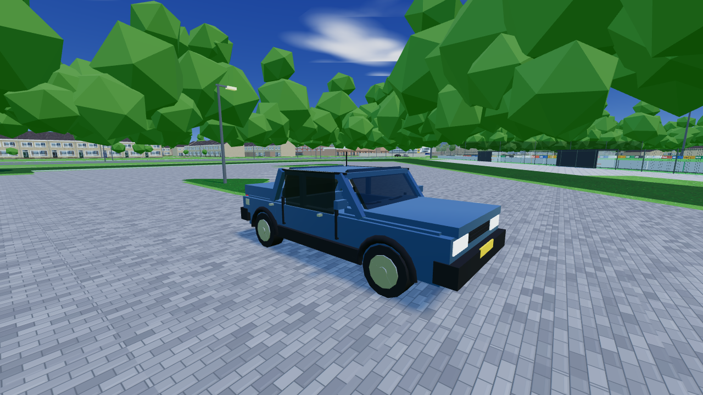

Zodra je instapt krijgt die ene auto het model met **losse wielen**: de voorwielen sturen mee en alle
vier rollen ze met de afgelegde weg. De carrosserie helt over in de bocht en duikt als je remt, de
remlichten branden als je op de rem staat en de achteruitrijlichten als je achteruit gaat. De rest van
de wijk houdt de zuinige uitvoering, want 329 auto's met losse wielen zou tweeduizend draw calls extra
kosten.

Het rijden zelf: gas geven trekt af naarmate je sneller gaat, los gas is motorrem plus
luchtweerstand, en de stuuruitslag wordt kleiner naarmate je harder rijdt — anders is een auto op
snelheid onbestuurbaar. De auto rijdt bovendien niet precies waar zijn neus wijst: de rijrichting
loopt er iets achteraan, en met de **handrem** (spatie) loopt hij er zóver achteraan dat de kont
uitbreekt en je de bocht uit glijdt.

Auto's zijn massief: je rijdt niet meer dwars door de geparkeerde rij of door het verkeer heen, en te
voet loop je er ook niet doorheen — je loopt eromheen zoals om alles wat er staat. Raak je er eentje
met vaart, dan rolt die een halve meter opzij en is jouw vaart eruit.

**In het rijdende verkeer zit iemand achter het stuur.** Rijd je zo'n auto aan, dan schrikt de
bestuurder: de klap haalt zijn vaart eruit, hij zet hem in zijn achteruit en probeert anderhalve
seconde lang bij je vandaan te komen. Schiet je op een rijdende auto — dat kon eerst niet, het
verkeer stond niet in de doelenlijst van je kogels — dan geeft hij juist gas: vijf tot acht seconden
bijna twee keer zo hard, tot hij de straat uit is. De auto zelf gaat niet in vlammen op; hij rijdt op
een vaste baan, en een wrak midden op de N7 sluit de rij erachter op.

De motor heeft een **versnellingsbak** van vijf verzetten. Binnen een verzet lopen de toeren op, bij
het schakelen valt het gas even weg en beginnen ze weer onderaan — daardoor klinkt het niet meer
alsof je de hele wijk in zijn één doorkomt. Achteruit is één laag verzet dat hoog opjankt. En zodra
je achter het stuur zit speelt de **autoradio** een rockdeuntje: zacht genoeg om de motor eronder te
blijven horen, en tijdens de achtervolging in het verhaal zakt hij nog verder weg.

### In de auto

Vanachter het stuur zit je nu **echt in de auto**: dashboard, stuur, klokken,
deurpanelen met armsteun, hemelbekleding, stoelen, middenconsole met pook en
handrem, achterbank, hoedenplank, binnenspiegel en zonnekleppen. Het stuur
draait mee met de voorwielen en de twee wijzers lopen mee met je snelheid en je
toeren.

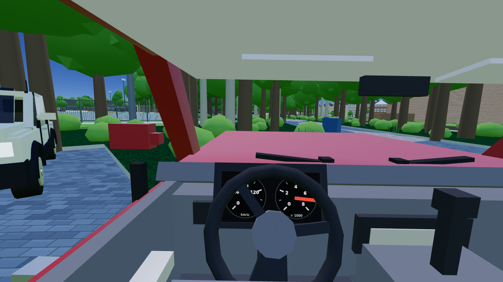

Hoe dit slim blijft: er wordt **geen interieur in elk automodel gebouwd**. De
1781 geparkeerde auto's zijn instanced meshes en krijgen er niets bij; er is
maar één auto tegelijk waar je in zit, en alleen díe krijgt het erin gehangen —
aan de carrosseriegroep, zodat het meehelt in de bocht en meeduikt bij het
remmen. Stap je uit, dan gaat het weer weg. Met de camera over je schouder staat
het uit. Eenenveertig onderdelen, 353 driehoeken, en buiten die ene auto kost
het niets.

Twee dingen moesten daarvoor veranderen. Het **oogpunt** lag vóór de voorruit en
vlak onder de dakrand — eigenlijk boven de motorkap, buiten de auto: een
noodgreep, want er wás geen interieur en vanaf de stoel keek je door twee
getinte ruiten naar een leeg gat. Nu zit het waar een stoel staat. En de
**cabine is hol geworden**: de flank en de schouderlijn liepen als dichte
blokken door de hele auto, dus zodra de camera erin zat keek je tegen de
bovenkant van zo'n blok aan — een rode vlakte waar het interieur hoort te
zitten. Er blijven nu twee zijwanden over plus een vulling vóór en achter de
cabine; van buiten is er niets aan veranderd, want de buitenvlakken liggen op
precies dezelfde plek.

De ruiten blijven uit zolang je erin zit: het glas is van buiten donker getint,
en van binnen keek je er dwars doorheen naar een grauwe plaat. Wat je ziet is de
opening met de stijlen eromheen, alsof de ramen openstaan — en dat is precies
wat je in een spel wilt. Ze komen terug zodra je uitstapt of naar de camera
achter de auto gaat.


## De wapens

Je hebt er twee: het pistool waar je mee begint, en een **machinegeweer** dat je voor **€ 500** koopt
aan de toonbank bij Tinga State (toets **F**, waar **E** een doos kogels koopt). Met het **scrollwiel**
wissel je ertussen; het icoon van het wapen dat je pakt staat twee tellen rechtsonder in beeld. Het
magazijn blijft in het wapen zitten dat je weglegt, en de voorraad kogels is voor allebei dezelfde —
een doos van Tinga State, of de munitie van een neergeschoten agent, past dus altijd.

| | pistool | machinegeweer |
|---|---|---|
| magazijn | 12 | 30 |
| vuren | per klik | doorschieten zolang je de knop vasthoudt (ruim tien schoten per seconde) |
| nauwkeurig | precies waar je kijkt | een fractie ernaast — harder, maar slordiger |
| herladen | 1,55 s | 2,05 s |
| prijs | je begint ermee | € 500 |

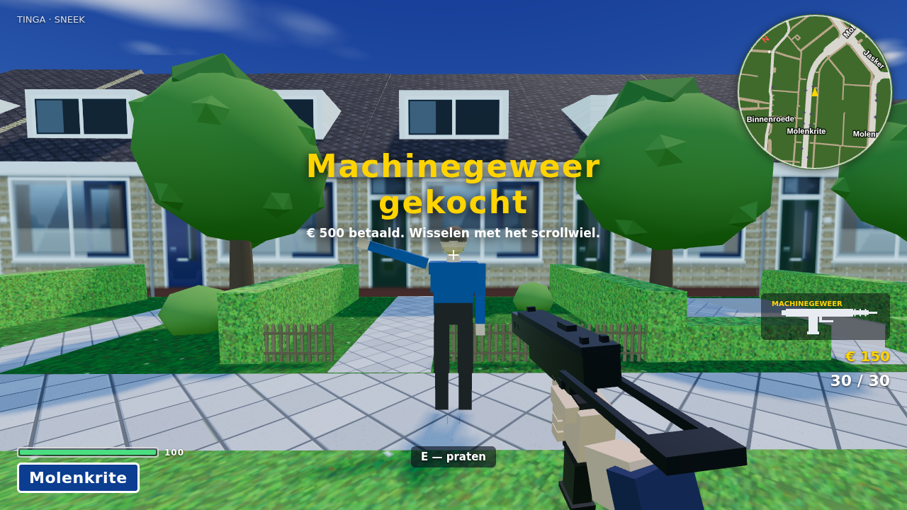

Het machinegeweer heeft hetzelfde onderstel als het pistool — dezelfde greep, hand en onderarm, en
dezelfde herlaadbeweging in vijf stappen — met daarboven een langere grendelkast met een loopmantel
met koelribben, een spanknop in plaats van een slede, een magazijnschacht door de greep heen (zoals
bij een Uzi) en een ingeklapte schouderstut.

### Het pistool

Het pistool zit in je rechterhand met een onderarm die naar de rechteronderhoek uit beeld loopt. Met
**H** stop je hem weg: dan verdwijnt ook het kruisje en schiet je niet meer, tot je hem met dezelfde
toets weer trekt.

Het is een 9 mm van 19 cm met de onderdelen die een pistool werkelijk heeft: een slede met grepen
aan de achterkant, een uitwerpopening, een loop die er vooraan net uitsteekt, een onderstel met
stofkap, een trekkerbeugel met de trekker erin, korrel en keep, een greep met ribbels en een magazijn
dat er los in zit. De hand is geen vuist: een handpalm achter de greep, vier vingers die eromheen
vouwen, een duim langs de kast en een wijsvinger aan de trekker.

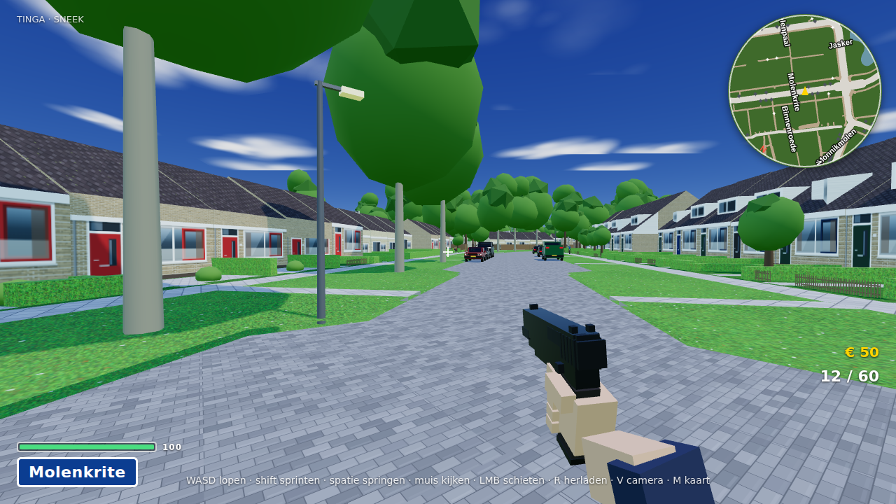

**Schieten.** Bij elk schot springt de slede naar achteren, brandt er mondingsvuur (een kegel met een
dwarskruis, elk schot een slag gedraaid en een maat anders) en tikt even later de huls op de stoep.
De knal is elke keer nét iets anders van toon, zodat een serie schoten niet klinkt als een
kopieermachine.

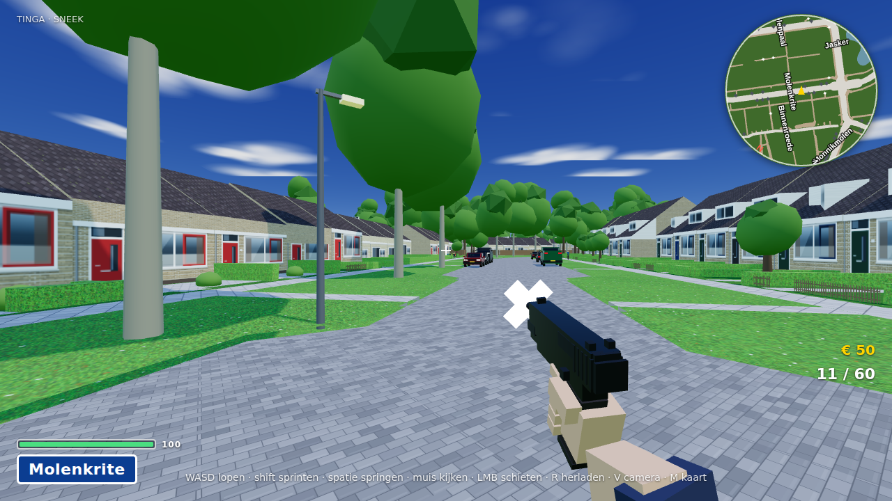

**Terugslag.** Het beeld schokt bij elk schot een graad of anderhalf omhoog en een tikje opzij, en
zakt in een halve seconde weer terug. Het is alleen beeld: je kijkrichting blijft staan waar jij hem
hebt gezet, dus het tweede schot komt op dezelfde plek aan en je hoeft niet na te corrigeren.

**Herladen (R).** Dat is een beweging van anderhalve seconde in vijf stappen: het wapen kantelt naar
je toe zodat je in het magazijnhuis kijkt, de magazijnknop gaat in, het lege magazijn valt eruit, een
vol magazijn komt van onderen omhoog en klikt vast, de slede gaat naar achteren en weer naar voren,
en dan ligt hij weer in de aanslag. De klik, de klap van het magazijn en het overhalen van de slede
klinken precies op het moment dat je ze ziet gebeuren. Schiet je met een leeg magazijn, dan hoor je
alleen de klik van de slagpin.

| Het magazijn valt eruit | De slede gaat naar achteren |
|---|---|
| 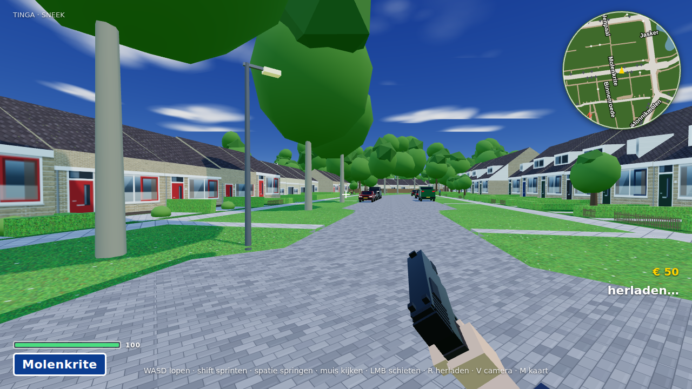 | 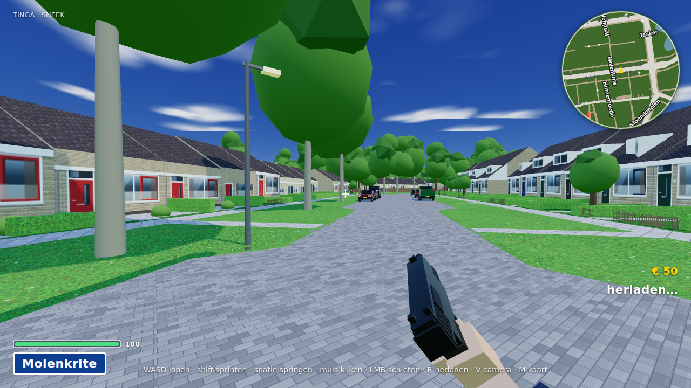 |

## De mensen

Iedereen in de wijk is van hetzelfde lichaam gemaakt — de honderddertig voetgangers, de agenten, de
bewakers, de dief en de mensen uit het verhaal. Een volwassene is 1,75 m, en de bouw klopt met die
maat: borstkas en taille, een bekken, een nek, een hoofd met een neus en oren, haar of een pet,
handen en schoenen.

Armen en benen hebben een **elleboog en een knie**. Dat is het verschil tussen een pop en een mens:
een been dat van heup tot voet één plank is zwaait als een klok, een been met een knie zet een stap.
De knie buigt alleen de kant op waar een knie heen kan, de enkel volgt het onderbeen, en het lichaam
zakt bij elke pas een centimeter of vijf — sla je dat over, dan zweven de voeten boven de stoep. Wie
rent zwaait verder en buigt dieper; wie fietst trapt rondjes met de armen op het stuur.

| Op straat | Een agent |
|---|---|
| 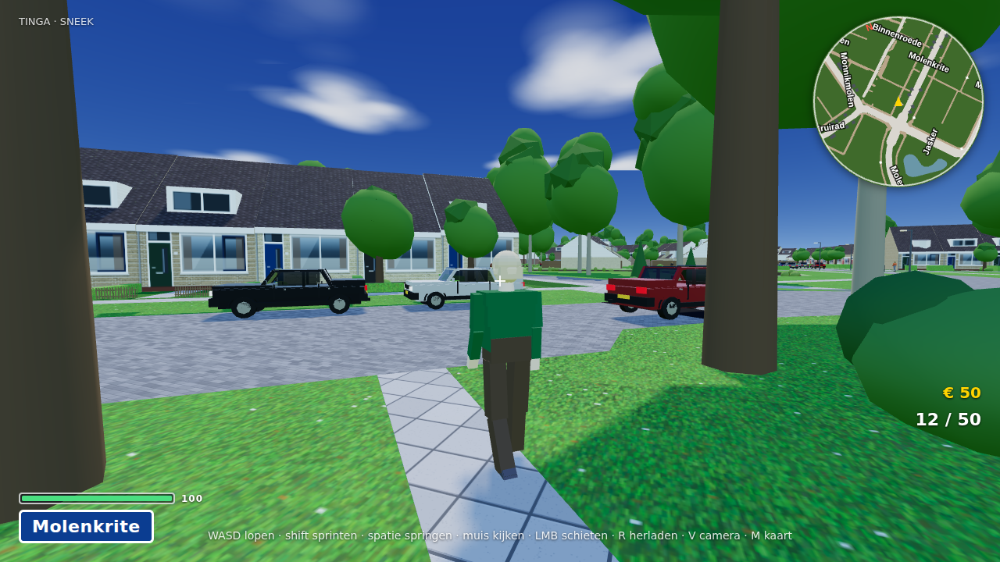 | 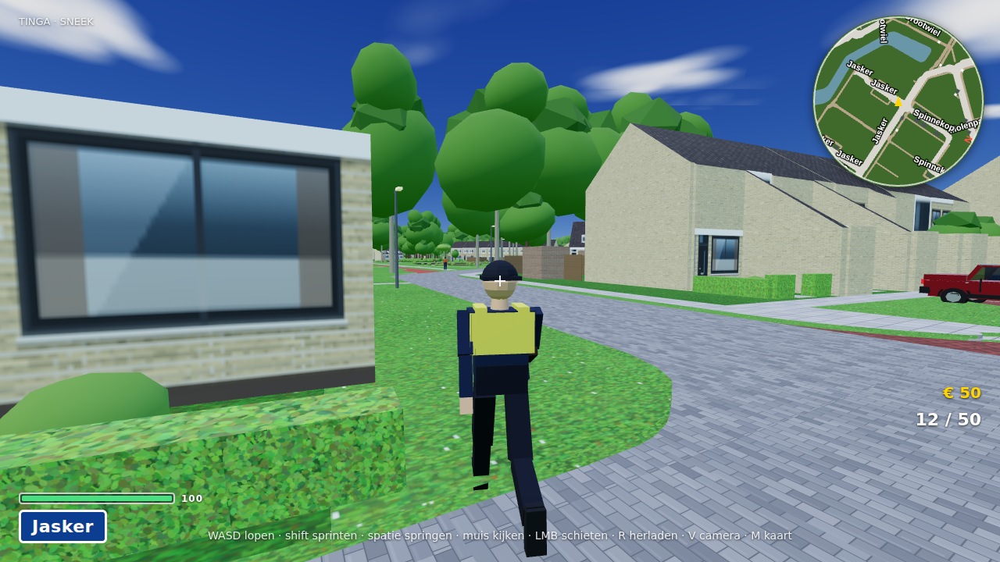 |

**Wat er in de ronde van 13 september bij kwam.** Ze zwaaiden met armen en benen, maar de rómp stond
er kaarsrecht en doodstil bij — en dat is waarom ze eruitzagen als marionetten. Nu doet het lichaam
mee:

- **voorover hellen.** Wie loopt helt twee graden naar voren, wie rent elf. Dat is het verschil
  tussen wandelen en hard weglopen, en je ziet het van ver;
- **de slinger opzij.** Bij elke pas valt je gewicht op één been en helt je bovenlichaam een graad of
  twee die kant op — twee keer per hele slag;
- **een hoofd dat waterpas blijft.** Het draait tegen de romp in, want je ogen willen stilstaan. Het
  hoofd is daarvoor een eigen groep geworden, met de pet of het haar eraan vast;
- **de voet zet af.** De enkel volgde alleen de knie, en daardoor stond de voet het hele rondje in
  dezelfde stand, alsof je op planken loopt. Nu komt de hiel als eerste neer en zet de teen aan het
  eind af;
- **de armen hangen naar buiten**, een paar graden, in plaats van plat tegen de romp;
- **en wie stilstaat, staat niet stíl:** hij ademt en verlegt langzaam zijn gewicht van het ene op
  het andere been, ieder op zijn eigen moment. Een rij mensen die allemaal bevroren staan te wachten
  is net zo verkeerd als een rij die precies gelijk loopt.

Aan het uiterlijk veranderde net zoveel: **ogen** in het gezicht (twee donkere spleetjes — een eigen
onderdeel, want ze hebben een eigen kleur), een **kaaklijn met een kin** in plaats van een bal met
een neus erop, **schouders** die de hoek van de romp afhalen, een **broekband**, een **duim** aan de
hand, een **zool** onder de schoen, en bij ruim de helft **korte mouwen** — dan is de onderarm
huidkleur, en dat is meteen te zien. Een jas herken je aan dat verschil.

| Van voren | Driekwart: stilstaan, lopen, mikken |
|---|---|
| 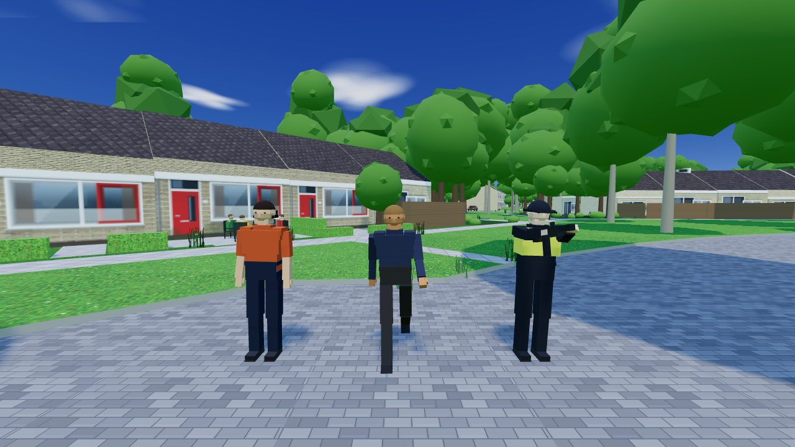 | 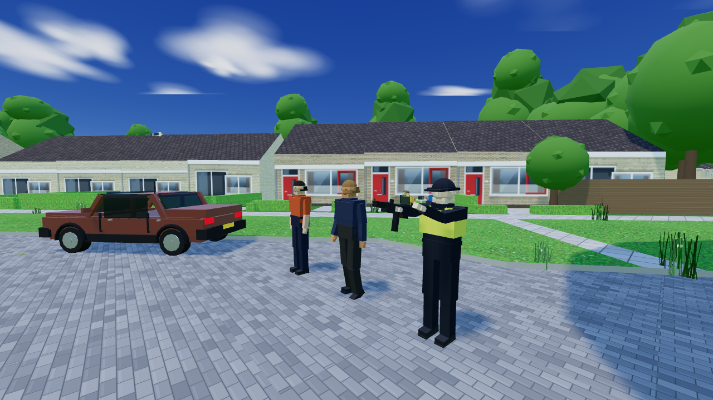 |

De politie draagt een donkerblauw uniform met een **fluorescerend vest** eroverheen en een pet. Dat
is niet alleen echter — een agent in het donkerblauw was tussen de voetgangers nauwelijks te
onderscheiden, en nu zie je van ver of het blauw op je afkomt. De bewaking op de waterzuivering
draagt een oranje vest. Hun geweer hangt aan de onderarm en niet aan de schouder, zodat de loop
meewijst met de elleboog.

**Vanaf vier sterren rukt de politie zwaarder uit.** Veertig procent van de agenten die dan komt heeft
een **machinepistool** in plaats van het dienstwapen, bij vijf sterren de helft. Het wordt per agent
bepaald op het moment dat hij komt, dus wie er al staat wisselt niet ineens van wapen en een ploeg is
nooit helemaal de een of de ander. Zo iemand schiet **salvo's van drie**, korter na elkaar, en je
ziet het aan zijn wapen: korter dan het geweer, met een magazijn dat eronder uitsteekt en een
ingeklapte schouderstut. Elk schot van zo'n salvo is wel minder trefzeker dan één gericht schot —
anders is vier sterren geen uitdaging meer maar een executie.

`npm run wapentest` loopt dit allemaal na (veertig controles over het model, het schieten, de
terugslag, het herladen, de bouw van een mens, de looppas en een agent). `npm run wapenshots` maakt
de foto's hierboven. Het machinegeweer, de buit, het verkeer dat op je reageert en de rest van de
punten van 13 september staan in **`npm run puntentest`** (vijfenveertig controles) met
`npm run puntenshots` voor de foto's; de mensen, de auto's, het vuil, het bukken en de zwaardere
politie in **`npm run vuiltest`** (vierenveertig controles) met `npm run vuilshots`.

### Wat er op straat blijft liggen

Neerschieten leverde niets op. Nu laat een voetganger die je neerschiet wisselend wat geld vallen —
**vaak niets, hooguit een tientje**, zoals iemand met een paar briefjes op zak — en een agent zijn
**munitie**, drie tot vijftien kogels die in elk wapen passen. Het ligt er echt: een stapeltje
briefjes of een doosje patronen dat rondjes draait en op en neer dobbert, groter dan levensgroot zodat
je het van een paar meter ziet liggen. Loop je er binnen een meter langs, dan pak je het op; na een
minuut knippert het even en is het weg, anders ligt de wijk na een half uur vol.

### De buurt verhuist met je mee

De honderddertig voetgangers werden bij het opstarten één keer op een willekeurig wegvak in de héle
wereld gezet, en daarna kwam er niemand meer bij. Over 10,95 km² is dat twaalf mensen per vierkante
kilometer: gemeten stond er op elk standpunt **nul of één** iemand binnen tachtig meter, en in IJlst
en Duinterpen niets binnen tweehonderd meter. Rijd je hard, dan laat je die paar achter en staat er
niets meer vóór je. Met het verkeer was het net zo: veertien auto's reden op de N7 en zes op acht
assen in Tinga, dus in IJlst, langs de Lemmerweg en in Duinterpen reed er geen enkele auto.

Er wordt nu niemand bijgemaakt — ze **verhuizen**. Wie meer dan 380 m achter je ligt, wordt in een
band om je heen opnieuw op straat gezet; auto's net zo, op elke rijbaan van de kaart. Het aantal
blijft dus precies gelijk (130 mensen, 20 auto's) en het kost niets: gemeten +0,1 ms per beeld, wat
binnen de ruis van de meting valt.

Twee dingen bepalen waar iemand terechtkomt:

- **Niet vóór je neus.** `zichtVrij` uit `js/world.js` kijkt of er een gebouw tussen jou en de plek
  staat. Zo niet, dan moet het minstens 110 m van je af (auto's 130 m); staat er wél iets tussen, dan
  mag het dichterbij, want je ziet het niet gebeuren.
- **Twee ringen.** Een handvol mensen in de straat waar je bent (vier binnen 100 m) en een
  twintigtal in de buurt (achttien binnen 200 m). Alleen die buitenste ring was niet genoeg:
  achttien mensen verdeeld over een schijf van tweehonderd meter laten er maar één of twee bij je
  staan, want het stuk binnen tachtig meter is maar een zesde van die schijf. Voor de binnenste ring
  wordt niemand in het open veld gezet — is er geen plek achter een gebouw, dan gebeurt er niets en
  probeert het spel het een halve seconde later opnieuw.

Rijd je nu met 50 km/u door de Wieken, dan staan er onderweg gemiddeld zeven mensen binnen tachtig
meter (minimaal drie, hoogstens tien) en komt er regelmatig een auto voorbij. Stilstaand in IJlst,
waar eerst niets was, staan er na een minuut achttien mensen en drie rijdende auto's binnen
tweehonderd meter. Het blijft een woonwijk: het wordt niet druk, maar het is niet meer uitgestorven.

`npm run bevolkingtest` toetst dit (twintig controles: het aantal blijft gelijk, elke wijk vult zich,
niemand verschijnt in het vrije zicht binnen 110 m, de binnenste ring blijft binnen 105 m, en de
kosten per beeld).

## Drie dingen rechtgezet

Uit het spelen kwamen drie meldingen, en alle drie klopten ze:

**Iedereen liep achteruit.** Het lichaam kijkt langs zijn eigen −z (de neus zit op z = −0,108, de klep
van de pet op −0,155), dus voor een looprichting (vx, vz) hoort `yaw = atan2(−vx, −vz)`. In `js/npc.js`
stond er een halve slag te veel bij: de voetgangers en fietsers liepen met hun gezicht naar waar ze
vandaan kwamen. Gemeten over alle honderddertig mensen, met wie net een hoek omsloeg of aan het
oversteken is buiten beschouwing: **89 vooruit, 0 achteruit**.

**De auto's liepen door hun eigen wielen.** Drie fouten, alle drie uit de maten na te rekenen: de
sierlijst langs de dorpel was 2,80 m lang terwijl de wielen op ±1,32 staan met een straal van 0,32 —
veertig centimeter dwars door beide banden; het chassis van de bakwagen was 2,25 m breed met de wielen
op ±1,00, dus 27 van de 30 centimeter band zat erin; en grille, koplampen, achterlichten en
kentekenplaten hingen centimeters vóór het plaatwerk, met daglicht ertussen. Daarbij kwamen nog de
zijruiten die in het portiergat zweefden en de spiegels van de bakwagen die twee centimeter naast de
cabine hingen. `npm run rijtest` rekent nu voor alle drie de modellen na dat geen onderdeel tot aan de
buitenkant van een band komt en dat elk onderdeel ergens tegenaan zit.

**Je kon tussen het gras en de weg door kijken.** De opstaande rand langs een verhoogd vlak wordt per
rand als vierhoek opgebouwd, en zowel de normaal als de volgorde van de hoekpunten klapt om als de
ring andersom loopt. De brondata houdt zich niet aan één draairichting, dus de helft van die randen
keek naar binnen en werd als achterkant weggeknipt: je keek onder de stoep door tot op het grondvlak
een meter lager. Gemeten met een felroze grondvlak was **0,14 % tot 0,58 % van het beeld** zo'n kier.
De draairichting wordt nu per ring rechtgezet — buitenring linksom, gaten rechtsom, en voor een
oeverwand precies andersom omdat je die van de waterkant ziet. Ook de fietspaden (2 cm hoog) krijgen nu
een randje, en elk stukje rand hoort voortaan bij de tegel waar het zélf ligt in plaats van bij de
tegel van het eerste hoekpunt van zijn vlak. Wat overblijft zijn spleetjes in de brondata zelf:
0,04 % van het open terrein in Tinga ligt tussen twee vlakken in.

## Tankstation BP Slump Oil

Aan de Lemmerweg, op de hoek bij het sportpark, staat het tankstation: een luifel op vier kolommen met
een groene rand en een dunne gele lijn eronder, het BP-zonnetje op de koppen, twee pompeilanden met
groen-witte pompen, en aan de weg een prijzenzuil met de prijzen in groene cijfers. De shop ernaast is
het echte pand (Lemmerweg 63) met een groene band over de glazen pui.

De maten komen uit de brondata: de luifel staat als los bouwwerk in de BGT (24,6 × 10,8 m), en daar
komen plek, richting en maat vandaan. Alleen de doorrijhoogte, het aantal pompen en de prijzen staan in
`data/stijl/omgeving.json`. Onder de luifel kun je gewoon doorrijden; door een pomp of de zuil niet.
`npm run tanktest` rekent dat na, `npm run tankshots` maakt de foto's.

| Onder de luifel | De prijzenzuil |
|---|---|
| 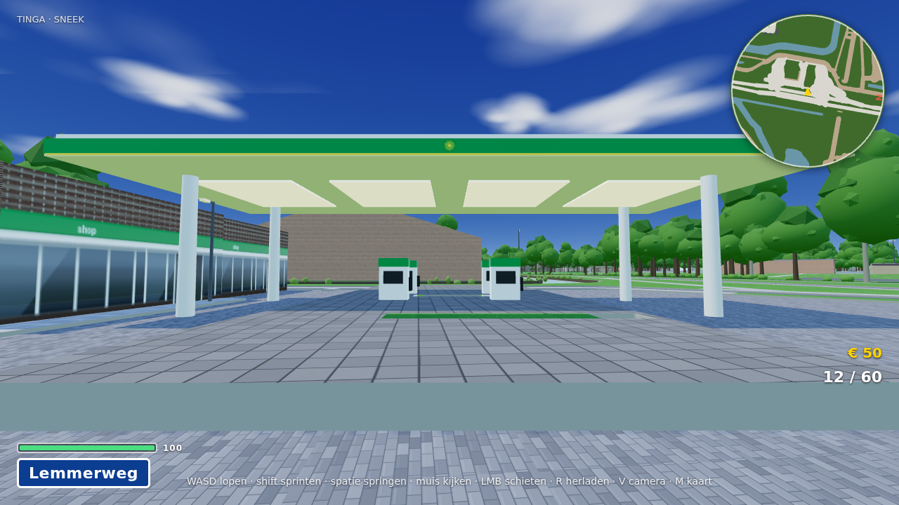 | 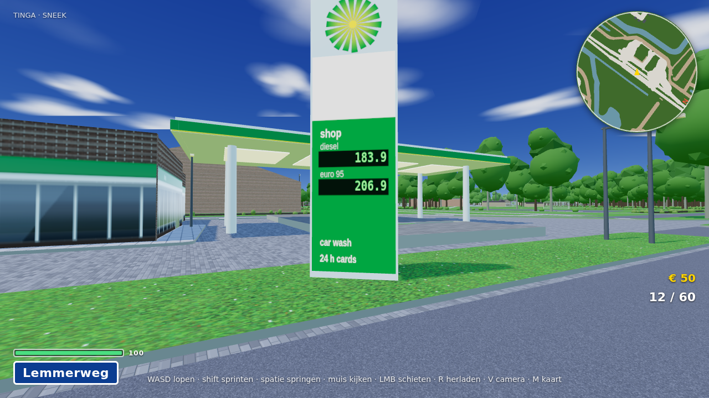 |

## Tennispark Molenkrite

Naast het sportpark, bij Molenkrite 130, liggen tien gravelbanen: roodbruin gravel met witte belijning,
een net per baan, een donkergroen gaashek van 3,6 m eromheen en lichtmasten op de hoeken.

Ook dit komt uit de brondata. De banen staan in de BGT als **halfverhard** — grind, en dat is in
Nederland gewoon gravel — in vier blokken van 1276 tot 2535 m². Maat, plek en richting van elk blok
komen daar vandaan; alleen het aantal banen rekent de generator erbij, met de maat van een echte baan
(36,6 × 18,3 m inclusief uitloop). Dat geeft 2 + 2 + 2 + 4 = tien banen.

De belijning wordt op één doek per blok getekend in plaats van als losse balkjes: dat scheelt honderd
objecten per park en een lijn van vijf centimeter blijft zo scherp. Door het hek rijd je niet heen;
tussen de banen sta je vrij. Wat de strooiregels op het grind hadden neergezet — achtendertig bomen en
struiken binnen het hek — wordt bij het genereren weer weggehaald, net als eerder op de voetbalvelden.
`npm run tennistest` rekent het na, `npm run tennisshots` maakt de foto's.

| Van bovenaf | Vanaf de baan |
|---|---|
| 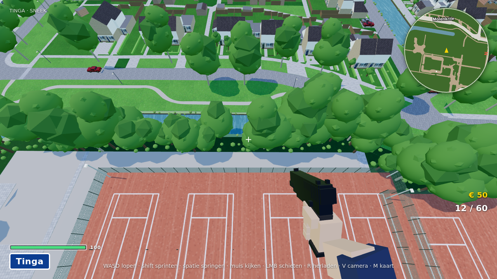 | 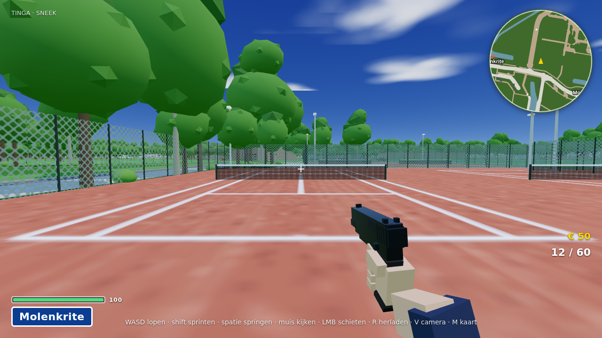 |

## Ranzijn Tuin & Dier

Aan de rondweg bij de Zonnedauw staat het tuincentrum: Akkerwinde 1, één pand van 3112 m² (81 × 45 m)
met een goot op 3,94 en een nok op 6,44 m, bouwjaar 1980. Die maat komt onveranderd uit de BGT en het
3D BAG. Van de foto komen alleen kleur en indeling, zoals de regel voorschrijft: lichtgrijze
gevelbeplating op een donkere plint, een glazen pui over de voorkant en daarboven de gele band met het
woordmerk in het groen. De voorkant kijkt naar het westen, naar het parkeerterrein aan de rondweg.

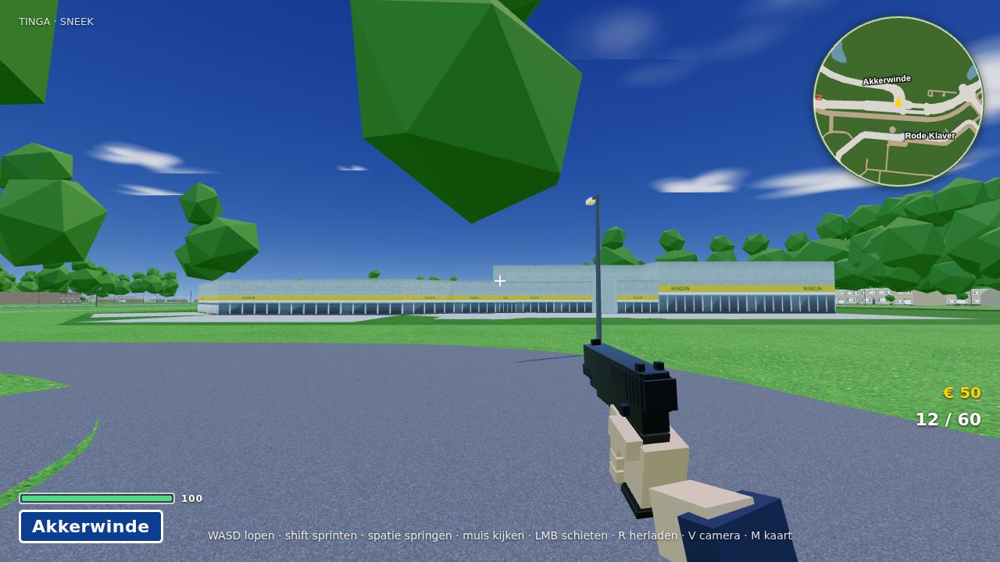

## Vijf panden uit de steekproef

Uit de brondata kwamen achttien panden die er qua maat uitspringen en die nog als generiek blok in het
spel stonden. Dit zijn de eerste vijf, elk met een eigen gevel. Steeds hetzelfde recept: **maat, hoogte
en richting uit de BGT en het 3D BAG, kleur en indeling uit de foto.**

| Pand | Uit de data | Van de foto |
|---|---|---|
| **Westhemstraat 55–61** | vier bungalows van 13,2 × 7,1 m, goot 2,8–3,1 en nok 6,6–6,7 m, bj 1972 | lichte zandkleurige steen, blauwe deuren en draaidelen, schoorsteen per woning op de nok, zonnepanelen over het hele voordakvlak |
| **Potterzijlstraat 2–48 / 3–49** | galerijflats, 69 × 10,6 m, plat dak op 11,1 m, bj 1966 — vier lagen | roodbruine steen, donkere open onderbouw met bergingen, een stalen galerijhek voor elke woonlaag |
| **Potterzijlstraat 51–177 / 157–241** | 51 × 12,5 m, goot 25,6 m, bj 1968 — negen lagen, de hoogste gebouwen van de kaart | doorlopende witte balkonplaten, glas erachter, donkere onderbouw, gele trappentoren |
| **Sûdwester, Lemmerweg 130a** | 77 × 44 m, goot 6,25 en nok 12,32 m, 19 dakvlakken, bj 1980 | donkergroene dichte wand met hoog één strook ramen, glazen entreepui onder een overstek |
| **Sneekerpad 25** | de loods naast de molen, 63 × 55 m, goot 3,57 en nok 8,34 m, bj 1981 | roodbruine steen onder donkergrijze felsplaten, verder een dichte wand |

Twee dingen zijn er nieuw voor bij gekomen. Een pand uit de BGT had tot nu toe een kaal dakvlak: geen
schoorsteen, geen zonnepanelen. Dat kan nu, en het staat per stijl aan — anders komen er in één klap
honderden schoorstenen bij. En een gevel werd altijd op vier lagen afgekapt; op de muur van 25 meter van
de hoogbouw werden dat lagen van ruim zes meter. `npm run steekproeftest` rekent het na,
`npm run steekproefshots` maakt de foto's.

| Westhemstraat | Potterzijlstraat |
|---|---|
| 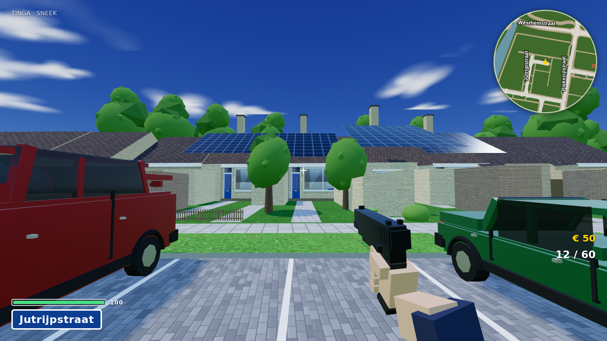 | 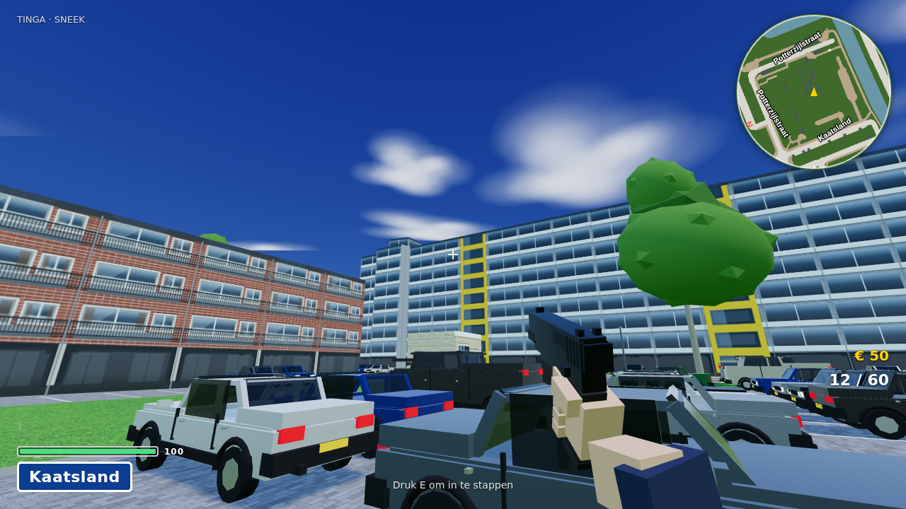 |

## Het startscherm en het laadscherm

Je komt binnen op een menu: **Start spel · Doorgaan · Spel laden · Instellingen · Besturing ·
Afsluiten**. Dat staat er na **2,8 seconden**; daarvóór keek je drieënveertig seconden naar een zwart
scherm terwijl de wereld werd opgebouwd. Kies je iets, dan schuift het laadscherm ervoor met een beeld
uit de wijk en een voortgangsbalk. Met Esc komt hetzelfde menu tijdens het spelen terug, nu met
Doorgaan bovenaan — en dat is ook waar de instellingen en de toetsenlijst zitten.

| Startscherm | Laadscherm |
|---|---|
| 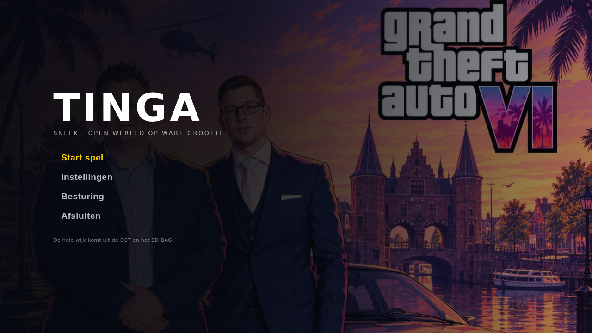 | 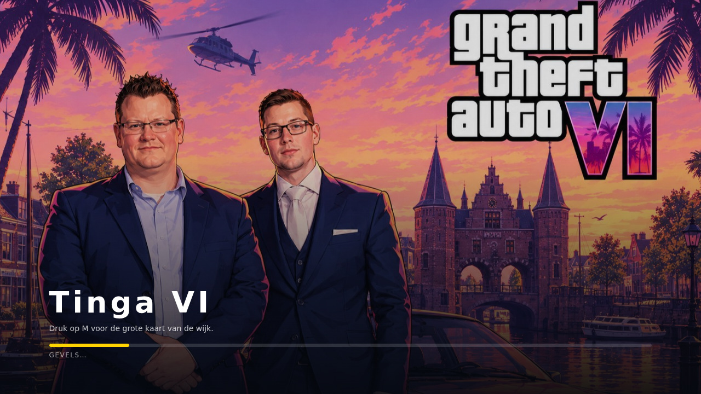 |

**De wereld wordt nu in stukjes opgebouwd.** `buildWorld` is een generator geworden die tussen de fases
en binnen de grootste lussen teruggeeft (de vlakken, de panden, de gevels); `js/main.js` laat er
vierentwintig milliseconde per keer van draaien en werkt de balk bij. Daardoor staat het menu er meteen,
loopt er een teller, en bevriest het tabblad niet meer een halve minuut.

Onderweg kwam er één echte rem boven water. `nearBuilding` — "staat hier een gebouw?" — liep **alle
56.128 botsdozen** langs, en het riet langs het water vraagt dat voor elke pol opnieuw: **29 seconden**
voor het riet alleen. Er lag al een rooster over de botsdozen voor de botsingen; dat wordt nu ook hier
gebruikt. Riet: **29 → 4,3 s**.

| | vóór | ná |
|---|---|---|
| menu in beeld | 68 s | **2,8 s** |
| wereld opbouwen | 43,3 s | **28,1 s** |
| laadtijd tot speelbaar | 67,8 s | **44,4 s** |
| langste bevriezing tijdens de opbouw | 43 s | **4,1 s** |

De beelden voor het laadscherm staan in [`beeld/laadscherm/`](beeld/laadscherm/) met een lijstje in
`beelden.json` — zet daar je eigen beelden neer. Is er niets, dan tekent `js/menu.js` zelf een
achtergrond op een canvas, dus het werkt ook leeg.

Er speelt **muziek** bij, uit [`audio/menu/`](audio/menu/): één nummer op herhaling dat begint zodra het
menu er staat, gewoon **doorloopt** als het laadscherm ervoor schuift, uitfadet zodra het spel begint en
weer terugkomt als je op Esc drukt. Een browser laat geluid pas toe ná een klik of toetsaanslag, dus als
de eerste poging geweigerd wordt wacht het spel op de eerste de beste aanraking. Met **U** (of via
Instellingen) gaat hij mee uit met de rest van het geluid.

Het beeld staat niet stil: het **zoomt in achtentwintig seconden een procent of tien in**, met de vaart
er langzaam uit — zoals een echt GTA-laadscherm. Per beeld staat in `beelden.json` hoever (`zoom`),
welk deel in beeld blijft op een breder scherm (`focus`) en wat er onderin als titel staat (`titel`).
Het donkere verloop dat de tekst leesbaar houdt ligt in een eigen laag en zoomt níét mee, anders schuift
de onderrand het scherm af terwijl je kijkt. Wie in zijn systeem "beweging beperken" aan heeft staan
krijgt een stilstaand beeld.

**Het spel begint pas als jij dat zegt.** Staat de balk op honderd, dan komt er onderaan *"klik op
enter om te beginnen"* te staan en blijft het beeld staan tot je op enter (of de spatiebalk) drukt —
op een telefoon tik je op het scherm. Het startscherm zelf is teruggebracht tot de titel, de plaats en
de knoppen: de twee regels uitleg die eronder stonden ("open wereld op ware grootte" en de regel over
de BGT) zijn eraf.

| Startscherm zonder de uitlegregels | Het laadscherm wacht op enter |
|---|---|
|  |  |

## Botsgevoel en geluid

Een aanrijding was een getal: je snelheid ging eraf en verder veranderde er niets. Nu voel je het.

- **De camera schudt** van een klap, en hoe harder je erin rijdt hoe meer. De uitslag dempt in een
  halve seconde uit. Hij zit op de camera en niet op de speler, anders zou je botsdoos meeschuiven en
  door een muur heen lopen. Bij een **explosie** telt de afstand mee, en met het kwadraat: naast de
  auto voel je alles, op twintig meter nog een kwart, op zestig meter niets meer. Het geluid van de
  knal zakt op dezelfde manier weg — hij was tot dan toe overal even hard, ook honderd meter verderop,
  en daarmee had de klap geen plek in de wereld.
- **Remsporen.** Op de handrem, hard remmen vanaf snelheid, of dwars door een bocht glijden legt rubber
  op de weg. Honderdtwintig vierhoekjes in één buffer die als ringbuffer hergebruikt worden: één draw
  call voor alle sporen bij elkaar, ook als je de halve wijk hebt rondgeslipt. Na veertien seconden
  zijn ze weg.
- **Wrakken worden opgeruimd.** Een uitgebrande auto bleef er eeuwig staan; na een half uur spelen
  stond de wijk vol zwart blik. Nu komt hij na een minuut terug als gewone auto op zijn eigen
  parkeerplek — maar alleen als je meer dan tachtig meter verderop bent, want iets zien verdwijnen
  waar je naar kijkt leest als een fout.

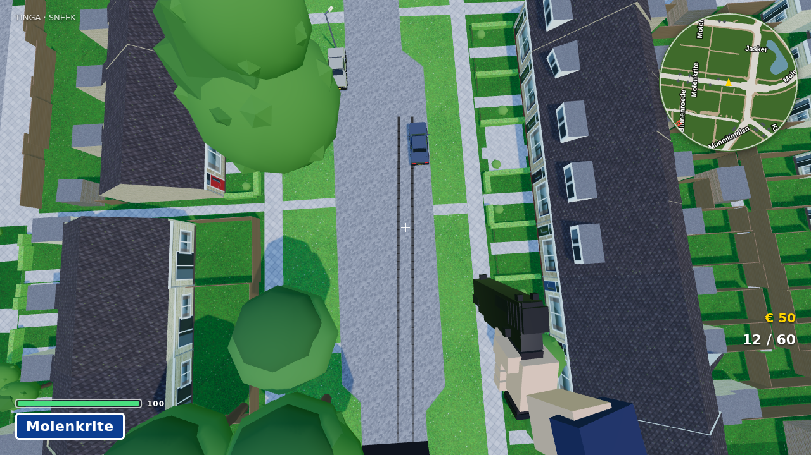

Vier nieuwe geluiden, allemaal gesynthetiseerd zoals al het andere geluid in het spel:

| Geluid | Waaruit | Wanneer |
|---|---|---|
| **explosie** | een korte brede knal, een sinus die van 90 naar 28 Hz zakt, anderhalve seconde rommelend vuur en een handvol brokken | een auto vliegt in brand — dat was hetzelfde blikken geluid als een kogel in een portier |
| **glas** | vijf tot tien hoge tikjes met wisselende toonhoogte over een halve seconde | een ruit die het begeeft |
| **kreet** | een zaagtand op stemhoogte door drie formantfilters, `schrik` of `pijn` | iemand wordt geraakt of schrikt van een schot |
| **bandengier** | ruis door een smalle band rond 1,3 kHz met een toon erbij, sterkte loopt met het slippen mee | zolang de banden slippen |

**De buurt laat zich horen.** Er stond één mussengeluidje op een klok van een paar seconden, en verder
niets: acht minuten lang steeds datzelfde vogeltje. Er zijn er nu negen, allemaal op dezelfde manier
gemaakt — een meeuw is een zaagtand met een knik erin, een kraai een ruisstoot door een smal filter,
een brommer een lage zaagtand die aanzwelt en weer wegzakt:

| overdag | 's nachts |
|---|---|
| mus, merel, meeuw, houtduif, kraai, blaffende hond, brommer, torenklok | uil, hond, kraai, brommer, torenklok (plus het krekeltapijt dat er al was) |

Nooit twee keer achter elkaar hetzelfde, en in de auto hoor je alleen wat er doorheen komt.

En vier meldingen uit de beta-test opgelost: de sirene loeide door zodra je een gebouw in liep, de
motor bromde door zolang je in het pauzescherm stond, de motor overstemde de radio (motor zachter,
muziek harder), en de meldingen "Raak!" en "Agent neer!" zijn weg — je ziet het gebeuren en nu hoor je
het ook. `npm run gevoeltest` rekent het na.

## Zeven punten uit de beta-test

De rest van de beta-test ging over de wereld en de auto zelf. Wat er is veranderd:

**De avond kostte de helft van je snelheid.** Liep de klok het donker in, dan zakte het spel in. Dat
kwam van de straatlampen: elke puntlamp telt mee in de belichting van **elk** materiaal in beeld, dus
acht lampen rond de speler betekent acht keer rekenen per oppervlak. Het zijn er nu **drie**, met een
hogere sterkte per lamp (9 → 11) zodat de straat er even licht uit ziet. De nachtprijs zakte van
**+183 % naar +96 %** per beeld.

**Uit de auto schieten.** Dat kon helemaal niet. Nu wel — naar voren en opzij, tot 150° van de neus
af. Recht naar achteren niet: je hangt uit het raam, je hangt niet over de achterbank.

**De koplampen staken uit de neus.** Vijf centimeter vóór het plaatwerk, waardoor ze van schuin voren
als een los blokje naast de auto zweefden. Koplampen, achterlichten, achteruitrijlichten, de grille en
de lampen van de vrachtwagen zitten nu **in** het blik, met anderhalve centimeter die er nog uitsteekt.

**Lantaarnpalen gaan om.** Rijd je er met vaart tegenaan (boven de 5 m/s), dan kantelt de paal in een
halve seconde om en blijft liggen. Zijn botsdoos zakt mee naar 0,35 m: met de auto rijd je er daarna
overheen, te voet stap je er nog omheen. Pas veertig seconden later én meer dan zestig meter verderop
staat hij weer rechtop — anders is de wijk na een half uur kaal, maar je ziet het ook niet gebeuren.

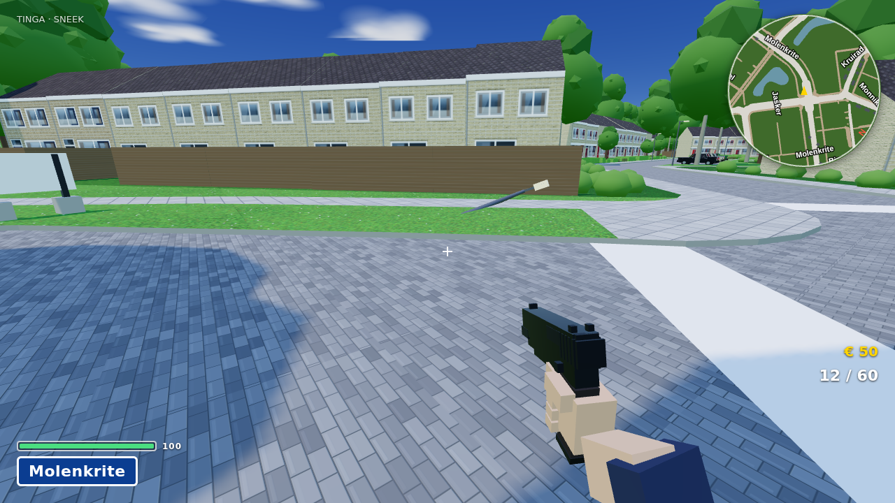

**Wegafsluitingen in plaats van onzichtbare muren.** Op (800.9, −554.2) stond een onzichtbare wand
waar je zonder waarschuwing tegenaan reed. Daar staan nu **rood-wit gestreepte schrikhekken** dwars
over de weg met een baken aan weerszijden. De botsdoos loopt links en rechts zeventig meter door, dus
via de berm kom je er ook niet omheen — maar je ziet nu dat het einde een afzetting is en geen bug.
Een plek toevoegen is een regel in `data/stijl/omgeving.json` onder `wegafsluitingen`; de generator
zoekt zelf de dichtstbijzijnde rijbaan-as en zet het hek er haaks op.

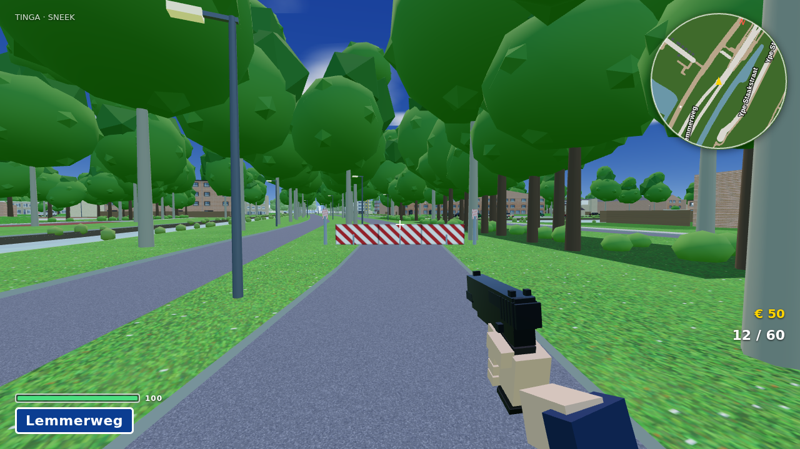

**Het verhoogde platform bij het tankstation.** Onder de luifel lag een betonnen verhoging waar je
tegenaan reed. Dat was het BGT-vlak van het bouwwerk *van de luifel zelf*: de generator gebruikte die
polygoon om de luifel te plaatsen en tekende hem daarna nóg een keer als verhoogd vlak. Hij wordt nu
uit de vlakkenlijst gehaald zodra hij als luifel is gebruikt.

`npm run betatest` rekent deze punten na — negentien controles — en `npm run betashots` maakt de
foto's hierboven.

## De rotonde over de N7

Het laatste punt uit de beta-test: op de Lemmerweg ligt een rotonde over de rijksweg heen, en in het
spel lag dat allemaal plat op elkaar. Nu niet meer — maar andersom dan je zou denken: niet de rotonde
gaat omhoog, **de N7 gaat omlaag**. Hij ligt er in een bak van 5,6 m diep, met twee brugdekken erover
waar de twee helften van de ring overheen lopen, en tussen de middeneilanden door zie je hem
onderdoorlopen. Dat is ook hoe het er in het echt bij ligt (foto's van de gebruiker).

| De bak van onderaf | Vlak voor de onderdoorgang |
|---|---|
| 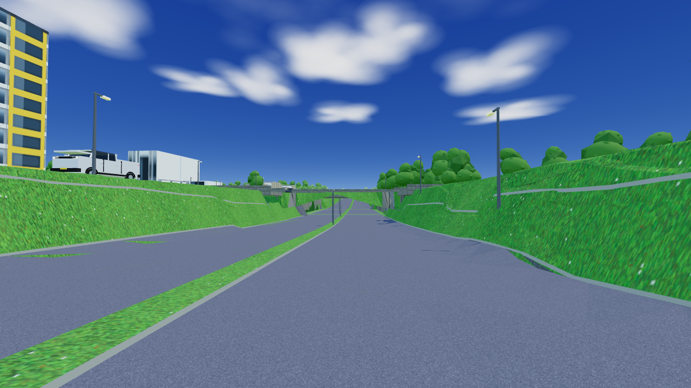 | 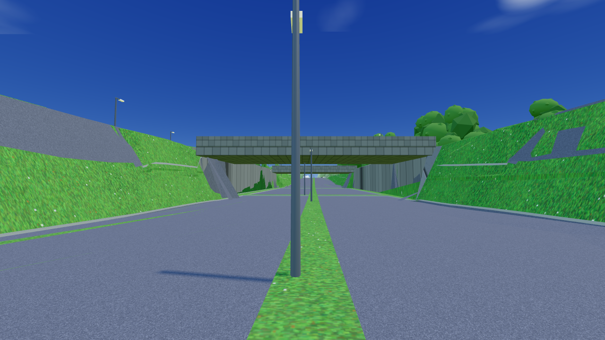 |

**Het fietspad gaat er ook onderdoor.** Langs de rijksweg loopt een fietspad, en dat duikt bij de twee
opritten onder het viaduct door — precies zoals op de foto's. Het is dezelfde truc, maar dan klein: een
tunneltje van 2,5 m hoog waar het pad in zakt en weer uit komt.

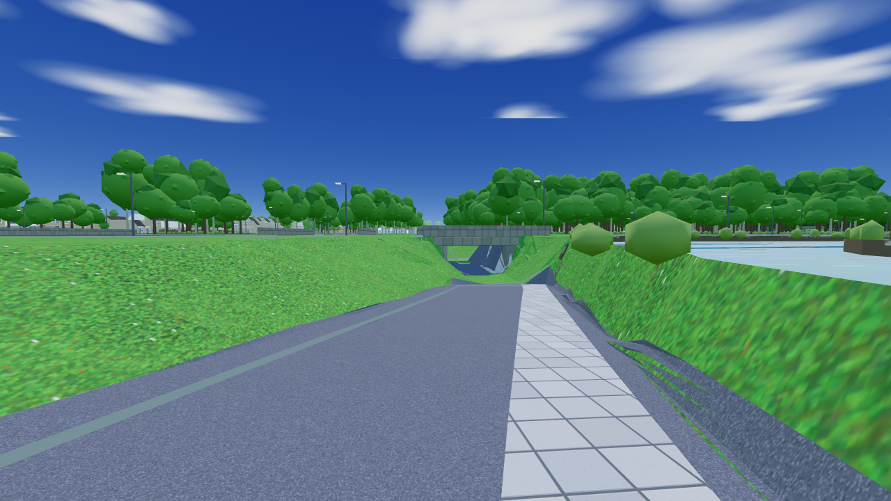

De rijksweg zakt over 350 meter weg tot 5,6 m onder maaiveld en komt er aan de andere kant weer uit;
de steilste helling is 6 %, en onder het dek is 4,7 m doorrijhoogte — een vrachtwagen kan eronderdoor.
De rotonde, de op- en afritten en de rest van de wijk blijven precies waar ze lagen: alleen de weg zelf
verandert van hoogte. `npm run rotondetest` rekent het na (achttien controles),
`npm run rotondeshots` maakt de foto's.

## Muren, hekken en vangrails uit de BGT

Twee lagen van de BGT bleven tot nu toe liggen: `scheiding` (muur, hek, kademuur, walbescherming,
damwand) en de twee soorten uit `weginrichtingselement` die je vanaf de weg ziet — de **vangrail** en de
**balustrade**. Toen het spel nog alleen Tinga was zat daar bijna niets in; met IJlst en Duinterpen erbij
is het **ruim acht kilometer** straatmeubilair: 2,6 km muur, 2,7 km damwand langs het water, 1,8 km
spijlenhek, 590 m kademuur, 390 m vangrail en 83 m balustrade.

| De vangrail langs de Lemmerweg | Het spijlenhek bij de waterzuivering |
|---|---|
| 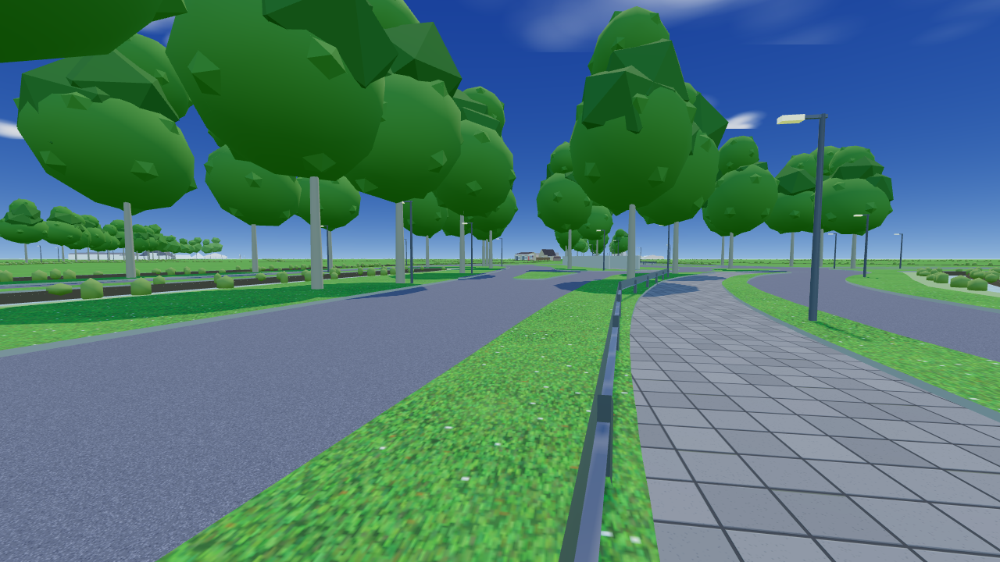 | 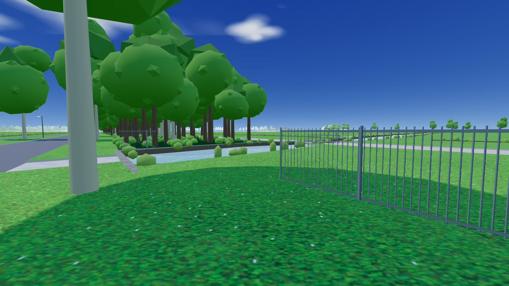 |

Een muur staat als **vlak** in de BGT — een lang, smal polygoon — en wordt teruggebracht tot zijn
hartlijn, met de dikte die hij werkelijk heeft. De hoogte weet de BGT niet; die staat per soort in
`data/stijl/omgeving.json`. Alles van één soort gaat in één mesh, dus het kost vier draw calls voor de
hele wereld; wat er wél per stuk bij komt is een botsdoos. `npm run scheidingtest` rekent het na
(achttien controles), `npm run scheidingshots` maakt de foto's.

## De autoradio

Zodra je in een auto stapt speelt de radio, door dezelfde smalle band als het gesynthetiseerde deuntje dat
er eerst zat: hoogdoorlaat op 190 Hz, laagdoorlaat op 3,4 kHz. Zo klinkt het uit de speakers in het portier
en niet als een concert, en het zakt weg onder het jachtdeuntje van het verhaal.

Er zijn **twee zenders**, en met de **pijltjes naar links en rechts** wissel je ertussen zolang je achter
het stuur zit:

- **Radio Tinga** — de huiszender, met het rocknummer;
- **Radio Spannenburg** — de lokale omroep van De Fryske Marren, een uitzending van een uur.

Bij het instappen en bij het wisselen komt het **logo van de zender** een paar tellen boven in beeld.
Een doorlopende zender begint nooit bij nul: stap je in een andere auto, dan val je ergens middenin de
uitzending binnen; stap je weer in dezelfde auto, dan loopt hij door waar hij was. En wissel je van zender
en weer terug, dan is die ondertussen ook doorgelopen — net als een echte radio.

De zenders staan in `audio/radio/zenders.json`: naam, logo, en de bestanden (mp3, ogg of m4a). Is dat
bestand er niet, dan valt hij terug op `nummers.json`, en anders op het gesynthetiseerde riffje.
`npm run radiotest` loopt het allemaal na (achttien controles).

Wat er nu in staat zijn plaatshouders waarop rechten rusten; voor een openbare versie hoort daar eigen of
rechtenvrij werk te staan.

## Camera over je schouder

Stap je in een auto, dan staat de camera **standaard achter de auto**: je ziet de neus, je achterwielen
en het stuk weg eromheen, en dat stuurt een stuk prettiger. Met **V** kijk je alsnog door je eigen ogen.
Te voet onthoudt het spel hoe je liep, dus bij het uitstappen sta je weer zoals je stond. Kijk je zelf niet rond, dan draait de camera vanzelf terug tot
recht achter de auto.


De camera zakt nooit door een gebouw: de hengel wordt elk beeld ingekort tot het eerste obstakel dat
hoger is dan de camera zelf, en schuift weer uit zodra het vrij is. Kan hij niet ver genoeg naar
achteren — je staat met je rug tegen een muur — dan klimt hij omhoog in plaats van naar binnen.

Te voet zie je jezelf lopen: Erik is hetzelfde poppetje als de mensen uit het verhaal. Schieten blijft
kloppen, want de kogel komt uit zijn schouder en gaat naar het punt onder het kruisje, niet uit de
camera achter je.


## Voetgangers aanrijden

Rij je harder dan zes kilometer per uur tegen een voetganger aan, dan gaat hij tegen de vlakte,
schuift hij een paar meter door in de richting van de klap en staat hij een halve minuut later
ergens anders in de wijk weer op. Stapvoets langs iemand manoeuvreren kan gewoon.


## De buurt schrikt

Van een schot (binnen 28 meter) of een aanrijding (binnen 20 meter) schrikt iedereen in de buurt. Ze
kijken eerst een paar tienden van een seconde op — een reactietijd — en zetten het dan op een lopen,
weg van de knal: eerst de straat uit waar ze staan, en op elke hoek de zijstraat die het verst van de
knal af ligt. Rennen gaat met zo'n 4,5 meter per seconde tegen 1,3 wandelend, fietsers trappen naar
7 m/s, en de pas loopt mee met de snelheid. Na een seconde of negen is de schrik voorbij en wandelt
iedereen weer verder. Wie er ver vandaan loopt merkt er niets van.

`npm run rijtest` loopt dit allemaal na — 55 controles over het model, het rijgedrag, de wielen en de
lichten, de camera achter je, het aanrijden, het wegrennen, de botsingen tussen auto's onderling en
het omheen lopen te voet.
`npm run rijshots` maakt de foto's hierboven.

## Politie en sterren

Sinds kort merkt de wijk wat je uitspookt. Elke misdaad levert **verdenking** op, maar niet elke
misdaad wordt gemeld — dat hangt af van wie het ziet:

- iemand neerschieten waar niemand bij is gaat vaak ongemerkt voorbij (ongeveer één op de tien wordt
  toch gebeld: iemand achter een raam);
- met omstanders erbij loopt die kans hard op, en met drie getuigen is het zo goed als zeker;
- en wie er al eentje op zijn geweten heeft valt bij de tweede veel eerder op — *stille* misdaden
  stapelen zich op tot iemand alsnog de telefoon pakt.

De verdenking staat in **sterren**, rechtsboven onder de minikaart: één ster na een melding, en verder
oplopend tot vijf. Hoe meer sterren, hoe meer blauw er op straat staat:

| sterren | surveillanceauto's | agenten | ze zoeken tot |
| --- | --- | --- | --- |
| ★ | 1 | 3 | 55 m rond de melding |
| ★★ | 2 | 4 | 85 m |
| ★★★ | 3 | 5 | 120 m |
| ★★★★ | 4 | 6 | 155 m |
| ★★★★★ | 5 | 8 | 195 m |

Bij elke auto zitten er nog twee agenten die eruit stappen als je dichtbij genoeg komt en langzaam
genoeg gaat (zie hieronder), dus bij vijf sterren lopen en rijden er zo'n twintig eenheden rond. Ze rijden over de straten naar de **plaats
delict** — de laatste plek waar ze jou wisten — en gaan van daaruit zoeken. Niet allemaal op dezelfde
hoek: iedere eenheid krijgt zijn eigen richting en een eigen afstand binnen die zoekring, dus ze
waaieren over de omliggende straten uit en verleggen hun zoekpunt om de vijftien à vijfentwintig
seconden. Op de minikaart én op de grote kaart (M) knipperen ze als blauwe stipjes, zodat je ziet waar
ze al zijn — gewone auto's staan daar grijs op, zodat blauw echt politie betekent.


Komen ze met de auto bij je in de buurt, dan stappen de twee inzittenden uit — **maar niet altijd**.
Ze doen dat alleen als je binnen veertig meter bent én je langzamer gaat dan dertig kilometer per uur.
Rijd je hard voorbij, dan blijven ze zitten en zetten ze de achtervolging in de auto voort; uitstappen
voor een auto die er al lang vandoor is slaat nergens op. Stappen ze wél uit, dan blijft die **wagen
staan** met zijn zwaailicht aan — hij rijdt niet leeg verder — en je kunt er zelf in stappen. Doe je
dat, dan is hij van jou, lichtbalk en al. Laat je hem staan, dan verdwijnt hij vanzelf: snel zodra ze
je kwijt zijn, en anders na drie kwartier minuut, maar nooit terwijl je ernaast staat.


**Vanaf vier sterren zetten ze wegblokkades.** Twee wagens kop aan staart dwars over de rijbaan —
samen bijna negen meter, dus de straat zit echt dicht — met het zwaailicht aan, op honderd tot
tweehonderdzestig meter vóór je, en altijd buiten je zicht neergezet, zodat je er tegenaan rijdt in
plaats van er eentje voor je ogen te zien verschijnen. Ze kijken naar welke kant je op gaat: een
blokkade achter je is geen blokkade, en sta je stil, dan wachten ze — zonder richting is er geen
"vóór je". Er staan er hoogstens twee tegelijk, en ze worden opgeruimd zodra de verdenking onder de
vier sterren zakt of de achtervolging voorbij is.

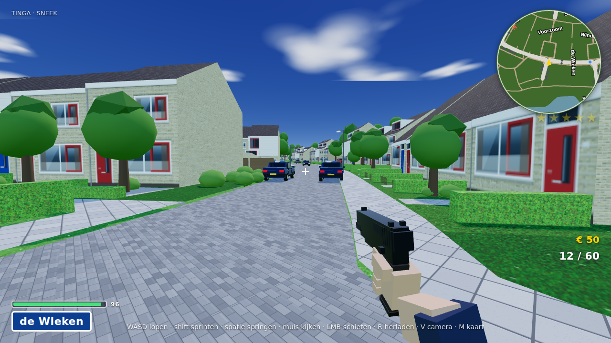

**Je kunt op de auto's schieten.** Elke kogel kost tien van de honderd, dus na een stuk of tien
vliegt hij in brand: de auto wordt zwartgeblakerd, er komt een vuurbal met rook overheen en rijden
kun je er niet meer mee. Die knal laat de buurt schrikken, is voor de politie een schot als elk ander
— ze komen erop af — en doet zeer als je er zelf binnen negen meter naast staat. Uitgebrande
politieauto's worden door het spel opgeruimd zodra de achtervolging gestaakt is.

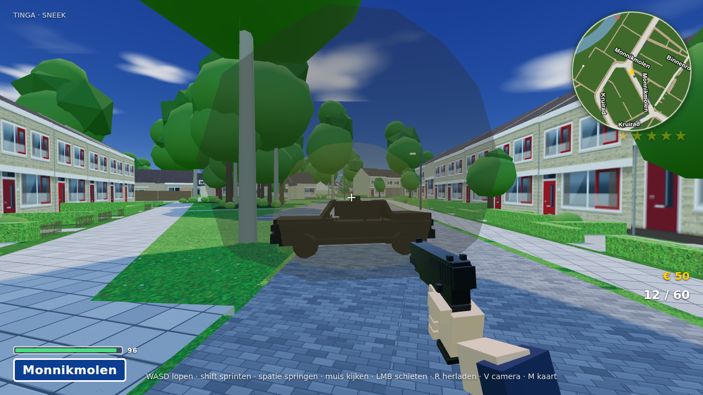

Nieuwe eenheden komen **ergens vandaan rijden**: altijd op een rijbaan, minstens ruim zestig meter bij
je vandaan en het liefst buiten je gezichtsveld. Ze verschijnen dus niet naast of achter je.

Zien ze je — kijkhoek plus vrij zicht — of horen ze je schieten, dan zetten ze de achtervolging in en
schieten ze op je. Elke treffer kost leven: de balk linksonder loopt terug en het beeld flitst rood.
Een agent aanrijden kan ook, en kost je net zoveel verdenking als hem neerschieten.

**Geen tekst meer in beeld.** Er verscheen een regel ("De politie is gebeld", "Gezocht: drie
sterren") op het moment dat je iemand neerschoot of aanreed. Die is eruit: de sterren rechtsboven
zeggen het al, en die knipperen zolang ze je zoeken. Een balkje met tekst over je beeld is precies
wat een spel niet hoeft te doen als hetzelfde ook te zien is.

**Ze schieten raker dan eerst.** Op dekkingsafstand (elf meter) raakte een agent je vier van de tien
keer voor vier levenspunten; dat voelde als losse flodders, en je kon in een vuurgevecht blijven staan
om terug te schieten. Nu is het zes punten en bijna de helft van de schoten: met de drie agenten die
tegelijk mogen vuren is dat ruim vier levenspunten per seconde. Wegkomen is het antwoord geworden, en
niet uitzitten. Wie een agent neerschiet vindt zijn **munitie** op straat: drie tot vijftien kogels.

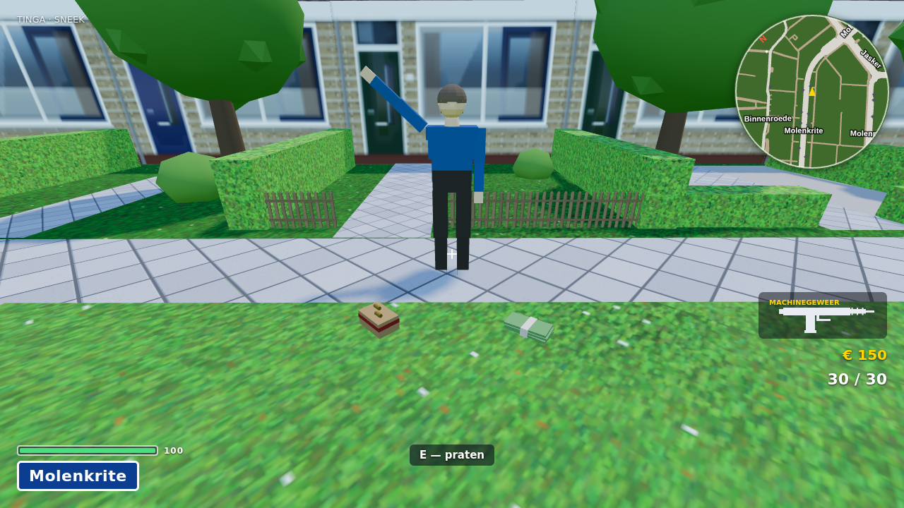

Wie op een **agent of een surveillanceauto** schiet geeft zichzelf weg. Ook een kogel die alleen de
lak raakt is een aanwijzing: er wordt op ons geschoten en we weten vanwaar. De laatst bekende plek
verspringt naar waar je op dat moment staat en alle eenheden draaien die kant op. Vanuit een hoekje
blijven schieten werkt dus niet.

**Verstoppen werkt.** Staat er een gebouw of een schutting tussen, dan zien ze je niet, en dan volgen
ze je ook niet: ze lopen naar de plek waar ze je het láátst zagen. Horen ze alleen een schot, dan gaan
ze op dat gelúid af, niet op jou. Wel denken ze mee: op het moment dat de laatste je uit het oog
verliest schuift het zoekgebied een paar seconden mee in de richting waarin je wegliep, tot het
dichtstbijzijnde punt op een straat — en van daaruit waaieren ze met hun eigen sectoren de omliggende
straten in. Hoe langer je uit beeld blijft, hoe schever hun beeld wordt. Een auto die je kwijtraakt blijft nog een paar seconden zoeken en gaat dan terug
naar de laatst bekende plek — één hoek omgaan is dus niet genoeg. Blijf je uit het zicht, dan zakt de
verdenking na een aftelling van achttien seconden plus zes per ster, en zijn ze je kwijt. Een agent
neerschieten kost je meteen een paar sterren extra.

`npm run politietest` loopt het allemaal na — vierenzestig controles: de meldkans met en zonder
getuigen, de sterdrempels, het uitrukken en aankomen, het aantal eenheden en hun spreiding per
sterniveau, waar ze vandaan komen rijden, het schieten, het neerschieten én aanrijden van een agent,
het verstoppen achter een gebouw, het meeschuivende zoekgebied, het ontsnappen, de lege
surveillanceauto die blijft staan en te stelen is, en of de hoofdlus de politie buiten wél en
binnenshuis niet bijwerkt en de schade in de levensbalk terechtkomt. Een negende hoofdstuk toetst het
nieuwe gedrag: dat een schot op een agent of een wagen de zoektocht verlegt, dat ze bij 50 km/u
blijven zitten en stapvoets wél uitstappen, dat een blokkade vóór je en buiten je zicht komt te staan
en weer wordt opgeruimd, en dat tien kogels een surveillanceauto tot wrak maken.
`npm run politieshots` maakt de vijf foto's hierboven.

## Hondjes

Eén op de acht wandelaars laat een hondje uit: een klein beestje aan een lijn dat schuin achter zijn
baas aan dribbelt, met een slinger erin. Ze verschillen in kleur (wit, crème, zandbruin, roodbruin,
donkerbruin, grijs, zwart) en in maat. Alle hondjes samen kosten twee draw calls.

## Snelheid

Het spel draait op een telefoon en straks op een pc, dus de motor is gemeten en
niet op gevoel bijgesteld (`npm run audit`, en fijner uitgesplitst met `npm run
optimeer`).

De ronde hieronder is van toen de wereld nog één buurt was:

| | eerst | na die ronde |
|---|---|---|
| draw calls in de wijk | 1649 | **595** |
| driehoeken per beeld | 1,69 M | **1,28 M** |
| texturegeheugen | 187 MB | **82 MB** |
| meshes in de scene | 3254 | **1256** |

Sinds de wereld op zijn volle maat staat (4,4 × 2,5 km, 7885 panden) is dat
achterhaald. Op het zwaarste standpunt staat het nu op **1883 draw calls en 5,83
M driehoeken per beeld**, waarvan 416 calls en 1,50 M in de schaduwpas — die
kwam in de oude cijfers niet voor, omdat three zijn tellers ná de schaduwpas op
nul zet. Er loopt een optimalisatieronde; wat er gemeten is en wat eraan gedaan
wordt staat in [docs/METHODIEK.md](docs/METHODIEK.md) onder *Eerst meten*.

Wat daarvoor veranderd is:

- **De 329 geparkeerde auto's zijn instanced.** Ze stonden er als losse groepjes
  van zeven meshes — op straat waren er zeshonderd van in beeld, meer dan de
  helft van alle draw calls. Nu zijn het zeven instanced meshes per soort voor
  de hele wijk, met de lakkleur per auto. Stap je in, dan gaat die ene op schaal
  nul en komt zijn eigen model met wielen ervoor in de plaats.
- **Auto's verder dan 170 m gaan uit.** Een instanced mesh valt nooit buiten
  beeld, dus zonder dat gingen alle 329 elk beeld naar de GPU.
- **De wereld ligt in tegels van 240 m.** De kaart werd per materiaal in één
  mesh samengevoegd — één mesh met alle trottoirbanden van de wijk — en die valt
  nooit buiten beeld. Hetzelfde gold voor de 3177 bomen. Nu gooit frustum
  culling het meeste weg.
- **De gevelplaten zijn kleiner.** Ze werden op 40 beeldpunten per meter
  getekend; dat is nu 26, met een bovengrens van 2048 px voor een lang rijtje.
  De steen- en dakpandoeken (tientallen kleurvarianten van 512×512) gaan naar
  288. Samen scheelt dat honderd megabyte — op een telefoon het verschil tussen
  soepel en haperen.

### Scherpte (G)

Op de pc laat de kaart de randen zelf gladmaken (MSAA), maar dat helpt alleen tegen gekartelde randen
van driehoeken. Wat in deze wijk vooral flikkert zijn de dunne dingen op afstand: hekspijlen,
dakranden, belijning. Daar is één middel tegen — op meer beeldpunten renderen dan het scherm heeft en
de browser het laten verkleinen. Op een gewoon 1×-scherm stond die teller op precies 1,00 en gebeurde
er dus niets.

**G** loopt door drie standen; hij blijft bewaard, dus je hoeft hem maar één keer te zetten:

| stand | wat hij doet |
|---|---|
| **scherp** | anderhalf keer zoveel beeldpunten (standaard op de pc) |
| normaal | precies je scherm (standaard op telefoon en tablet) |
| zuinig | driekwart, voor een trage machine |

De texturen staan bovendien op het maximale anisotrope filter dat de kaart aankan — meestal 16 in
plaats van 8. Dat houdt asfalt en stoeptegels die schuin weglopen scherp in plaats van een grijze brij
in de verte, en het kost geen geheugen.

### Reliëf en glans (alleen pc)

Alle texturen zijn op een canvas getekend, er zit geen enkel plaatje in het spel. Een canvas geeft
kleur, en kleur alleen is vlak: een muur van baksteen was een foto van baksteen op een plat vlak, en
of de zon er recht op stond of er langs streek maakte niets uit. Op de pc worden daarom bij het
opstarten twee extra doeken uit elk kleurdoek **afgeleid**, dus zonder één extra bestand:

- een **normal map**: per beeldpunt in welke richting het oppervlak staat. Uit de helderheid van het
  kleurdoek wordt met een Sobel-filter een hoogteverschil gehaald, en daaruit de normaal. Nu vangt de
  bovenkant van elke baksteen licht en ligt de voeg in de schaduw, draait het licht met de zon mee, en
  krijgt de bestrating diepte in plaats van een patroon.
- een **roughness map**: per beeldpunt hoe mat of glad het is. Op een gevelplaat staan steen,
  kozijnen, deuren en ruiten door elkaar in één doek; de kaart leest ze uit elkaar (blauwachtig
  → glas, glad; licht en neutraal → verf, half; de rest → steen, mat). Ruiten spiegelen de lucht in
  plaats van er als grijs papier in te zitten.

Twee dingen zijn met opzet anders dan je zou verwachten:

- **Baksteen wordt van de omgekeerde hoogte afgeleid.** `brick()` tekent de voeg *lichter* dan de
  steen, dus recht overgenomen zou elke voeg een randje zijn in plaats van een groef.
- **Gevels krijgen geen normal map.** In een gevelplaat zit het licht al getekend (dorpels, negge,
  slagschaduw onder de dakrand). Een normaal daaruit halen vecht met de zon. Een gevel krijgt dus
  alleen de glansmap; het reliëf zit op de dertien andere soorten — kale baksteen, pleisterwerk,
  dakpannen, bitumen, klinkers, stoeptegels, asfalt, planken, damwand, riet, gras, kunstgras en
  schelpenpad — samen 111 doeken.

**Nat wegdek.** Bij regen gaat de ruwheid van de vijf wegmaterialen (asfalt, grijze en rode
klinkers, stoeptegels en fietspad) naar 0,35, de
kleur 28 % omlaag en de metalness naar 0,12. De weg spiegelt dan de grauwe lucht. Droogt het op, dan
worden de oude waarden exact teruggezet (ze staan in `userData.droogRuw` en `userData.droogKleur`).

Wat het kost, gemeten met `npm run audit` met en zonder `?relief=0`:

| | zonder | met |
|---|---|---|
| texturegeheugen | 169,4 MB | **212,9 MB** |
| doeken | 784 | **1501** |
| texturen in de GPU | 496 | **966** |
| shaderprogramma's | 31 | **33** |
| wereld bouwen | 28,9 s | **36,0 s** |
| javascript per beeld | 4,14 ms | **4,16 ms** |
| draw calls / driehoeken | 1467 / 4,33 M | 1467 / 4,33 M |

Dus: 44 MB geheugen en 5,5 s bij het opstarten (de 643 gevelplaten uitlezen is het duurste stuk),
en per beeld niets. Daarom staat het **op de telefoon uit** en op de pc aan; met `?relief=0` in de
adresbalk zet je het ook op de pc uit. `npm run beeldshots` maakt de voor-en-naparen hieronder,
`npm run relieftest` loopt de 33 proeven na.

| kale kopgevel, zon er schuin over | dezelfde gevel met reliëf |
|---|---|
| 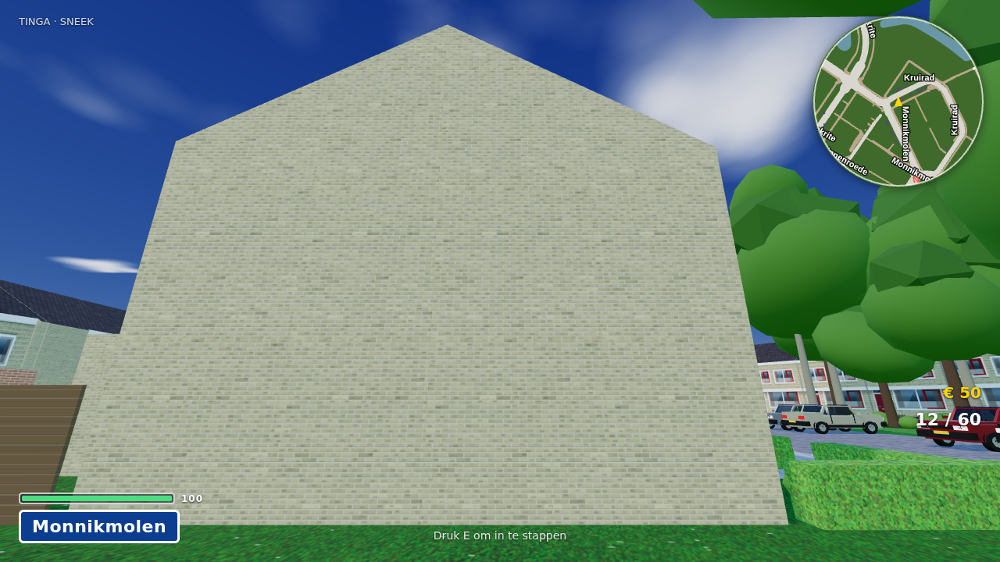 | 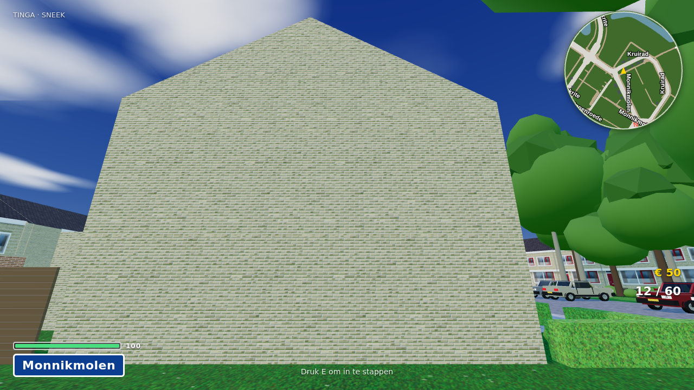 |

| bestrating bij laag zonnetje | met reliëf |
|---|---|
|  | 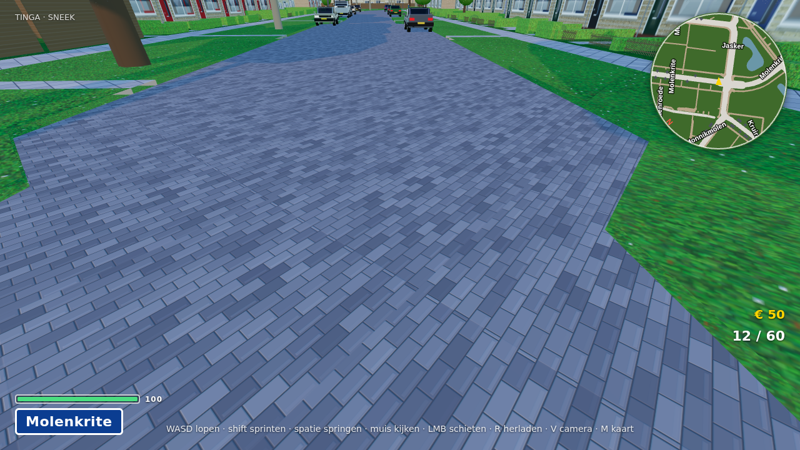 |

| voorgevel in de schaduw | met glansmap: de ruiten spiegelen |
|---|---|
| 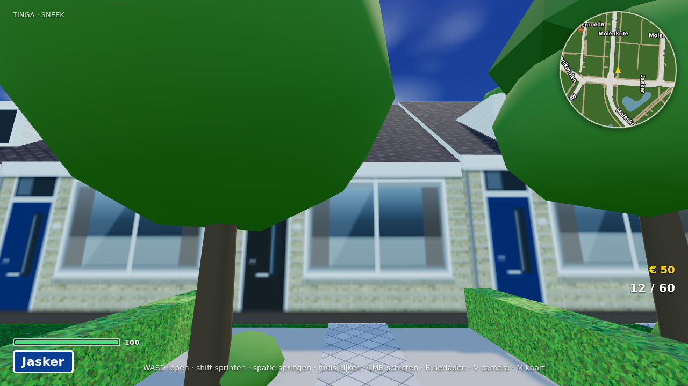 | 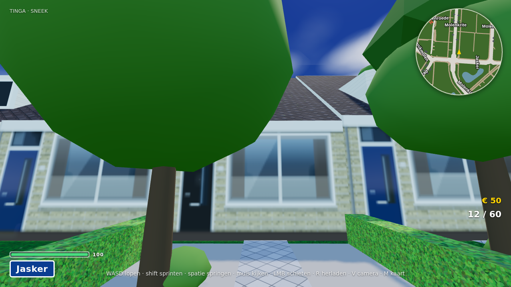 |

| droog wegdek | nat wegdek bij regen |
|---|---|
| 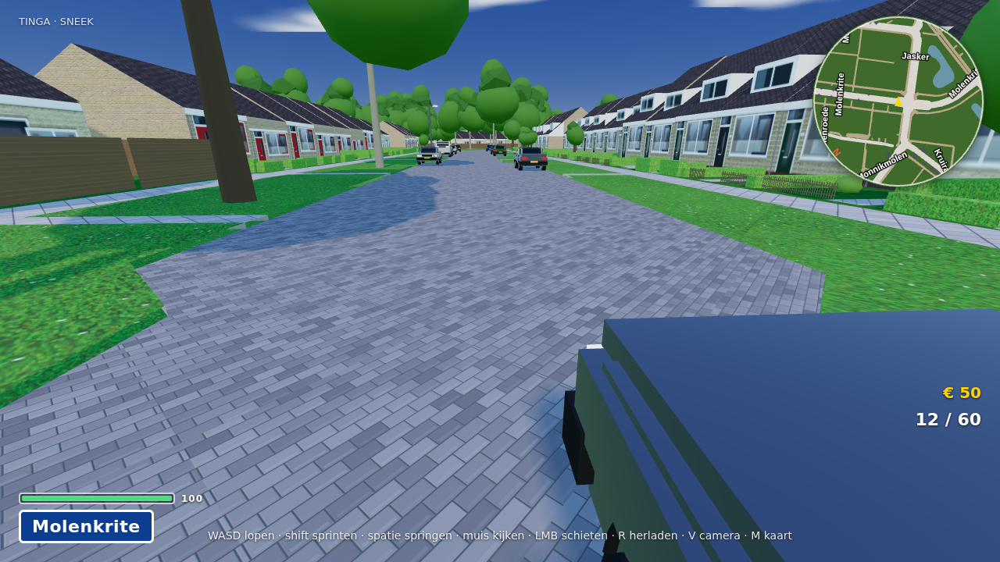 | 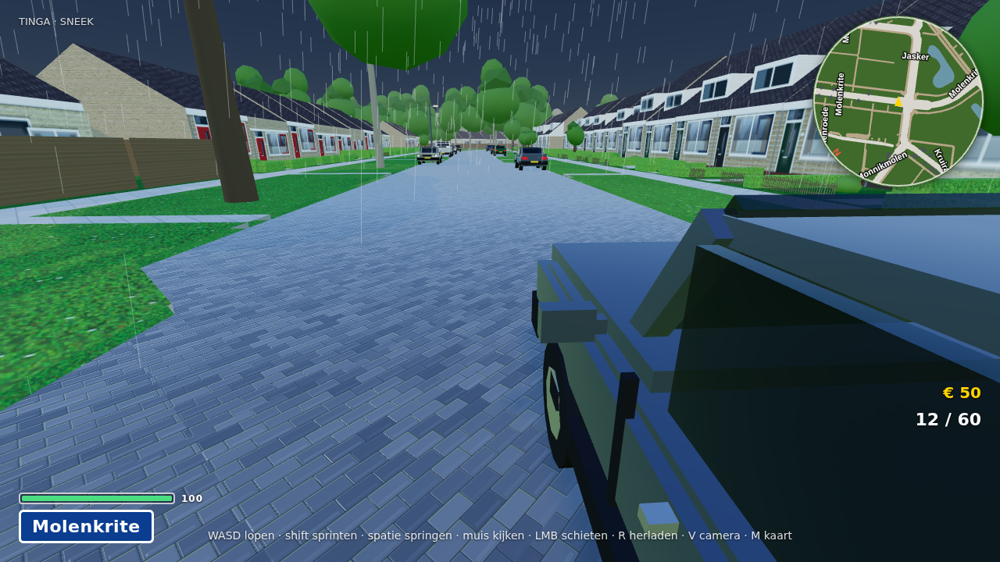 |

En op afstand, waar het verschil kleiner is maar niet weg — de straat en de daken:

| de Molenkrite zonder | met |
|---|---|
| 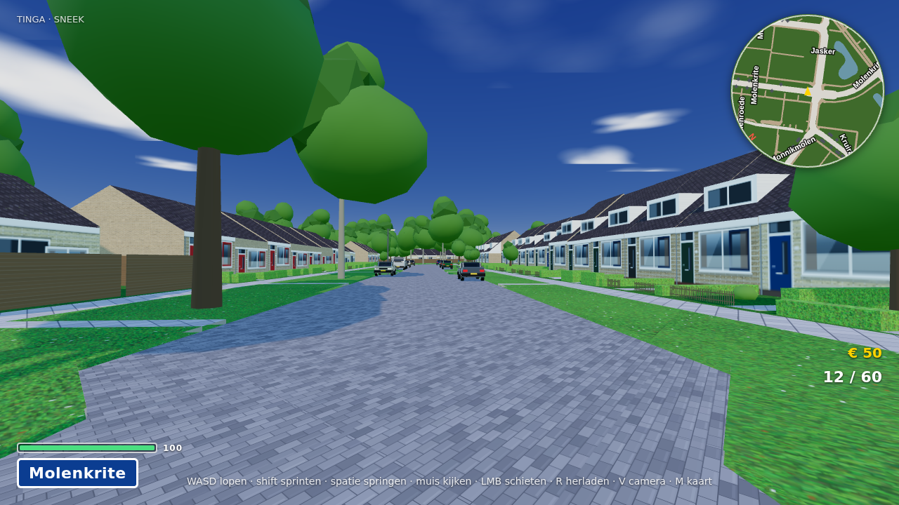 | 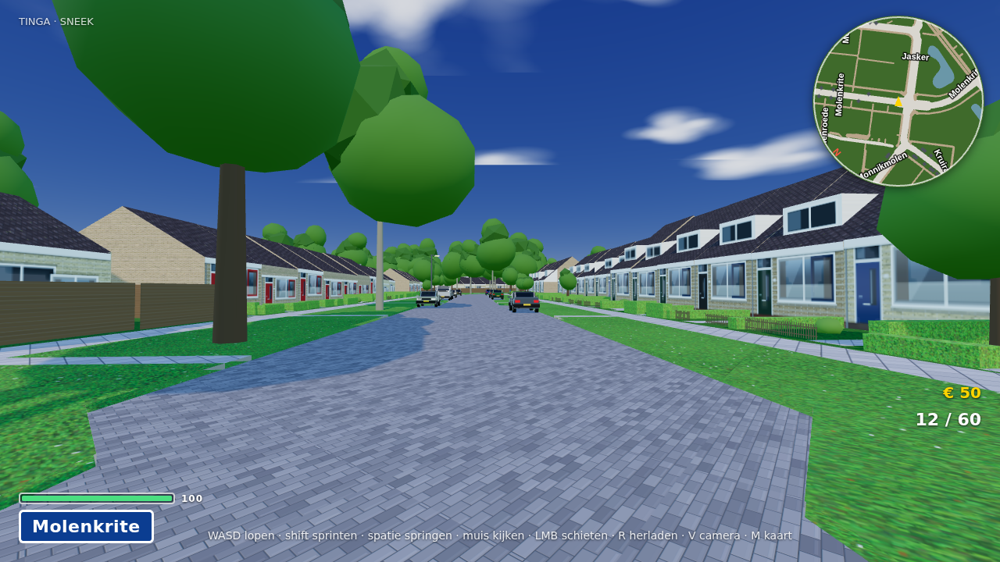 |

| de daken zonder | met |
|---|---|
| 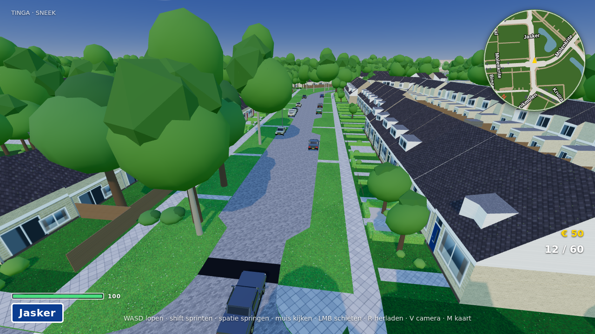 |  |

## Het verhaal

Je heet **Erik**. Je broer **Mark** heeft vier missies voor je, en daarna belt Johan.

### 1 · Molenkrite 15

Bij het eerste opstarten sta je op de berm voor **Molenkrite 15** — het vierde huis na de knik in de
straat, aan de kant met de dakkapellen. Op de stoep ervoor staat Mark; hij kijkt je aan en zwaait.


Met **E** spreek je hem aan. Het gesprek staat onderin het scherm en klik je met **E** door (op een
telefoon: tik op de 🚗-knop om te praten en op de tekstbalk om door te klikken).


Daarna loopt hij de Molenkrite over naar het gezelschap dat schuin tegenover, in de voortuin van
**Molenkrite 20**, met een radio en een flesje bier in de tuin zit. Daar draait hij zich naar je om:
*"Schiet ze neer!"*


### 2 · Naar de waterzuivering

Als alle vier neer zijn vertelt Mark wat hij van De Veteraan gehoord heeft: bij de waterzuivering is
een grote lading afgeleverd. Er staat een auto in de straat, **jij rijdt**. De minikaart en de grote
kaart (**M**) wijzen de route naar de rioolwaterzuivering aan de Buitenroede: een blauwe lijn over de
straten en een gele vlag op de bestemming.


### 3 · De bewaking

Bij het terrein stap je automatisch uit. Achter het hek lopen **vijf bewakers** hun rondje, met de
vrachtwagen met de lading op het erf.


Binnen het hek vallen ze je aan zodra ze je zien of je horen schieten, en dan loopt je **levensbalk**
(linksonder) leeg. Ga je neer, dan begin je bij je laatst opgeslagen spel; is er niets opgeslagen,
dan begint de missie opnieuw. Na elke missie is je leven weer vol.


### 4 · Afleveren bij de boerderij

Liggen alle vijf neer, dan schuift de poort open en kun je de vrachtwagen pakken en het terrein
afrijden. De kaart navigeert dan naar de boerderij in de zuidwesthoek van het gebied. Zet de wagen
bij de schuur en de klus is klaar:


### 5 · Het telefoontje van Johan

Zodra de lading staat gaat de telefoon: **Johan** van Kruirad 62 is in zijn eigen huis bestolen. Zijn
kop komt in beeld, hij scheldt door de lijn en hangt op — en op de kaart staat een gele **J** bij zijn
oprit.


Op zijn oprit krijg je de briefing: duizend euro cash van de keukentafel, en de dader is *"die kneus
van De Wieken 27"* — felrood shirt, kanariegele broek, wit petje. En vooral: **niet schieten**, want
dan staat de halve Sneker politie op de stoep.


In De Wieken slentert hij over het trottoir. Kom je binnen vijftien meter en ziet hij je, dan is het
rennen:


Hij rent net iets langzamer dan je sprint (shift), dus je loopt hem langzaam in — en na anderhalve
minuut is hij op en wankelt hij verder. Onder de achtervolging loopt een **spannend deuntje**: een
jachtende achtstenbas in d-klein met een dreigende halve toon erboven, die aanzwelt zodra hij het op
een lopen zet en uitdooft als je hem hebt (of als je hem neerschiet). Schiet je hem neer, dan vaagt
het beeld naar grijs met **MISSIE MISLUKT** en begin je bij je laatste opgeslagen spel.


Kom je binnen armlengte (of ram je hem met de auto), dan smijt hij de envelop met €1.000 op de tegels.
Breng die terug naar Johan en je houdt er vijfhonderd euro aan over:


## Naar binnen bij Molenkrite 15

Loop je naar de **voordeur van Molenkrite 15** en druk je op **E**, dan ga je naar binnen:


Achter die deur zit een gang met zwart-witte blokjes. Achterin zit de deur naar de trap; die blijft
dicht, want alleen de begane grond is ingericht.


Rechts komt de gang uit in de woonkamer: bruin laminaat, een bank van 2,10 m tegen de zijmuur en een
tuindeur op de achtergevel.


Aan de andere kant staat de tv op het dressoir, met achterin de doorgang naar de keuken.


In de aanbouw staat het keukenblok in één rij: onderkasten met een licht houten front, een werkblad
op 90 cm met spoelbak en kookplaat, witte wandtegels tot 1,45 m en bovenkasten tot 2,15 m met een
wasemkap boven de plaat.


Met **E** bij de deur sta je weer buiten, op de plek waar je naar binnen ging. Zolang je binnen bent
zegt de HUD *Molenkrite 15* en blijft de minikaart de Molenkrite tonen.

### Waar het vandaan komt

Alle plekken in het verhaal komen uit de kaartdata: het pand met huisnummer 15 aan de Molenkrite, het
pand schuin tegenover, het hek en de schuifpoort van het RWZI-terrein, de schuur van de boerderij, de
oprit van Kruirad 62, het trottoir voor De Wieken 27, en het wegennet voor de routes en de
vluchtroutes van de dief. In `js/verhaal.js` staat geen enkele coördinaat, alleen adressen, namen
en afstanden vanaf de voorgevel — verhuist een pand in de brondata, dan verhuist de scène mee.

Dat geldt ook voor de woning binnen: het grondvlak `voet` van Molenkrite 15 uit de 3D BAG levert de
plattegrond (een voorhuis van 5,42 × 9,48 m met een aanbouw van 2,42 × 4,58 m), de goothoogte van
3,38 m laat één woonlaag met een plafond op 2,60 m toe, en de voordeur staat op dezelfde plek als in
de geveltexture. De kamer zelf staat ruim buiten het kaartgebied, zodat je er nooit langs loopt en hij
ook niet op het bovenaanzicht staat; naar binnen en naar buiten gaan is een teleport (`js/interieur.js`).

`npm run verhaaltest` loopt het hele verhaal na — 123 controles: startpunt, zwaaien, gesprek,
wandeling, schieten, rijden, de bewaking, de levensbalk, doodgaan, de poort, afleveren, het
telefoontje, de briefing, de dief die schrikt en wegrent, het deuntje bij de achtervolging, de
mislukking bij een schot, het uitgeput raken, het pakken, de beloning, de woning achter de voordeur
(maten, wanden, teleport, hoogtes van aanrecht, bank en tv) en opslaan en laden.
`npm run verhaalshots` maakt de foto's hierboven.

## Naar binnen bij de Wieken 29

Aan de Wieken zit de voordeur bij **elke** woning aan dezelfde kant — rechts, met de woonkamerpui
ernaast links. In de geveltexture stonden ze om en om links en rechts, zoals in de meeste rijtjes
waar twee woningen om hun bouwmuur heen spiegelen; die stijl doet dat nu niet meer.

Ook achter de blauwe voordeur van **de Wieken 29** kun je naar binnen. Het is dezelfde bouwer als bij
Molenkrite 15 — een voorhuis met een aanbouw erachter — maar met de maten van dít pand uit de kaart:
5,38 bij 14,07 m, met de keuken in de aanbouw en de gang aan de andere kant, want het grondvlak ligt
gespiegeld.


Drie dingen die er voor allebei de woningen bij zijn gekomen:

**Je kunt naar buiten kijken.** Het glas is doorzichtig geworden. De kamer staat ver buiten het
kaartgebied, dus daar was niets te zien; nu staat de buurt er weer omheen. De panden binnen vijftig
meter van het huis staan er op hun echte plek, maat en goothoogte uit de kaart, mét de geveltexture
van hun eigen woningtype en een zadeldak met pannen — dezelfde texturen als de wijk buiten, dus het
kost geen extra geheugen. Door de pui kijk je zo op de overkant van de straat, met de deuren, de
ramen en de dakkapellen erop.


**Je kunt op de bank zitten.** Sta je bij de bank, dan zegt de hint `E — op de bank zitten`. Je zakt
naar zithoogte, kijkt naar de tv aan de overkant en kunt rondkijken; lopen doe je pas weer als je met
E opstaat.


**En als het buiten donker wordt gaat de lamp aan.** Er staan geen lampen in de scene — de helderheid
zit in de materialen — dus 's avonds gaat er een andere tint over alle vlakken: binnen warm en iets
gedempt, buiten donkerblauw. De plafondlamp is dan het felste vlak in de kamer. Met `[` en `]` zet je
de klok vooruit, met `\` laat je hem lopen.


**En er lopen katten.** Aan de Molenkrite één, aan de Wieken twee: zwart-wit, met een witte bles over
de snuit. Ze lopen de kamer rond, blijven af en toe staan om rond te kijken, gaan zitten — en
klimmen geregeld op de bank, waar ze een halve minuut blijven liggen. Een kat is 45 cm lang met een
schofthoogte van 25 cm, dezelfde maat als de echte.


`npm run woningtest` toetst het geheel: de tweede woning en zijn maten, de deur heen en terug, het
zitten (lager oog, niet meer kunnen lopen, weer opstaan), de lamp die met de klok mee aan en uit gaat,
het doorzichtige glas met een buurt erachter, de katten (aantal, rondlopen, binnen blijven, op de
bank) en het speeltuintje hieronder. `npm run wereldtest` toetst dat de voordeur aan de Wieken bij
elke woning rechts zit en dat een gewoon rijtje nog wél spiegelt.
`npm run woningshots` maakt de foto's.

## Het speeltuintje achter de Wieken 144

Op het open grasveld achter **de Wieken 144** — tussen de achtertuinen en de vaart, aan het pad —
staat een speeltuintje: een schommel, een houten speelhuisje met een zadeldakje, een wipwap en een
glijbaan, met een zandbak en een bankje erbij.

Het staat op het veld zelf en niet in iemands tuin: het middelpunt ligt zo'n 37 meter achter het huis,
op ruim 25 meter van het dichtstbijzijnde pand en 18 meter van de dichtstbijzijnde tuin. De plekken
zijn uitgezet vanaf de voorgevel van 144, dus ze schuiven mee als het grondvlak in de brondata
verandert; in de code staat geen enkele coördinaat.


## Het viaduct over de rondweg

Tegenover de Jumbo aan de **Molenkrite 171** loopt de weg naar het noorden de wijk uit en gaat daar
over de **N7** heen. In het spel lag die weg tot nu toe plat: je reed dwars door de rondweg heen alsof
er een gewoon kruispunt lag. In werkelijkheid klimt hij over een dijklichaam omhoog en ligt er boven
op het dek een houten boogbrug — het **Viaduct Tinga**.

Dat is nu de enige plek in de wijk waar de wereld niet plat is:

- de oprit klimt vanaf de Jumbo in ruim honderd meter naar **5,6 m** boven het maaiveld — het wegdek
  ligt daarmee 4,7 m boven de rijksweg, genoeg om er met een vrachtwagen onderdoor te kunnen;
- het steilste stuk is **8 %**; het profiel loopt recht omhoog met afgeronde uiteinden, zoals een
  echte verticale boog;
- naast de weg ligt een **grastalud** dat van de kruin af naar beneden loopt tot in het gras;
- het **dek** is 57 m lang en 10,5 m breed, met de rijbaan in het midden en **rode fietsstroken** aan
  weerskanten;
- op de dekranden staan twee **houten bogen** die 5,6 m boven de weg uitkomen, met trekstangen naar de
  dekligger en dwarsportalen tussen de bogen door;
- langs de rand loopt een **houten leuning**; die houdt je op het dek, ook als je met de auto tegen de
  rand aan komt;
- de rondweg eronder blijft gewoon op maaiveld liggen. Je kunt er onderdoor rijden en lopen, en het
  verkeer op de N7 en het verkeer op de brug hebben niets met elkaar te maken.

Te voet loop je de helling op en af, en spring je van de brug dan val je. In de auto wijst de neus
omhoog op de klim en omlaag op de afdaling.

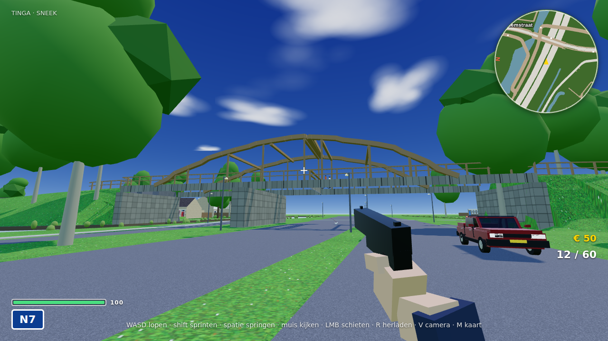

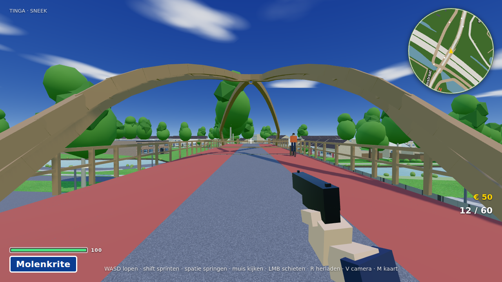

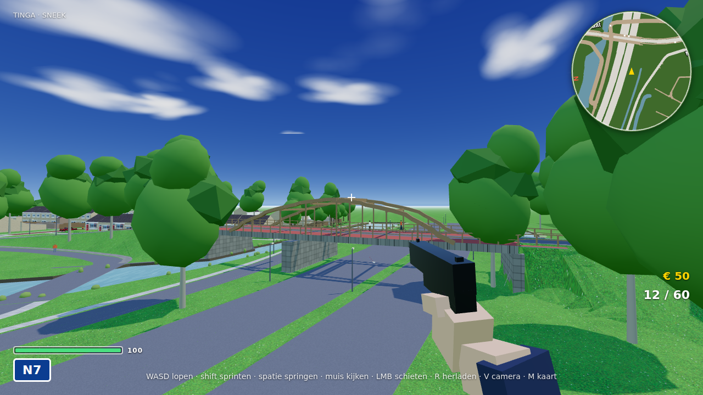

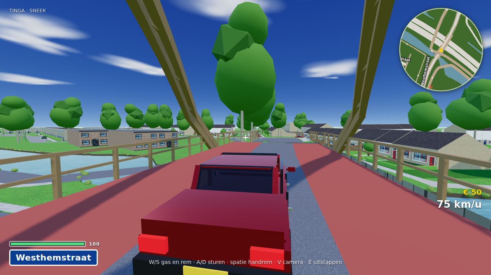

### Waar het vandaan komt

De BGT weet zelf welke wegvakken over de rondweg heen liggen: die hebben `relatieveHoogteligging 1`.
Daar staat het brugdek, met de rijbaan, de fietspaden, het trottoir en het overbruggingsdeel, en ook
de pijler in de middenberm. Wat de BGT niet weet is hóé hoog het ligt — die kent geen derde dimensie.

In [`data/stijl/omgeving.json`](data/stijl/omgeving.json) staat daarom alleen wat je van de foto's
afleest: de doorrijhoogte, de dikte van het dek, de twee punten waar de oprit weer op maaiveld ligt,
de helling van het talud en de maten van de houten boog. `tools/geo/genereer.mjs` zoekt de route
tussen die twee punten zelf op over de wegassen, legt er om de meter een station op met de hoogte uit
het profiel, en meet ter plekke hoe breed de verharding en het grastalud daar zijn. Er staat geen
enkele coördinaat van het viaduct in de code.

`js/viaduct.js` leest dat hoogteveld en beantwoordt de enige vraag die de rest van het spel stelt:
*hoe hoog ligt de grond hier?* De ondergrond, de auto's, de voetgangers, de politie en de speler
gebruiken allemaal hetzelfde antwoord. Sta je onder de brug, dan is de grond de rondweg; sta je
erboven, dan is het het dek.

`npm run viaducttest` loopt het na (39 controles): de plek, het hoogteveld, lopen, de leuning,
rijden, de houten boog en de wereld eromheen. `npm run viaductshots` maakt de foto's hierboven.

## Het sportpark aan de Molenkrite

Naast de Jumbo ligt **VV Sneek Wit Zwart** (Molenkrite 132), met vier velden. Twee ervan zijn
kunstgras — dat staat zo in de brondata, als `kunststof` — en twee zijn gras. Ze lagen eerst als
grijs asfalt en kaal gras in het spel; nu ligt er een echt veld.

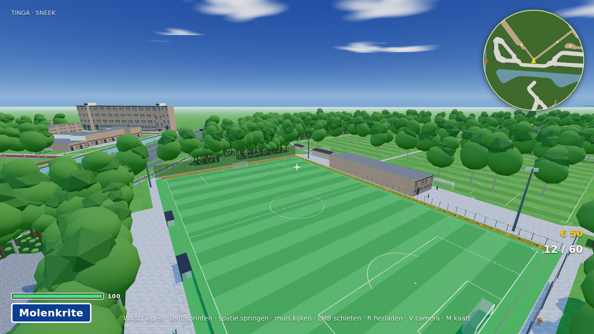

De belijning is uitgezet volgens de KNVB-maten op het speelveld dat de generator uit de omhullende
rechthoek van het BGT-vlak berekent: middencirkel van 9,15 m, strafschopgebied van 16,5 × 40,32 m,
doelgebied van 5,5 × 18,32 m, de strafschopstip op 11 m en hoekcirkels van 1 m. Er staan twee doelen
van 7,32 × 2,44 m met een net in, en rond het hoofdveld een ring van 120 reclameborden, een
ballenvanger van 6 m achter de doelen, een spijlenhek langs de kant, twee dugouts en vier
lichtmasten. Op de borden staat geen bestaand merk: het zijn de gekleurde vlakken en woordbeelden
die je op een sportpark ziet. De maaibanen lopen in de lengte van het veld, zoals ze horen.

| Vanaf de middenstip | Achter het doel |
|---|---|
| 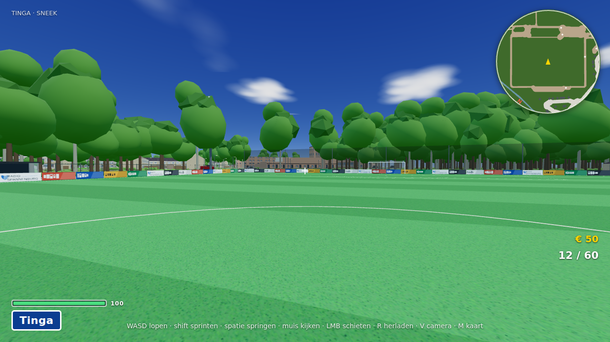 | 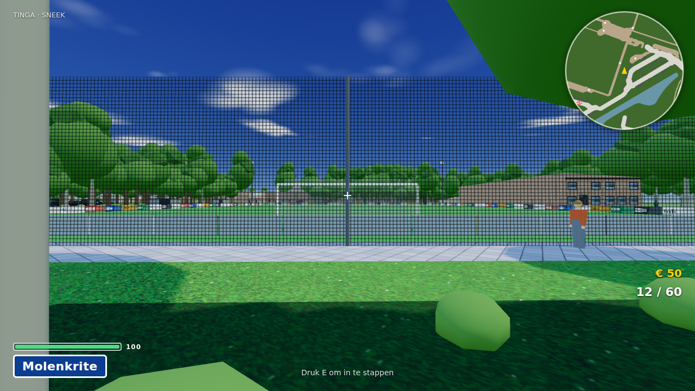 |

Langs de zijlijn staat de **overdekte tribune**: betonnen traptreden met oranje stoeltjes, daarboven
een vlak luifeldak op slanke kolommen met een reclamerand langs de voorrand, en de kantine erachter.
Waar hij staat, hoe lang hij is en hoe hoog het dak komt, haalt de generator uit het BAG-pand van de
tribune zelf (Molenkrite 132); de treden, de stoeltjes en het dak komen uit de foto. Aan het einde
staat een vlaggenmast met de clubvlag.

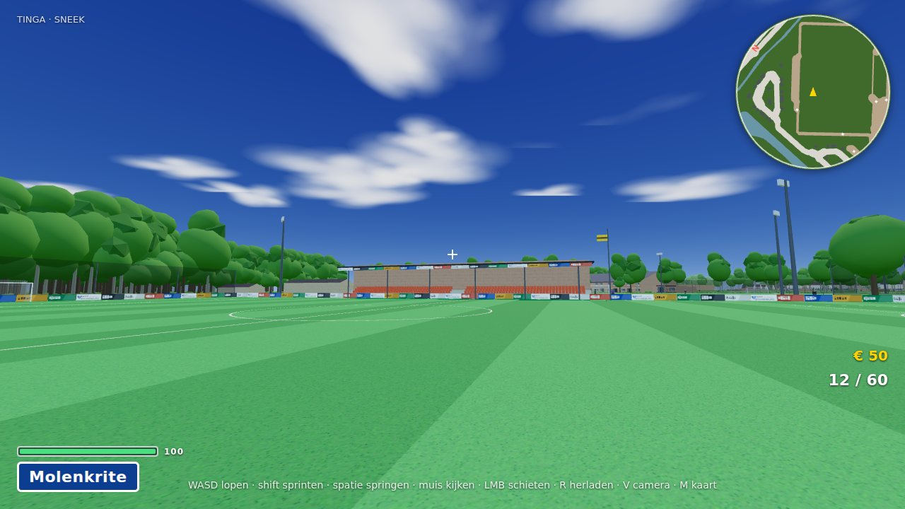

**Je kunt het veld op.** Bij de middenlijn zit een opening in het hek, en over de reclameborden heen
spring je: ze zijn 90 cm hoog en een sprong komt tot 88, dus hun botsingsdoos telt maar tot 60 cm.
Lopend houden ze je nog steeds tegen, en auto's ook — die geven geen hoogte mee.

Langs de lijn hangt **Radio Spannenburg** — *It hert fan De Fryske Marren* — de lokale omroep die de
club sponsort. Zijn bord komt om de vijf borden terug, dus je ziet het rond het hele veld, aan alle
vier de kanten. Er zitten geen plaatjesbestanden in dit spel: net als het Jumbo-woordmerk wordt het
logo op een canvas getekend, hart en al.

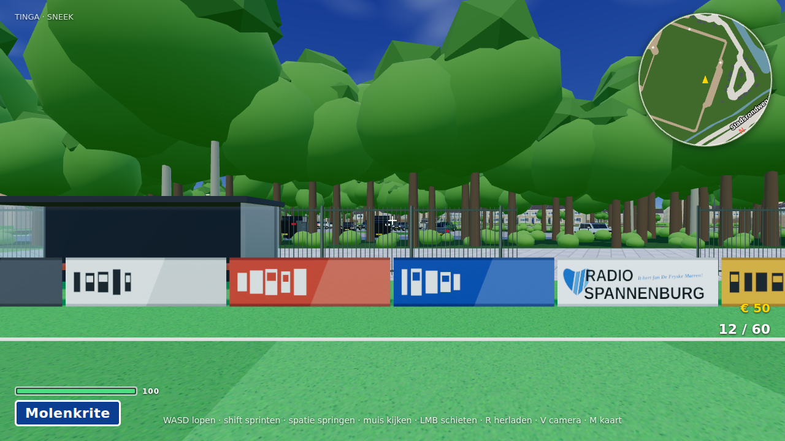

Je kunt het veld op lopen — er staat niets in de weg — maar door de reclameborden, de ballenvanger
en het hek heen niet.

## De volkstuinen achter de Wieken

Het perceel tussen de twee sloten achter de Wieken staat in de BGT als één stuk gras van ruim
18 000 m². In werkelijkheid is het een **volkstuincomplex**: 58 tuintjes van 8 bij 14 m, rug aan rug
in rijen met een schelpenpad ertussen en een grasrand langs de sloot.

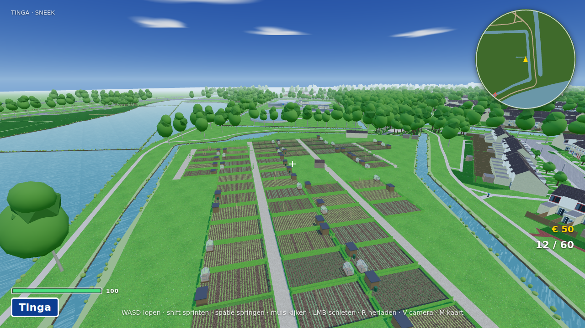

Elk tuintje heeft omgespitte grond met bedden gewas en een lage haag of een gaashekje met een
poortje aan de padkant. Bij 33 staat een houten schuurtje, bij 22 een kasje met een aluminium frame
en een zadeldakje, en hier en daar een regenton of een rek bonenstaken. Je kunt overal tussen de
bedden door lopen; alleen de randen, de schuurtjes en de kassen houden je tegen.

| Over het pad | Een tuintje van dichtbij |
|---|---|
| 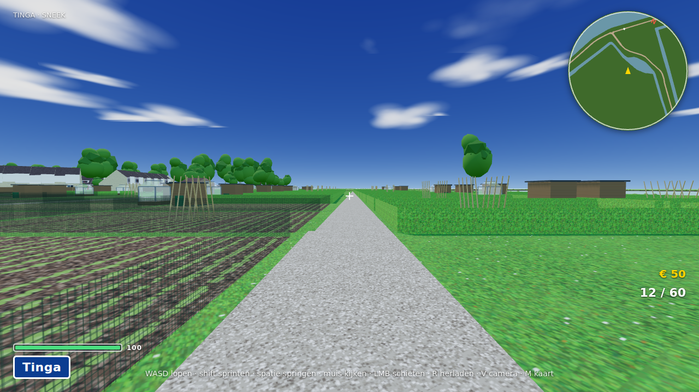 | 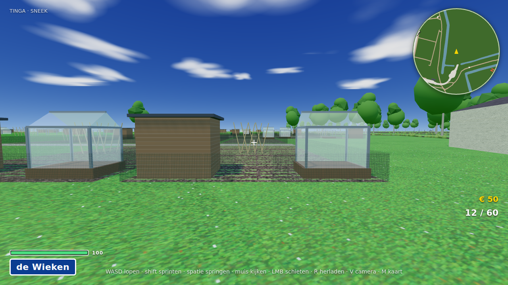 |

`npm run sporttest` loopt beide na (46 controles): het kunstgras uit de brondata, de vier velden met
hun maten en richting, de belijning, de doelen, de bordenring, het erlangs en erop lopen, en de
volkstuinen — binnen het perceel, de grasrand, de paden, de schuurtjes en of je er doorheen kunt
lopen. `npm run sportshots` maakt de foto's hierboven.

## Naar binnen bij Tinga State: munitie kopen

De stelpboerderij aan de Molenkrite is de tweede plek waar je naar binnen kunt. Ga voor de zwarte
schuurdeur staan en druk op **E**:


Daarachter ligt de deel: één open ruimte van 27,9 bij 19,1 m met de kap van binnen, van de goot op
1,94 m tot de nokbalk op 13,32 m — allemaal maten uit de kaart. Langs de wanden staan stellingen,
achterin liggen hooibalen.


Aan de toonbank staat een verkoper. Voor **€ 50** krijg je **100 kogels**; het geld gaat meteen van je
portemonnee af. Sta je bij de bank, dan staat de prijs onderin beeld en reken je af met **E**. Heb je
het niet, dan zegt hij dat ook. Meer dan 600 kogels krijg je niet in je tas.

Hij verkoopt er sinds kort ook een **machinegeweer** bij, voor **€ 500**, met **F** — één keer, want
daarna heb je hem. Hij komt meteen in je handen met een vol magazijn uit je eigen voorraad; wisselen
doe je daarna met het scrollwiel (zie [De wapens](#de-wapens)).


Je begint het spel met **€ 50**, dus één doos munitie zit er altijd in. Daarna moet je het verdienen:
de beloning van Johan aan het eind van het verhaal is € 500 (zie [Het verhaal](#het-verhaal)). Je geld
staat rechtsonder in beeld en gaat mee in de opslag.

De winkel is te vinden zonder ernaar te zoeken: op de minikaart én op de grote kaart (**M**) staat een
amberkleurig speldje met een patroon erin, op de plek van de schuurdeur. Op de minikaart draait het
icoontje niet mee met de kaart, zodat het altijd rechtop staat; op de grote kaart staat de naam
erbij.


`npm run winkeltest` toetst het geheel — 23 controles: het beginkapitaal, de deur heen en terug, de
maten van de deel, de wanden die je binnenhouden, de prijs, wat er van je geld af gaat en wat je aan
kogels bijkrijgt, dat je met een lege portemonnee niets koopt, en dat het icoontje op allebei de
kaarten getekend wordt. `npm run winkelshots` maakt de foto's hierboven.

## Naar binnen bij de Poiesz: bier kopen

De supermarkt aan De Dassenboarch 32 in IJlst is de derde plek waar je naar binnen kunt. Loop naar de
schuifdeuren onder de punt van de gevel en druk op **E**.

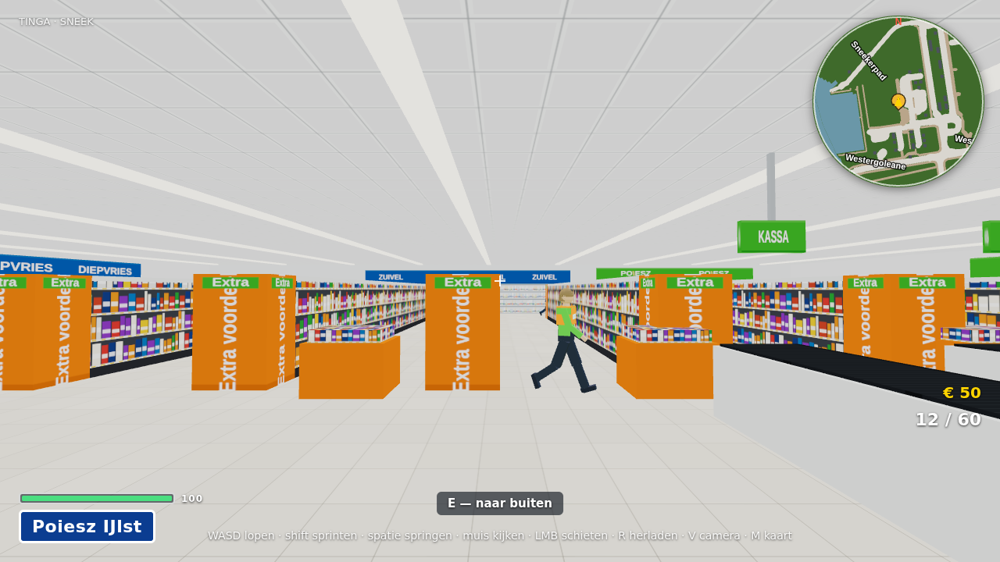

Binnen is het een echte winkel van **41,6 bij 30,7 meter** — de maten van het BAG-pand — met een
verlaagd plafond op 3,4 m vol tl-balken. Wat er staat komt van de foto's:

- **vijf kassa's** met lopende banden en een verlicht kassanummer erboven;
- **zeven dubbele schappenrijen** vol pakken, met aan het eind van elk gangpad het oranje kopschot met
  *Extra voordeel* erop, en actiebakken in het brede pad ervoor;
- rechts de **diepvriesafdeling**: blauwe glasdeuren met de vriesbalk erboven en twee eilanden met
  vrieskisten;
- achterin de **versbalie** met de groene Poiesz-wand erboven, en daarnaast de blauwe **zuivelwand**;
- links de **drankafdeling** met het bier;
- winkelwagens en plantenbakken in het halletje bij de deur.

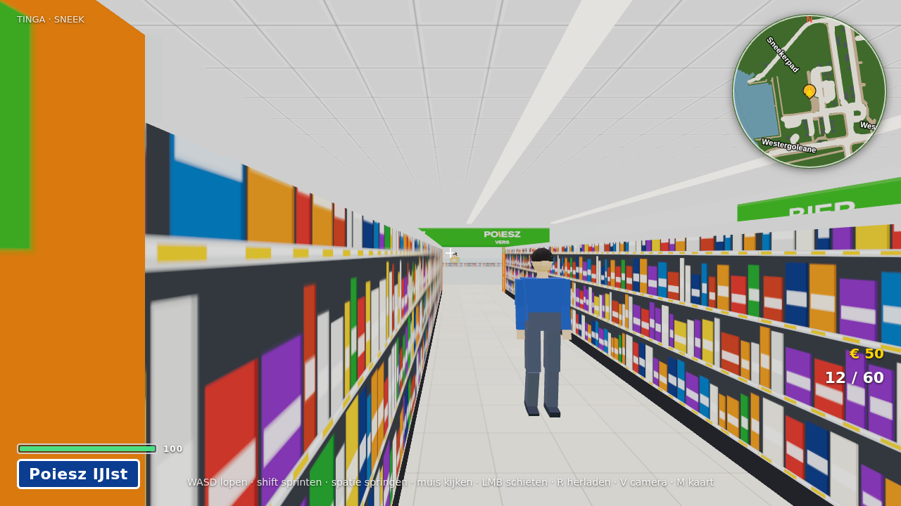

Er lopen **vijf medewerkers** rond in een groen shirt met een oranje schort en het logo op de borst —
eentje achter de kassa, eentje aan de versbalie, en drie die de winkel doorlopen — plus **vier
klanten** die van gangpad naar gangpad slenteren en af en toe bij een schap blijven staan.

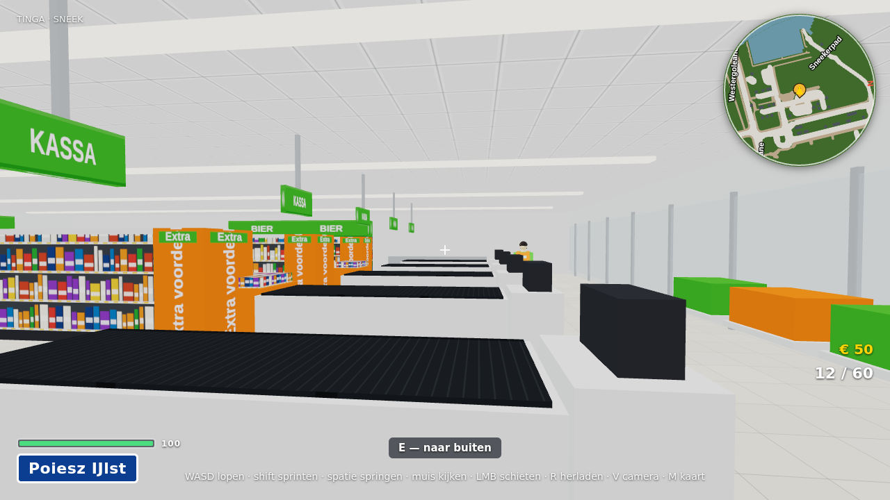

### Bier

Bij het bierschap links staat er onderin beeld **E — flesje bier kopen (€ 5)**. Elk flesje kost € 5,
gaat meteen naar binnen en levert **tien levenspunten** op; boven de honderd kom je niet.

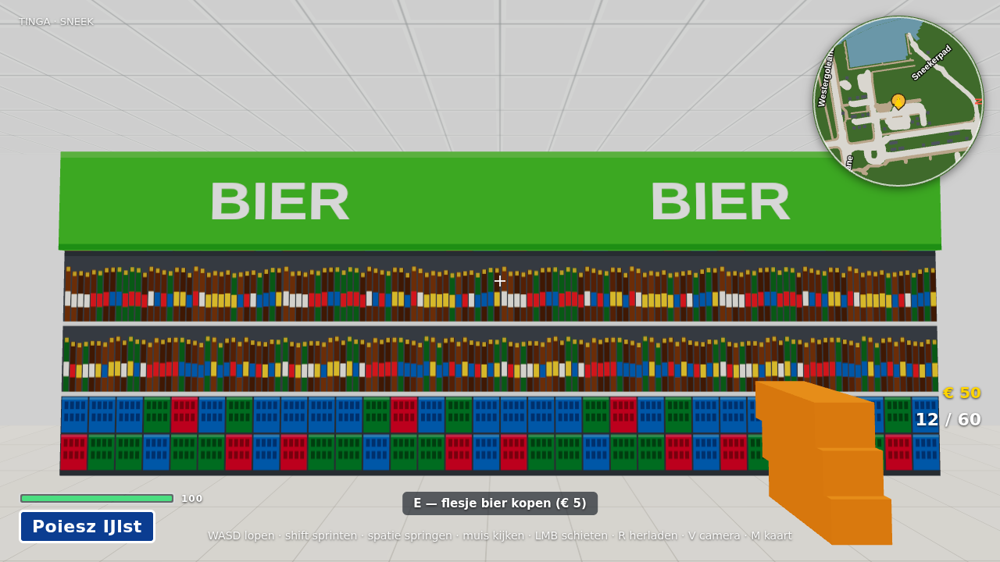

Maar drink je er meer dan twee, dan ga je het merken. Vanaf het **derde flesje** begint het beeld te
deinen: de camera rolt en dobbert, en er komt een warme waas overheen die de randen vervaagt. Elk
volgend flesje maakt het erger. Het zakt vanzelf weer weg — in **een minuut** ben je weer nuchter, en
heb je een minuut lang niets gedronken, dan begint de telling ook weer bij nul.

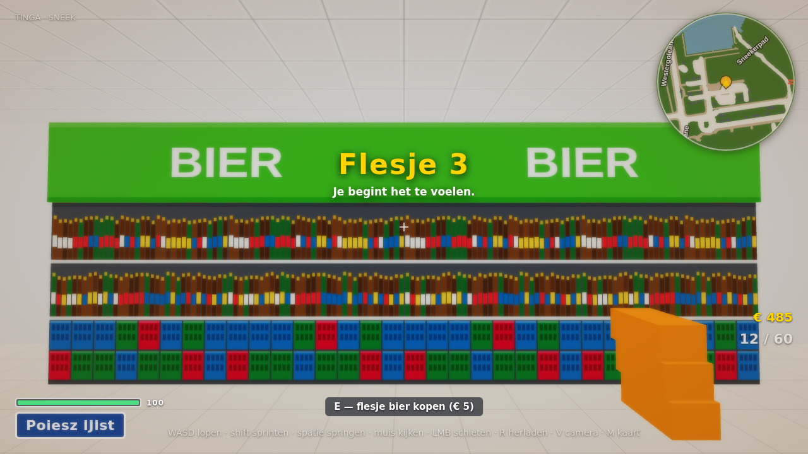

`npm run poiesztest` toetst het geheel — vierendertig controles: de maten uit de kaart, de deur heen
en terug, de inrichting en de schappen waar je niet doorheen loopt, de negen mensen en hun kleding,
de prijs en de levenspunten van een flesje, dat je zonder geld niets krijgt, en het wazige beeld dat
vanaf het derde flesje komt en in een minuut weer wegzakt. `npm run poieszshots` maakt de foto's.

## Opslaan en laden

Er is één opslagplek, in de browser (de Windows-app draait dezelfde pagina en gebruikt dezelfde).
**F5** bewaart je spel, **F9** zet het terug. Bewaard worden: waar je staat en waar je naar kijkt, je
munitie en je leven, de auto waar je in zat, de tijd van de dag, het weer, en de stand van het
verhaal: welke missie, welke bierdrinkers en bewakers al neer liggen, of de poort open staat, waar de
auto en de vrachtwagen staan, hoe het met de dief staat en hoeveel geld je hebt. Ga je in een vuurgevecht neer, dan begint het spel bij deze opslag.

Staat er een opgeslagen spel, dan biedt het startscherm **Verder spelen** aan naast **Nieuw spel**, met
de datum van de opslag erbij; na **Esc** is datzelfde scherm het pauzescherm met **Doorgaan**. De wijk
zelf zit niet in de opslag, want die ligt vast in de gegenereerde kaart, zodat
een gewone opslag nooit werk aan de wijk overschrijft.

## Windows-app

Naast de webversie is er een Windows-app met dezelfde wereld, zodat je hem zonder browser kunt
draaien.

```bash
npm install
npm run desktop      # meteen draaien (Windows, macOS of Linux)
npm run dist:win     # bouwt dist/Tinga-win32-x64/Tinga.exe
```

De GitHub-workflow **Windows-app** bouwt bij elke push een kant-en-klare zip; die staat onder
*Actions → de run → Artifacts*.

In de app zit alleen wat het spel nodig heeft: `index.html`, `js/`, `lib/`, `audio/` en `beeld/`. De
brondata (`data/geo`, 148 MB ruwe BGT- en 3D BAG-download), de referentiefoto's, het gereedschap in
`tools/` en de documentatie blijven eruit — die zitten al verwerkt in `js/kaart.js`. Dat scheelt ruim
de helft: het pakket ging van 292 MB naar ongeveer 120 MB, waarvan het meeste Electron zelf is.


## Gebouwen die geen woning zijn

Bijna de hele wereld bestaat uit woningen, en die krijgen hun aanzien van hun straat. Een handvol
panden valt daarbuiten en stond er als een naamloos blok bij. Ze staan nu met hun BAG-pandnummer in
**[data/stijl/straten.json](data/stijl/straten.json)** en hebben hun eigen aanzien gekregen.

### De Jumbo aan de Molenkrite

De supermarkt: de rij puntdaken komt uit het 3D BAG-model (goot 2,6 m, nok 7,1 m), en daaronder zit
nu een luifel over de volle breedte met een glazen pui met witte stijlen op een donkere plint, en de
gele huisstijlband met het woordmerk. Voor de ingang staan drie gele vlaggenmasten van ruim acht
meter, en het parkeerterrein ernaast is met 1239 m² het grootste van de wijk.


### Tinga State

De stelpboerderij aan de Molenkrite: één steile piramidekap van rode pannen die van de nok op 13,3 m
tot een dakvoet van twee tot vier meter doorloopt, met rijen dakramen erin. Daaronder een lage
bakstenen wand rondom, met witte kozijnen, een zwarte schuurdeur en een groene staldeur. Achter die
schuurdeur kun je naar binnen — daar zit de munitiewinkel, zie
[Naar binnen bij Tinga State](#naar-binnen-bij-tinga-state-munitie-kopen).


### De tuinen tegenover Molenkrite 15

De achtertuinen van de Binnenroede grenzen hier met hun achterkant aan de Molenkrite. De generator zet
daar normaal een schutting van 1,8 m neer, en dat werd een houten muur van achttien meter recht
tegenover de voordeur van nummer 15. In het echt staan er lage hagen, net als in de rest van de wijk.
Zulke uitzonderingen staan als vak in **[data/stijl/omgeving.json](data/stijl/omgeving.json)** onder
`lageErfscheidingen`.


### Houtzaagmolen De Rat, Sneekerpad 16 in IJlst

Kom je vanuit Sneek over het Sneekerpad IJlst binnenrijden, dan staat hij links aan het water: een
**achtkante stellingmolen** van ruim twintig meter, met de zaagloodsen aan weerskanten. **De wieken
draaien**, rustig — vier en een halve omwenteling per minuut, dus ruim dertien seconden per rondje.

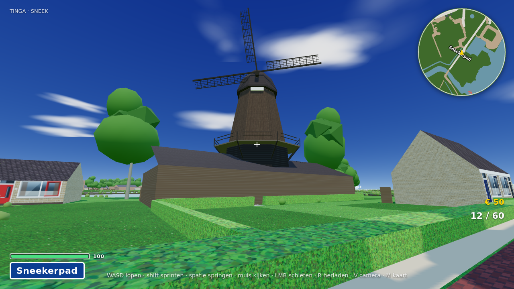

Van onder naar boven: een zwart geteerde achtkante onderbouw tot aan de **stelling** op 7,5 m, met
een omloop met een plankier, een leuning en schoren eronder; daarboven het **rieten achtkant** dat
naar boven toe smaller wordt; dan de **kap**, die een halve meter over de romp heen steekt zodat je
ziet dat hij los kan draaien, met de **bovenas** eruit die naar de kop toe omhoog loopt; en achter de
kap de **staart** met het kruirad, waarmee een molenaar de kap op de wind zet. Het **gevlucht** is
twee gekruiste roeden van 9,7 m met aan één kant van elke roede het hekwerk — meer lucht dan hout,
dus je kijkt er dwars doorheen.

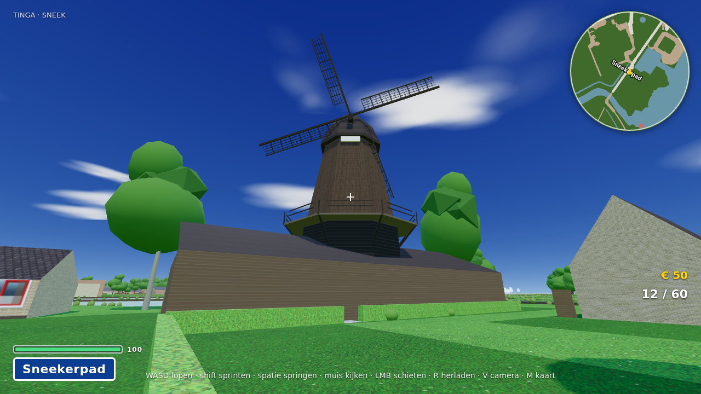

Wat er uit de data komt en wat niet, staat in [docs/METHODIEK.md](docs/METHODIEK.md). Kort: het pand
is er een uit 1683 met een goot op 7,52 m — dat is bij een stellingmolen precies de stelling — en een
nok op 20,66 m, en het grondvlak van 28 bij 13,6 m is dat van de zaagloodsen. Het 3D BAG-model zelf
is bij een molen onbruikbaar: dat vangt de roeden mee, en opgetrokken tot een gebouw was het de witte
klomp die er tot nu toe stond.

### Supermarkt Poiesz, De Dassenboarch 32 in IJlst

De supermarkt van IJlst: donkerbruine baksteen onder een flauw hellend dak van grijze metalen
dakplaten, met onderlangs de hele voorgevel een glazen pui met lichtgrijze stijlen, en daarboven de
zilvergrijze band met het **groene woordmerk** — met de I in oranje, schuin tussen de andere letters
door, net als in het echte logo. De ingang zit onder het puntdak in het midden — dat staat zo in het
3D BAG-model. Het parkeerterrein ligt aan de oostkant, en daar kijkt de voorgevel ook naartoe; rechts
van de ingang staan twee rijen winkelwagens tegen de gevel.

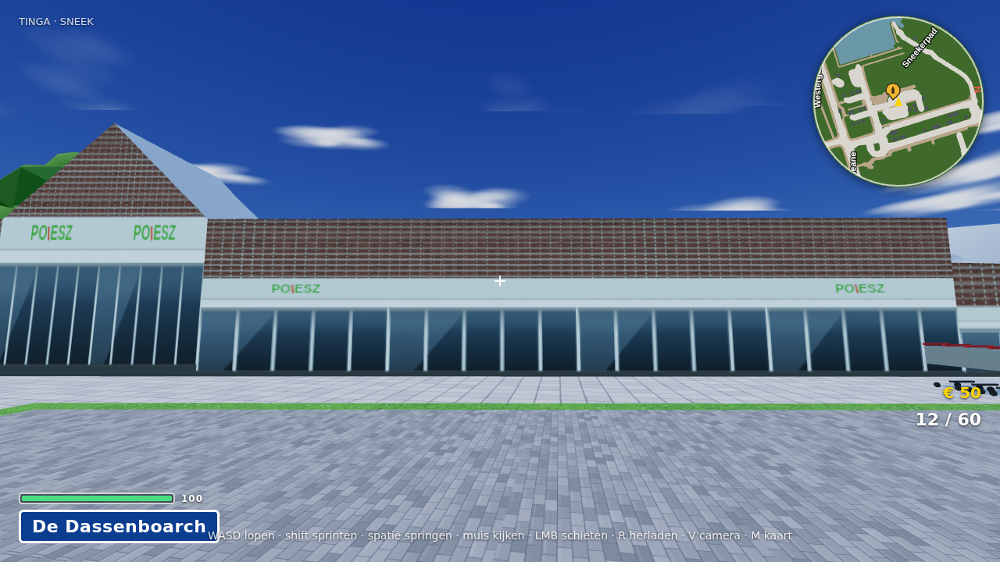

En je kunt er naar binnen: zie [Naar binnen bij de Poiesz](#naar-binnen-bij-de-poiesz-bier-kopen).

### Kindcentrum De Wynpôlle, Keizersmantel 1

Een complex met een grondvlak van **3846 m² en 131 hoeken** (de omhullende doos is 7937 m², want het
gebouw buigt): een lage gebogen vleugel met een liggend houten beschot en per lokaal een felgekleurde
luifel — rood, oranje, geel, groen, blauw als een regenboog langs de bocht — met daarnaast hogere
delen van roodbruine baksteen.

Welk deel wat krijgt is gemeten en niet verzonnen: de bovenkanten van de 228 muurvlakken in het
3D BAG-model liggen in twee groepen, 85 tot 9,5 m (de lage vleugel, goot 7,49 m) en 143 erboven tot de
nok op 14,61 m. Van de foto's komen alleen het beschot, de luifelkleuren, de kozijnen en de oranje
entree.

| het schoolplein | dicht op de luifels |
|---|---|
| 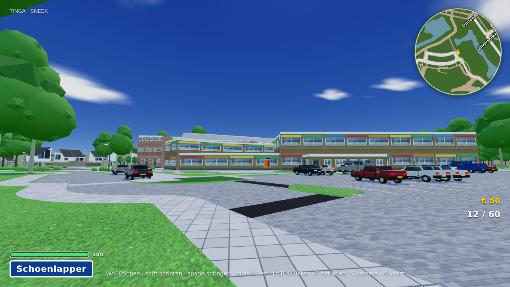 | 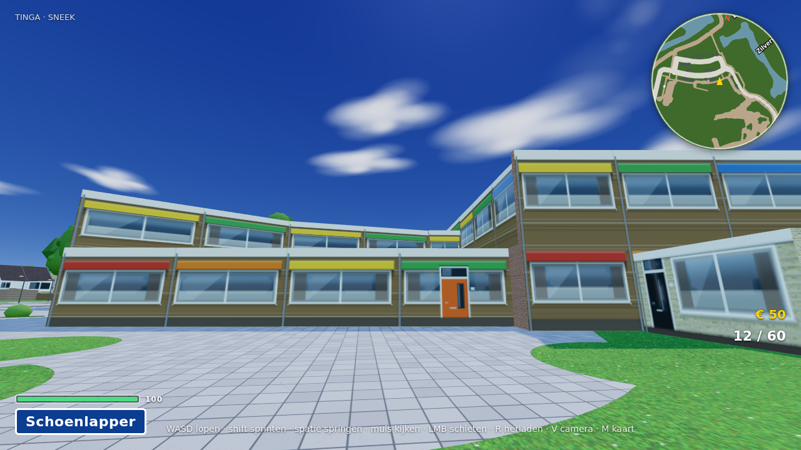 |

Het pand was niet op naam te vinden: zijn huisnummerlabel ligt elf meter van het pad Schoenlapper, dus
de generator zet het aan díe straat. Het is gevonden door langs de hele Keizersmantel-as naar het
grootste pand binnen 250 m te zoeken.

De luifels zijn **losse zeilen per raam** die schuin naar voren staan, in blokken van drie lokalen dezelfde
kleur — zo staan ze op de foto, en niet als één doorlopende gekleurde balk om en om. Aan de kant van de
bakstenen kop ligt het **schoolplein**: klimtoestel, glijbaan, speelhuisje, zandbak en een pergola achter
een zwart spijlenhek, en voor de glazen entree twee vlaggenmasten met een rij fietsenrekken.

| het schoolplein | langs het hek |
|---|---|
| 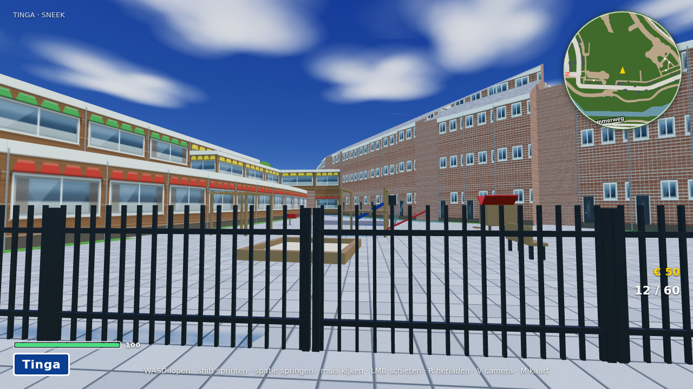 | 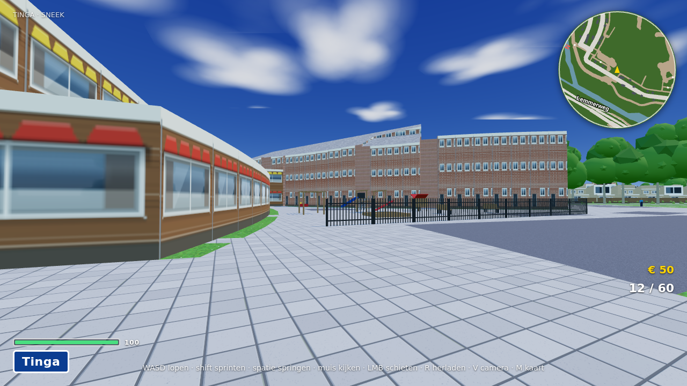 |

**De bijbouw op 1A** hoort er ook bij. Dat is een pand van 87 m² (15,0 × 5,8 m) met een plat dak op
3,49 m uit 3D BAG, bouwjaar 2023, dat op vijf meter tegen de school aan staat. Het stond als
`jasker_flat` in beeld — het standaardtype voor een plat pand in deze straat — en zag er dus uit als
een losse portiekflat naast een school. Het krijgt nu het beschot en de kozijnen van de lage vleugel,
zonder de luifels (die zitten op de foto's op de lange vleugel zelf) en zonder overheaddeur: de
bedrijfstak van `facade()` zet die in elke derde travee, en op vijftien meter gevel stond er zo een
grijze roldeur midden op het schoolplein.

| de bijbouw op 1A | en hoe hij tegen de school aan staat |
|---|---|
| 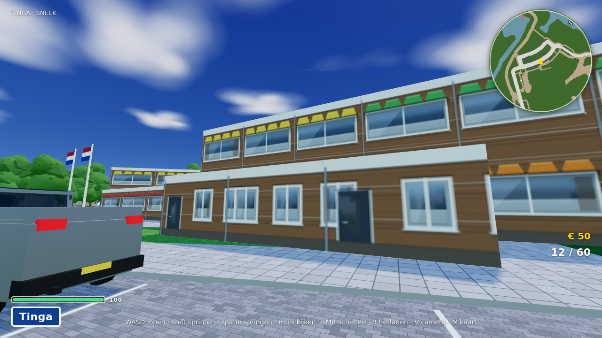 | 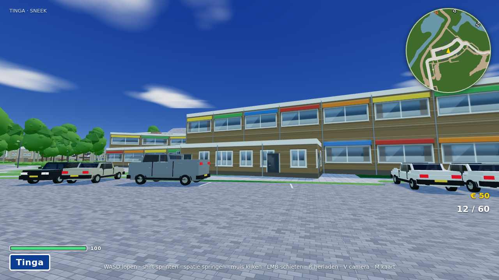 |

### De twee blokken aan de Keizersmantel in Duinterpen

Op **Keizersmantel 437** zit een Poiesz op de begane grond van een gebogen blok van drie lagen, en het
blok ernaast (441–485) is in dezelfde trant. Beide buigen om hun eigen parkeerterrein heen en staan op
een rij ronde zuilen, met de winkelpui een paar meter naar achteren.

| | Poiesz-blok | blok ernaast |
|---|---|---|
| BAG-pand | 0091100000019594 | 0091100000019595 |
| huisnummers | 401–437 | 441–485 |
| hoeken in het grondvlak | 46 | 45 |
| goot / nok | 3,95 / 11,73 m | 4,01 / 11,53 m |
| zuilen | 10 | 11 |

Die 46 en 45 hoeken zijn de gebogen plattegrond uit de BGT, en de goot op bijna vier meter is niet een
dakrand maar precies de rand van de zuilengang — die hoogte is dus gemeten en niet geschat. Van de
foto's komen alleen de kleuren, de dikte van een zuil, hun onderlinge afstand en de diepte van de pui.

Een gevelplaat is één plat vlak op de rooilijn en kan een terugliggende pui niet laten zien. Daarom
haalt `npm run geo:genereer` de boog uit het grondvlak, bouwt `js/zuilengang.js` de zuilen, de pui met
donker glas, het plafond van de gang en het groene POIESZ-woordmerk, en knipt `js/kaartwereld.js` de
muur van deze panden op de ganghoogte af.

| de Poiesz vanaf het parkeerterrein | onder de zuilengang |
|---|---|
| 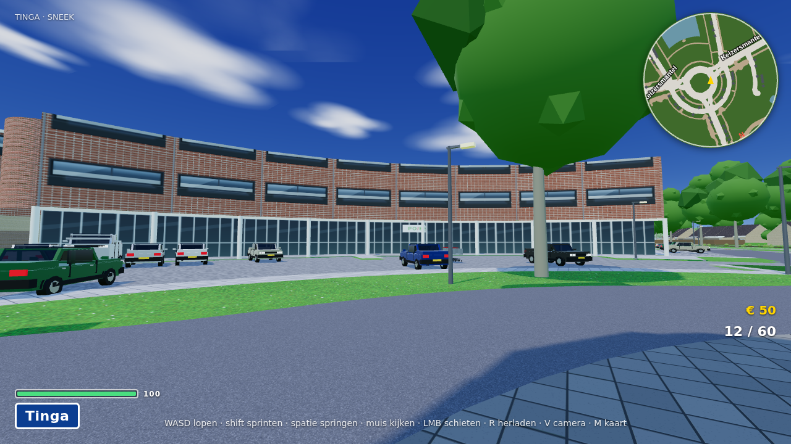 | 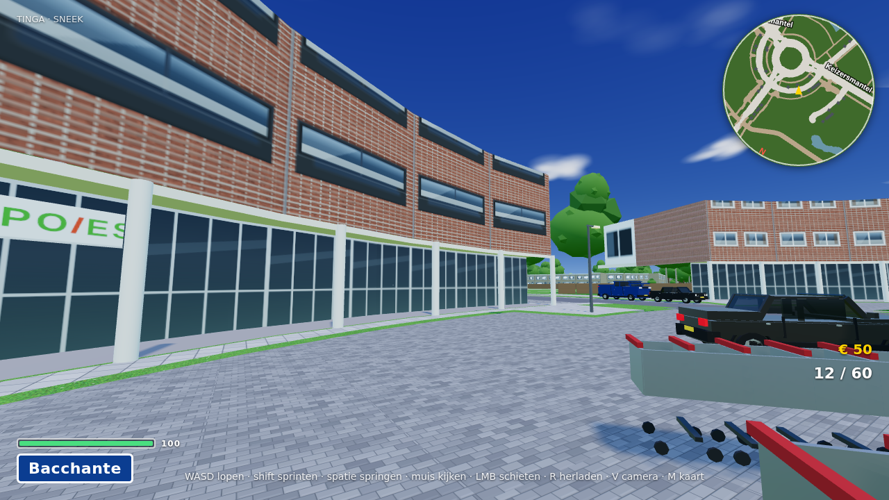 |

| dicht op de Poiesz | het blok ernaast |
|---|---|
| 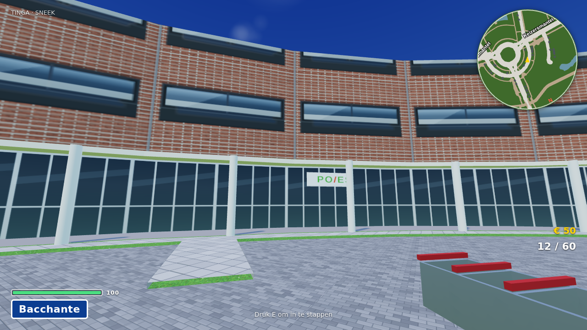 | 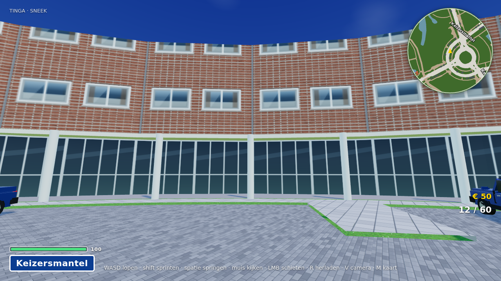 |

Je loopt tot aan de zuilen; onder de gang door kunnen lopen en een deur de winkel in staan als open
punt in [docs/METHODIEK.md](docs/METHODIEK.md).

| de achterkant, waar eerst een gat zat |
|---|
| 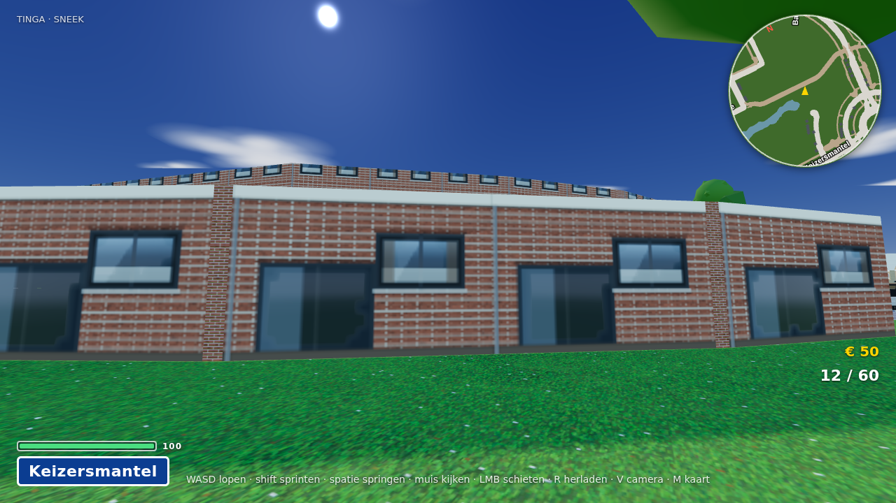 |

### Basisschool De Spil, Molenkrite 169

Het grootste pand van de wijk: een U van 6600 m² om een plein heen. Roodbruine baksteen met over de
hele lengte een doorlopende raamstrook met felblauwe kozijnen en gele gordijnen, een gele plaatband
onder een lichte dakrand, en om de drie traveeën de ingang met een geel bord erboven. Achterin staat
de rij puntdaken die ook in het 3D BAG-model zit.


### Jeugdhulp Friesland, Molenkrite 234

Een lang gebouw van één laag met plat dak in donkerbruine steen, lichte kozijnen en blauwe deuren.
Het terrein is omheind met een donkergroen spijlenhek van anderhalve meter, en naast het gebouw ligt
een speeltuin met een klimtoestel met glijbaan, een zandbak, een wipkip en een bankje.


Dat hek staat niet in de BGT — de laag `scheiding` bevat in Tinga alleen kademuren — dus het komt uit
**[data/stijl/omgeving.json](data/stijl/omgeving.json)**: een lijn op acht meter uit de gevel, die
overal vervalt waar hij op de weg, de inrit of het voetpad zou komen. Daardoor ontstaat de opening bij
de inrit vanzelf.

`npm run adresshots` maakt de foto's van deze panden; de uitsnede staat bij het pand in de catalogus.
`npm run molenshots` maakt die van de molen en de Poiesz, `npm run molentest` toetst ze allebei —
vierendertig controles, van de stellinghoogte tot het aantal toeren van het gevlucht.
`node tools/plek.mjs <x> <z> <kijkNaarX> <kijkNaarZ> [naam]` maakt een foto van een willekeurige plek
in de wijk, handig als er ergens iets niet klopt.

## Dag, nacht en weer

De zon draait van oost naar west, met bijpassende kleuren voor licht, lucht en mist. Wordt het donker,
dan springen de straatlantaarns aan. Bij regen zakt het zicht van 900 naar 320 meter, wordt het water
dof, hoor je het op je jas en wordt het wegdek nat: asfalt, klinkers, fietspad en tegels worden
donkerder en spiegelender, zodat de grauwe lucht erin staat (zie **Reliëf en glans**).


Alle geluid is gesynthetiseerd met de Web Audio API, er zijn geen geluidsbestanden: wind, vogels
overdag en krekels 's avonds, regen, voetstappen die verschillen op klinkers, tegels en gras, een
motor waarvan de toonhoogte met de snelheid meeloopt, schoten, herladen en portieren. In de
voortuin van Molenkrite 20 staat een radio op een tafeltje die echt speelt: hoe dichter je erbij
staat, hoe harder je hem hoort.

## Straten in het spel

**Tinga zelf:** Molenkrite · Monnikmolen · Kruirad · Binnenroede · Buitenroede · Jasker · Molenpaal ·
Spinnekop · Omloop · de Wieken · Windbord · Voorzoom · Bovenas · Grootwiel · Bonkelaar · Eekmolen ·
Zeskanter · Kaar · Koningsspil · de Vang · de Kap · de Krans · de Ligger · de Loper · de Hekken ·
Voorlijn · Bovenslag · Korte Spruit · het Eerst · Het Perk · Kaatsland, het Tinga Parkje met vijver,
zorgcomplex Tinga State, het Viaduct Tinga over de rondweg, en de N7 met afrit 21 aan de noordkant.

**Aan de overkant van de N7** (erbij gekomen toen de wereld werd vergroot): Westhemstraat ·
Scherwolderhemstraat · Morrahemstraat · Rijperahemstraat · Oosthemstraat · Folsgaarsterhemstraat ·
Nijlanderhemstraat · Partuurstraat · Pripperstraat · Marnezijlstraat · Piekezijlstraat ·
Katzijlstraat · Eesterzijlstraat · Jutrijpstraat · Hommertsstraat · Boetsstraat. In totaal 49 straten.

## Opbouw

- `index.html` – pagina, HUD en startscherm
- `js/kaart.js` – **de kaart van de wijk, gegenereerd uit BGT en 3D BAG** (`npm run geo:genereer`): alle
  vlakken van de openbare ruimte, wegassen met gemeten breedte, 7885 panden met hun echte grondvlak en
  3D-dak, parkeerplekken, straatnaamlabels en huisnummers, in meters vanaf het kruispunt
  Molenkrite/Monnikmolen/Jasker. Niet met de hand bewerken; zie [docs/METHODIEK.md](docs/METHODIEK.md)
- `js/kaartwereld.js` – bouwt de wereld uit `kaart.js`: ondergrond per materiaal, trottoirbanden, oevers,
  panden, hagen, struiken, bomen, lantaarns, en de aansluitingen voor verkeer, voetgangers en HUD
- `js/sportveld.js` – de velden van VV Sneek Wit Zwart: belijning, maaibanen, doelen, reclameborden,
  ballenvanger, dugouts en lichtmasten, uitgezet op het BGT-vlak
- `js/volkstuin.js` – de volkstuinen achter de Wieken: bedden, paden, hagen en hekjes, schuurtjes en kassen
- `js/molen.js` – Houtzaagmolen De Rat aan het Sneekerpad: zaagloodsen, onderbouw, stelling, rieten
  achtkant, kap, staart en het draaiende gevlucht
- `js/supermarkt.js` – de binnenkant van de Poiesz in IJlst: kassa's, schappen, diepvries, versbalie,
  personeel en klanten, en het bier
- `js/kaartkleuren.js` – één kleur per klasse, gedeeld door kaartplaat, bovenaanzicht en minimap
- `js/data.js` – de oude, handgetekende kaart in pixelcoördinaten; draait nog met `?kaart=oud`
- `js/props.js` – de objectenbibliotheek (carports, borden, speeltoestellen, zittende buren met een biertje, ...)
- `js/verhaal.js` – de vijf missies: Mark voor Molenkrite 15, het gesprek onderin het scherm, de
  bierdrinkers schuin tegenover, de rit naar de waterzuivering, de bewaking op het terrein en het
  afleveren bij de boerderij, en het telefoontje van Johan met de achtervolging in De Wieken. Alle
  plekken komen uit de kaartdata via adressen en huisnummers
- `js/bewaking.js` – de vijf bewakers: patrouille, zien en horen, aanvallen en vuren
- `js/dief.js` – de dief van De Wieken 27: slenteren, schrikken, vluchten over het wegennet,
  uitgeput raken en gepakt worden
- `js/interieur.js` – de woning achter de voordeur van Molenkrite 15: de plattegrond uit het
  grondvlak van het pand, gang met blokjes, woonkamer met laminaat, bank en tv, keukenblok in de
  aanbouw, en de teleport naar binnen en naar buiten met E
- `js/navigatie.js` – het wegennet van de kaart als graaf, met de kortste route voor de kaartnavigatie
- `js/viaduct.js` – het viaduct over de rondweg: het hoogteveld (`grondHoogte`) dat de rest van het
  spel gebruikt, het dijklichaam van de opritten, het brugdek met landhoofden en pijler, en de houten
  boogbrug met trekstangen, dwarsportalen en leuning
- `js/lichaam.js` – de maten en de lichaamsdelen van een mens van 1,75 m, gedeeld door de voetgangers
  en de losse poppetjes: romp, bekken, nek, hoofd met neus en oren, haar of pet, veiligheidsvest,
  boven- en onderarm met hand, boven- en onderbeen met schoen, plus de standen van alle gewrichten
  bij lopen, rennen, fietsen en mikken
- `js/persoon.js` – één los poppetje met een echt skelet: elleboog, knie en enkel, en het kan staan,
  zwaaien, lopen, mikken, vuren en omvallen (de voetgangers in `npc.js` zijn instanced meshes en
  kunnen dat niet)
- `js/wapen.js` – het pistool in beeld: het model met slede, loop, trekkerbeugel, greep en een los
  magazijn, de hand eromheen, het mondingsvuur en de hele herlaadbeweging met de klikken erbij
- `js/tennis.js` – het tennispark aan de Molenkrite: rood gravel, netten met een witte band,
  gaashekken, ballenvangers en lichtmasten, uitgezet op de BGT-vlakken
- `js/menu.js` – het startscherm, het pauzescherm (Esc), de instellingen, de toetsenlijst en het
  laadscherm met de voortgangsbalk
- `js/sporen.js` – remsporen: honderdtwintig vierhoekjes in één buffer die als ringbuffer
  hergebruikt worden, samen één draw call
- `js/afsluiting.js` – de wegafsluitingen aan de rand van het speelgebied: schrikhekken met een
  baken, en de onzichtbare wand erachter
- `js/scheiding.js` – muren, hekken, kademuren, damwanden, vangrails en balustrades uit de
  BGT-lagen `scheiding` en `weginrichtingselement`
- `js/opslag.js` – opslaan en laden van het spel (F5 en F9)
- `js/sfeer.js` – tijd van de dag, weer, wind, stromend water en straatverlichting
- `js/audio.js` – alle geluid, volledig gesynthetiseerd
- `tools/geo/` – de geodata-keten: `bgt2geojson.mjs` en `bag3d2geojson.mjs` (ruwe downloads → GeoJSON),
  `genereer.mjs` (→ `js/kaart.js`), `plaat.mjs` (kaartplaat van de brondata), `bovenaanzicht.mjs`
  (bovenaanzicht van het spel en pixelvergelijking met de plaat), `controle.mjs` (keurt de brondata),
  `rd.mjs` (RD ↔ Google Maps ↔ spel), `skelet.mjs` (wegassen uit rijbaanvlakken)
- `tools/verhaaltest.mjs` – loopt het verhaal na en toetst opslaan en laden
- `tools/verhaalshots.mjs` – maakt de foto's van het verhaal
- `tools/adresshots.mjs` – maakt de foto's van de panden die met naam in `data/stijl/straten.json` staan
- `tools/rijtest.mjs` – toetst het automodel, de besturing, de camera achter de auto en het aanrijden
- `tools/rijshots.mjs` – maakt de foto's van het rijden en de derdepersoonscamera
- `tools/looptest.mjs` – toetst of je nergens vastloopt: het open terrein binnen de panden en een
  wandeling in acht richtingen vanaf de binnenpleinen
- `tools/plek.mjs` – één foto van een willekeurige plek in de wijk, in spelmeters
- `tools/wereldtest.mjs` – toetst wat je in beeld ziet: geen gat in de lucht, het pistool met zijn arm
  en de H-toets, de lage erfscheidingen en het dubbelzijdige vlaggendoek
- `tools/politietest.mjs` – toetst de politie: meldkans, sterren, uitrukken, de inzet en spreiding per
  sterniveau, schieten en ontsnappen, en het nieuwe gedrag: de aanwijzing na een schot, het uitstappen
  naar snelheid, de wegblokkades en het opblazen van een surveillanceauto
- `tools/politieshots.mjs` – maakt de vijf foto's van de politie-inzet bij vijf sterren: het
  straatbeeld, de kaart, een lege surveillanceauto, een wegblokkade en een uitgebrand wrak
- `tools/winkeltest.mjs` – toetst de boerderijwinkel: beginkapitaal, de schuurdeur, de deel en het
  kopen van munitie
- `tools/winkelshots.mjs` – maakt de foto's van Tinga State van buiten en van binnen
- `tools/woningtest.mjs` – toetst de Wieken 29, het zitten op de bank, de plafondlamp, het uitzicht
  door het glas en het speeltuintje
- `tools/woningshots.mjs` – maakt de foto's van de Wieken 29, binnen en buiten
- `tools/viaducttest.mjs` – toetst het viaduct: de plek uit de BGT, het hoogteveld, lopen en rijden
  over de brug, de leuning, de houten boog en de rondweg die eronder blijft liggen
- `tools/viaductshots.mjs` – maakt de foto's van het viaduct
- `tools/wapentest.mjs` – toetst het pistool, de terugslag, het herladen met zijn geluiden, en de
  bouw en de looppas van de mensen
- `tools/wapenshots.mjs` – maakt de foto's van het wapen en de poppetjes
- `tools/wereldshots.mjs` – maakt de foto's van de vergrote wereld: de grote kaart en twee straten aan de
  overkant van de N7
- `tools/sporttest.mjs` – toetst het sportpark aan de Molenkrite en de volkstuinen achter de Wieken
- `tools/sportshots.mjs` – maakt de foto's van het voetbalveld en de volkstuinen
- `tools/molentest.mjs` – toetst de houtzaagmolen en de Poiesz in IJlst
- `tools/molenshots.mjs` – maakt de foto's van de molen en de gevel van de supermarkt
- `tools/poiesztest.mjs` – toetst de binnenkant van de Poiesz, het personeel en het bier
- `tools/poieszshots.mjs` – maakt de foto's van de winkel van binnen
- `tools/audit.mjs` – meet draw calls, geheugen en laadtijd door
- `tools/contactblad.py` – plakt de losse foto's uit `tools/propshots.mjs` en `tools/assets.mjs` tot de
  overzichtsbladen met alle objecten en woningtypen
- `tools/meetstrook.mjs` – meet een dwarsdoorsnede: hoeveel meter gras, tegels, water en rijbaan er
  achter elkaar liggen, om straatprofielen en groenstroken aan de foto's te toetsen
- `js/touch.js` – touchbesturing voor telefoon en tablet
- `desktop/` – de Electron-schil voor de Windows-app
  (3.26 px per meter, oorsprong op het kruispunt Molenkrite/Monnikmolen/Jasker)
- `js/textures.js` – procedureel gegenereerde textures: baksteen, dakpannen, klinkers (grijs en rood
  keperverband), stoeptegels, asfalt, gras, water, heggen en complete gevels met ramen en deuren
- `js/world.js` – bouwt het straatprofiel (smalle rijbaan, trottoirband, grasberm met bomen en
  parkeerhavens, tegeltrottoir tegen de voortuinen), huizenrijen met daken, dakkapellen,
  schoorstenen en zonnepanelen, voortuinen met heggen, achtertuinen met schuttingen en schuurtjes,
  lantaarnpalen, straatnaamborden, kliko's, de speeltuin en de parkjes met slingerpad, bomen,
  struiken en bankjes. Elke woning krijgt een eigen voortuintje: de een met een ligusterhaag, de
  ander met een houten kruishekje, een rode berberishaag, een conifeer of gewoon gras met struiken,
  een grindvak of een sierboompje. Elke woning wordt vóór plaatsing getoetst op overlap met wegen,
  water, parken en andere woningen; tuinen krijgen alleen de diepte die werkelijk beschikbaar is
- `js/player.js` – first-person besturing, botsingen en het pistool
- `js/vehicles.js`, `js/carmodel.js` – geparkeerde en bestuurbare auto's, verkeer op de N7 en in de wijk
- `js/npc.js` – voetgangers als instanced meshes (honderddertig mensen kosten samen zeven draw calls)
- `js/hud.js` – straatnaambord, minimap, snelheid en munitie
- `lib/three.module.js` – Three.js r160 (lokaal meegeleverd)
- `tools/screenshot.mjs` – maakt testscreenshots met headless Chromium (Playwright)
- `.github/workflows/pages.yml` – publiceert `index.html`, `js/` en `lib/` naar GitHub Pages

## Bronnen

De kaart komt uit open overheidsdata: de **BGT** (Basisregistratie Grootschalige Topografie) voor elke
rijbaan, stoep, parkeervak, berm, sloot en tuin, en **3D BAG** voor elk pand met zijn echte grondvlak,
daktype, goot- en nokhoogte en bouwjaar. De brondata staat in `data/geo/` (zie
[data/geo/README.md](data/geo/README.md)), de keten die er `js/kaart.js` van maakt in `tools/geo/`.

**[docs/METHODIEK.md](docs/METHODIEK.md)** beschrijft de aanpak: waarom foto's geen bron voor
geometrie zijn, welke bronnen en welk coördinatenstelsel (RD New) gebruikt worden, de stappen, en de
controles. De belangrijkste controle is `npm run geo:boven`: een bovenaanzicht van het spel dat pixel
voor pixel naast de kaartplaat van de brondata wordt gelegd (nu 1,59 % afwijking).


Elk pand krijgt zijn gevel met ramen en deuren uit het woningtype in de stijlcatalogus
`data/stijl/straten.json` (per straat), met het aantal lagen uit de echte goothoogte. `npm run
geo:steekproef` rendert de vaste adressen vanaf de straat en zet er de Street View-link van
hetzelfde camerapunt naast, zie **[docs/steekproef/README.md](docs/steekproef/README.md)**.

De derde ronde staat klaar in **[docs/steekproef/ronde3.md](docs/steekproef/ronde3.md)**: twintig
standpunten in IJlst, Duinterpen, de nieuwbouw ten oosten van Tinga en de noordoosthoek, elk met de
Street View-link van precies het punt waar het spel vanaf rendert. Dat is de grootste openstaande
aanname in de kaart — al die straten worden nu met het Molenkrite-woningtype getekend, de gele
baksteen en de kap van Tinga uit de jaren zeventig. `node tools/geo/steekproeflinks.mjs 3` maakt die
lijst opnieuw, zonder browser.

De oude, handgetekende kaart in `js/data.js` (overgetypt uit schermafbeeldingen, bijgesteld met
Street View) draait nog met `?kaart=oud`. Street View-foto's dienen voortaan alleen nog voor de
stijl per straat: steenkleur, kozijnen, dakkapellen, voortuinen.

## Screenshots

| Monnikmolen | Bonkelaar | Jasker | Kruirad |
|---|---|---|---|
|  |  |  |  |

| Parkje De Wieken | De Wieken | Molenkrite | Bovenas |
|---|---|---|---|
|  |  |  |  |

| Overzicht vanaf Molenpaal | Kaart (toets M) |
|---|---|
|  |  |

| Viaduct Tinga van onderaf | De oprit vanaf de Jumbo |
|---|---|
|  | 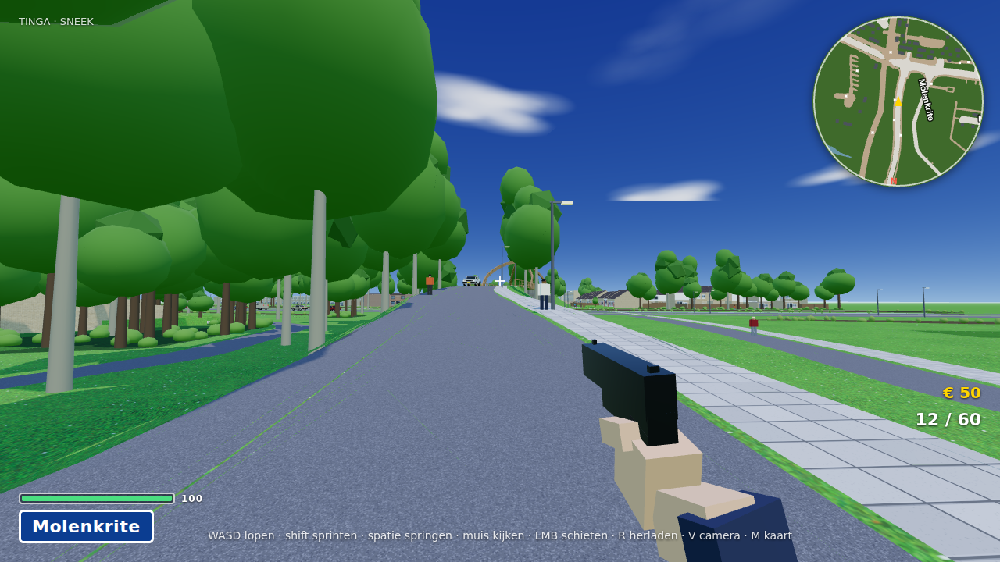 |

Testscreenshots maken (vereist Playwright en de meegeleverde Chromium):

```bash
python3 -m http.server 8123 &
node tools/screenshot.mjs 8123 shots
```
