# Steekproef stijl

Per adres: het spel vanaf de straat, negen meter voor de voorgevel, en de Street
View-link van hetzelfde camerapunt (zelfde plek, zelfde kijkrichting). Gemaakt met
`node tools/geo/steekproef.mjs`; adressen in `data/stijl/steekproef.json`, de
gekozen typen in `data/stijl/straten.json`.

Kijk per adres naar: steenkleur, kozijnkleur, deurkleur, dakpannen, dakkapel of
dakraam, zonnepanelen, voortuin (heg, hekje, grind). Wat afwijkt, komt als regel in
de stijlcatalogus; positie, breedte en hoogte komen uit de data en worden hier niet
beoordeeld.

| adres | type | 3D BAG | bouwjaar | spel | foto |
|---|---|---|---|---|---|
| Molenkrite 19 | molenkrite_bung | goot 3.17 m, nok 8.95 m, slanted | 1976 | 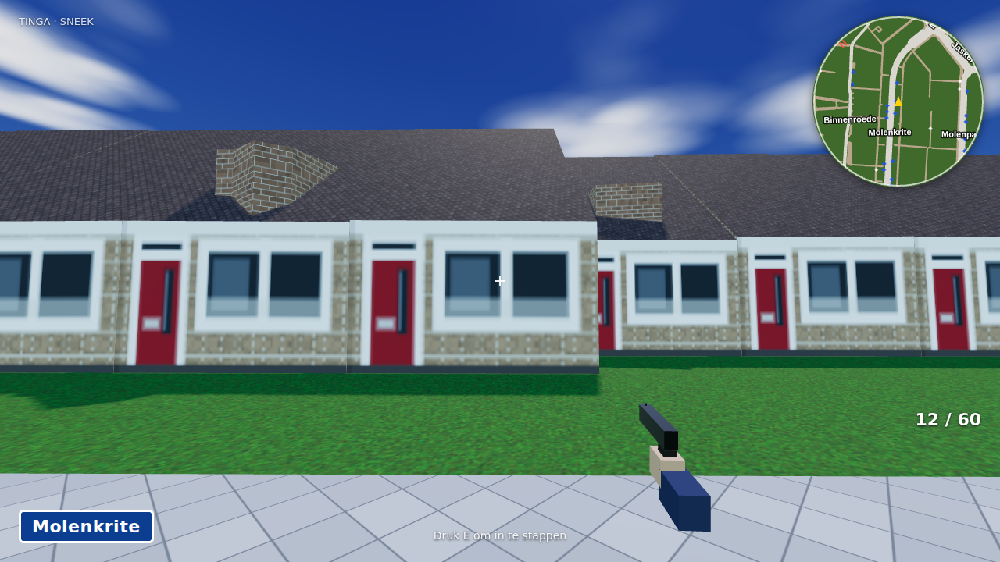 | [Street View](https://www.google.com/maps/@?api=1&map_action=pano&viewpoint=53.021453,5.644901&heading=136&pitch=5&fov=80) |
| Molenkrite 43 | molenkrite_bung | goot 3.33 m, nok 8.94 m, slanted | 1976 | 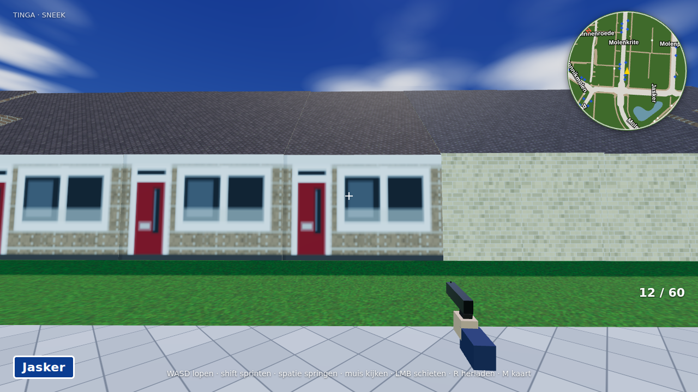 | [Street View](https://www.google.com/maps/@?api=1&map_action=pano&viewpoint=53.021036,5.644159&heading=136&pitch=5&fov=80) |
| Molenkrite 70 | molenkrite_bung | goot 3.35 m, nok 6.73 m, slanted | 1977 | 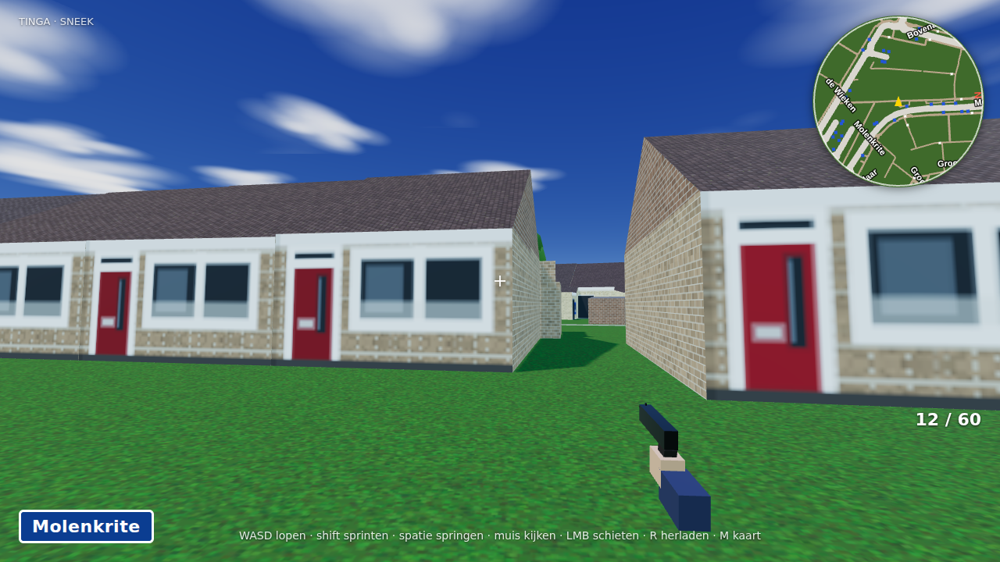 | [Street View](https://www.google.com/maps/@?api=1&map_action=pano&viewpoint=53.019584,5.643250&heading=265&pitch=5&fov=80) |
| Kruirad 50 | kruirad | goot 5.8 m, nok 8.93 m, slanted | 1974 | 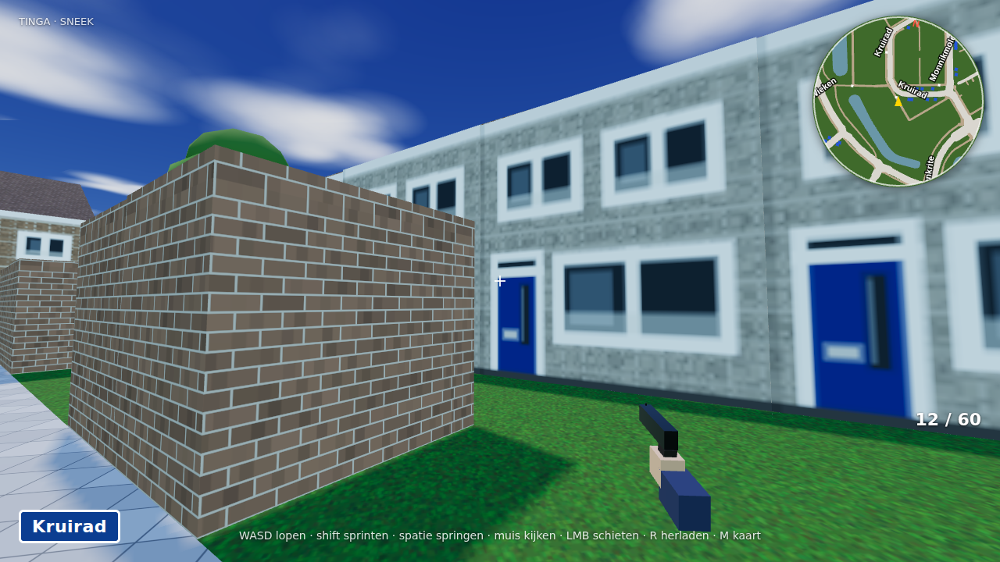 | [Street View](https://www.google.com/maps/@?api=1&map_action=pano&viewpoint=53.020988,5.642703&heading=193&pitch=5&fov=80) |
| Kruirad 12 | kruirad | goot 5.75 m, nok 8.84 m, slanted | 1974 | 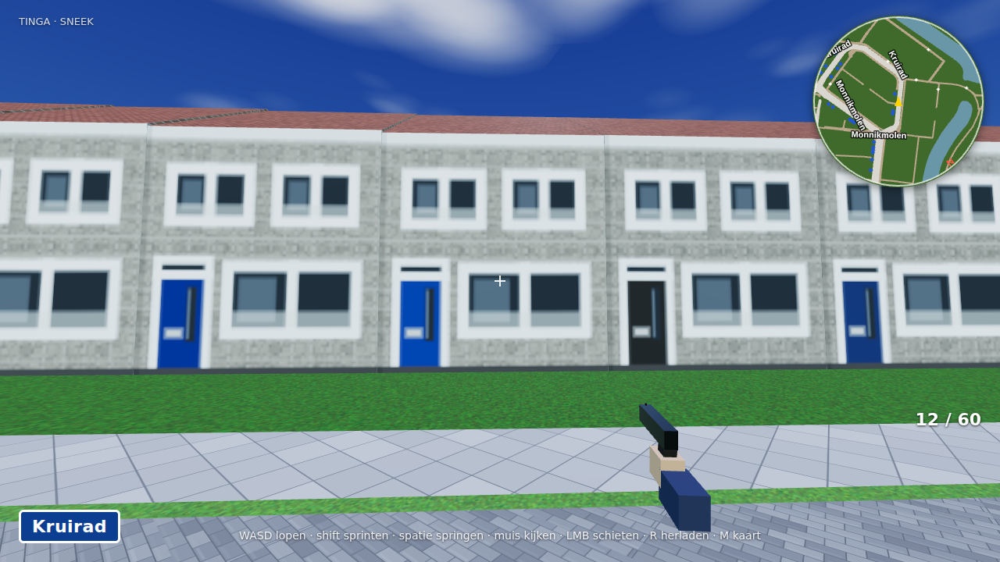 | [Street View](https://www.google.com/maps/@?api=1&map_action=pano&viewpoint=53.021692,5.642645&heading=319&pitch=5&fov=80) |
| Monnikmolen 148 | monnik | goot 5.08 m, nok 8.88 m, slanted | 1974 | 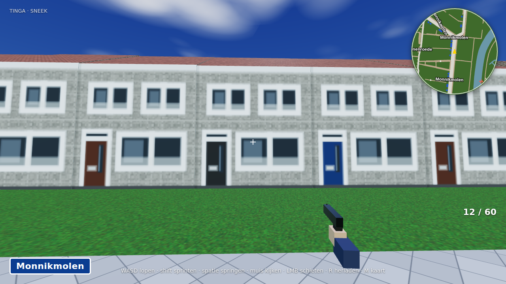 | [Street View](https://www.google.com/maps/@?api=1&map_action=pano&viewpoint=53.021979,5.643409&heading=319&pitch=5&fov=80) |
| Binnenroede 15 | monnik | goot 3.05 m, nok 8.93 m, slanted | 1974 | 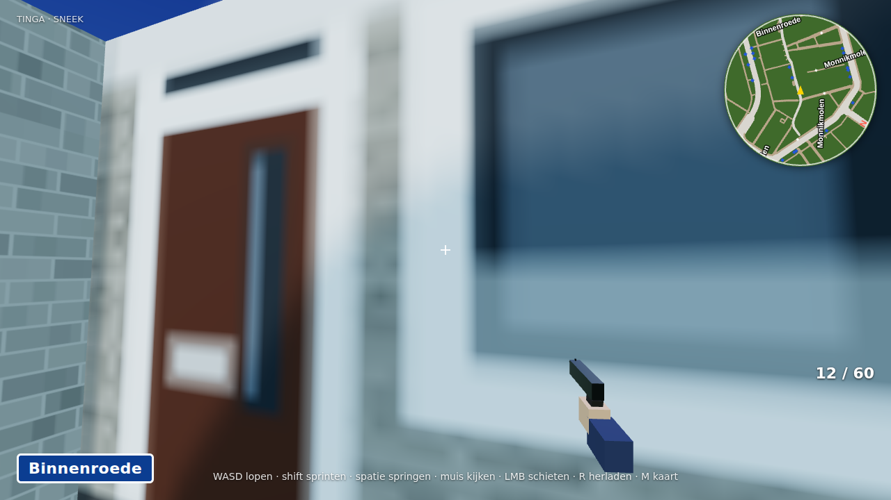 | [Street View](https://www.google.com/maps/@?api=1&map_action=pano&viewpoint=53.022025,5.644848&heading=298&pitch=5&fov=80) |
| Jasker 7 | jasker_gable | goot 2.76 m, nok 9.9 m, slanted | 1979 | 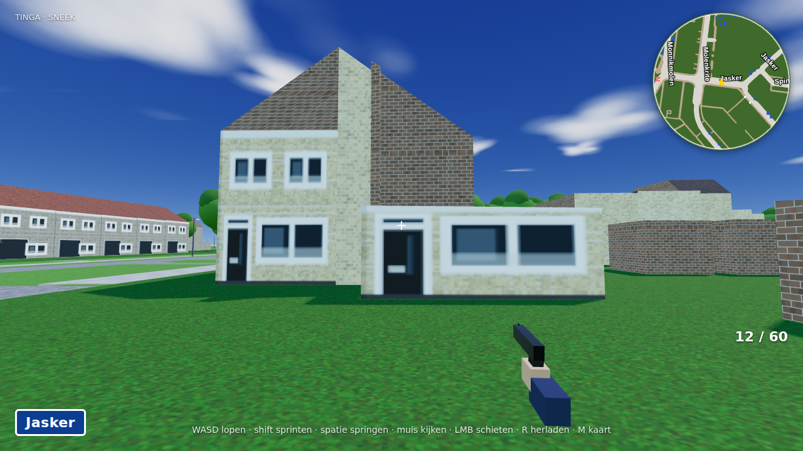 | [Street View](https://www.google.com/maps/@?api=1&map_action=pano&viewpoint=53.021469,5.645984&heading=92&pitch=5&fov=80) |
| de Wieken 34 | wieken_white | goot 3.62 m, nok 8.95 m, slanted | 1976 | 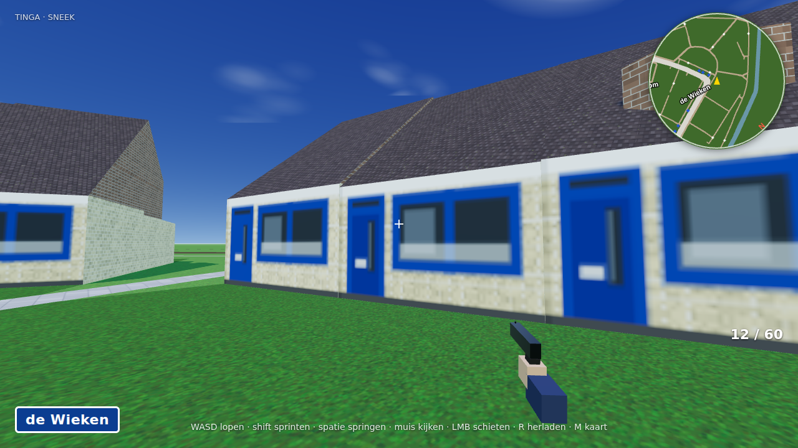 | [Street View](https://www.google.com/maps/@?api=1&map_action=pano&viewpoint=53.021176,5.639866&heading=315&pitch=5&fov=80) |
| Bovenas 5 | bovenas_bung | goot 2.8 m, nok 6.8 m, slanted | 1977 | 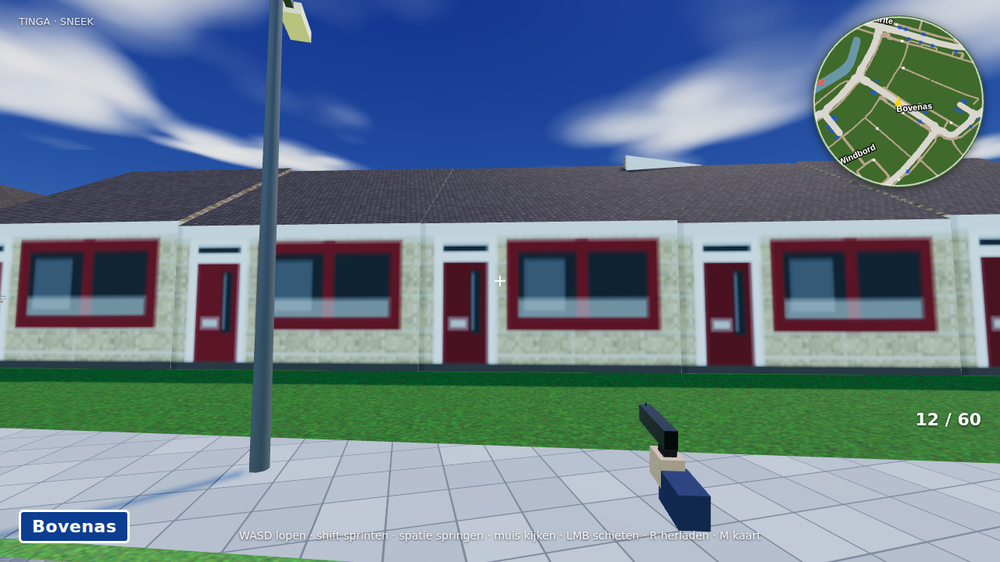 | [Street View](https://www.google.com/maps/@?api=1&map_action=pano&viewpoint=53.020030,5.642449&heading=104&pitch=5&fov=80) |
| Molenpaal 6 | molenpaal | goot 5.44 m, nok 9.19 m, slanted | 1980 |  | [Street View](https://www.google.com/maps/@?api=1&map_action=pano&viewpoint=53.021023,5.645562&heading=124&pitch=5&fov=80) |
| Bonkelaar 11 | bonkelaar | goot 2.36 m, nok 8.44 m, slanted | 1978 | 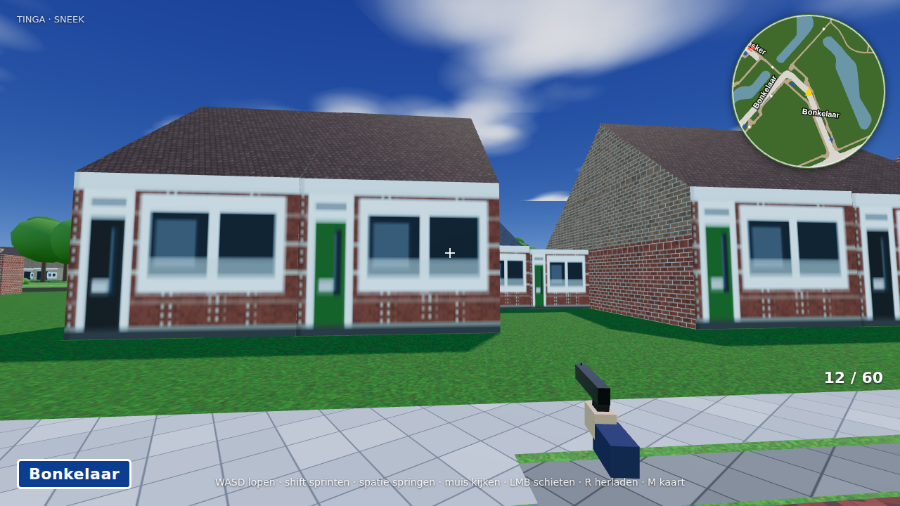 | [Street View](https://www.google.com/maps/@?api=1&map_action=pano&viewpoint=53.019090,5.646391&heading=127&pitch=5&fov=80) |
