# Steekproef stijl

Per adres: het spel vanaf de straat, negen meter voor de voorgevel, en de Street
View-link van hetzelfde camerapunt (zelfde plek, zelfde kijkrichting). Gemaakt met
`node tools/geo/steekproef.mjs`; adressen in `data/stijl/steekproef.json`, de
gekozen typen in `data/stijl/straten.json`.

Kijk per adres naar: steenkleur, kozijnkleur, deurkleur, dakpannen, dakkapel of
dakraam, zonnepanelen, voortuin (heg, hekje, grind). Wat afwijkt, komt als regel in
de stijlcatalogus; positie, breedte en hoogte komen uit de data en worden hier niet
beoordeeld.

## Ronde 1: adressen met foto (verwerkt in de catalogus)

| adres | type | 3D BAG | bouwjaar | spel | foto |
|---|---|---|---|---|---|
| Molenkrite 19 | molenkrite_kap | goot 3.17 m, nok 8.95 m, slanted | 1976 |  | [Street View](https://www.google.com/maps/@?api=1&map_action=pano&viewpoint=53.021453,5.644901&heading=136&pitch=5&fov=80) |
| Molenkrite 43 | molenkrite_kap | goot 3.33 m, nok 8.94 m, slanted | 1976 |  | [Street View](https://www.google.com/maps/@?api=1&map_action=pano&viewpoint=53.021036,5.644159&heading=136&pitch=5&fov=80) |
| Molenkrite 70 | molenkrite_bung | goot 3.35 m, nok 6.73 m, slanted | 1977 |  | [Street View](https://www.google.com/maps/@?api=1&map_action=pano&viewpoint=53.019584,5.643250&heading=265&pitch=5&fov=80) |
| Kruirad 50 | kruirad | goot 5.8 m, nok 8.93 m, slanted | 1974 |  | [Street View](https://www.google.com/maps/@?api=1&map_action=pano&viewpoint=53.020988,5.642703&heading=193&pitch=5&fov=80) |
| Kruirad 12 | kruirad_rood | goot 5.75 m, nok 8.84 m, slanted | 1974 |  | [Street View](https://www.google.com/maps/@?api=1&map_action=pano&viewpoint=53.021692,5.642645&heading=319&pitch=5&fov=80) |
| Monnikmolen 148 | monnik | goot 5.08 m, nok 8.88 m, slanted | 1974 |  | [Street View](https://www.google.com/maps/@?api=1&map_action=pano&viewpoint=53.021979,5.643409&heading=319&pitch=5&fov=80) |
| Binnenroede 15 | monnik | goot 3.05 m, nok 8.93 m, slanted | 1974 |  | [Street View](https://www.google.com/maps/@?api=1&map_action=pano&viewpoint=53.022025,5.644848&heading=298&pitch=5&fov=80) |
| Jasker 7 | jasker_gable | goot 2.76 m, nok 9.9 m, slanted | 1979 |  | [Street View](https://www.google.com/maps/@?api=1&map_action=pano&viewpoint=53.021469,5.645984&heading=92&pitch=5&fov=80) |
| de Wieken 34 | wieken_white | goot 3.62 m, nok 8.95 m, slanted | 1976 |  | [Street View](https://www.google.com/maps/@?api=1&map_action=pano&viewpoint=53.021176,5.639866&heading=315&pitch=5&fov=80) |
| Bovenas 5 | bovenas_bung | goot 2.8 m, nok 6.8 m, slanted | 1977 |  | [Street View](https://www.google.com/maps/@?api=1&map_action=pano&viewpoint=53.020030,5.642449&heading=104&pitch=5&fov=80) |
| Molenpaal 6 | molenpaal | goot 5.44 m, nok 9.19 m, slanted | 1980 |  | [Street View](https://www.google.com/maps/@?api=1&map_action=pano&viewpoint=53.021023,5.645562&heading=124&pitch=5&fov=80) |
| Bonkelaar 11 | bonkelaar | goot 2.36 m, nok 8.44 m, slanted | 1978 |  | [Street View](https://www.google.com/maps/@?api=1&map_action=pano&viewpoint=53.019090,5.646391&heading=127&pitch=5&fov=80) |

## Ronde 2: adressen zonder foto

| adres | type nu | 3D BAG | bouwjaar | spel | foto | vraag |
|---|---|---|---|---|---|---|
| Molenkrite 73 | molenkrite | goot 5.67 m, nok 9.38 m, slanted | 1980 | 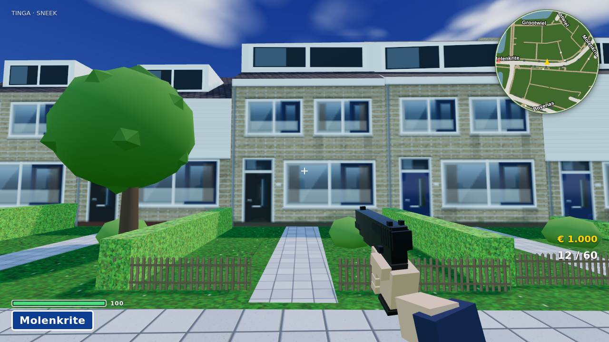 | [Street View](https://www.google.com/maps/@?api=1&map_action=pano&viewpoint=53.019850,5.643450&heading=92&pitch=5&fov=80) | het tweelaagse deel van de Molenkrite: steen, kozijnen, deuren, dakkapel of dakraam |
| Kruirad 30 | kruirad_rood | goot 5.62 m, nok 8.79 m, slanted | 1974 |  | [Street View](https://www.google.com/maps/@?api=1&map_action=pano&viewpoint=53.021383,5.642386&heading=261&pitch=5&fov=80) | rood of blauw? hier ligt in het spel de grens tussen de twee rijen |
| Binnenroede 24 | monnik | goot 3.47 m, nok 6.82 m, slanted | 1975 | 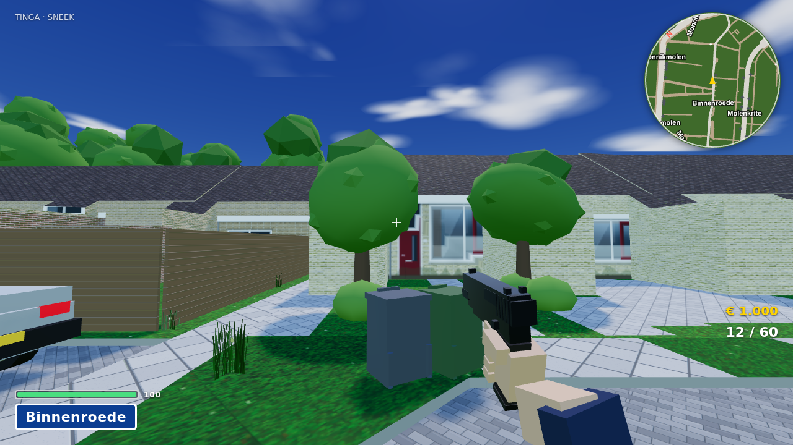 | [Street View](https://www.google.com/maps/@?api=1&map_action=pano&viewpoint=53.021787,5.644471&heading=124&pitch=5&fov=80) | hetzelfde als de Monnikmolen (rood met luifel) of anders? |
| Spinnekop 9 | molenpaal | goot 5.76 m, nok 9.35 m, slanted | 1981 | 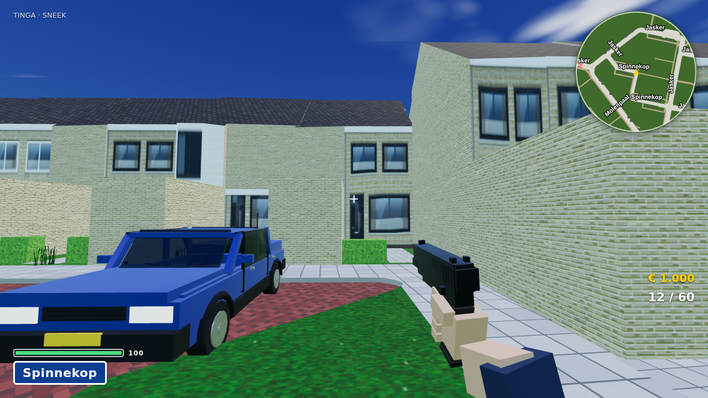 | [Street View](https://www.google.com/maps/@?api=1&map_action=pano&viewpoint=53.020697,5.645940&heading=100&pitch=5&fov=80) | nu getekend als Molenpaal-type: klopt de steen en de kozijnkleur? |
| Jasker 101 | jasker_flat | goot 5.67 m, nok 5.71 m, horizontal | 1978 | 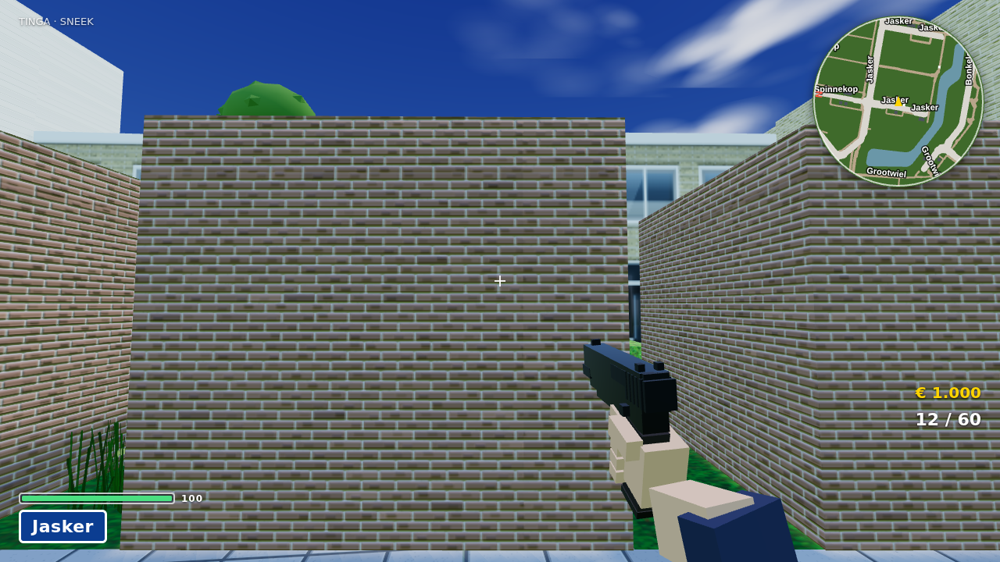 | [Street View](https://www.google.com/maps/@?api=1&map_action=pano&viewpoint=53.019977,5.645364&heading=90&pitch=5&fov=80) | de platte daken aan de Jasker: kleur steen, kozijnen, dakrand |
| Grootwiel 7 | tinga_groen | goot 2.54 m, nok 8.68 m, slanted | 1980 | 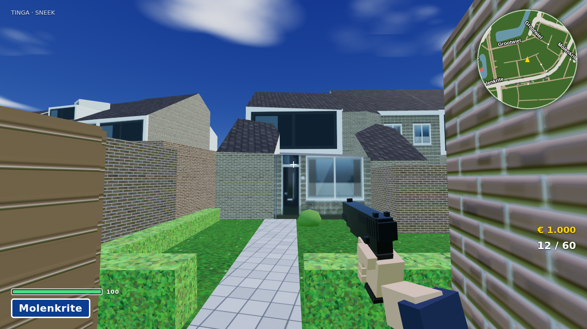 | [Street View](https://www.google.com/maps/@?api=1&map_action=pano&viewpoint=53.019781,5.644285&heading=301&pitch=5&fov=80) | nu bruine steen met donkergroene kozijnen: klopt dat? |
| Omloop 45 | tinga_groen | goot 5.65 m, nok 5.67 m, horizontal | 1979 |  | [Street View](https://www.google.com/maps/@?api=1&map_action=pano&viewpoint=53.020247,5.646868&heading=102&pitch=5&fov=80) | zelfde type als Grootwiel gekozen; klopt dat? |
| Buitenroede 66 | tinga_blauw | goot 5.7 m, nok 8.84 m, slanted | 1974 | 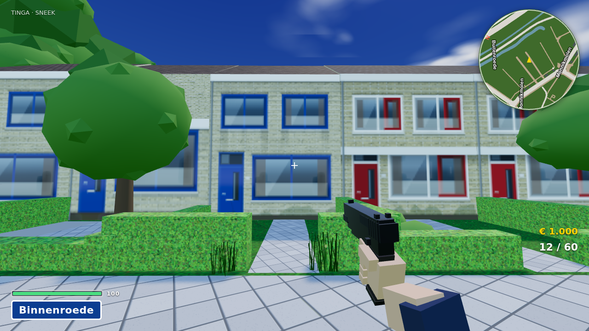 | [Street View](https://www.google.com/maps/@?api=1&map_action=pano&viewpoint=53.022610,5.646214&heading=201&pitch=5&fov=80) | nu gele steen met felblauwe kozijnen: klopt dat? |
| de Hekken 5 | bonkelaar | goot 2.51 m, nok 7.34 m, slanted | 1978 | 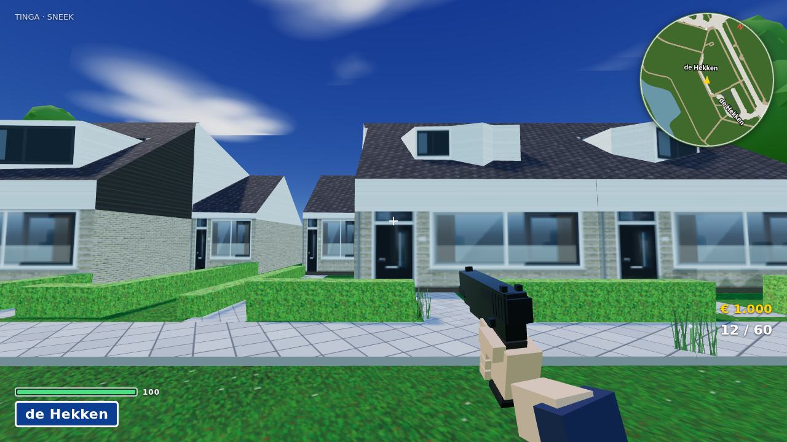 | [Street View](https://www.google.com/maps/@?api=1&map_action=pano&viewpoint=53.018484,5.644634&heading=206&pitch=5&fov=80) | zelfde type als Bonkelaar gekozen (roodbruin, witte topgevel); klopt dat? |
| Eekmolen 21 | molenkrite_kap | goot 2.8 m, nok 8.23 m, slanted | 1979 | 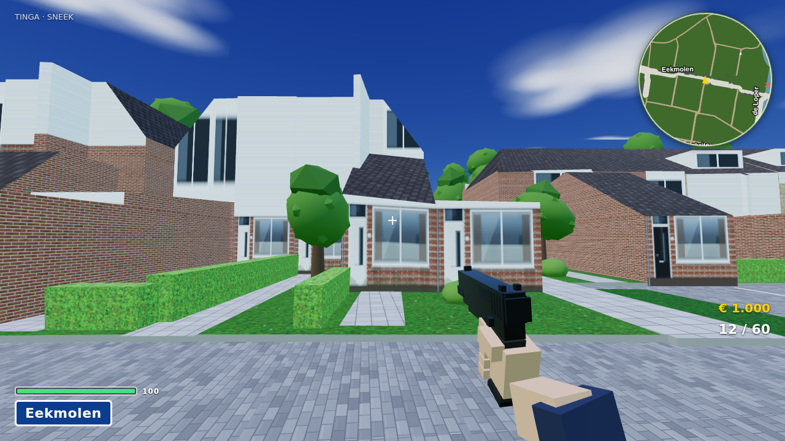 | [Street View](https://www.google.com/maps/@?api=1&map_action=pano&viewpoint=53.018893,5.648550&heading=282&pitch=5&fov=80) | geen enkele aanname nog: steen, kozijnen, deuren, dak |
| Zeskanter 8 | molenkrite_kap | goot 2.47 m, nok 10.09 m, slanted | 1977 | 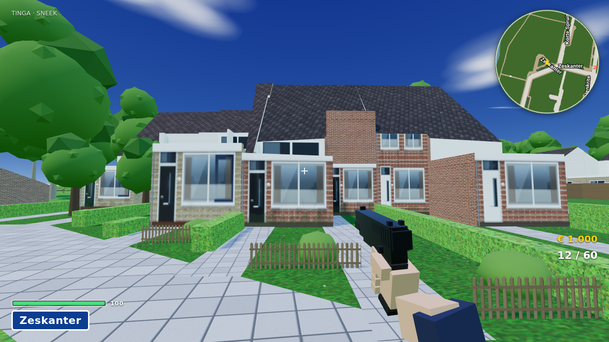 | [Street View](https://www.google.com/maps/@?api=1&map_action=pano&viewpoint=53.017343,5.649294&heading=9&pitch=5&fov=80) | geen enkele aanname nog: steen, kozijnen, deuren, dak |

## Omgeving: groen, water, parkeren, stoepen, voortuinen

Camerapunt op de dichtstbijzijnde rijbaan, kijkend naar de plek (bij een
straatprofiel: langs de straat).

| plek | soort | waar op te letten | spel | foto |
|---|---|---|---|---|
| Straatprofiel Molenkrite | profiel | stoep, berm met bomen, parkeren langs de rijbaan, kleur van de klinkers en tegels, lantaarnpalen | 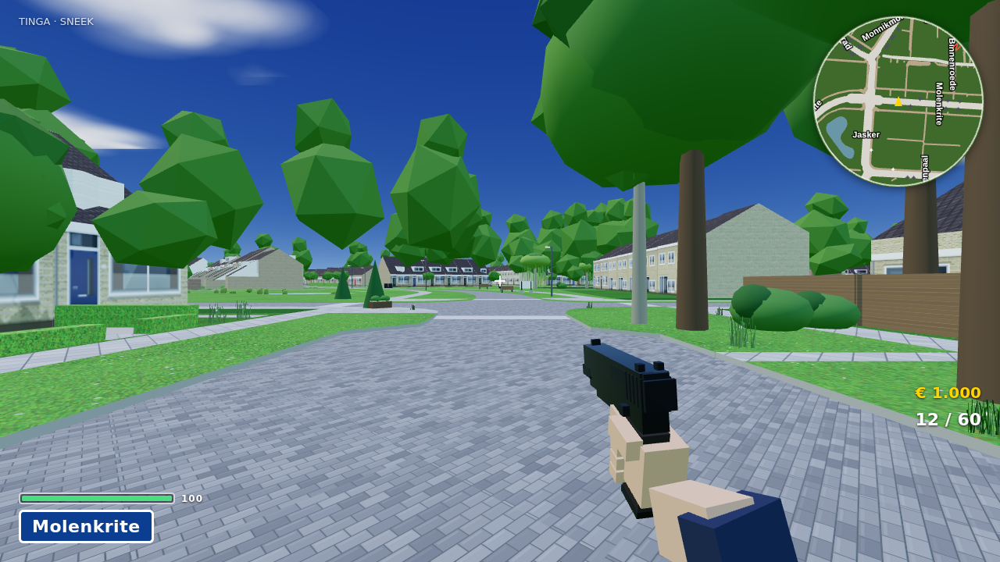 | [Street View](https://www.google.com/maps/@?api=1&map_action=pano&viewpoint=53.021076,5.644089&heading=227&pitch=5&fov=80) |
| Straatprofiel de Wieken | profiel | rode klinkers? stoep aan één of twee kanten, bomen, parkeervakken | 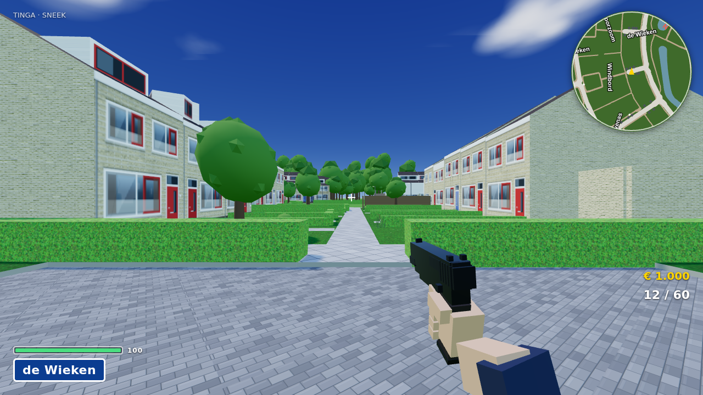 | [Street View](https://www.google.com/maps/@?api=1&map_action=pano&viewpoint=53.020482,5.641855&heading=217&pitch=5&fov=80) |
| Straatprofiel Jasker | profiel | stoep, berm, parkeren, straatbomen | 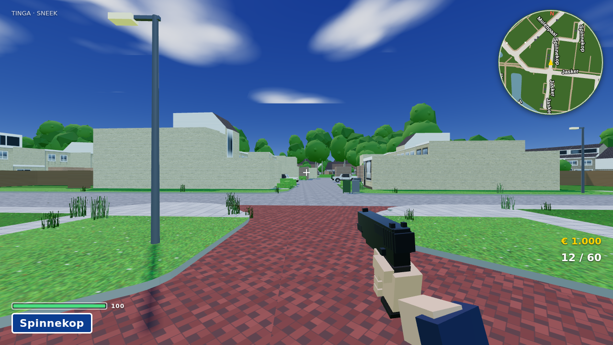 | [Street View](https://www.google.com/maps/@?api=1&map_action=pano&viewpoint=53.020378,5.645329&heading=182&pitch=5&fov=80) |
| Parkeerhof Kruirad | parkeren | haaks parkeren? belijning, bestrating, hagen of muurtjes rond het hof, bergingen | 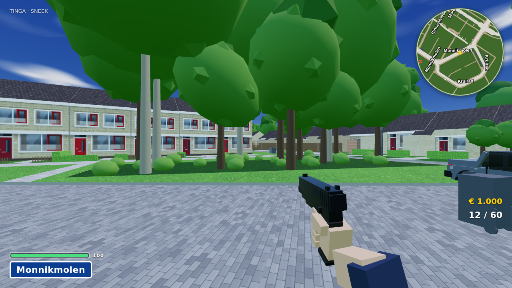 | [Street View](https://www.google.com/maps/@?api=1&map_action=pano&viewpoint=53.021403,5.643294&heading=76&pitch=5&fov=80) |
| Parkeerplaats Tinga State | parkeren | groot parkeerterrein: bestrating, belijning, bomen of hagen ertussen, verlichting | 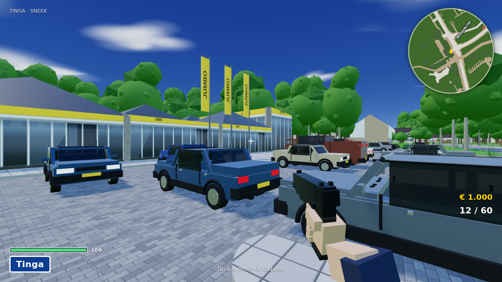 | [Street View](https://www.google.com/maps/@?api=1&map_action=pano&viewpoint=53.021508,5.647678&heading=235&pitch=5&fov=80) |
| Parkeervak Buitenroede | parkeren | parkeervakken langs de doorgaande weg: haaks of langs, bestrating | 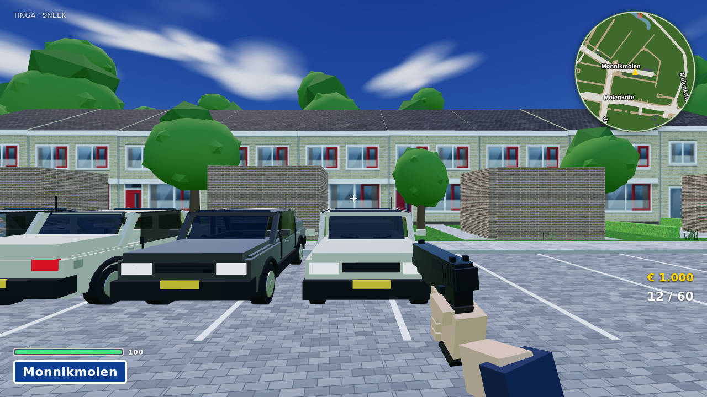 | [Street View](https://www.google.com/maps/@?api=1&map_action=pano&viewpoint=53.022060,5.646544&heading=185&pitch=5&fov=80) |
| Parkje de Wieken met vijver | groen | gemaaid gras of ruig, boomsoorten (populieren?), oever van de vijver, paden, bankjes |  | [Street View](https://www.google.com/maps/@?api=1&map_action=pano&viewpoint=53.021789,5.641124&heading=88&pitch=5&fov=80) |
| Bosje aan de Buitenroede | groen | dicht bos of losse bomen, ondergroei, pad erdoor | 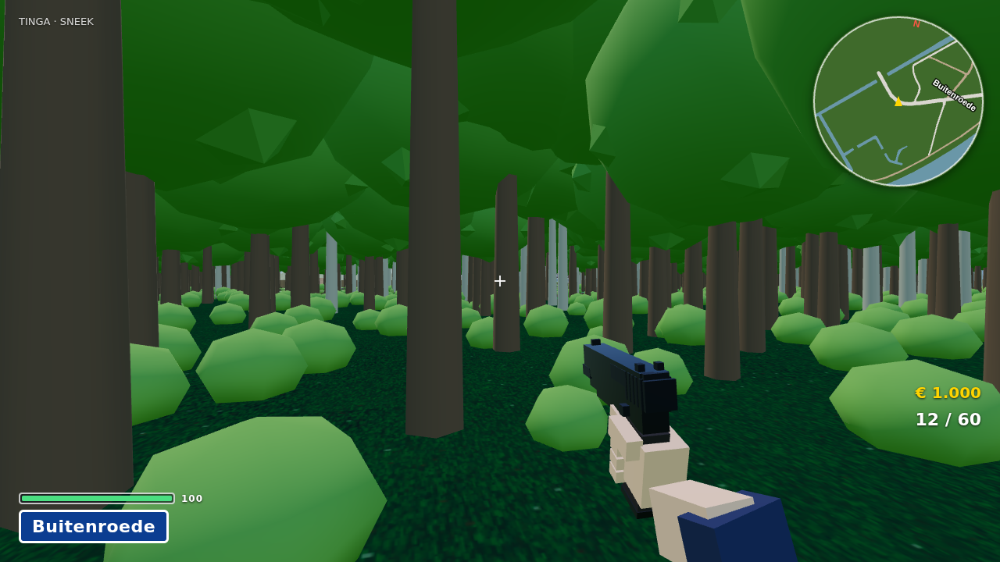 | [Street View](https://www.google.com/maps/@?api=1&map_action=pano&viewpoint=53.023048,5.642672&heading=193&pitch=5&fov=80) |
| Bosje bij de Wieken | groen | boomsoorten, ondergroei, hoe dicht | 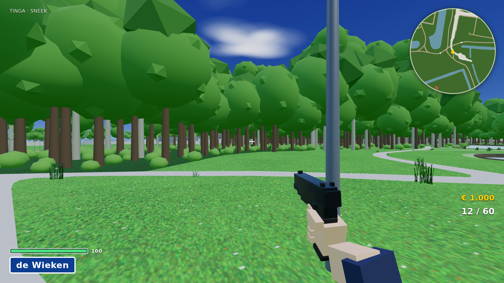 | [Street View](https://www.google.com/maps/@?api=1&map_action=pano&viewpoint=53.021967,5.640975&heading=24&pitch=5&fov=80) |
| Vijver tussen Molenkrite en Jasker | groen | oever (riet, gras, beschoeiing), bomen erlangs, pad, bankjes | 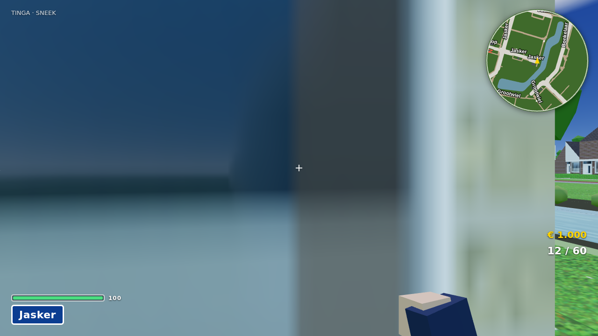 | [Street View](https://www.google.com/maps/@?api=1&map_action=pano&viewpoint=53.019732,5.645246&heading=101&pitch=5&fov=80) |
| Sloot noord van de Monnikmolen | groen | breedte van de sloot, oever, bomenrij, hekwerk | 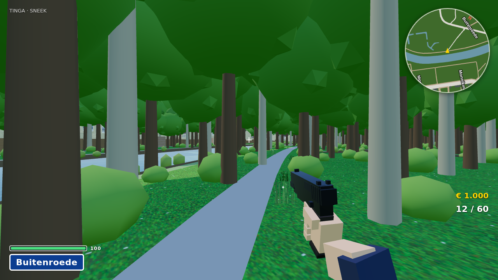 | [Street View](https://www.google.com/maps/@?api=1&map_action=pano&viewpoint=53.022664,5.643259&heading=215&pitch=5&fov=80) |
| Groen oostzijde bij Tinga State | groen | bosplantsoen of parkgras, bomen, paden |  | [Street View](https://www.google.com/maps/@?api=1&map_action=pano&viewpoint=53.021552,5.647209&heading=207&pitch=5&fov=80) |
| Heestervak de Wieken zuid | groen | wat voor struiken staan in zo'n heestervak, hoe hoog |  | [Street View](https://www.google.com/maps/@?api=1&map_action=pano&viewpoint=53.019138,5.643004&heading=36&pitch=5&fov=80) |
| Voortuinen Kruirad hofkant | voortuin | hekjes, hagen, tegels of grind, schuttingen tussen de tuinen | 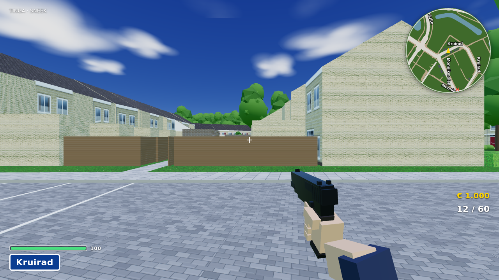 | [Street View](https://www.google.com/maps/@?api=1&map_action=pano&viewpoint=53.021100,5.643060&heading=347&pitch=5&fov=80) |
| Voortuinen de Wieken | voortuin | gras met pad, hagen, hekjes, hoe diep is de voortuin | 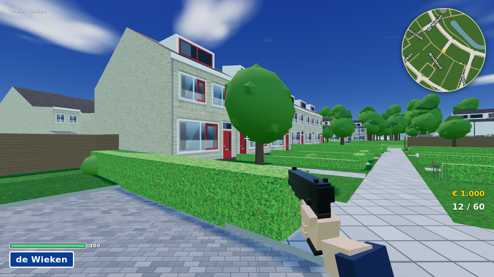 | [Street View](https://www.google.com/maps/@?api=1&map_action=pano&viewpoint=53.020454,5.641819&heading=180&pitch=5&fov=80) |
