# Steekproef stijl

Per adres: het spel vanaf de straat, negen meter voor de voorgevel, en de Street
View-link van hetzelfde camerapunt (zelfde plek, zelfde kijkrichting). Gemaakt met
`node tools/geo/steekproef.mjs`; adressen in `data/stijl/steekproef.json`, de
gekozen typen in `data/stijl/straten.json`.

Kijk per adres naar: steenkleur, kozijnkleur, deurkleur, dakpannen, dakkapel of
dakraam, zonnepanelen, voortuin (heg, hekje, grind). Wat afwijkt, komt als regel in
de stijlcatalogus; positie, breedte en hoogte komen uit de data en worden hier niet
beoordeeld.

## Ronde 1: adressen met foto (verwerkt in de catalogus)

| adres | type | 3D BAG | bouwjaar | spel | foto |
|---|---|---|---|---|---|
| Molenkrite 19 | molenkrite_kap | goot 3.17 m, nok 8.95 m, slanted | 1976 | 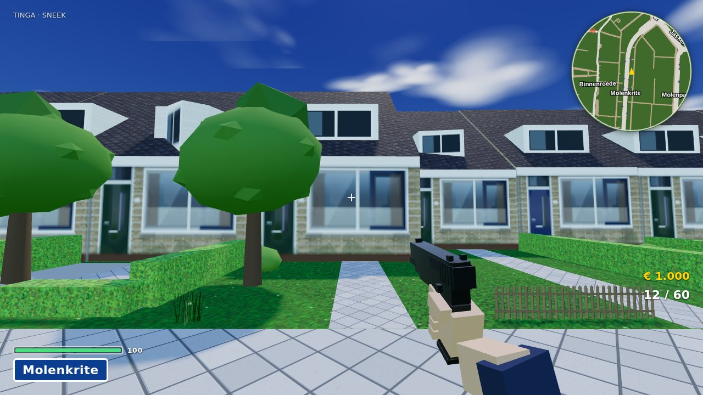 | [Street View](https://www.google.com/maps/@?api=1&map_action=pano&viewpoint=53.021455,5.644900&heading=137&pitch=5&fov=80) |
| Molenkrite 43 | molenkrite_kap | goot 3.33 m, nok 8.94 m, slanted | 1976 | 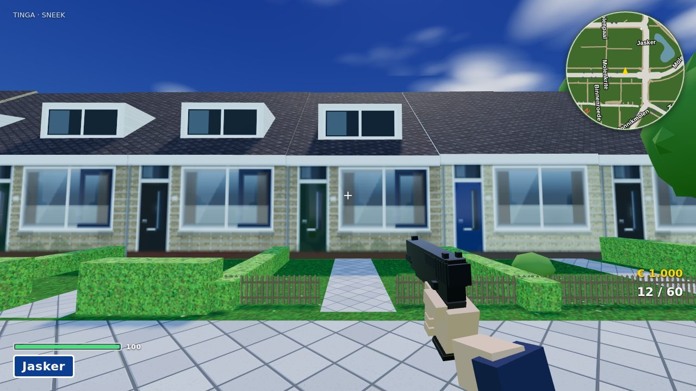 | [Street View](https://www.google.com/maps/@?api=1&map_action=pano&viewpoint=53.021038,5.644159&heading=137&pitch=5&fov=80) |
| Molenkrite 70 | molenkrite_bung | goot 3.35 m, nok 6.73 m, slanted | 1977 | 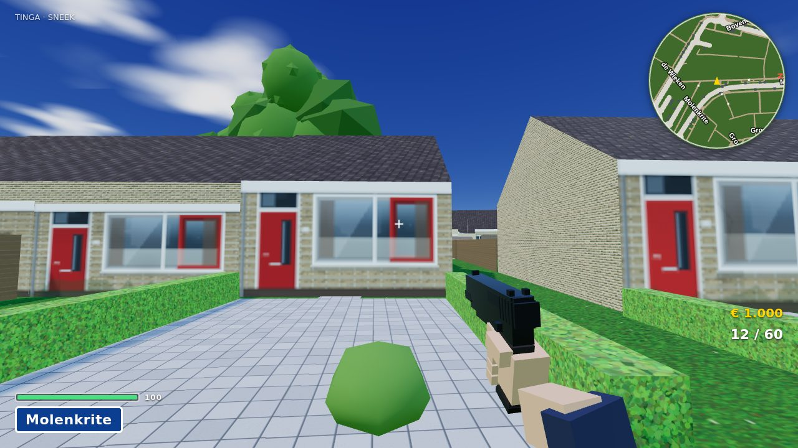 | [Street View](https://www.google.com/maps/@?api=1&map_action=pano&viewpoint=53.019560,5.643248&heading=275&pitch=5&fov=80) |
| Kruirad 50 | kruirad | goot 5.8 m, nok 8.93 m, slanted | 1974 | 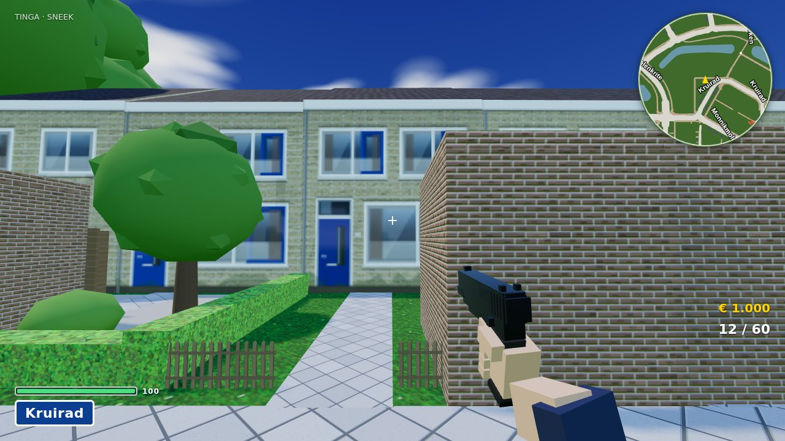 | [Street View](https://www.google.com/maps/@?api=1&map_action=pano&viewpoint=53.020947,5.642805&heading=227&pitch=5&fov=80) |
| Kruirad 12 | kruirad_rood | goot 5.75 m, nok 8.84 m, slanted | 1974 | 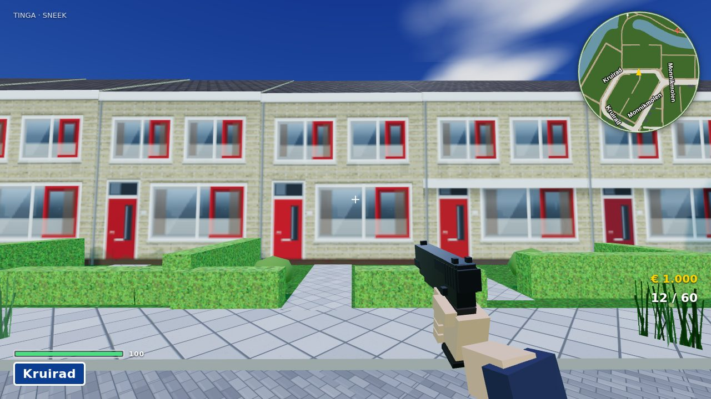 | [Street View](https://www.google.com/maps/@?api=1&map_action=pano&viewpoint=53.021697,5.642651&heading=317&pitch=5&fov=80) |
| Monnikmolen 148 | monnik | goot 5.08 m, nok 8.88 m, slanted | 1974 | 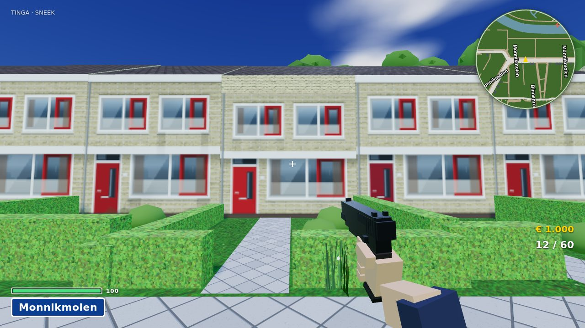 | [Street View](https://www.google.com/maps/@?api=1&map_action=pano&viewpoint=53.021983,5.643413&heading=317&pitch=5&fov=80) |
| Binnenroede 15 | bovenas_bung | goot 3.05 m, nok 8.93 m, slanted | 1974 | 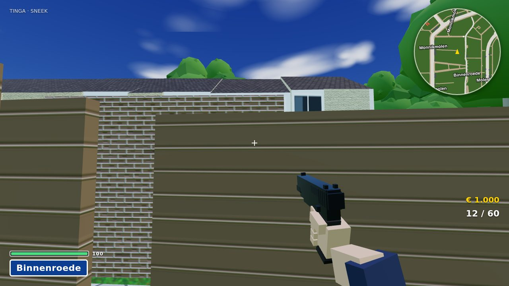 | [Street View](https://www.google.com/maps/@?api=1&map_action=pano&viewpoint=53.022002,5.644512&heading=47&pitch=5&fov=80) |
| Jasker 7 | jasker_gable | goot 2.76 m, nok 9.9 m, slanted | 1979 | 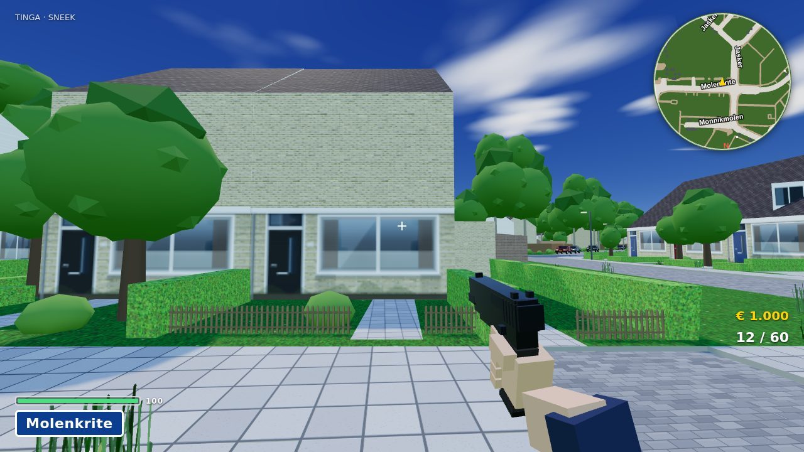 | [Street View](https://www.google.com/maps/@?api=1&map_action=pano&viewpoint=53.021610,5.646203&heading=183&pitch=5&fov=80) |
| de Wieken 34 | wieken_white | goot 3.62 m, nok 8.95 m, slanted | 1976 | 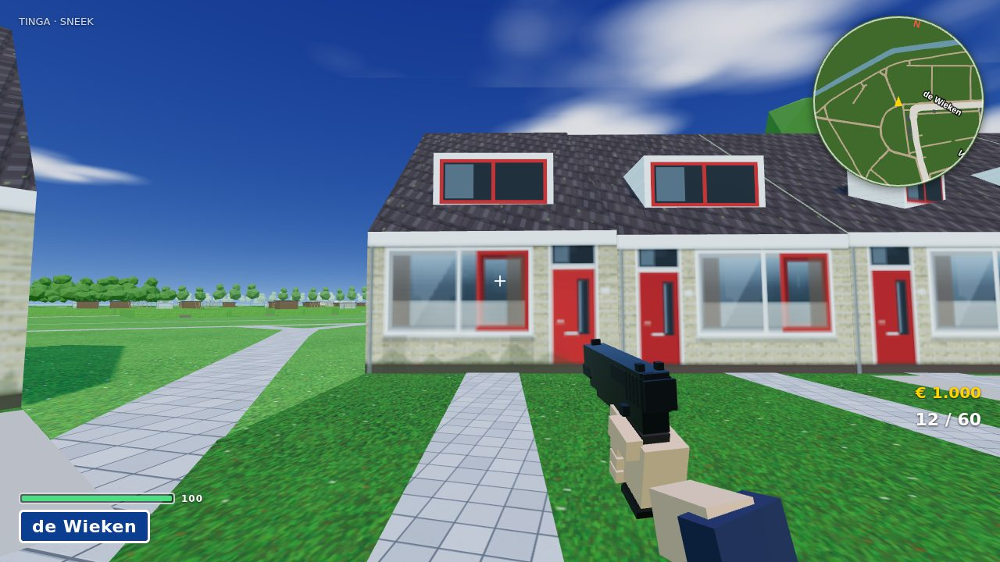 | [Street View](https://www.google.com/maps/@?api=1&map_action=pano&viewpoint=53.021139,5.639745&heading=347&pitch=5&fov=80) |
| Bovenas 5 | bovenas_bung | goot 2.8 m, nok 6.8 m, slanted | 1977 | 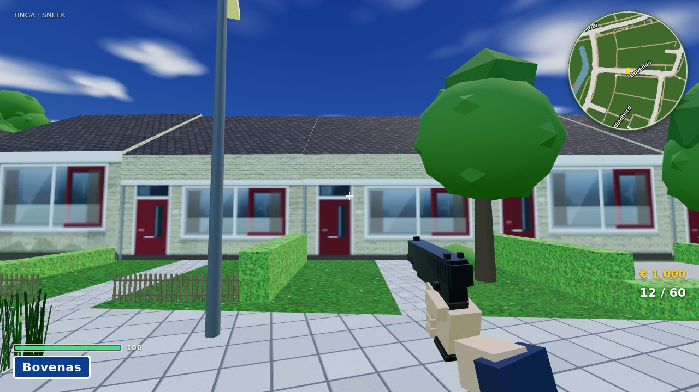 | [Street View](https://www.google.com/maps/@?api=1&map_action=pano&viewpoint=53.020035,5.642454&heading=106&pitch=5&fov=80) |
| Molenpaal 6 | molenpaal | goot 5.44 m, nok 9.19 m, slanted | 1980 | 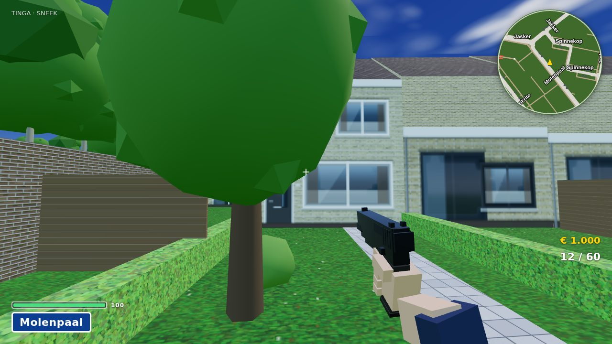 | [Street View](https://www.google.com/maps/@?api=1&map_action=pano&viewpoint=53.020956,5.645520&heading=96&pitch=5&fov=80) |
| Bonkelaar 11 | bonkelaar | goot 2.36 m, nok 8.44 m, slanted | 1978 | 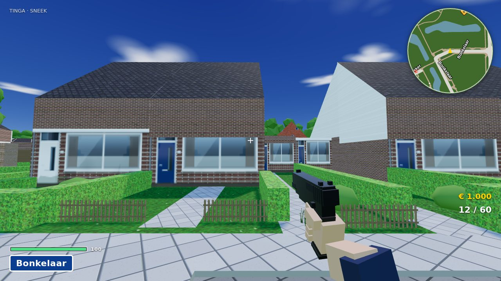 | [Street View](https://www.google.com/maps/@?api=1&map_action=pano&viewpoint=53.019076,5.646383&heading=121&pitch=5&fov=80) |
| Duizendblad 33 | molenkrite_kap | goot 2.75 m, nok 9.21 m, slanted | 1982 | 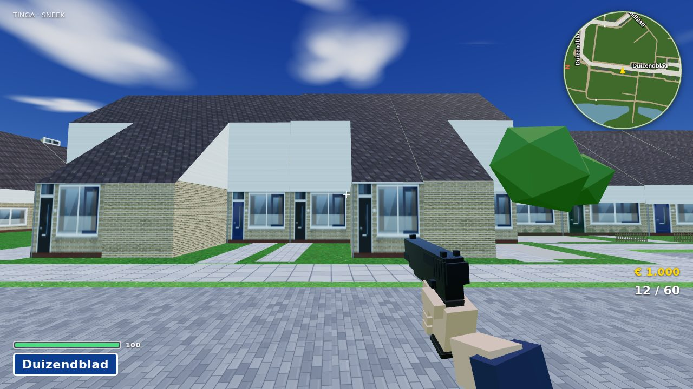 | [Street View](https://www.google.com/maps/@?api=1&map_action=pano&viewpoint=53.020893,5.656847&heading=93&pitch=5&fov=80) |
| Zilverschoon 64 | molenkrite_kap | goot 2.85 m, nok 8.93 m, slanted | 1987 | 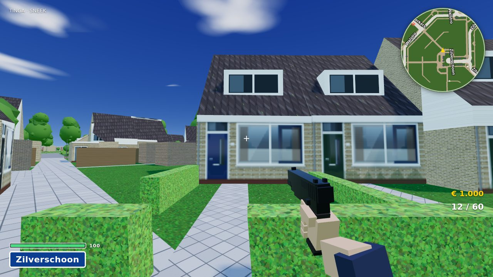 | [Street View](https://www.google.com/maps/@?api=1&map_action=pano&viewpoint=53.020267,5.659465&heading=49&pitch=5&fov=80) |
| Walstro 44 | molenkrite_kap | goot 2.24 m, nok 9.01 m, slanted | 1982 | 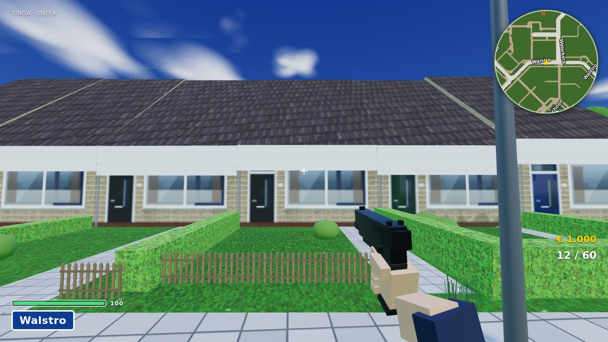 | [Street View](https://www.google.com/maps/@?api=1&map_action=pano&viewpoint=53.020796,5.659218&heading=3&pitch=5&fov=80) |
| Rode Klaver 2 | molenkrite_kap | goot 3.07 m, nok 8.99 m, slanted | 1990 | 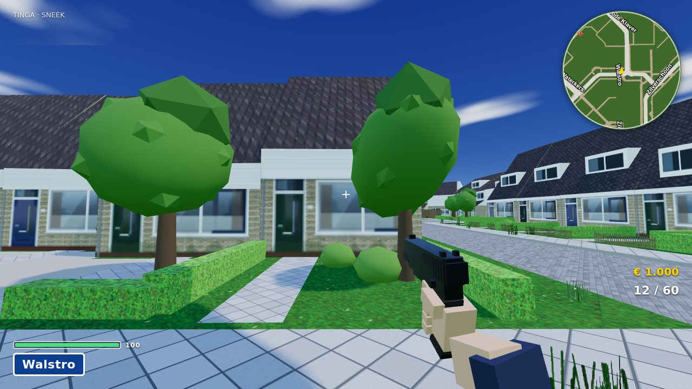 | [Street View](https://www.google.com/maps/@?api=1&map_action=pano&viewpoint=53.020569,5.660457&heading=48&pitch=5&fov=80) |
| Koolwitje 14 | molenkrite | geschat (geen 3D BAG) | ? | 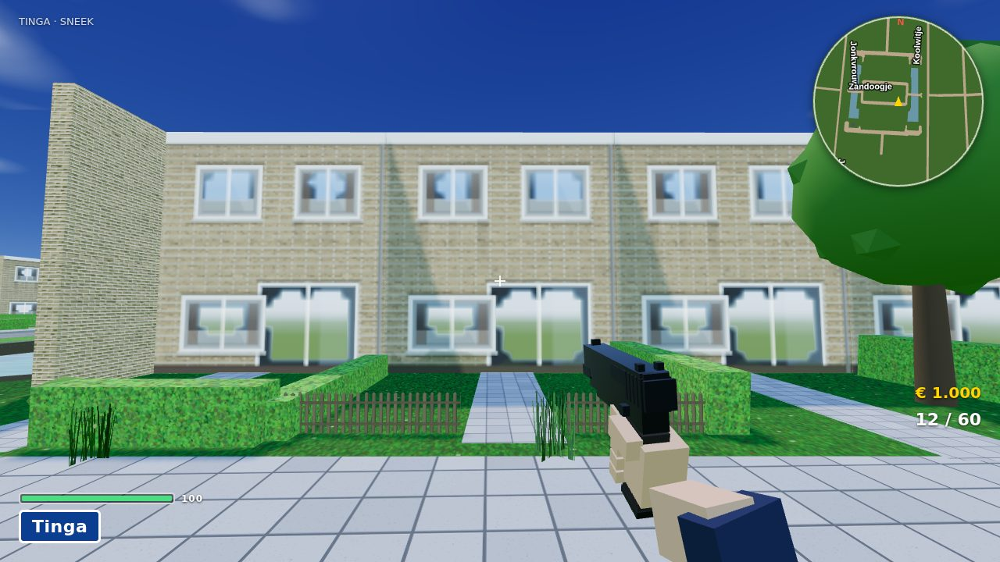 | [Street View](https://www.google.com/maps/@?api=1&map_action=pano&viewpoint=53.016275,5.665746&heading=182&pitch=5&fov=80) |
| Dagpauwoog 10 | molenkrite_kap | goot 2.65 m, nok 11.09 m, slanted | 2007 | 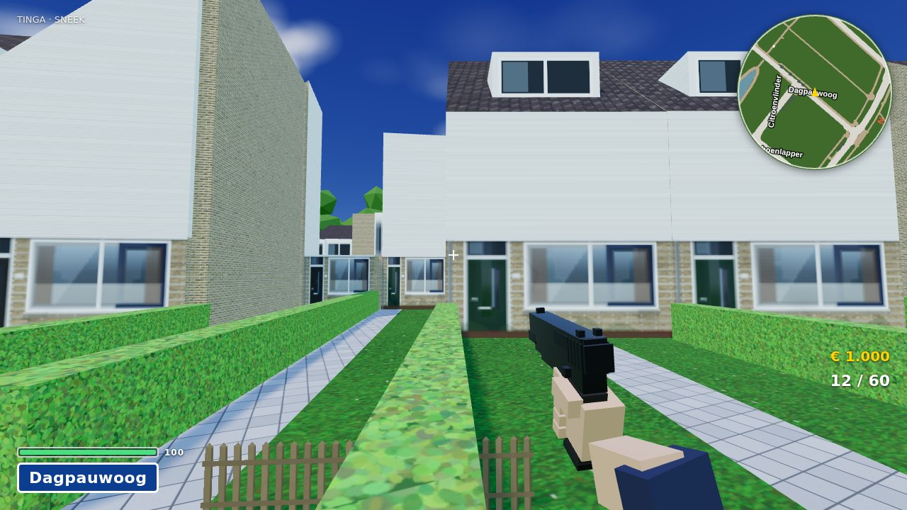 | [Street View](https://www.google.com/maps/@?api=1&map_action=pano&viewpoint=53.017684,5.658299&heading=293&pitch=5&fov=80) |
| Ylostinslaan 62 | molenkrite_kap | goot 2.48 m, nok 8.67 m, slanted | 1973 | 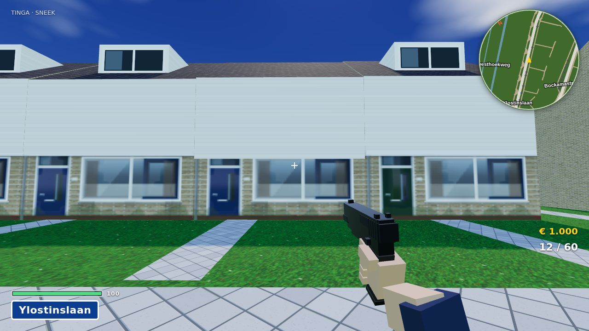 | [Street View](https://www.google.com/maps/@?api=1&map_action=pano&viewpoint=53.012203,5.613061&heading=142&pitch=5&fov=80) |
| Sikko Sjaerdemalaan 27 | molenkrite_kap | goot 2.89 m, nok 9.57 m, slanted | 1970 | 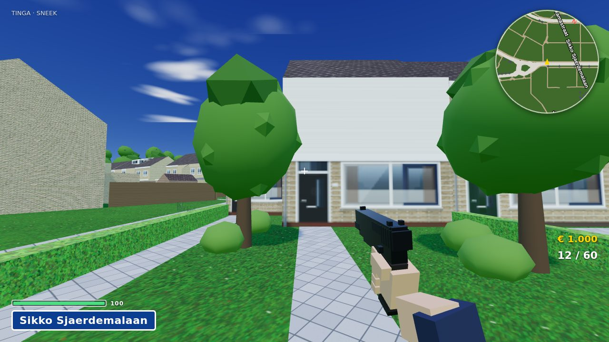 | [Street View](https://www.google.com/maps/@?api=1&map_action=pano&viewpoint=53.011028,5.613635&heading=326&pitch=5&fov=80) |
| Eegracht 10 | molenkrite | goot 7.4 m, nok 11.39 m, slanted | 2004 | 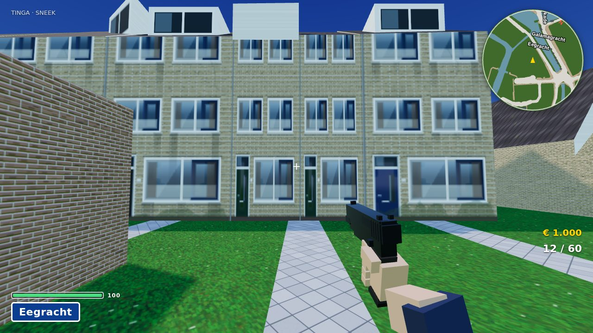 | [Street View](https://www.google.com/maps/@?api=1&map_action=pano&viewpoint=53.010125,5.622370&heading=217&pitch=5&fov=80) |
| Uilenburg 56 | spil | goot 2.8 m, nok 12.47 m, slanted | 1850 | 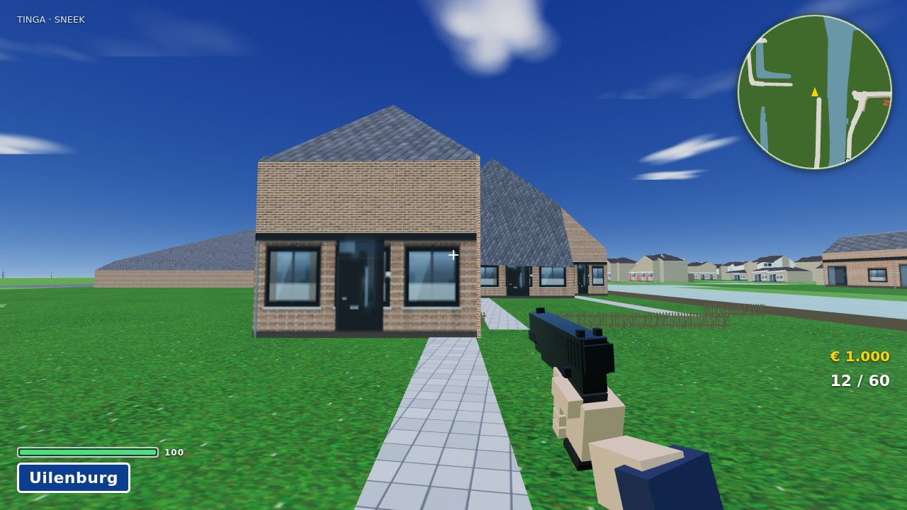 | [Street View](https://www.google.com/maps/@?api=1&map_action=pano&viewpoint=53.010294,5.618202&heading=261&pitch=5&fov=80) |
| Galamagracht 37 | molenkrite_bung | goot 2.64 m, nok 7.51 m, slanted | 1870 | 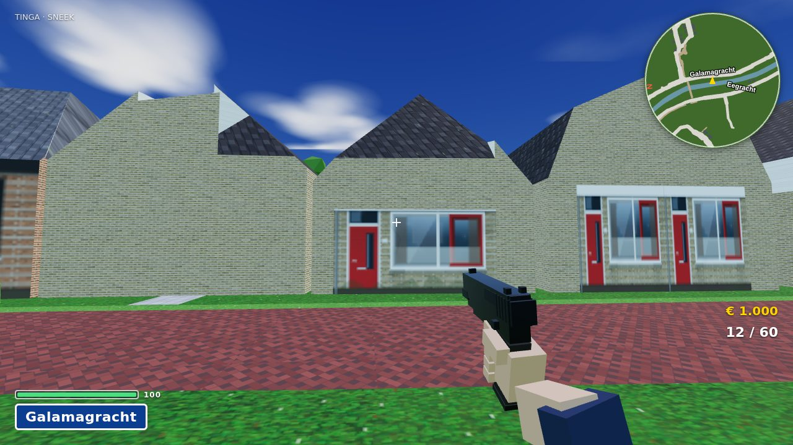 | [Street View](https://www.google.com/maps/@?api=1&map_action=pano&viewpoint=53.009372,5.623806&heading=96&pitch=5&fov=80) |
| Morrahemstraat 176 | molenkrite | goot 5.88 m, nok 9.12 m, slanted | 1965 | 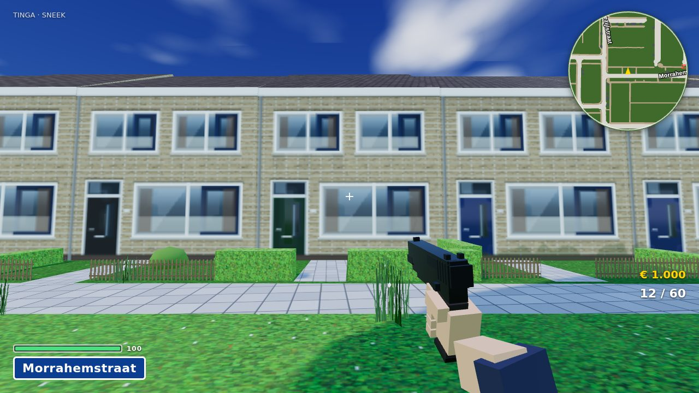 | [Street View](https://www.google.com/maps/@?api=1&map_action=pano&viewpoint=53.024077,5.650192&heading=275&pitch=5&fov=80) |
| Scherwolderhemstraat 76 | molenkrite | geschat (geen 3D BAG) | ? | 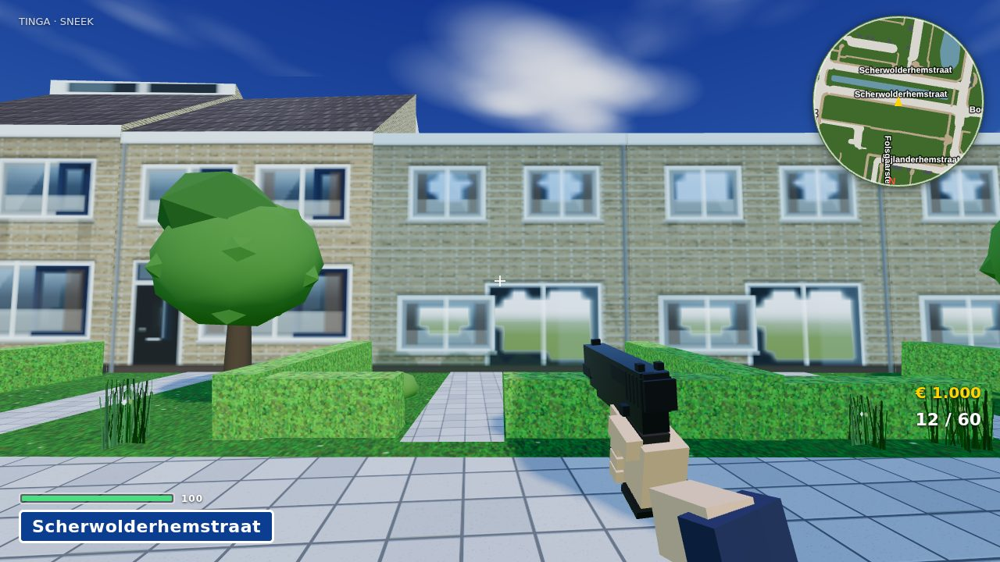 | [Street View](https://www.google.com/maps/@?api=1&map_action=pano&viewpoint=53.025621,5.649397&heading=5&pitch=5&fov=80) |
| Rijperahemstraat 44 | molenkrite | geschat (geen 3D BAG) | ? | 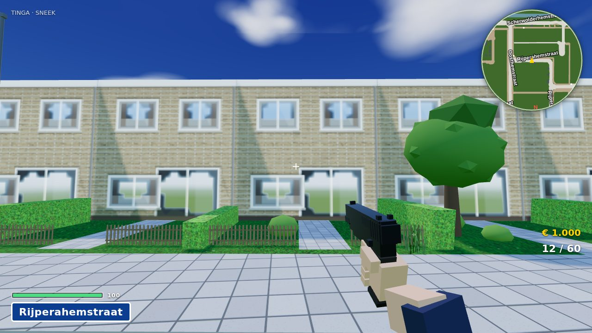 | [Street View](https://www.google.com/maps/@?api=1&map_action=pano&viewpoint=53.026019,5.652042&heading=185&pitch=5&fov=80) |
| Oosthemstraat 3 | molenkrite | geschat (geen 3D BAG) | ? | 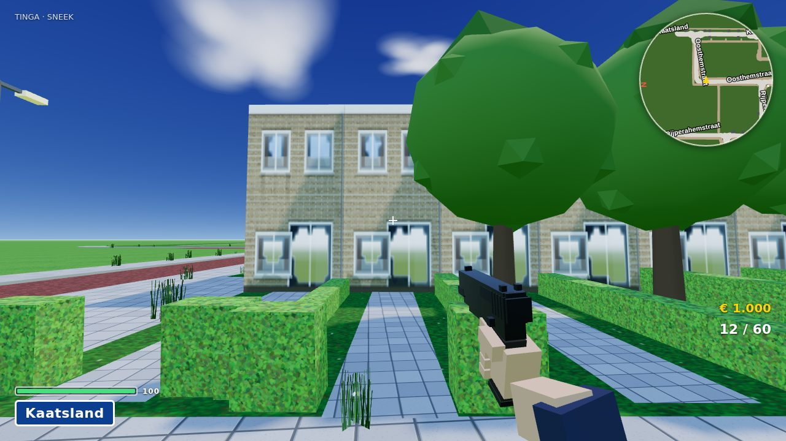 | [Street View](https://www.google.com/maps/@?api=1&map_action=pano&viewpoint=53.026594,5.652678&heading=95&pitch=5&fov=80) |
| Jonkvrouw 45 | jonkvrouw | goot 2.86 m, nok 9.09 m, slanted | 1999 | 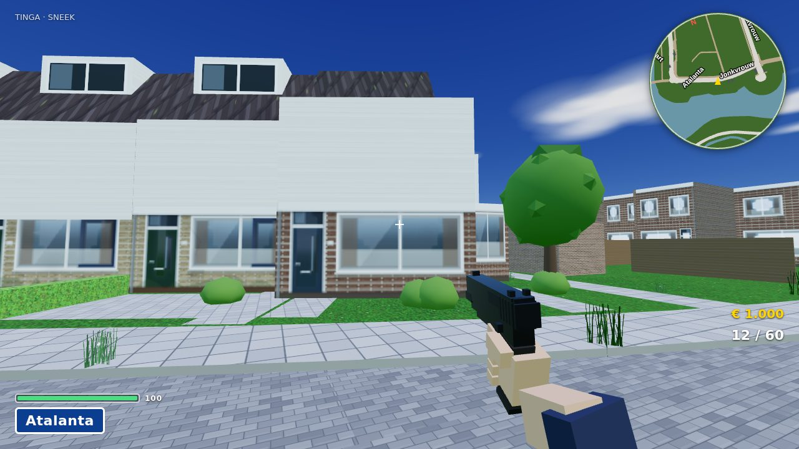 | [Street View](https://www.google.com/maps/@?api=1&map_action=pano&viewpoint=53.015156,5.664067&heading=22&pitch=5&fov=80) |
| Age Piersstraat 33 | agepiers | goot 5.7 m, nok 5.76 m, slanted | 1963 | 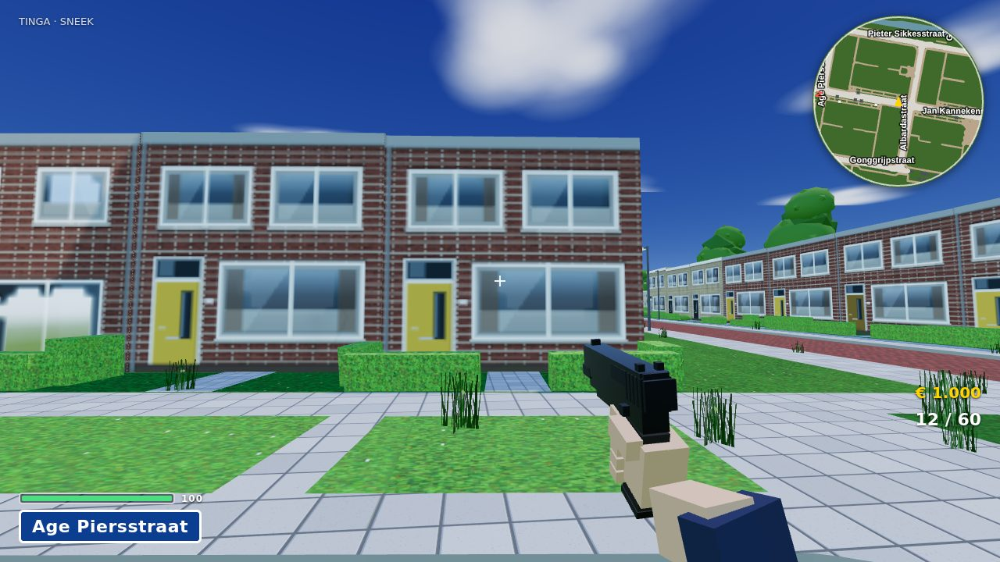 | [Street View](https://www.google.com/maps/@?api=1&map_action=pano&viewpoint=53.025584,5.658348&heading=95&pitch=5&fov=80) |
| De Dassenboarch 8 | dassenboarch | goot 3.96 m, nok 7.61 m, slanted | 1974 | 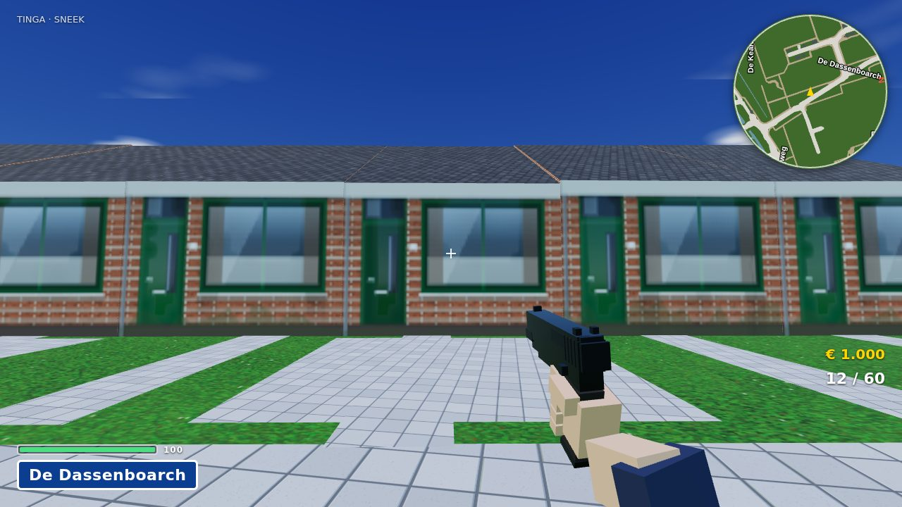 | [Street View](https://www.google.com/maps/@?api=1&map_action=pano&viewpoint=53.009678,5.626552&heading=261&pitch=5&fov=80) |
| Liaukemastraat 2-14 | appart | goot 11.48 m, nok 11.53 m, multiple horizontal | 1964 | 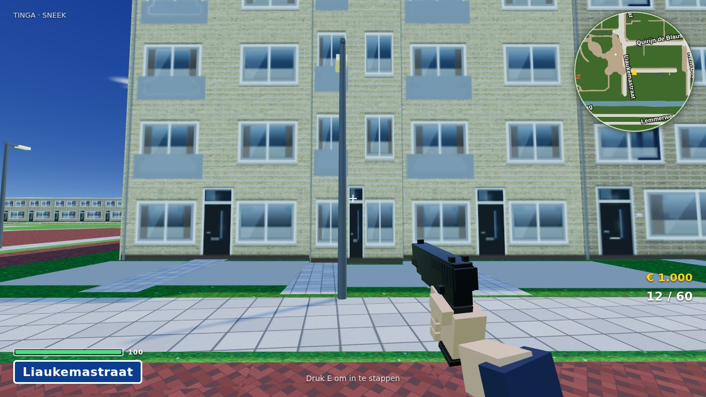 | [Street View](https://www.google.com/maps/@?api=1&map_action=pano&viewpoint=53.024679,5.656464&heading=95&pitch=5&fov=80) |
| Willem Santemastraat 30 | santema | goot 6.18 m, nok 6.26 m, horizontal | 2006 | 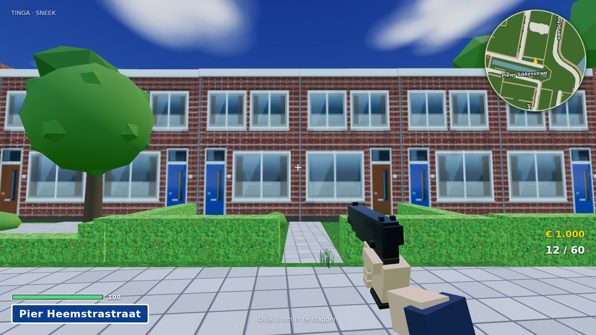 | [Street View](https://www.google.com/maps/@?api=1&map_action=pano&viewpoint=53.023217,5.659196&heading=95&pitch=5&fov=80) |
| Gajus Nautastraat 1 | jasker_flat | goot 5.93 m, nok 6.02 m, multiple horizontal | 1963 | 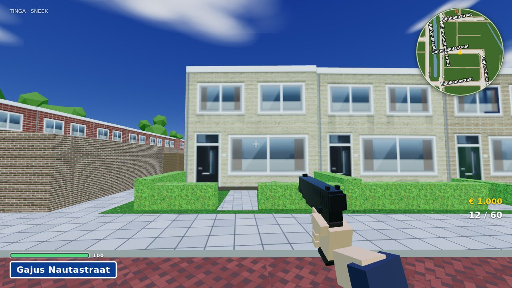 | [Street View](https://www.google.com/maps/@?api=1&map_action=pano&viewpoint=53.025158,5.660051&heading=5&pitch=5&fov=80) |
| Partuurstraat 98 | molenkrite_kap | goot 3.42 m, nok 8.35 m, slanted | 1971 | 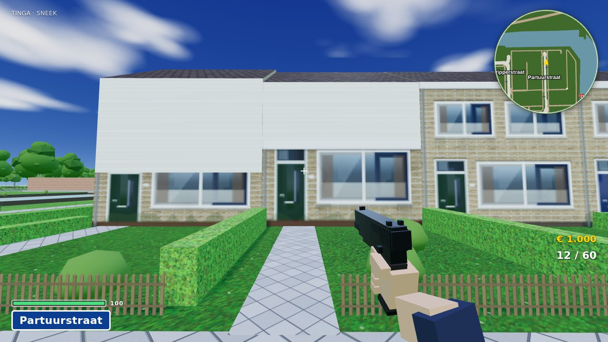 | [Street View](https://www.google.com/maps/@?api=1&map_action=pano&viewpoint=53.025171,5.643748&heading=314&pitch=5&fov=80) |
| Julianastraat 15 | jasker_flat | goot 3.38 m, nok 3.4 m, horizontal | 1965 | 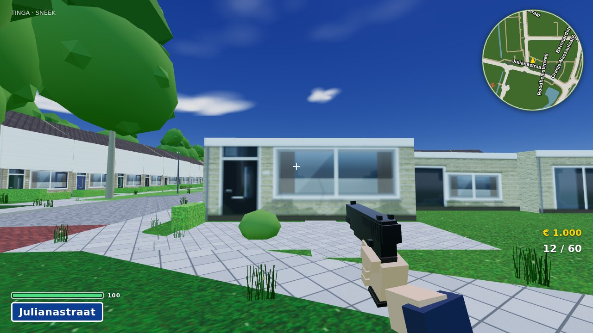 | [Street View](https://www.google.com/maps/@?api=1&map_action=pano&viewpoint=53.013832,5.617913&heading=122&pitch=5&fov=80) |
| Kaatsland 160 | kaatsland | goot 6.04 m, nok 9.21 m, slanted | 1965 | 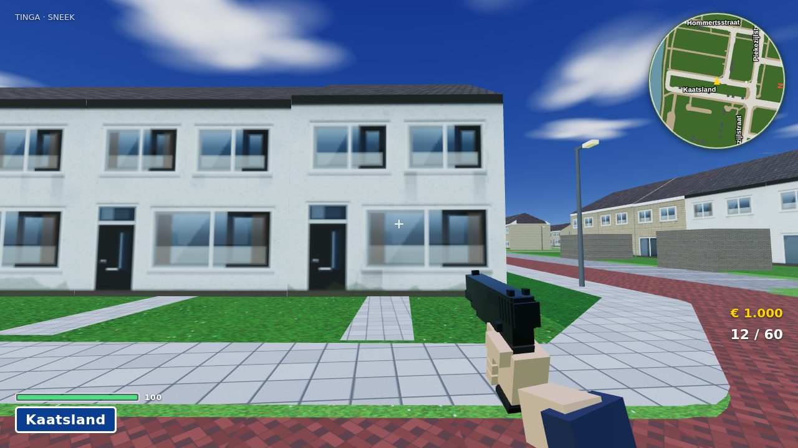 | [Street View](https://www.google.com/maps/@?api=1&map_action=pano&viewpoint=53.023250,5.652739&heading=275&pitch=5&fov=80) |
| Pripperstraat 58 | pripperstraat | goot 3.47 m, nok 8.32 m, slanted | 1971 | 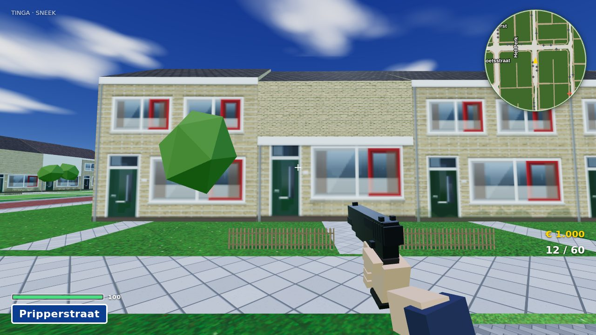 | [Street View](https://www.google.com/maps/@?api=1&map_action=pano&viewpoint=53.025452,5.645433&heading=314&pitch=5&fov=80) |
| Bockamastraat 48 | bockama | goot 3.24 m, nok 8.62 m, slanted | 1969 | 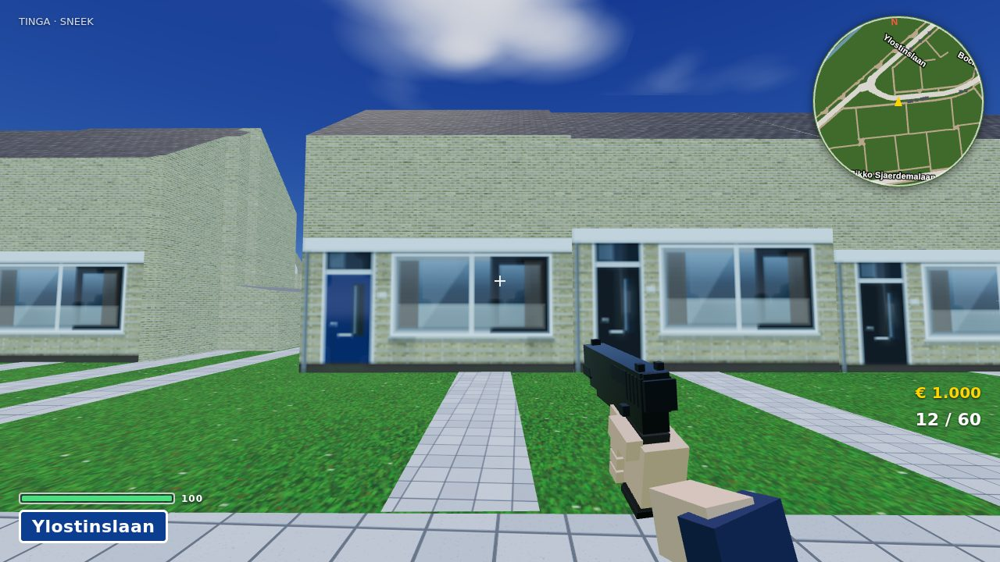 | [Street View](https://www.google.com/maps/@?api=1&map_action=pano&viewpoint=53.011391,5.612067&heading=177&pitch=5&fov=80) |
| Wilgeroosje 50 | wilgeroosje | goot 2.81 m, nok 8.68 m, slanted | 1988 | 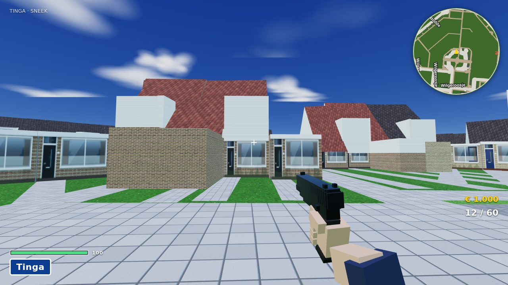 | [Street View](https://www.google.com/maps/@?api=1&map_action=pano&viewpoint=53.019360,5.660745&heading=272&pitch=5&fov=80) |
| Apollovlinder 41 | apollovlinder | goot 2.93 m, nok 9.66 m, slanted | 2003 | 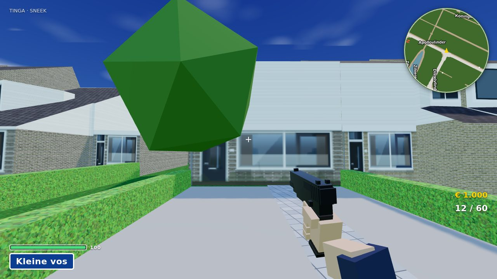 | [Street View](https://www.google.com/maps/@?api=1&map_action=pano&viewpoint=53.016436,5.660159&heading=103&pitch=5&fov=80) |
| Holtropweg 14 | spil | goot 2.37 m, nok 14.42 m, slanted | 1960 | 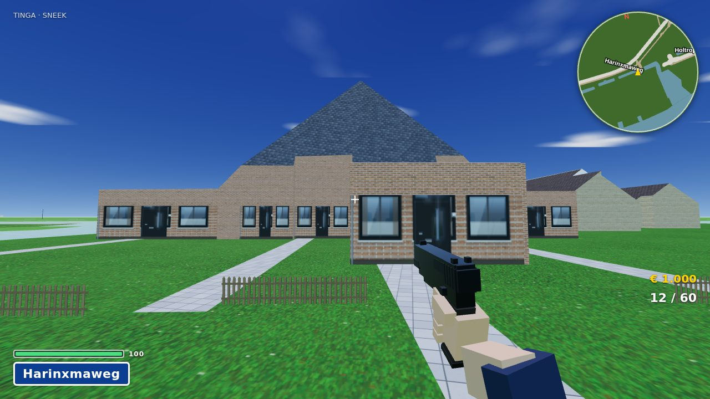 | [Street View](https://www.google.com/maps/@?api=1&map_action=pano&viewpoint=53.009948,5.612128&heading=168&pitch=5&fov=80) |
| Jutrijpstraat 20 | jutrijp | goot 5.66 m, nok 8.41 m, slanted | 1972 | 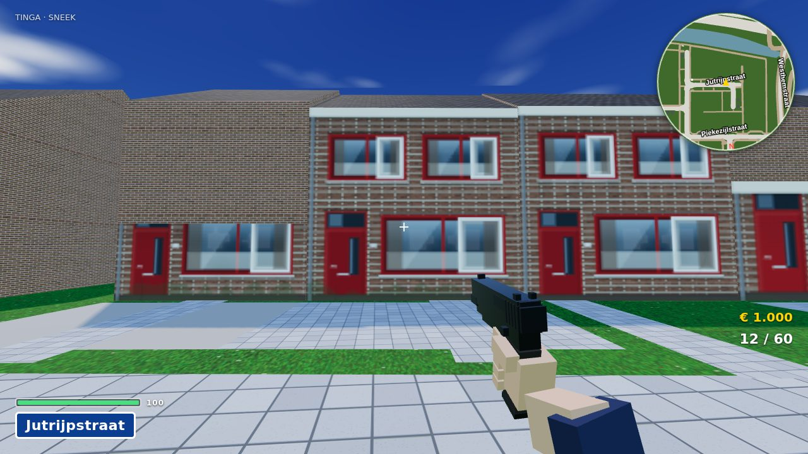 | [Street View](https://www.google.com/maps/@?api=1&map_action=pano&viewpoint=53.023262,5.649113&heading=185&pitch=5&fov=80) |
| Uilenburg 56 | spil | goot 2.8 m, nok 12.47 m, slanted | 1850 |  | [Street View](https://www.google.com/maps/@?api=1&map_action=pano&viewpoint=53.010294,5.618202&heading=261&pitch=5&fov=80) |
| Eegracht 28-29 | molenkrite_kap | goot 2.99 m, nok 11.77 m, slanted | 1898 | 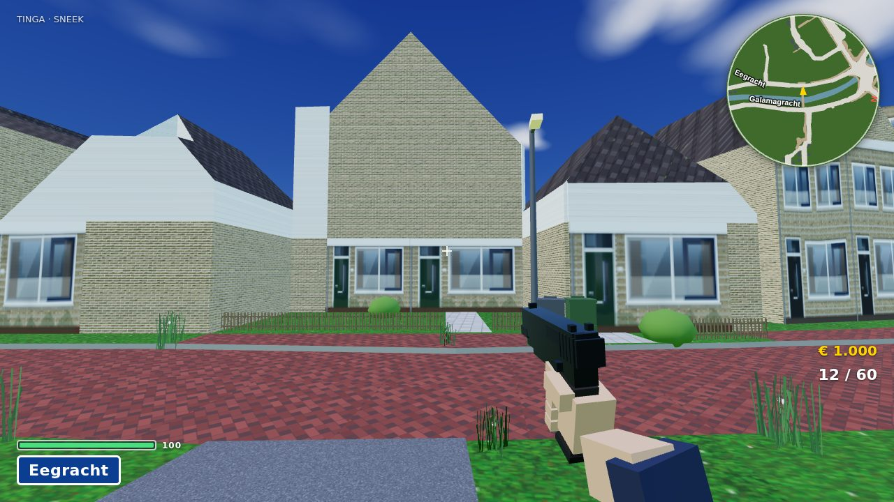 | [Street View](https://www.google.com/maps/@?api=1&map_action=pano&viewpoint=53.009620,5.623565&heading=263&pitch=5&fov=80) |
| Galamagracht 5 | molenkrite_kap | goot 2.68 m, nok 11.16 m, slanted | 1850 | 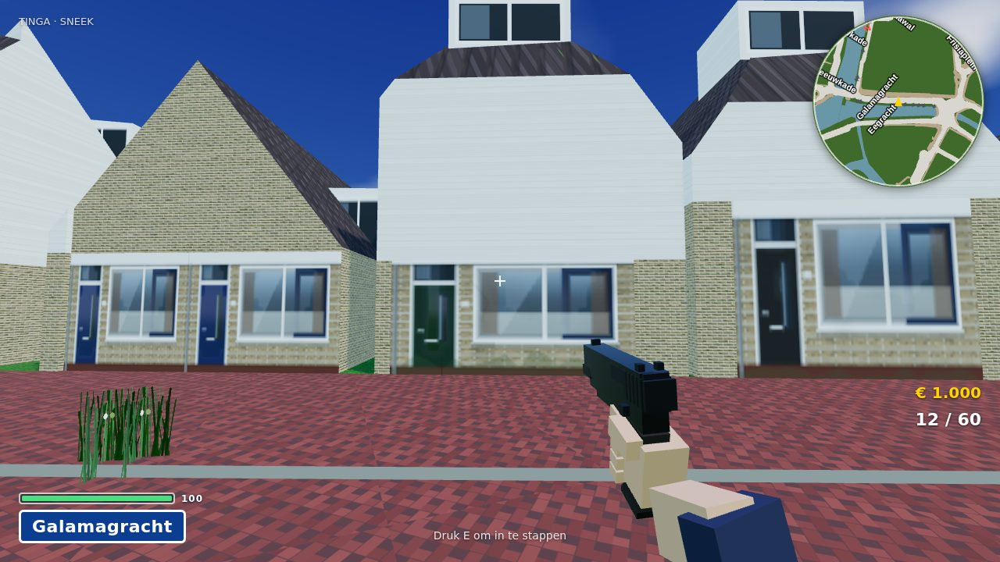 | [Street View](https://www.google.com/maps/@?api=1&map_action=pano&viewpoint=53.010422,5.622583&heading=23&pitch=5&fov=80) |
| Popmawal 2 | molenkrite_kap | goot 2.74 m, nok 8.87 m, slanted | 1900 | 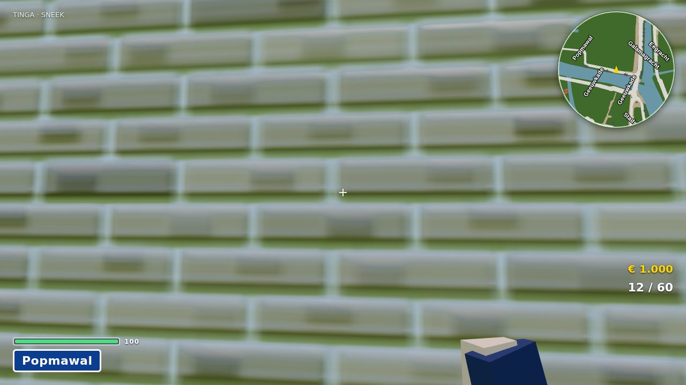 | [Street View](https://www.google.com/maps/@?api=1&map_action=pano&viewpoint=53.010820,5.622374&heading=113&pitch=5&fov=80) |
| Geeuwkade 17 | molenkrite_kap | goot 3.3 m, nok 10.43 m, slanted | 1933 | 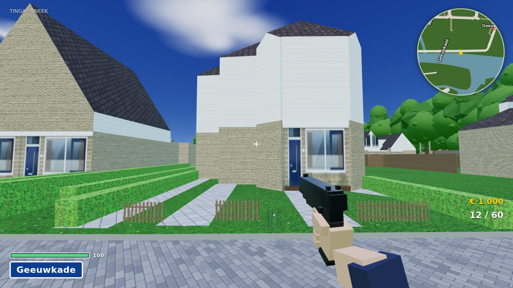 | [Street View](https://www.google.com/maps/@?api=1&map_action=pano&viewpoint=53.011896,5.623147&heading=305&pitch=5&fov=80) |
| Stadslaan 42 | molenkrite_kap | goot 3.02 m, nok 10.19 m, slanted | 1955 | 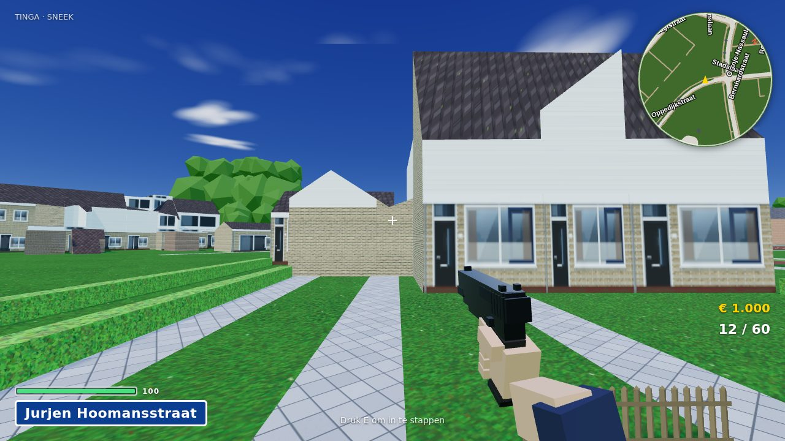 | [Street View](https://www.google.com/maps/@?api=1&map_action=pano&viewpoint=53.012888,5.617519&heading=308&pitch=5&fov=80) |
| Julianastraat 75 | spil | goot 6.42 m, nok 14.19 m, slanted | 1985 | 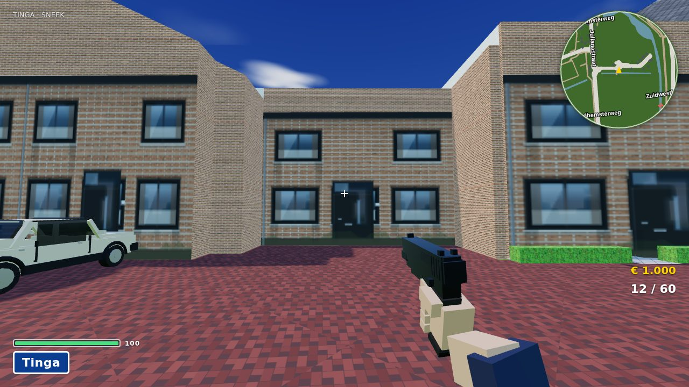 | [Street View](https://www.google.com/maps/@?api=1&map_action=pano&viewpoint=53.014417,5.617772&heading=229&pitch=5&fov=80) |
| Roodhemsterweg 7 | spil | goot 7.55 m, nok 7.95 m, slanted | 1991 | 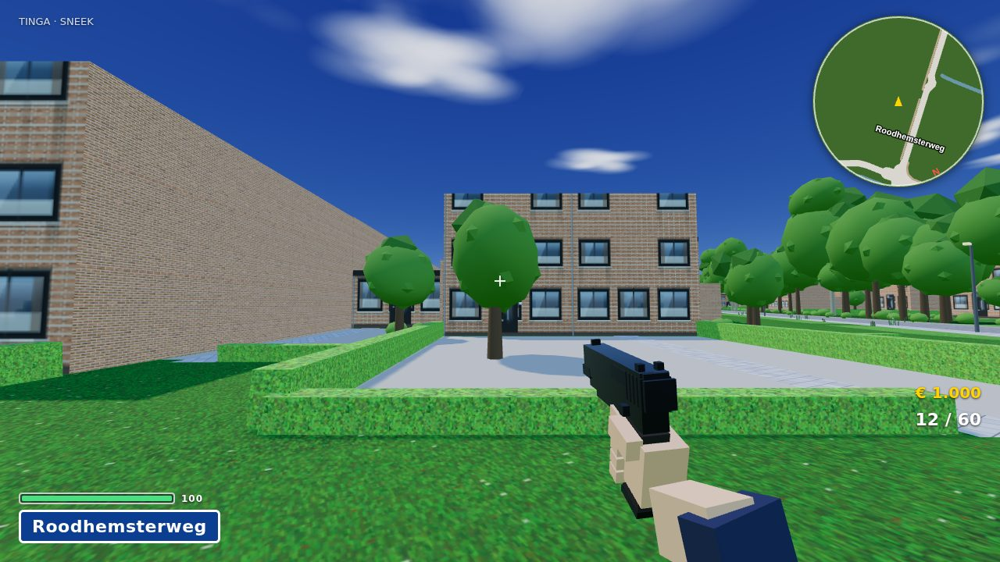 | [Street View](https://www.google.com/maps/@?api=1&map_action=pano&viewpoint=53.015303,5.620470&heading=208&pitch=5&fov=80) |
| De Finne 2 | spil | goot 3.64 m, nok 10.49 m, slanted | 2002 | 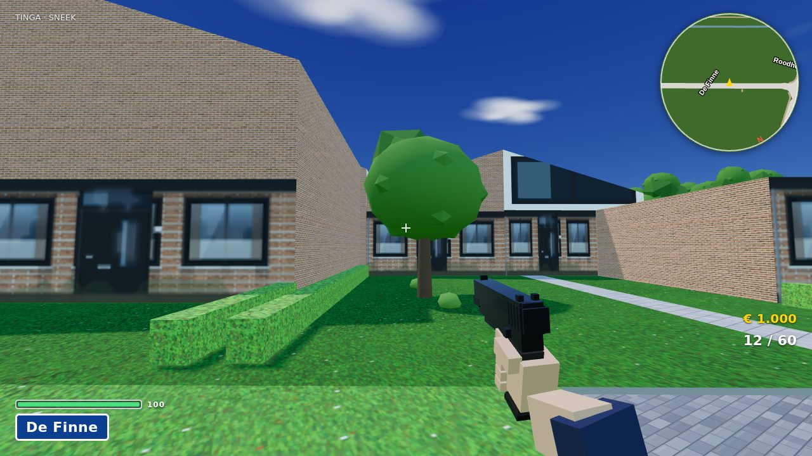 | [Street View](https://www.google.com/maps/@?api=1&map_action=pano&viewpoint=53.014339,5.620000&heading=208&pitch=5&fov=80) |
| Trompmoledyk 6-6A | spil | goot 7.06 m, nok 15.2 m, slanted | 1996 | 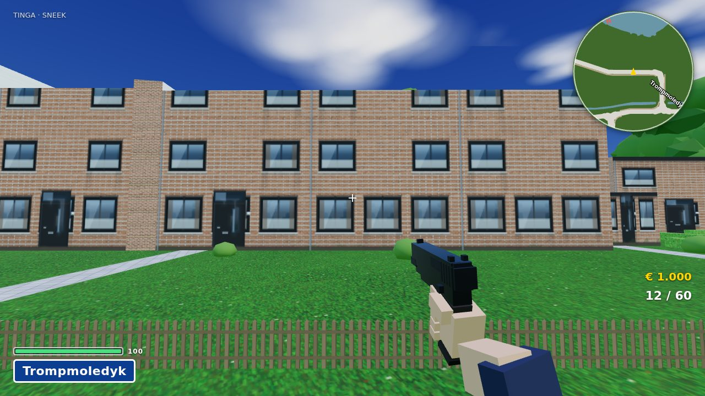 | [Street View](https://www.google.com/maps/@?api=1&map_action=pano&viewpoint=53.015572,5.623483&heading=26&pitch=5&fov=80) |
| Lemmerweg 130a | sudwester | goot 6.25 m, nok 12.32 m, slanted | 1980 | 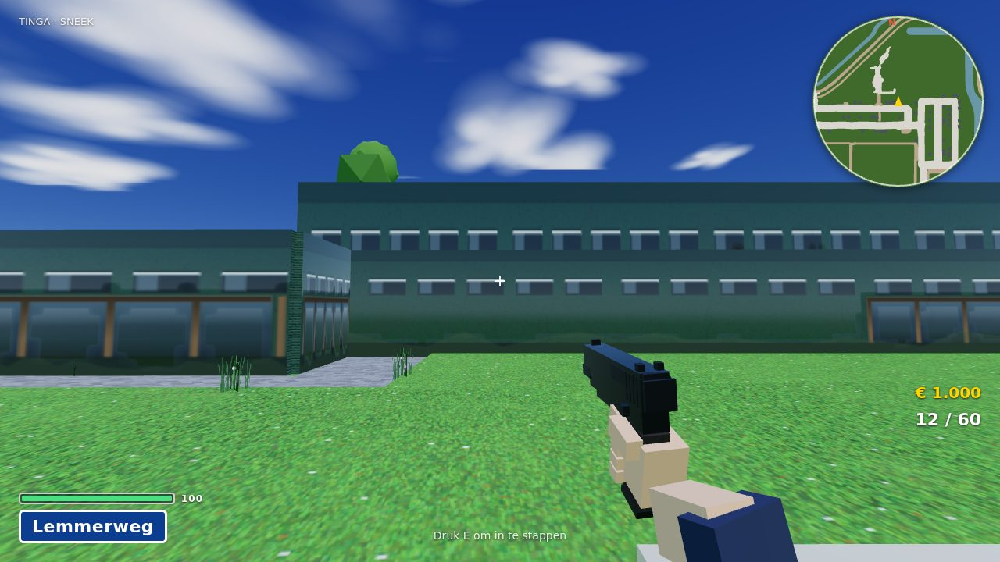 | [Street View](https://www.google.com/maps/@?api=1&map_action=pano&viewpoint=53.019321,5.653044&heading=5&pitch=5&fov=80) |
| Lemmerweg 130B | spil | geschat (geen 3D BAG) | ? | 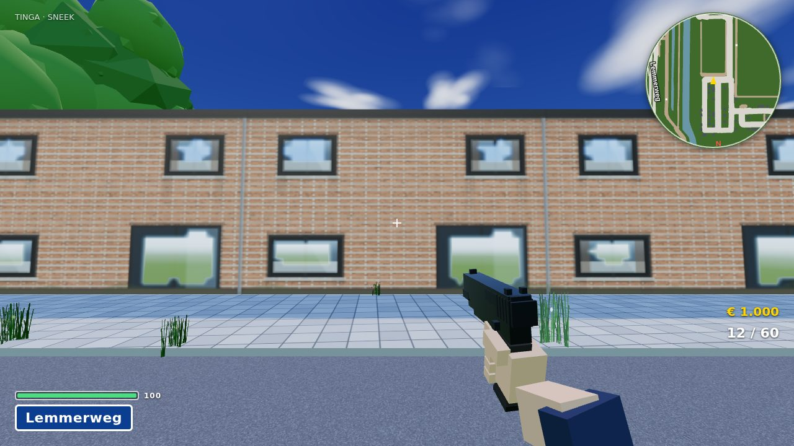 | [Street View](https://www.google.com/maps/@?api=1&map_action=pano&viewpoint=53.018757,5.653604&heading=185&pitch=5&fov=80) |
| Lemmerweg 84 | spil | goot -0.12 m, nok 13.86 m, slanted | 1858 | 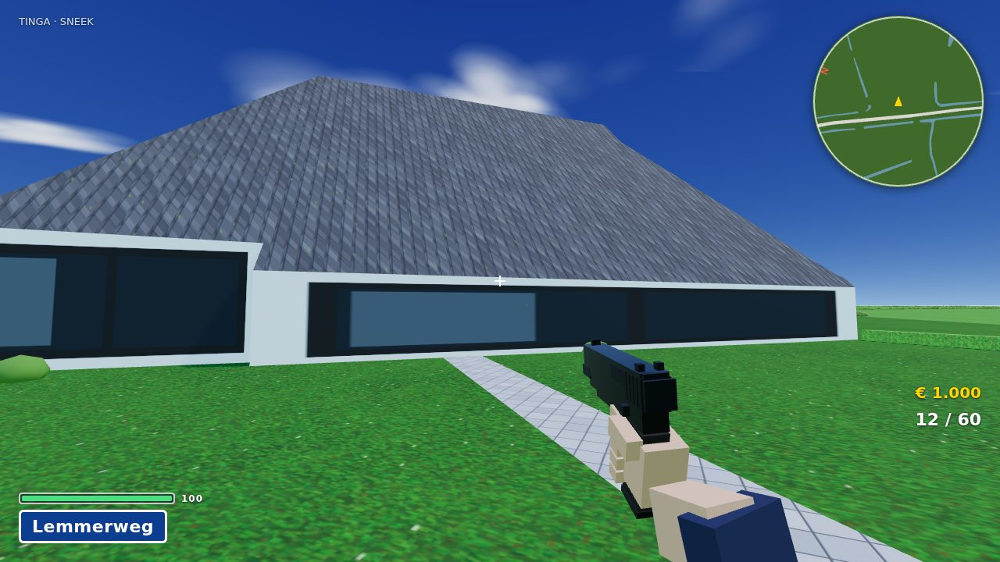 | [Street View](https://www.google.com/maps/@?api=1&map_action=pano&viewpoint=53.009223,5.658401&heading=68&pitch=5&fov=80) |
| Lemmerweg 51 | spil | geschat (geen 3D BAG) | ? | 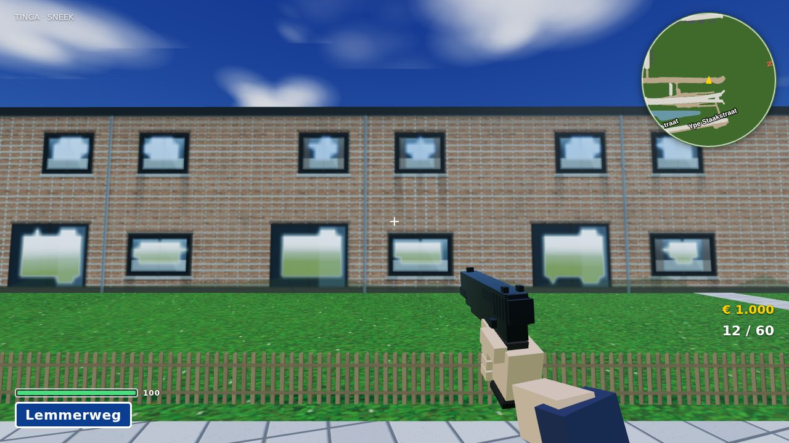 | [Street View](https://www.google.com/maps/@?api=1&map_action=pano&viewpoint=53.026690,5.655793&heading=285&pitch=5&fov=80) |
| Quirijn de Blaustraat 50-50B | spil | goot 3.23 m, nok 25.92 m, slanted | 2012 | 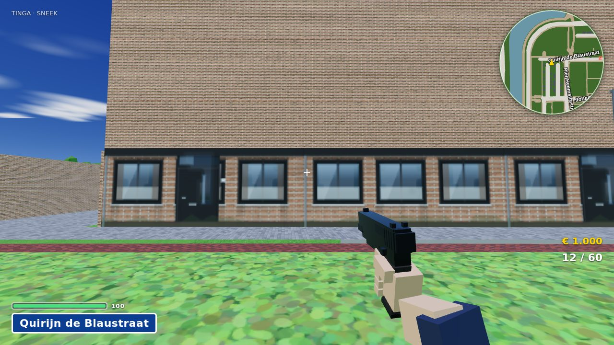 | [Street View](https://www.google.com/maps/@?api=1&map_action=pano&viewpoint=53.023023,5.656854&heading=275&pitch=5&fov=80) |
| Potterzijlstraat 11 | spil | goot 3.9 m, nok 8.88 m, multiple horizontal | 1968 | 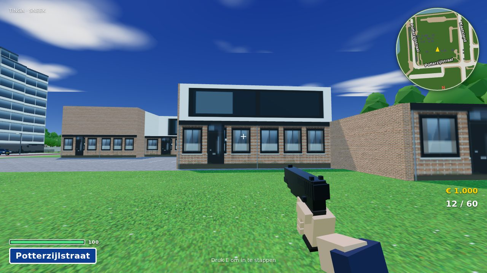 | [Street View](https://www.google.com/maps/@?api=1&map_action=pano&viewpoint=53.023299,5.653724&heading=189&pitch=5&fov=80) |

## Ronde 2: adressen zonder foto

| adres | type nu | 3D BAG | bouwjaar | spel | foto | vraag |
|---|---|---|---|---|---|---|
| Molenkrite 73 | molenkrite | goot 5.67 m, nok 9.38 m, slanted | 1980 | 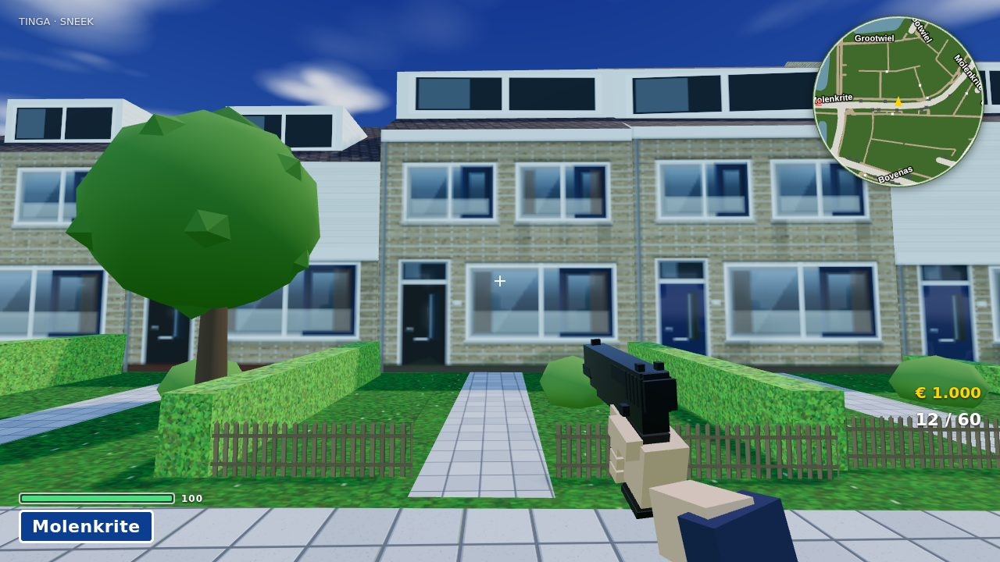 | [Street View](https://www.google.com/maps/@?api=1&map_action=pano&viewpoint=53.019847,5.643450&heading=91&pitch=5&fov=80) | het tweelaagse deel van de Molenkrite: steen, kozijnen, deuren, dakkapel of dakraam |
| Kruirad 30 | kruirad | goot 5.62 m, nok 8.79 m, slanted | 1974 | 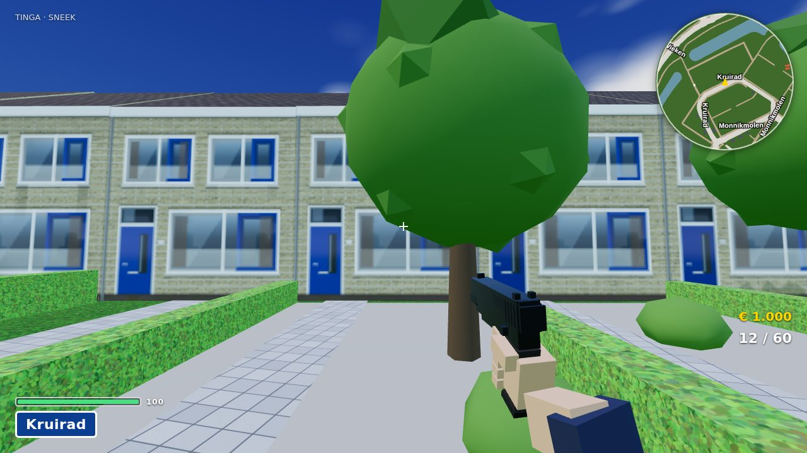 | [Street View](https://www.google.com/maps/@?api=1&map_action=pano&viewpoint=53.021395,5.642377&heading=257&pitch=5&fov=80) | rood of blauw? hier ligt in het spel de grens tussen de twee rijen |
| Binnenroede 24 | bovenas_bung | goot 3.47 m, nok 6.82 m, slanted | 1975 |  | [Street View](https://www.google.com/maps/@?api=1&map_action=pano&viewpoint=53.021811,5.644500&heading=137&pitch=5&fov=80) | hetzelfde als de Monnikmolen (rood met luifel) of anders? |
| Spinnekop 9 | spinnekop | goot 5.76 m, nok 9.35 m, slanted | 1981 | 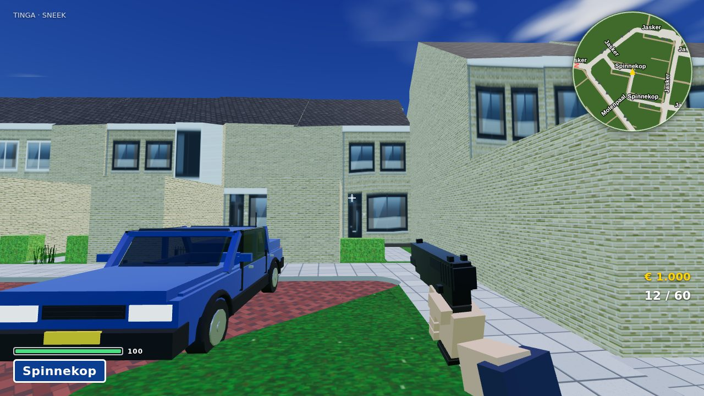 | [Street View](https://www.google.com/maps/@?api=1&map_action=pano&viewpoint=53.020687,5.645940&heading=96&pitch=5&fov=80) | nu getekend als Molenpaal-type: klopt de steen en de kozijnkleur? |
| Jasker 101 | jasker_flat | goot 5.67 m, nok 5.71 m, horizontal | 1978 | 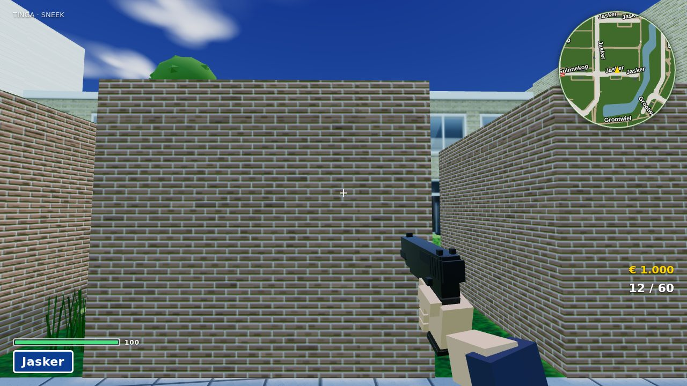 | [Street View](https://www.google.com/maps/@?api=1&map_action=pano&viewpoint=53.019989,5.645366&heading=95&pitch=5&fov=80) | de platte daken aan de Jasker: kleur steen, kozijnen, dakrand |
| Grootwiel 7 | grootwiel | goot 2.54 m, nok 8.68 m, slanted | 1980 | 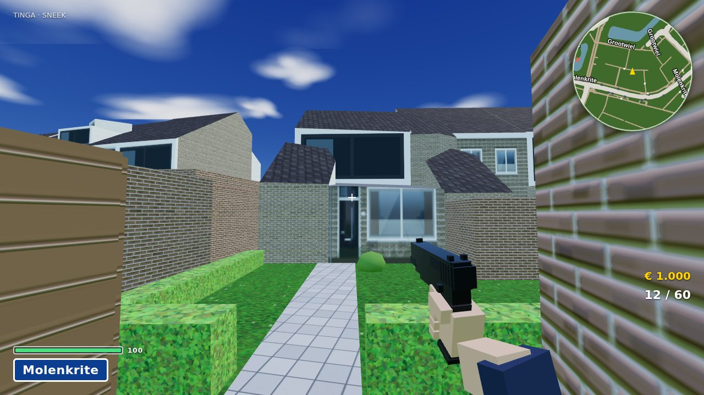 | [Street View](https://www.google.com/maps/@?api=1&map_action=pano&viewpoint=53.019827,5.643860&heading=78&pitch=5&fov=80) | nu bruine steen met donkergroene kozijnen: klopt dat? |
| Omloop 45 | jasker_flat | goot 5.65 m, nok 5.67 m, horizontal | 1979 | 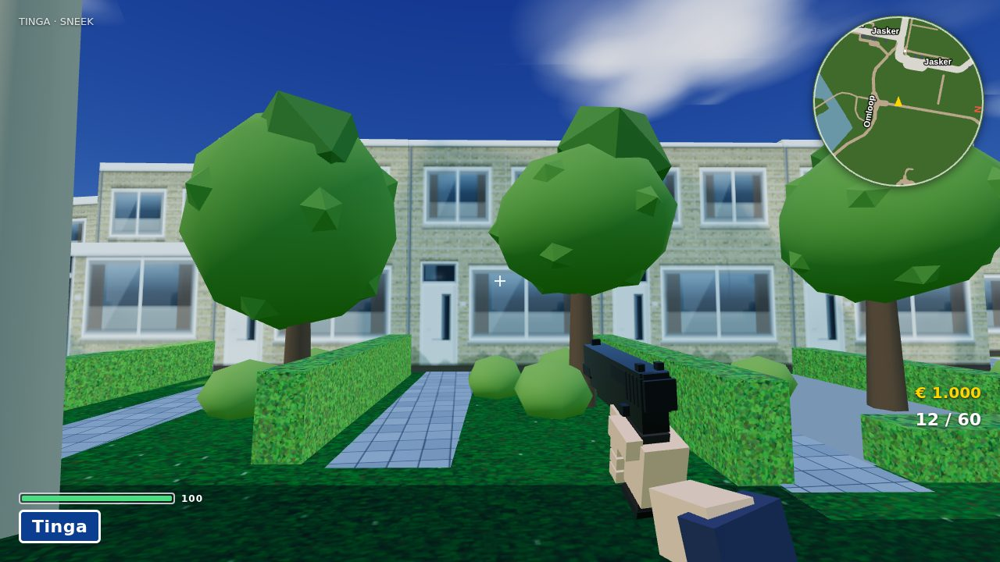 | [Street View](https://www.google.com/maps/@?api=1&map_action=pano&viewpoint=53.020204,5.647309&heading=276&pitch=5&fov=80) | zelfde type als Grootwiel gekozen; klopt dat? |
| Buitenroede 66 | tinga_blauw | goot 5.7 m, nok 8.84 m, slanted | 1974 |  | [Street View](https://www.google.com/maps/@?api=1&map_action=pano&viewpoint=53.022571,5.645917&heading=118&pitch=5&fov=80) | nu gele steen met felblauwe kozijnen: klopt dat? |
| de Hekken 5 | hekken | goot 2.51 m, nok 7.34 m, slanted | 1978 |  | [Street View](https://www.google.com/maps/@?api=1&map_action=pano&viewpoint=53.018472,5.644651&heading=212&pitch=5&fov=80) | zelfde type als Bonkelaar gekozen (roodbruin, witte topgevel); klopt dat? |
| Eekmolen 21 | eekmolen | goot 2.8 m, nok 8.23 m, slanted | 1979 |  | [Street View](https://www.google.com/maps/@?api=1&map_action=pano&viewpoint=53.018908,5.648554&heading=275&pitch=5&fov=80) | geen enkele aanname nog: steen, kozijnen, deuren, dak |
| Zeskanter 8 | eekmolen | goot 2.8 m, nok 9.28 m, slanted | 1976 |  | [Street View](https://www.google.com/maps/@?api=1&map_action=pano&viewpoint=53.017486,5.648216&heading=277&pitch=5&fov=80) | geen enkele aanname nog: steen, kozijnen, deuren, dak |

## Omgeving: groen, water, parkeren, stoepen, voortuinen

Camerapunt op de dichtstbijzijnde rijbaan, kijkend naar de plek (bij een
straatprofiel: langs de straat).

| plek | soort | waar op te letten | spel | foto |
|---|---|---|---|---|
| Straatprofiel Molenkrite | profiel | stoep, berm met bomen, parkeren langs de rijbaan, kleur van de klinkers en tegels, lantaarnpalen |  | [Street View](https://www.google.com/maps/@?api=1&map_action=pano&viewpoint=53.021076,5.644089&heading=227&pitch=5&fov=80) |
| Straatprofiel de Wieken | profiel | rode klinkers? stoep aan één of twee kanten, bomen, parkeervakken | 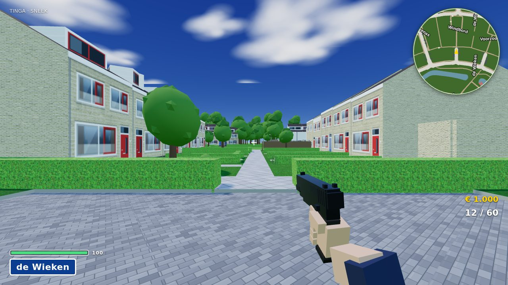 | [Street View](https://www.google.com/maps/@?api=1&map_action=pano&viewpoint=53.020482,5.641855&heading=217&pitch=5&fov=80) |
| Straatprofiel Jasker | profiel | stoep, berm, parkeren, straatbomen | 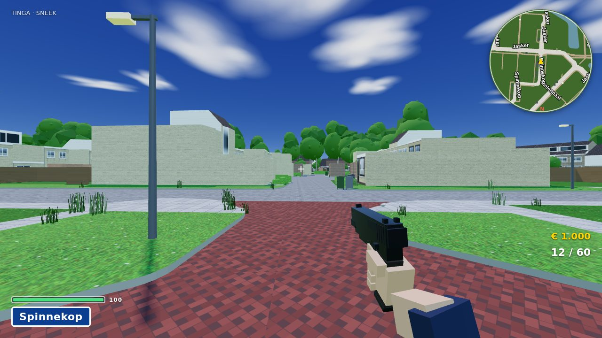 | [Street View](https://www.google.com/maps/@?api=1&map_action=pano&viewpoint=53.020378,5.645329&heading=182&pitch=5&fov=80) |
| Parkeerhof Kruirad | parkeren | haaks parkeren? belijning, bestrating, hagen of muurtjes rond het hof, bergingen | 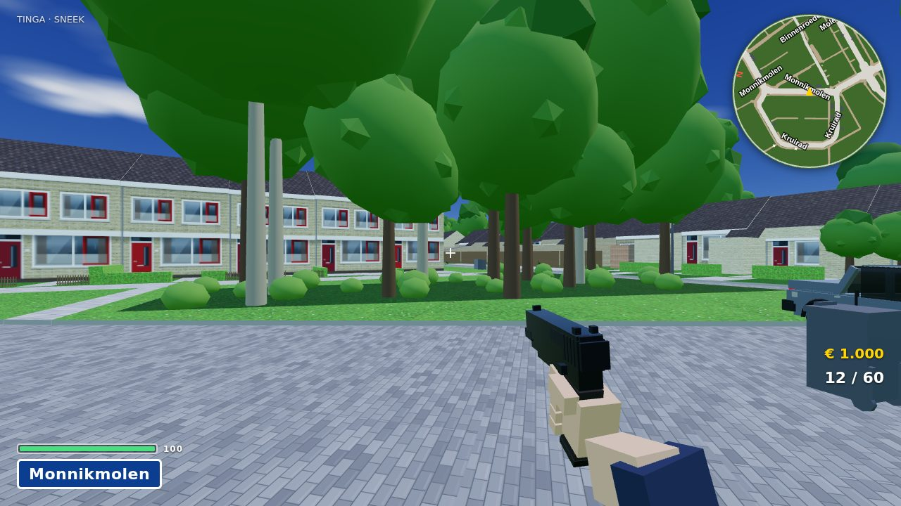 | [Street View](https://www.google.com/maps/@?api=1&map_action=pano&viewpoint=53.021403,5.643294&heading=76&pitch=5&fov=80) |
| Parkeerplaats Tinga State | parkeren | groot parkeerterrein: bestrating, belijning, bomen of hagen ertussen, verlichting |  | [Street View](https://www.google.com/maps/@?api=1&map_action=pano&viewpoint=53.021508,5.647678&heading=235&pitch=5&fov=80) |
| Parkeervak Buitenroede | parkeren | parkeervakken langs de doorgaande weg: haaks of langs, bestrating |  | [Street View](https://www.google.com/maps/@?api=1&map_action=pano&viewpoint=53.022060,5.646544&heading=185&pitch=5&fov=80) |
| Parkje de Wieken met vijver | groen | gemaaid gras of ruig, boomsoorten (populieren?), oever van de vijver, paden, bankjes | 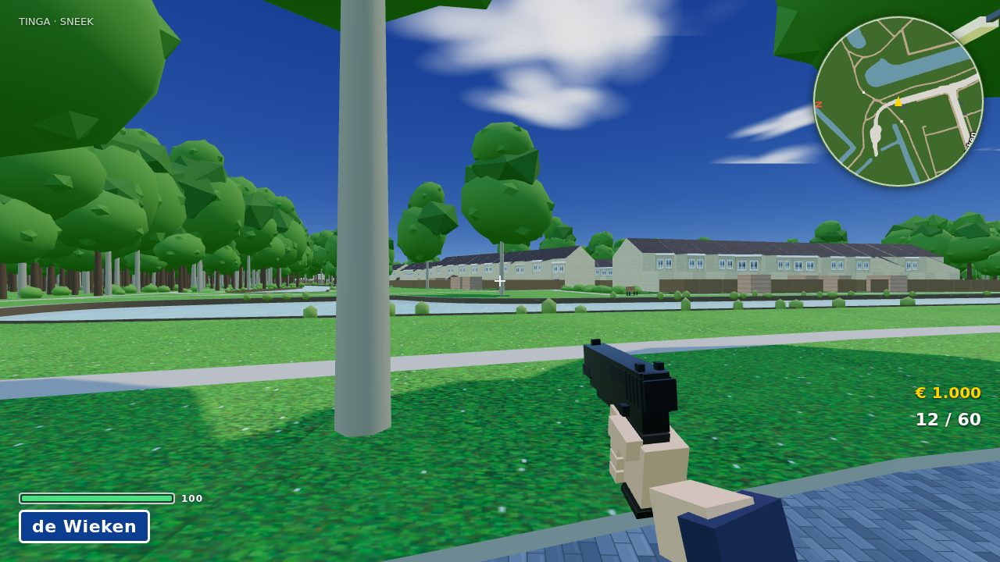 | [Street View](https://www.google.com/maps/@?api=1&map_action=pano&viewpoint=53.021789,5.641124&heading=88&pitch=5&fov=80) |
| Bosje aan de Buitenroede | groen | dicht bos of losse bomen, ondergroei, pad erdoor | 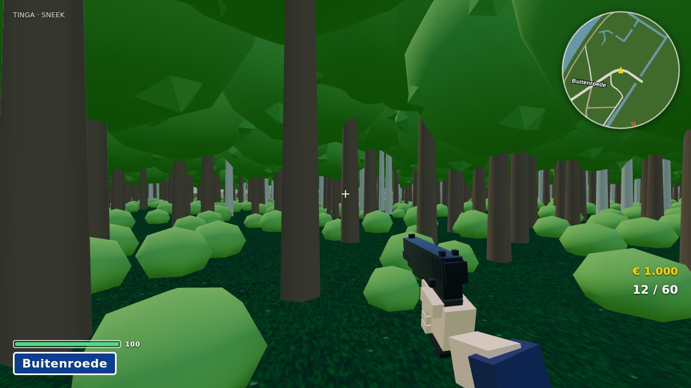 | [Street View](https://www.google.com/maps/@?api=1&map_action=pano&viewpoint=53.023048,5.642672&heading=193&pitch=5&fov=80) |
| Bosje bij de Wieken | groen | boomsoorten, ondergroei, hoe dicht | 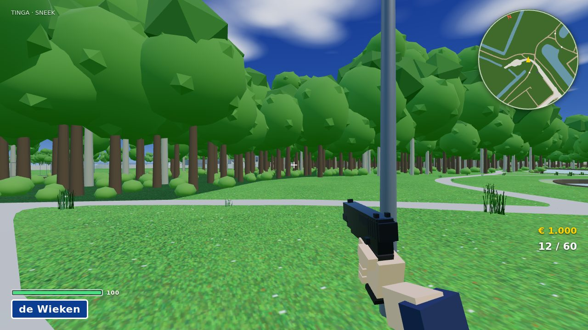 | [Street View](https://www.google.com/maps/@?api=1&map_action=pano&viewpoint=53.021967,5.640975&heading=24&pitch=5&fov=80) |
| Vijver tussen Molenkrite en Jasker | groen | oever (riet, gras, beschoeiing), bomen erlangs, pad, bankjes | 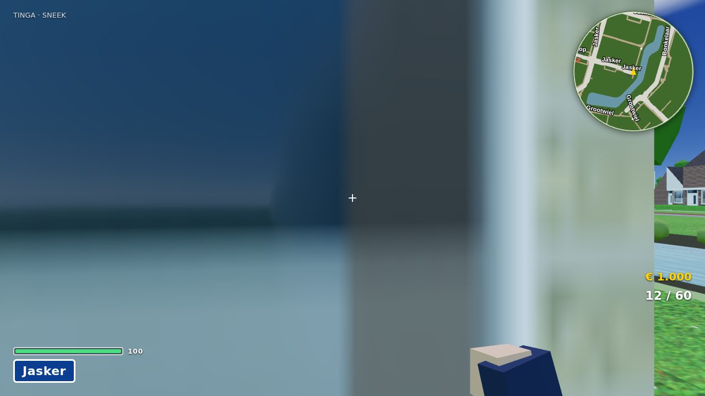 | [Street View](https://www.google.com/maps/@?api=1&map_action=pano&viewpoint=53.019732,5.645246&heading=101&pitch=5&fov=80) |
| Sloot noord van de Monnikmolen | groen | breedte van de sloot, oever, bomenrij, hekwerk | 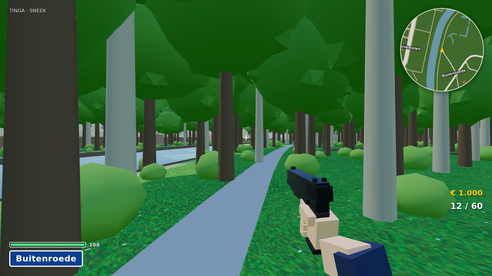 | [Street View](https://www.google.com/maps/@?api=1&map_action=pano&viewpoint=53.022664,5.643259&heading=215&pitch=5&fov=80) |
| Groen oostzijde bij Tinga State | groen | bosplantsoen of parkgras, bomen, paden | 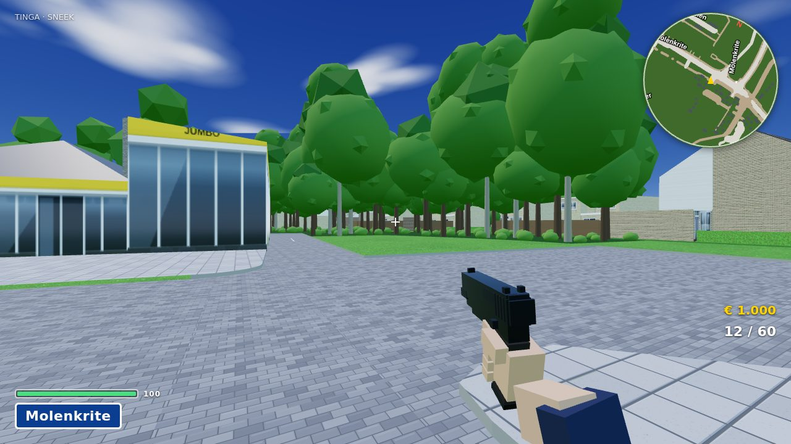 | [Street View](https://www.google.com/maps/@?api=1&map_action=pano&viewpoint=53.021552,5.647209&heading=207&pitch=5&fov=80) |
| Heestervak de Wieken zuid | groen | wat voor struiken staan in zo'n heestervak, hoe hoog | 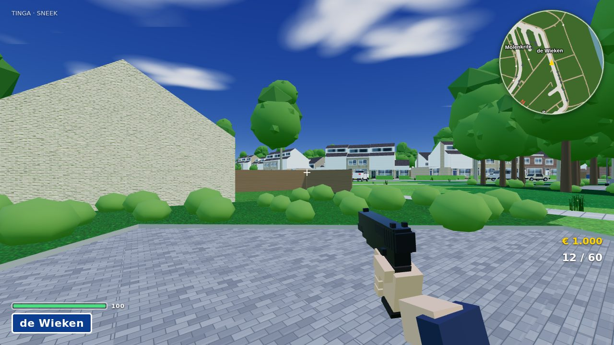 | [Street View](https://www.google.com/maps/@?api=1&map_action=pano&viewpoint=53.019138,5.643004&heading=36&pitch=5&fov=80) |
| Voortuinen Kruirad hofkant | voortuin | hekjes, hagen, tegels of grind, schuttingen tussen de tuinen | 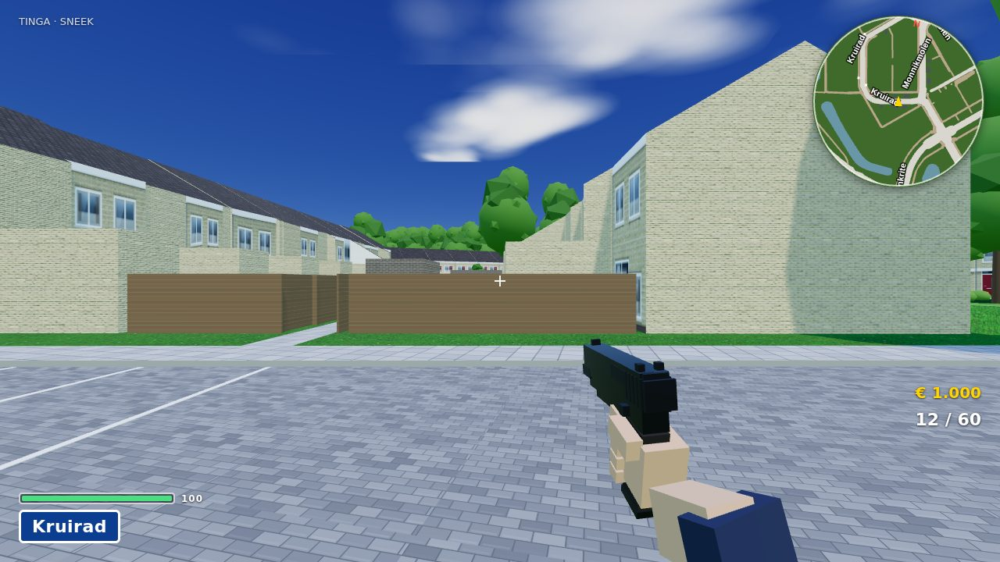 | [Street View](https://www.google.com/maps/@?api=1&map_action=pano&viewpoint=53.021100,5.643060&heading=347&pitch=5&fov=80) |
| Voortuinen de Wieken | voortuin | gras met pad, hagen, hekjes, hoe diep is de voortuin | 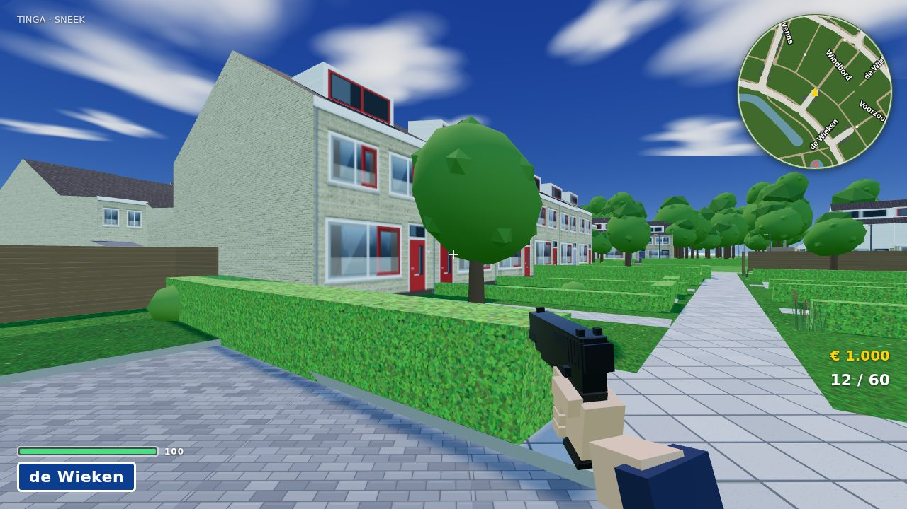 | [Street View](https://www.google.com/maps/@?api=1&map_action=pano&viewpoint=53.020454,5.641819&heading=180&pitch=5&fov=80) |
| Straatprofiel Duizendblad | profiel | nieuwbouwstraat: breedte, stoep, parkeervakken, berm, lantaarns — is dit hetzelfde profiel als Tinga of anders? | 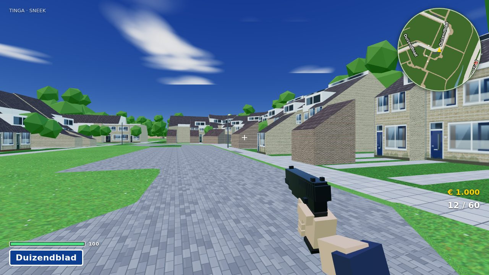 | [Street View](https://www.google.com/maps/@?api=1&map_action=pano&viewpoint=53.021383,5.657735&heading=290&pitch=5&fov=80) |
| Straatprofiel Ylostinslaan | profiel | IJlst: straatprofiel, bestrating, bomen, parkeren | 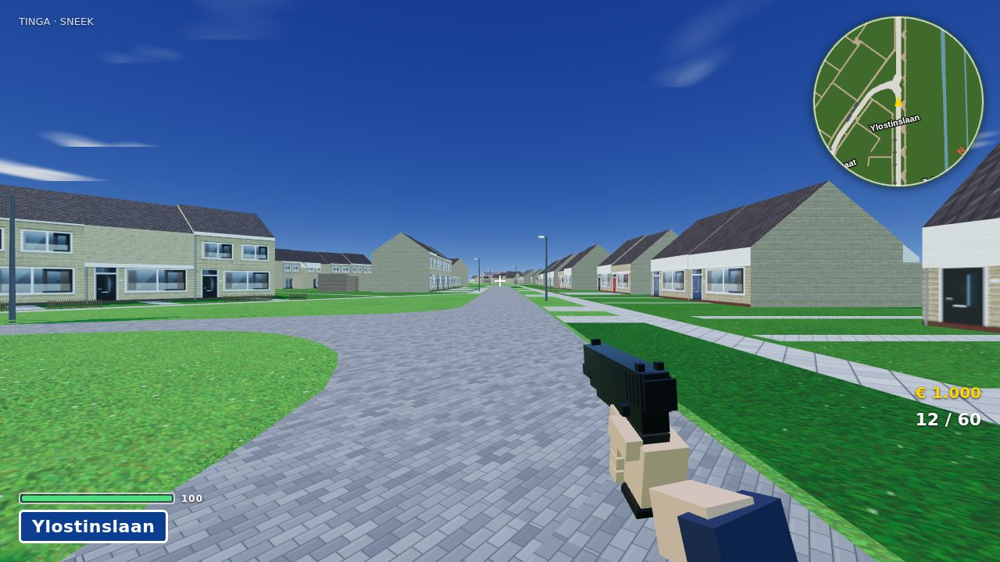 | [Street View](https://www.google.com/maps/@?api=1&map_action=pano&viewpoint=53.011653,5.611821&heading=232&pitch=5&fov=80) |
| Kade van de Eegracht | kade | kademuur, bolders, bomenrij, hoe dicht het water aan de straat ligt | 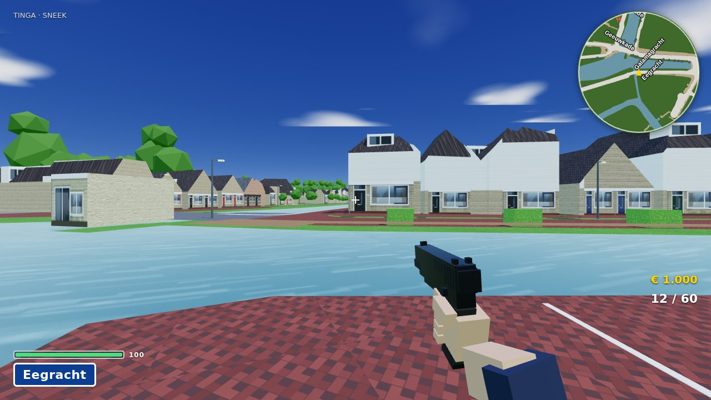 | [Street View](https://www.google.com/maps/@?api=1&map_action=pano&viewpoint=53.010371,5.622016&heading=21&pitch=5&fov=80) |
| Fietstunnel onder de oprit | tunnel | beton: gestort of met bekisting, verlichting in de tunnel, en staat er graffiti op? | 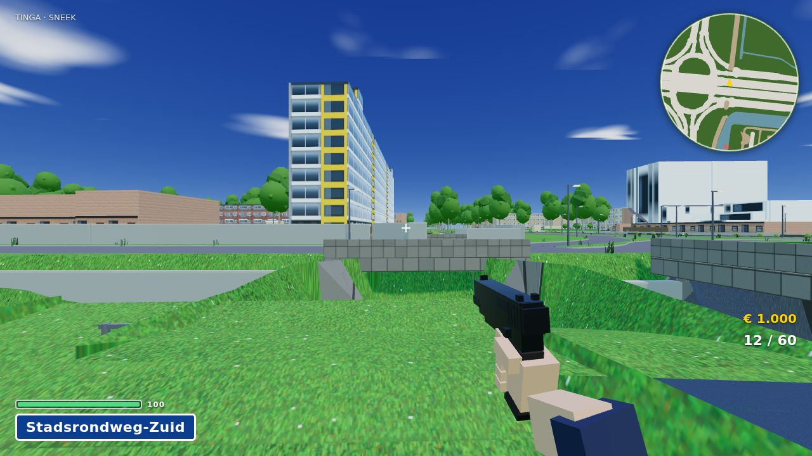 | [Street View](https://www.google.com/maps/@?api=1&map_action=pano&viewpoint=53.022193,5.654782&heading=3&pitch=5&fov=80) |
| Stoepranden en kliko's Monnikmolen | rommel | waar staan de rolcontainers (in de berm, op de stoep, aan de weg?), hoeveel onkruid staat er langs de band, en hoe vies zijn de plinten van de gevels? | 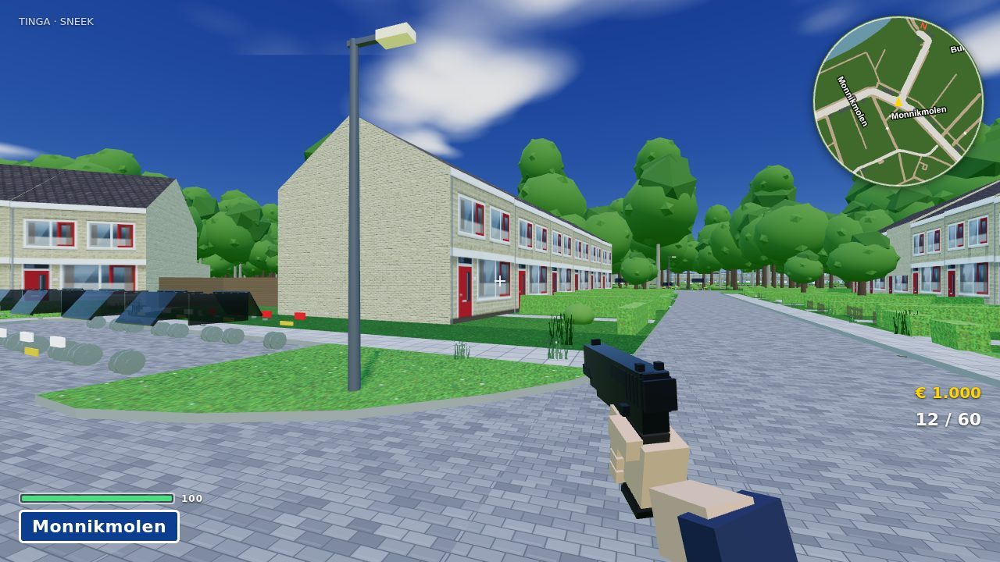 | [Street View](https://www.google.com/maps/@?api=1&map_action=pano&viewpoint=53.022473,5.644766&heading=342&pitch=5&fov=80) |
| Tankstation BP Slump Oil | tankstation | de luifel: kleur, hoogte, hoeveel pompen eronder, en hoe de shop en de wasstraat erbij staan | 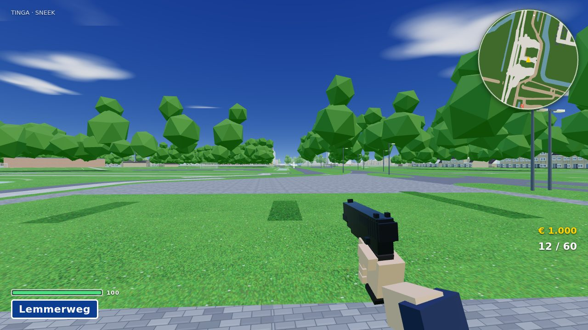 | [Street View](https://www.google.com/maps/@?api=1&map_action=pano&viewpoint=53.019608,5.654477&heading=7&pitch=5&fov=80) |
| Tennispark Molenkrite | sport | kleur van de banen, hoogte en kleur van de hekken, vangnetten, en wat er langs de banen staat | 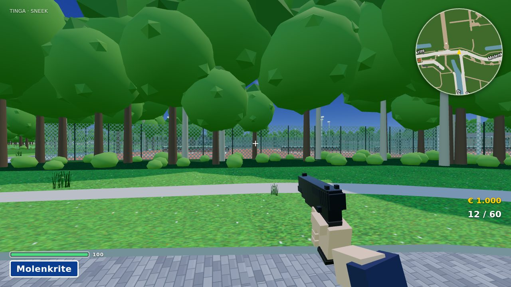 | [Street View](https://www.google.com/maps/@?api=1&map_action=pano&viewpoint=53.019474,5.650241&heading=102&pitch=5&fov=80) |
| Sportpark VV Sneek Wit Zwart | sport | lichtmasten, reclameborden langs het veld, dug-outs en de tribune: kleuren en maten | 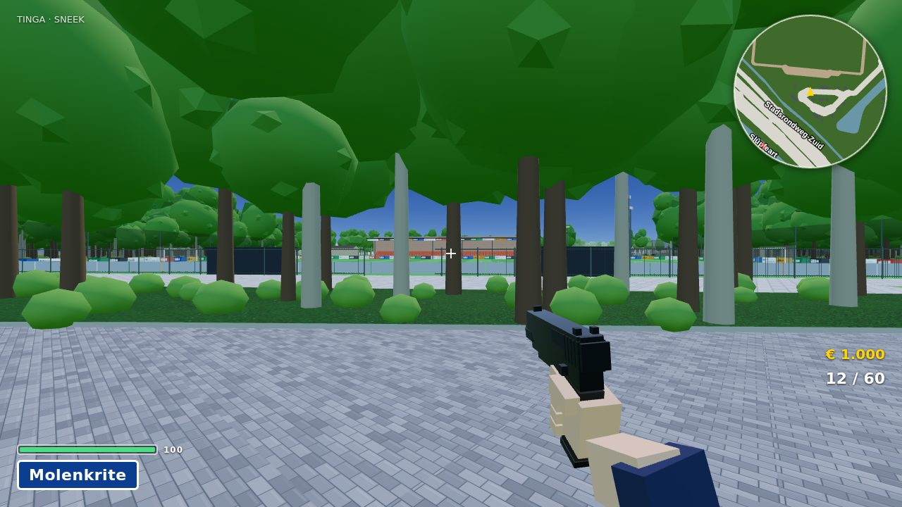 | [Street View](https://www.google.com/maps/@?api=1&map_action=pano&viewpoint=53.021886,5.651425&heading=139&pitch=5&fov=80) |
| Volkstuinen achter de Wieken | tuin | de schuurtjes en kassen: kleur, maat, en hoe de paden en de scheidingen ertussen lopen | 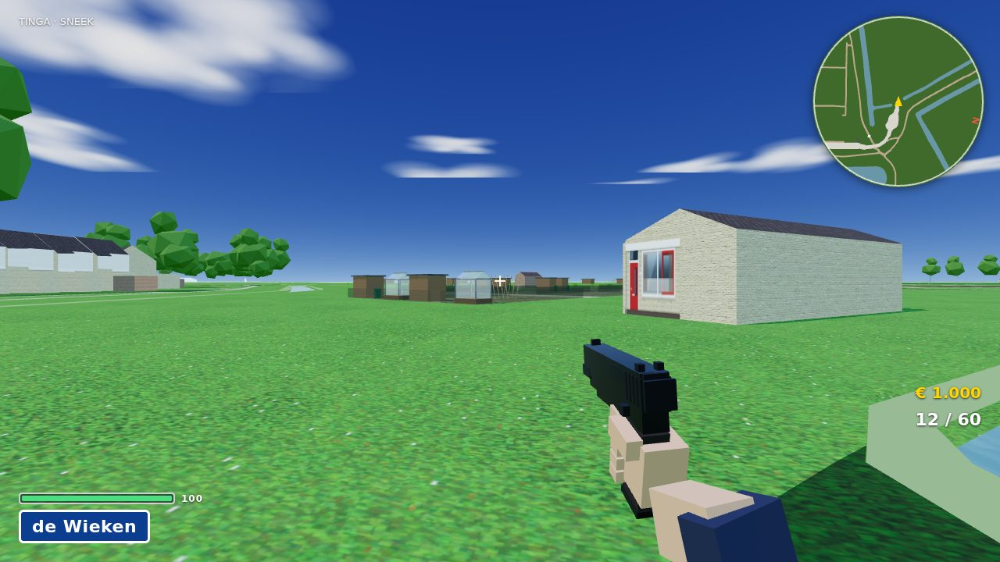 | [Street View](https://www.google.com/maps/@?api=1&map_action=pano&viewpoint=53.022000,5.640379&heading=256&pitch=5&fov=80) |
| Houtzaagmolen De Rat | molen | de wieken en de stelling: kleur van het hekwerk, de riet- of houtbekleding van de romp, en de loodsen ernaast | 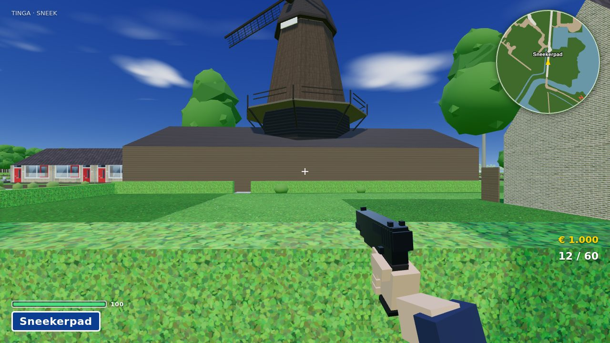 | [Street View](https://www.google.com/maps/@?api=1&map_action=pano&viewpoint=53.012651,5.627170&heading=317&pitch=5&fov=80) |
| Sportpark IJlst | sport | hier ligt 7700 m² kunstgras in de kaart, maar er staat nog níets op: geen doelen, geen belijning, geen ballenvangers, geen clubgebouw. Hoeveel velden zijn het, waar staan de lichtmasten en de dug-outs, hangen er reclameborden, en hoe ziet het clubhuis en het hek eruit? | 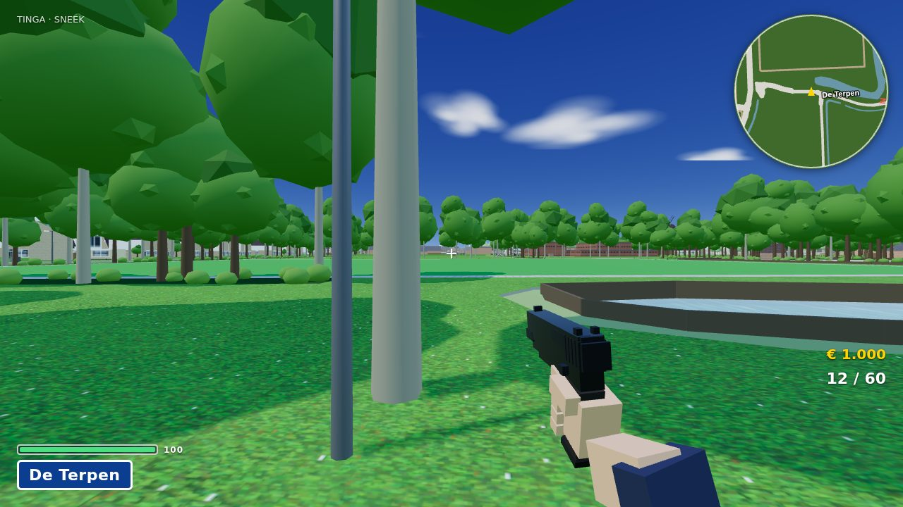 | [Street View](https://www.google.com/maps/@?api=1&map_action=pano&viewpoint=53.011819,5.630478&heading=263&pitch=5&fov=80) |
| Bedrijventerrein IJlst | terrein | de hallen samen: kleuren van de damwand, hoogte en soort hekwerk, opslag in de open lucht, bedrijfsborden en wat voor lantaarnpalen er staan | 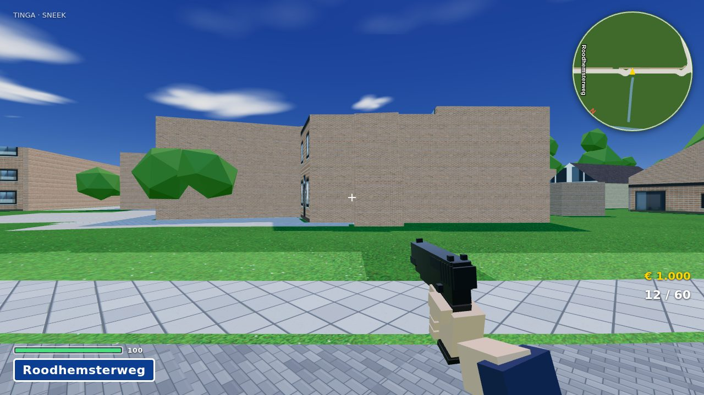 | [Street View](https://www.google.com/maps/@?api=1&map_action=pano&viewpoint=53.015226,5.619859&heading=135&pitch=5&fov=80) |
| De grote hal aan de Sneekerpad-kant | gebouw | 6100 m² onder één dak uit 1960, nok 17 m, en zonder adres in de kaart — het grootste gebouw van IJlst. Wat is dit, en hoe ziet het eruit? | 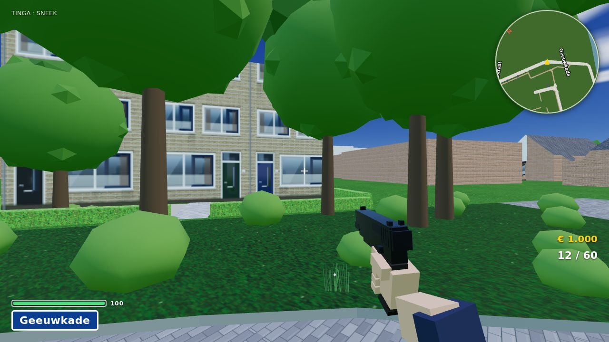 | [Street View](https://www.google.com/maps/@?api=1&map_action=pano&viewpoint=53.012744,5.622974&heading=51&pitch=5&fov=80) |
| De Eegracht | profiel | het grachtprofiel: kademuur of houten beschoeiing, bomen, ligplaatsen, bruggetjes naar de voordeuren, en welke verharding de rijbaan en de stoep hebben | 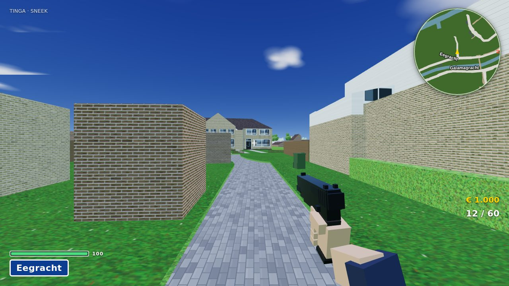 | [Street View](https://www.google.com/maps/@?api=1&map_action=pano&viewpoint=53.009246,5.623337&heading=270&pitch=5&fov=80) |
| De Galamagracht | profiel | zelfde vraag als de Eegracht, maar dan aan de andere kant: hoe breed is het water, waar staan de bomen, en hoe zien de bruggetjes en de kade eruit? | 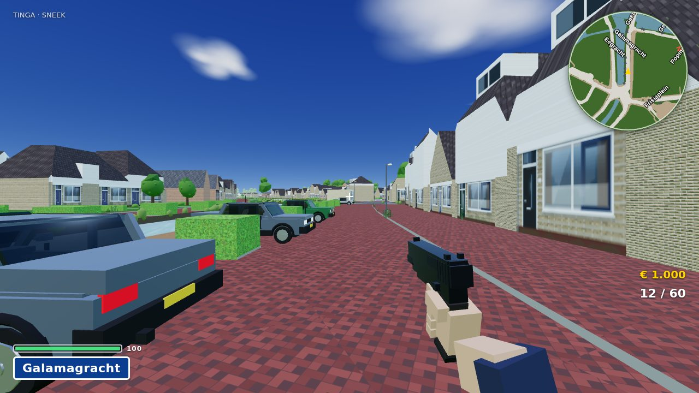 | [Street View](https://www.google.com/maps/@?api=1&map_action=pano&viewpoint=53.010369,5.622831&heading=294&pitch=5&fov=80) |
| De Lemmerweg bij het tankstation | profiel | het wegprofiel: hoeveel rijstroken, vrijliggend fietspad of niet, middenberm, bomenrij, lantaarns, geleiderail en bebording | 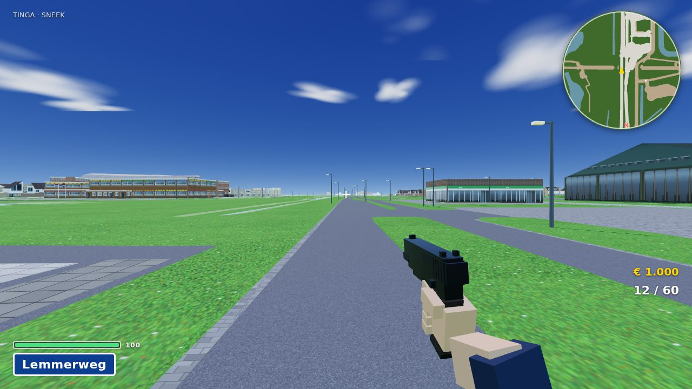 | [Street View](https://www.google.com/maps/@?api=1&map_action=pano&viewpoint=53.020024,5.654940&heading=185&pitch=5&fov=80) |
| De brug in de Lemmerweg | brug | de brug over het water: leuningen (kleur en model), of er een apart fietspad overheen loopt, en of het een vaste brug of een beweegbare is | 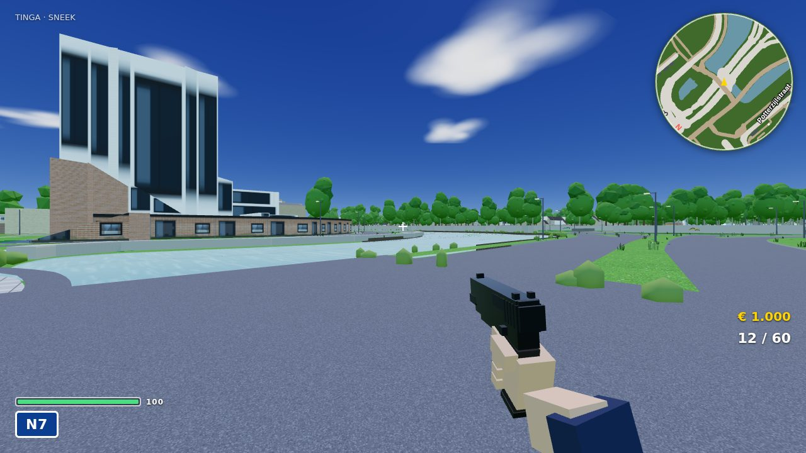 | [Street View](https://www.google.com/maps/@?api=1&map_action=pano&viewpoint=53.023256,5.655373&heading=135&pitch=5&fov=80) |
| De kop van de Geeuw bij IJlst | water | de kade waar de sloep ligt: steigers, bolders, afmeerpalen, hoe de oever eruitziet en wat er langs de kant staat | 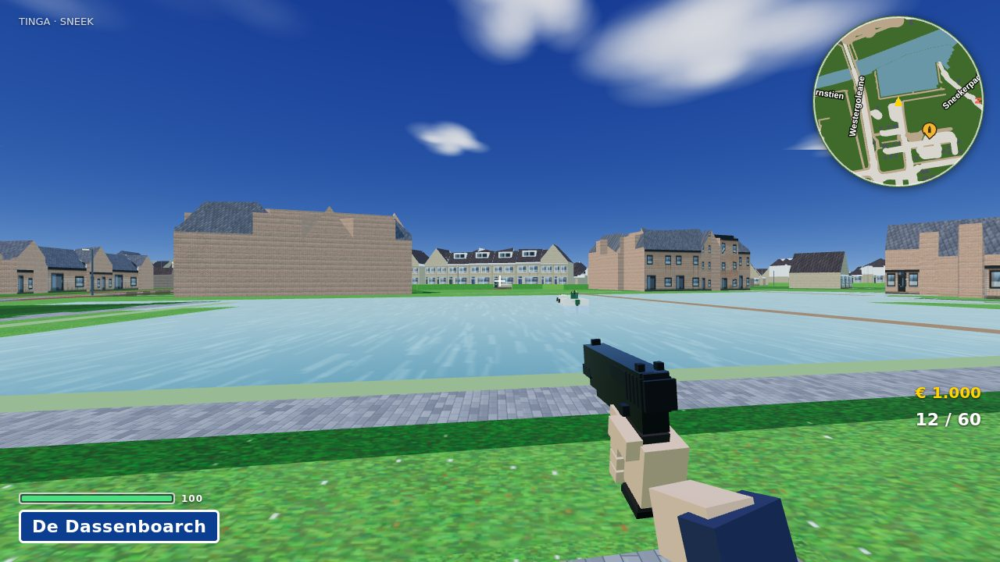 | [Street View](https://www.google.com/maps/@?api=1&map_action=pano&viewpoint=53.011001,5.625106&heading=271&pitch=5&fov=80) |
